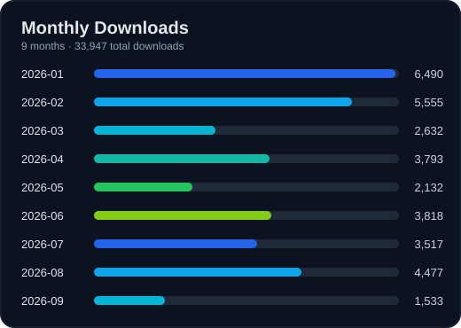

<p align="center">
  

## Downloads


</p>

<h1 align="center">ok-ef</h1>

<p>
An image-recognition-based automation tool for End Field, some actions support background mode (partial support; keyboard-operated actions are not supported), developed with <a href="https://ok-script.com/">ok-script</a>.
<br />
Automates parts of End Field via screen recognition and simulated user inputs.
</p>

<p><i>Operates by simulating Windows user input. No memory reading, no file modification.</i></p>

<p align="center"><b>Official Website:</b> <a href="https://alicejump.github.io/ok-end-field/">https://alicejump.github.io/ok-end-field/</a> (bilingual docs, feature guides, development & maintenance)</p>


<!-- Badges -->
<div align="center">


[](https://github.com/alicejump/ok-end-field/releases)
[](https://github.com/alicejump/ok-end-field/releases)
[](https://discord.gg/vVyCatEBgA)
[](https://alicejump.github.io/ok-end-field/)

</div>

### [中文说明](README.md) | English Readme

---

**Demo & Tutorial:**

[](https://youtu.be/h6P1KWjdnB4)

---

## ⚠️ Disclaimer

This software is an external assistance tool intended to automate parts of End Field. It interacts with the game by
simulating normal user interface operations and complies with relevant laws and regulations. The project aims to reduce
repetitive actions, does not break game balance or provide unfair advantages, and never modifies any game files or data.

This software is open-source and free for personal learning and communication only. Commercial or profit-oriented use is
prohibited. The development team reserves the right of final interpretation. Any issues arising from use of this
software are unrelated to the project or its developers.

According to the official fair-operation statement for End Field:
> The use of any third-party tools that disrupt gameplay is strictly prohibited.
> We will severely penalize the use of cheats, accelerators, bot scripts, macro tools, etc. This includes but is not
> limited to auto-farming, skill acceleration, invincibility, teleportation, or game data modification.
> Once verified, we may take actions including but not limited to deducting illegal gains, freezing, or permanently
> banning accounts.

**By using this software, you acknowledge that you have read, understood, and agreed to the above statement and assume
all potential risks.**

## 🚀 Quick Start

1. **Download the installer**: From GitHub Releases, download the latest `ok-ef-win32-Global-setup.exe` installer.
2. **Install**: Double-click `ok-ef-win32-Global-setup.exe` and follow the setup wizard.
3. **Run**: Launch `ok-ef` from the desktop shortcut or Start Menu after installation.

## 📥 Download Sources

* **[GitHub](https://github.com/alicejump/ok-end-field/releases)**: Official release page with fast global access. (**Download the `setup.exe` installer, not the `Source Code` archive**)
* **[Mirrorchyan](https://mirrorchyan.com/zh/projects?rid=ok-end-field&source=ok-ef-readme)**: China mirror (may require a CD-KEY purchase).
* **[Baidu Pan](https://pan.baidu.com/s/1rxLRLkSx34xIL-nGib04sg?pwd=479z)**: Free download.
* **[Quark Drive](https://pan.quark.cn/s/418018ddf7a0)**: Free download.

## Runtime Requirements & Recommendations

- OS: Windows
- Game resolution: 16:9 at 1920×1080 (1080P) or above required; lower than 1080P is not guaranteed to work
- Language: some features currently support Simplified Chinese only
- Privilege: run as Administrator recommended (required for source mode)
- Path: prefer pure-English install/runtime path
- Frame rate: stable 60 FPS recommended for combat and navigation tasks

---

## Documentation

- Documentation index: [docs/README.md](docs/zh-CN/README.md)
- Developer quick start: [docs/dev/QUICKSTART.md](docs/dev/QUICKSTART.md)
- API reference: [docs/dev/API.md](docs/dev/API.md)
- Windows Task Scheduler: [docs/Windows%20计划任务.md](docs/zh-CN/Windows%20计划任务.md)

---

## 🎮 Feature Overview (by task type)

### One-time tasks (manual click to run)

- [Daily Task](docs/zh-CN/日常任务.md): gift giving, outpost exchange, delivery handling, market trading, stamina farming, reward claim, and more
- [Stamina Farming](docs/zh-CN/体力本.md): normal/high-tier stages, danger stages, heavy energy nodes, skill timeline support
- [Delivery Commission Pickup](docs/zh-CN/运送委托接取.md): filter by ticket type + reward range and auto pickup
- [Auto Delivery](docs/zh-CN/自动送货.md): Wuling delivery automation for 73.1k/79.8k/119k/159k/163k ticket targets
- [Warehouse Transfer](docs/zh-CN/仓库物品转移.md): cross-warehouse batch transfer for selected items
- Demo Draw: repeat draws at the demo platform until the level-change condition is met
- Yingtuo Monument: complete all currently available normal stages
- `启动一次游戏,120s后自动关闭`: exact registered visible task name; scheduled pre-launch/check task. The `120s` is the timeout for reaching the main screen; actual default behavior waits 15 seconds after reaching it, then exits
- Realtime Detection: loop YOLO detection for model debugging
- Test and Diagnosis: development and framework diagnostic tools

> `PeriodicScreenshotTask` and other debug/test tasks are registered in the one-time task list. The former Graduation Essence task has been removed.

### Trigger tasks (background loop detection, partial support)

- [Auto Combat](docs/zh-CN/自动战斗.md): battle-state detection and automatic skill release
- Auto Interaction: auto skip dialog + auto click teleport
- Auto Pickup: whitelist pickup + blacklist filtering
- [Item Navigation](docs/zh-CN/物品导航与实时检测.md): official-map WebSocket or local WebSocket driven item gathering point navigation

### Scheduled tasks
- Daily Task, Auto Delivery, Yingtuo Monument, and `启动一次游戏,120s后自动关闭` declare built-in scheduling support
- [Windows Task Scheduler](docs/zh-CN/Windows%20计划任务.md) can also invoke any registered one-time task by its list index

---

## 🔧 Troubleshooting

If you encounter issues, check the following in order:

1. **Install path**: Install under a pure English path (e.g., `D:\Games\ok-ef`). Avoid `C:\Program Files` or folders
   with non-ASCII characters.
2. **Antivirus**: Add the install directory to your antivirus (including Windows Defender) allow-list to avoid
   deletion/quarantine.
3. **Display settings**:
    * Disable all GPU filters (such as NVIDIA Game Filter) and sharpening features, unless certain features specifically
      require them.
    * Use the game’s default brightness settings.
    * Disable overlays (MSI Afterburner, FPS counters, etc.).
4. **Custom keybinds**: If you changed in-game keybinds, sync them in `ok-ef` settings. Only listed keys are supported.
5. **Software version**: Ensure you’re running the latest `ok-ef` release.
6. **Game performance**: Keep the game at a stable **60 FPS**. If unstable, lower graphics or resolution.
7. **Disconnects**: If frequent, launch the game manually for 5 minutes before running this tool, or re-login directly
   after disconnect without exiting the game.
8. **Get help**: If all above fails, submit a detailed error report via the community channels.
9. **Game/Software language**: Some features support Simplified Chinese only.

---

## 🛠 Maintenance Zone

### Maintenance Documentation

| Document | Description |
|----------|-------------|
| [Auto Delivery Area Maintenance Workflow](docs/update/送货地区维护工作流.md) | Use when adding or adjusting delivery areas; explains how to maintain area data, template resources, and validation steps |
| [Daily Gift Maintenance Workflow](docs/update/日常送礼维护工作流.md) | Use when adding character contacts or gift-giving features; explains how to add character data and contact templates |
| [Master Data Maintenance Workflow](docs/update/主数据维护工作流.md) | Use when adding or adjusting game regions, stages, or product data; explains maintenance methods for all world data structures |

---

## 💻 Developer Zone

### Developer Documentation

| Document | Description |
|----------|-------------|
| [Quick Start Guide (QUICKSTART.md)](docs/dev/QUICKSTART.md) | Minimal workflow to run from source, launch the software, and create trigger/one-time tasks |
| [Development Guide (DEVELOPMENT.md)](docs/dev/DEVELOPMENT.md) | Architecture, repository structure, task registration, testing, and release workflow |
| [API Reference (API.md)](docs/dev/API.md) | Detailed API docs for BaseEfTask, Mixin, ScreenPosition, KeyConfigManager, and more |
| [i18n & OCR Configuration](docs/dev/i18n_OCR配置流程.md) | Runtime locale, language JSON, OCR matching, and text-fix workflow |
| [Keyboard System (键盘操作体系.md)](docs/dev/键盘操作体系.md) | Hotkey mapping, key binding conventions, and send_key exception list |

### Run from source (Python)

This project supports **Python 3.12 only**. Run CMD, PyCharm, or VSCode as **Administrator**. Dependencies are managed with [uv](https://docs.astral.sh/uv/) (install uv first).

```bash
# If your first clone did not include submodules, initialize them first
git submodule update --init --recursive

# Create the virtual environment and install/update dependencies
uv sync

# Run Release version
uv run python main.py

# Run Debug version
uv run python main_debug.py
```

### Command-line arguments

You can auto-start tasks via CLI:

CLI arguments are parsed by the underlying `ok-script` launcher. The project entry point `main.py` passes task configuration from [src/config.py](src/config.py).

```powershell
# Start after automatically executing the 1st task 'Daily Task' and exit upon completion
ok-ef.exe -t 1 -e
```

* `-t` or `--task`: Automatically run the Nth task. `1` is the first task in the list [src/config.py](src/config.py) `onetime_tasks`, which is Daily Task.
* `-e` or `--exit`: Exit automatically after the task completes.

### Development debug & tests

```bash
# Run all scripts under tests/ (PowerShell)
./scripts/testing/run_tests.ps1

# Or run unittest case-by-case
python -m unittest tests/TestGameWindow.py
```

For OCR/template/color-recognition features, prefer debugging with `main_debug.py` and inspect logs/screenshots for
faster diagnosis.

## 💬 Join Us

* **QQ Group**: `940581952` (answer: `终末地`)
* **QQ Channel**: [Click to join](https://pd.qq.com/s/djmm6l44y) (full or updates)
* **Developer Group**: `1079581542` (**Note**: for developers with GitHub accounts who can run the project from source.)

This project is built on [ok-script](https://ok-script.com/), which is easy to maintain. Developers are
welcome to build their own automation projects with ok-script.

## 🔗 Projects using ok-script

* End Field [https://github.com/AliceJump/ok-end-field](https://github.com/AliceJump/ok-end-field)
* Wuthering Waves [https://github.com/ok-oldking/ok-wuthering-waves](https://github.com/ok-oldking/ok-wuthering-waves)
* Wuthering Waves (Daily Task Enhanced Version) [https://github.com/zzc-tongji/ok-ww-enhanced](https://github.com/zzc-tongji/ok-ww-enhanced)
* Genshin Impact (maintenance stopped, background story automation
  available) [https://github.com/ok-oldking/ok-genshin-impact](https://github.com/ok-oldking/ok-genshin-impact)
* Girls’ Frontline 2 [https://github.com/ok-oldking/ok-gf2](https://github.com/ok-oldking/ok-gf2)
* Star Rail [https://github.com/Shasnow/ok-starrailassistant](https://github.com/Shasnow/ok-starrailassistant)
* Star Resonance [https://github.com/Sanheiii/ok-star-resonance](https://github.com/Sanheiii/ok-star-resonance)
* Duet Night Abyss [https://github.com/BnanZ0/ok-duet-night-abyss](https://github.com/BnanZ0/ok-duet-night-abyss)
* Neverness to Everness [https://github.com/BnanZ0/ok-nte](https://github.com/BnanZ0/ok-nte)
* Kaersi Dream [https://github.com/baoxin1100/ok-kes](https://github.com/baoxin1100/ok-kes)
* Bai Jing Corridor (maintenance
  stopped) [https://github.com/ok-oldking/ok-baijing](https://github.com/ok-oldking/ok-baijing)

## ❤️ Sponsors & Acknowledgements

### Contributors

<a href="https://github.com/AliceJump/ok-end-field/graphs/contributors">
  
</a>

### Sponsors

* **EXE signing**: Free code signing provided by [SignPath.io](https://signpath.io/), certificate
  by [SignPath Foundation](https://signpath.org/).

### Acknowledgements

* [ok-oldking/OnnxOCR](https://github.com/ok-oldking/OnnxOCR)
* [zhiyiYo/PyQt-Fluent-Widgets](https://github.com/zhiyiYo/PyQt-Fluent-Widgets)
* [Toufool/AutoSplit](https://github.com/Toufool/AutoSplit)
