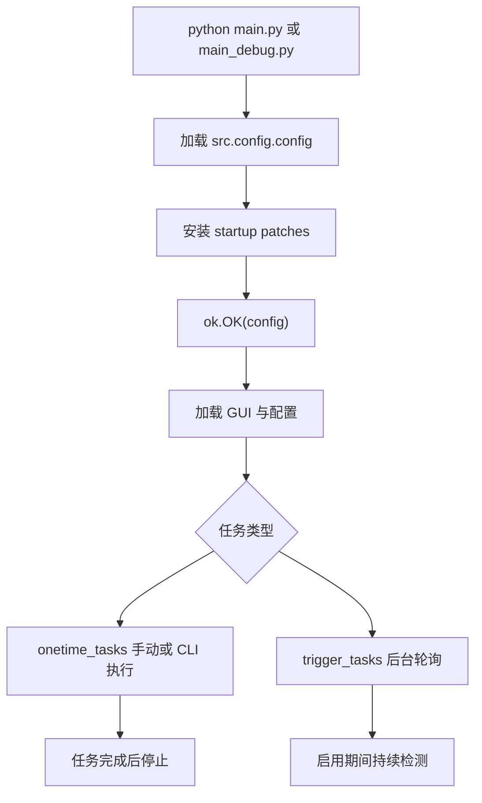

# 文档索引

返回：[README](../README.md) / [English README](../README_en.md)

本文是仓库内正式文档入口。文档内容以当前代码为唯一事实来源；任务注册、窗口配置、OCR、YOLO、全局配置和自定义页均来自 [src/config.py](../src/config.py)。

## 使用文档

| 文档 | 对应实现 |
|---|---|
| [日常任务](日常任务.md) | [DailyTask.py](../src/tasks/onetime/DailyTask.py) 和 [src/tasks/daily](../src/tasks/daily) |
| [刷体力](体力本.md) | [BattleTask.py](../src/tasks/onetime/BattleTask.py)、[daily_battle_mixin.py](../src/tasks/daily/daily_battle_mixin.py) |
| [自动战斗](自动战斗.md) | [AutoCombatTask.py](../src/tasks/trigger/AutoCombatTask.py)、[AutoCombatLogic.py](../src/tasks/onetime/AutoCombatLogic.py) |
| [排轴](排轴.md) | [sequence_parser.py](../src/core/sequence_parser.py)、[BattleConfig.py](../src/core/BattleConfig.py) |
| [运送委托接取](运送委托接取.md) | [TakeDeliveryTask.py](../src/tasks/onetime/TakeDeliveryTask.py) |
| [自动送货](自动送货.md) | [DeliveryTask.py](../src/tasks/onetime/DeliveryTask.py)、[delivery_area.py](../src/data/delivery_area.py) |
| [仓库物品转移](仓库物品转移.md) | [WarehouseTransferTask.py](../src/tasks/onetime/WarehouseTransferTask.py) |
| [物品导航与实时检测](物品导航与实时检测.md) | [ItemNavigatorTask.py](../src/tasks/trigger/ItemNavigatorTask.py)、[RealtimeDetectTask.py](../src/tasks/onetime/RealtimeDetectTask.py) |
| [账号配置用户指南](账号配置用户指南.md) | [AccountConfigTab.py](../src/gui/AccountConfigTab.py)、[account_mixin.py](../src/tasks/account/account_mixin.py) |
| [Windows 计划任务](Windows%20计划任务.md) | `ok-script` CLI 参数和支持计划任务的任务类 |

## 开发文档

| 文档 | 说明 |
|---|---|
| [快速开始](dev/QUICKSTART.md) | 从源码运行、任务创建和验证入口 |
| [开发指南](dev/DEVELOPMENT.md) | 架构、目录、任务注册、测试和发布流程 |
| [API 参考](dev/API.md) | 项目公共任务基类、Mixin、数据工具和交互工具 |
| [i18n 与 OCR 配置流程](dev/i18n_OCR配置流程.md) | 运行时语言、语言 JSON 和 OCR 纠错链路 |
| [键盘操作体系](dev/键盘操作体系.md) | 全局热键配置和直接 `send_key` 例外 |
| [滑索与送货逻辑](dev/滑索与送货逻辑.md) | 滑索 OCR 对齐、送货编排和调试入口 |
| [地图官方 WS 客户端实现](dev/地图官方WS客户端实现.md) | 物品导航官方地图 WebSocket 与本地 WS 回退 |

## 维护文档

| 文档 | 说明 |
|---|---|
| [主数据维护工作流](update/主数据维护工作流.md) | 地区、据点、商品、关卡、仓库映射维护 |
| [送货地区维护工作流](update/送货地区维护工作流.md) | 自动送货地区数据、券数标签和模板维护 |
| [日常送礼维护工作流](update/日常送礼维护工作流.md) | 角色数据与联络模板维护 |

## 启动与调度流程

相关文档：[开发指南](dev/DEVELOPMENT.md) / [API 参考](dev/API.md)
