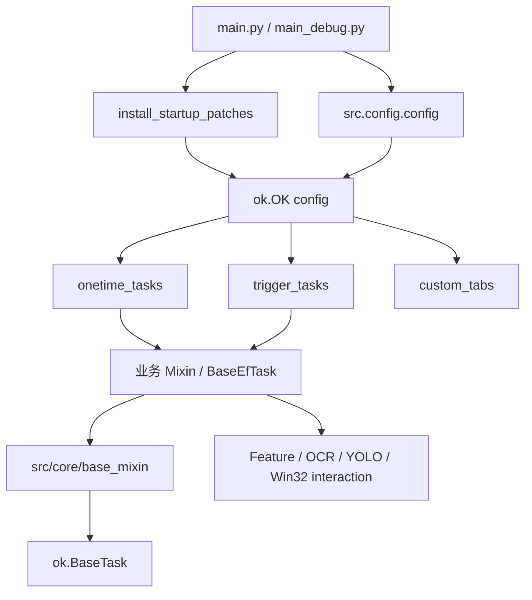

# ok-ef 开发指南

返回：[文档索引](../zh-CN/index.md) / [README](https://github.com/AliceJump/ok-end-field/blob/master/README.md)

本文以当前源码、`src/config.py`、测试目录和 workflow 为准，说明项目结构和贡献流程。具体项目自有接口见 [API 参考](API.md)。

## 1. 运行架构

ok-ef 是基于 [ok-script](https://github.com/ok-oldking/ok-script) 的 Windows 游戏自动化应用。仓库负责业务任务、项目级识别/交互封装、资源和自定义 GUI；截图、基础 OCR/Feature API、任务调度和主 GUI 由 `ok-script` 提供。



当前关键技术配置：

| 领域 | 当前实现 |
|------|----------|
| Python | CI 和 China 打包使用 3.12 |
| 平台 | Windows；游戏进程 `Endfield.exe`、窗口类 `UnityWndClass` |
| 捕获 | 优先 WGC，后备 `BitBlt_RenderFull` |
| OCR | `onnxocr`，启用 OpenVINO 和 NPU 参数 |
| Feature | COCO 标注区域 + OpenCV 模板匹配 |
| YOLO | ONNX/OpenVINO，多模型注册和按目标路由 |
| UI | ok-script GUI + qfluentwidgets 自定义页 |
| 打包 | PyAppify；China/Global profile |

## 2. 基类与组合

### 2.1 BaseEfTask

基础设施 Mixin 已从任务目录移动到 `src/core/base_mixin/`：

```text
BaseEfTask(
    WindowArrowDrawingMixin,
    AccountOverrideMixin,
    GameFlowMixin,
    RuntimeMixin,
    ok.BaseTask,
    ProcessManager,
)
```

职责：

| 类 | 文件 | 职责 |
|----|------|------|
| `WindowArrowDrawingMixin` | `src/core/base_mixin/window_arrow_drawing_mixin.py` | 导航箭头窗口绘制 |
| `AccountOverrideMixin` | `src/core/base_mixin/account_override_mixin.py` | 按稳定账号 ID 覆盖任务配置 |
| `GameFlowMixin` | `src/core/base_mixin/game_flow_mixin.py` | 主界面、地图、登录截图、弹窗和场景流程 |
| `RuntimeMixin` | `src/core/base_mixin/runtime_mixin.py` | Feature、点击、按键、移动、UI 稳定、YOLO |
| `ProcessManager` | `src/core/base_mixin/process_manager.py` | 游戏进程终止能力 |

不要再引用旧的 `src/tasks/mixin/runtime_mixin.py`、`game_flow_mixin.py`、`process_manager.py` 或 `window_arrow_drawing_mixin.py` 路径。

### 2.2 业务 Mixin

`src/tasks/mixin/` 保留跨任务业务能力：

```text
BaseEfTask
├── Common
├── MapMixin
├── BattleMixin
├── MouseScanMixin
├── NavigationMixin
│   ├── LiaisonMixin
│   └── ZipLineMixin
└── LoginMixin
    └── AccountMixin
```

`EndCommandMixin`、`WsPositionMixin` 是无 `BaseEfTask` 基类的协作 Mixin，通过最终任务组合获得任务能力。

### 2.3 实际任务 MRO

主要组合以类声明顺序为准：

```text
DailyTask(
    Common, MapMixin, ZipLineMixin, BattleMixin, LiaisonMixin,
    EndCommandMixin, AccountMixin, MouseScanMixin
)

BattleTask(Common, MapMixin, ZipLineMixin, BattleMixin)
DeliveryTask(AccountMixin, ZipLineMixin, MapMixin)
AutoCombatTask(BattleMixin, TriggerTask)
ItemNavigatorTask(WsPositionMixin, BaseEfTask, TriggerTask)
```

`DailyTask` 的日常子功能不再全部作为 Python 基类混入。它在 `__init__` 中组合 `DailyBuyFeature`、`DailyBattleFeature`、`DailyTradeFeature`、`DailyShopFeature`、`DailyRoutineFeature`、`DailyLiaisonFeature`、`DailyDemoFeature` 对象，并由 `DailyTaskRunner` 执行 `build_task_plan()`。

所有协作式 `__init__` 都应调用 `super()`。配置字典使用 `update` 增量合并，避免破坏 MRO 前序类注册的数据。

## 3. 注册清单

`src/config.py` 是 GUI 注册的唯一权威来源。

### 一次性任务

| 顺序 | 类 | 模块 |
|------|----|------|
| 1 | `DailyTask` | `src.tasks.onetime.DailyTask` |
| 2 | `TakeDeliveryTask` | `src.tasks.onetime.TakeDeliveryTask` |
| 3 | `WarehouseTransferTask` | `src.tasks.onetime.WarehouseTransferTask` |
| 4 | `DeliveryTask` | `src.tasks.onetime.DeliveryTask` |
| 5 | `BattleTask` | `src.tasks.onetime.BattleTask` |
| 6 | `DemoDrawTask` | `src.tasks.onetime.DemoDrawTask` |
| 7 | `YingTuoTask` | `src.tasks.onetime.YingTuoTask` |
| 8 | `TestStartGame` | `src.tasks.onetime.TestStartGame` |
| 9 | `TestBattleToEnd` | `src.tasks.test.TestBattleToEnd` |
| 10 | `TestArrowAngle` | `src.tasks.test.TestArrowAngle` |
| 11 | `TestDragScan` | `src.tasks.test.TestDragScan` |
| 12 | `TestPauseTiming` | `src.tasks.test.TestPauseTiming` |
| 13 | `TestBlueDotAlign` | `src.tasks.test.TestBlueDotAlign` |
| 14 | `TestLevelRead` | `src.tasks.test.TestLevelRead` |
| 15 | `TestDemoGraphic` | `src.tasks.test.TestDemoGraphic` |
| 16 | `RealtimeDetectTask` | `src.tasks.test.RealtimeDetectTask` |
| 17 | `DiagnosisTask` | `src.tasks.test.DiagnosisTask` |
| 18 | `TestBattleSlotDetect` | `src.tasks.test.TestBattleSlotDetect` |
| 19 | `TestCombatTemplateMatch` | `src.tasks.test.TestCombatTemplateMatch` |
| 20 | `MouseRotationCalibration` | `src.tasks.test.MouseRotationCalibration` |

一次性任务按「业务任务（`src.tasks.onetime.*`）→ 调试/测试任务（`src.tasks.test.*`）」分组排列。

`PeriodicScreenshotTask.py` 存在但未注册。`TakeDeliveryTask` 的类声明还包含 `TriggerTask`，但它当前只注册在一次性任务列表中。

### 触发式任务

| 顺序 | 类 | 模块 |
|------|----|------|
| 1 | `AutoCombatTask` | `src.tasks.trigger.AutoCombatTask` |
| 2 | `AutoInteractionTask` | `src.tasks.trigger.AutoInteractionTask` |
| 3 | `AutoPickTask` | `src.tasks.trigger.AutoPickTask` |
| 4 | `ItemNavigatorTask` | `src.tasks.trigger.ItemNavigatorTask` |

当前没有 `AutoLoginTask.py` 或触发式自动登录注册。登录切换能力由 `LoginMixin`/`AccountMixin` 供多账号任务调用。

### 自定义页

- `GlobalConfigTab`：全局战斗、键位和基础配置。
- `AccountConfigTab`：账号数据及按任务覆盖配置。

## 4. 当前目录

以下只列开发时需要理解和维护的文件，不包含运行缓存、日志、截图、IDE 元数据和生成的文件、目录。

```text
ok-end-field/
├── main.py / main_debug.py       # 正式/调试入口，均安装启动补丁
├── pyproject.toml                # 项目 Python 依赖声明
├── requirements.txt              # 由 uv 针对平台生成，供发布流水线 pip 使用
├── pyappify.yml                  # China/Global 打包 profile
├── deploy.txt                    # tag 构建时同步到更新仓库的清单
├── src/
│   ├── config.py                 # ok-script 应用配置、任务和 tab 注册
│   ├── globals.py                # 应用级共享对象
│   ├── icons.py                  # 图标定义
│   ├── core/
│   │   ├── BaseEfTask.py
│   │   ├── BattleConfig.py
│   │   ├── config_migration.py
│   │   ├── global_config_store.py
│   │   ├── sequence_parser.py
│   │   └── base_mixin/
│   │       ├── account_override_mixin.py
│   │       ├── game_flow_mixin.py
│   │       ├── process_manager.py
│   │       ├── runtime_mixin.py
│   │       └── window_arrow_drawing_mixin.py
│   ├── tasks/
│   │   ├── onetime/              # 一次性任务和 AutoCombatLogic
│   │   ├── trigger/              # 四个已注册后台任务
│   │   ├── mixin/                # 业务能力 Mixin
│   │   ├── account/              # 账号解析、稳定 ID 和覆盖存储
│   │   └── daily/                # Feature 组合、runner、汇总和 misc 子功能
│   ├── data/
│   │   ├── FeatureList.py        # 模板名称字符串枚举
│   │   ├── characters*.py
│   │   ├── delivery_area*.py
│   │   ├── item_map_query.py
│   │   ├── world_map*.py
│   │   ├── zh_en.py
│   │   └── lang/__init__.py      # 统一 JSON 语言访问器
│   ├── interaction/              # Win32 输入、键位、鼠标、屏幕区域
│   ├── image/                    # HSV、登录截图、旋转模板
│   ├── yolo/                     # 模型定义、注册、加载和 OpenVINO 检测
│   ├── essence/                  # 装备词条 OCR 纯算法轮子
│   ├── patches/                  # 启动 monkey patches
│   └── gui/                      # 全局/账号配置页、WebView 对话框
├── assets/
│   ├── coco_annotations.json
│   ├── images/                   # Feature 图片
│   ├── items/                    # 物品和地图数据
│   ├── lang/*.json              # 每模块一个统一多 locale JSON
│   ├── models/yolo/              # ONNX 模型
│   └── ocr_fix/ocr_text_fix.json
├── i18n/<locale>/LC_MESSAGES/   # gettext ok.po/ok.mo
├── configs/                      # 任务、全局、账号作用域配置
├── tests/                        # unittest 测试
├── scripts/                      # 维护/CI 脚本，按功能分目录
│   ├── i18n/                     # 语言与翻译维护（sync_* 官方译名同步、gen_lang_stubs、lang_fill_missing 等）
│   ├── data-capture/             # 官方 API / Wiki 数据抓取（capture_*、dump_*）
│   ├── release/                  # tag 辅助、requirements 生成、tag 冒烟
│   ├── docs/                     # mkdocs 构建辅助（mkdocs_mermaid）
│   ├── stats/                    # 下载统计 SVG 生成
│   ├── testing/                  # run_tests.ps1 测试运行
│   └── maintenance/              # 日志截图恢复、邮件工具
├── tools/                        # 脚本产出的本地数据（wiki_catalog 等，gitignored）
├── ok_tasks/                     # 用户自定义任务
├── ok_templates/                 # 模板标注子模块
└── .github/workflows/            # 构建、统计、地图数据和维护 workflow
```

## 5. 开发环境

```powershell
git clone --recurse-submodules https://github.com/AliceJump/ok-end-field.git
Set-Location ok-end-field
uv sync
uv run python main_debug.py
```

约束：

- 使用 Python 3.12 与当前 CI/打包环境保持一致。
- 依赖通过 [uv](https://docs.astral.sh/uv/) 管理：`uv sync` 依照 `uv.lock` 创建 `.venv`；`uv run python ...` 在该环境中执行 Python。`requirements.txt` 是面向发布流水线的派生产物，不要手动编辑。
- Windows 交互需要进程权限不低于游戏，开发时通常以管理员权限启动 IDE/终端。
- 从仓库根目录运行，资源和配置路径大量以当前工作目录解析。
- 游戏窗口配置要求 16:9，最低 `1920x1080`（1080P）。
- WGC 常规截图不适合登录界面；登录 Mixin 使用 Win32 屏幕捕获，通常需要窗口可见并可激活。

## 6. 开发流程

### 6.1 新增任务

一次性任务通常直接继承 `BaseEfTask` 或业务 Mixin：

```python
from src.core.BaseEfTask import BaseEfTask


class MyTask(BaseEfTask):
    def __init__(self, *args, **kwargs):
        super().__init__(*args, **kwargs)
        self.name = "我的任务"
        self.description = "任务说明"
        self.default_config.update({"选项 A": True})
        self.config_description.update({"选项 A": "控制该步骤。"})

    def run(self):
        self.ensure_main()
```

注册格式：

```python
["src.tasks.onetime.MyTask", "MyTask"],
```

触发式任务还需在最终 MRO 中包含 `ok.TriggerTask`，并注册到 `trigger_tasks`。完整最小示例见 [QUICKSTART](QUICKSTART.md)。

### 6.2 新增业务 Mixin

- 跨任务业务能力放 `src/tasks/mixin/`。
- 基础运行时能力才放 `src/core/base_mixin/`。
- Mixin 不定义最终任务的 `name`、`description` 或 `run()`。
- 若继承 `BaseEfTask`，使用协作式 `super()`。
- 如果 Mixin 只是依赖最终任务提供能力，可像 `EndCommandMixin` 一样不继承 `BaseEfTask`，但必须明确它的依赖。
- 增加基类前用 Python 的 `Class.__mro__` 检查 C3 线性化，避免重复基类顺序冲突。

### 6.3 任务配置

框架任务配置使用：

```python
self.default_config.update({...})
self.config_description.update({...})
self.config_type[key] = {...}
self.default_config_group.update({...})
```

`BaseEfTask.register_config_groups(groups)` 可创建一个带 `sub_configs` 的分组下拉框。配置旧键迁移通过类属性 `config_key_migrations` 声明，`BaseEfTask.load_config()` 会沿 MRO 合并后调用 `migrate_config_file_keys`。

全局配置定义在 `src/core/global_config_store.py`：

- `Game Hotkey Config`
- `Battle Config`
- `Ensure Main Once Action Sleep`
- `Zip Line Config`

战斗任务通过 `BattleMixin.get_battle_config()` 读取。任务可通过「使用独立配置」开关选择全局或独立战斗配置；「使用独立配置」关闭时，`get_battle_config()` 直接返回全局配置，账号任务覆盖不会生效。仅当「使用独立配置」开启时，绑定账号上下文后，账号任务覆盖才为最高优先级。不要在多个任务中复制全局战斗默认值。

### 6.4 Feature 资源

`src/config.py` 的 `template_tab` 会生成 `src/data/FeatureList` 标签枚举，Feature 图像和标注以 `assets/images/`、`assets/coco_annotations.json` 及 `ok_templates/` 数据为准。

```python
from src.data.FeatureList import FeatureList as fL

box = self.find_one(fL.transfer_go)
boxes = self.find_feature([fL.monthly_card, fL.monthly_card2])
```

分辨率名称约定为无后缀、`_2k`、`_4k`。`RuntimeMixin.get_feature_by_resolution()` 只会选择 `FeatureList` 中实际存在的名称，缺失时抛 `AttributeError`。

### 6.5 OCR 与语言

OCR 业务文本保存在单文件 `assets/lang/<module>.json`，不是 locale 子目录：

```python
self.wait_ocr(match=self.lang.login_mixin.k_20275ef2, time_out=5)
```

当前活动 OCR locale 是 `zh_CN`、`zh_TW`。全局混淆补丁只扩展 match，不改写 OCR 输出。新增资源和纠错前阅读 [i18n 与 OCR 配置流程](i18n_OCR配置流程.md)。

### 6.6 键位

可改键操作不得直接发送默认字面值：

```python
self.press_key("f")             # common
self.press_industry_key("y")    # industry
self.press_combat_key("e")      # combat
```

`KeyConfigManager` 只有 `resolve_key(key, key_type)`。方向移动、固定角色数字键、固定滑索键和 `alt` 等系统修饰键可按明确的不改键语义使用底层接口。若游戏设置允许改键，对应 UI 图标也不应做成固定按键字样模板。

### 6.7 登录和多账号

`LoginMixin.login_flow(username, password=None)` 通过登录界面的“最近账号”列表选择账号，不输入密码。旧账号行中的逗号后密码字段会被忽略且不存储。

多账号任务应使用 `iter_multi_account_context()` 或现有 `AccountMixin` 流程，并在读取账号覆盖配置前设置 `current_account_id`。账号覆盖优先稳定 ID，用户名仅作为后备。

## 7. 测试清单

当前 `tests/` 有 42 个测试模块：

| 文件 | 主要覆盖 |
|------|----------|
| `TestAccountBattleConfig.py` | 账号配置可见性、快照合并、任务账号配置黑名单、战斗配置优先级 |
| `TestAccountOverrideMixin.py` | 账号覆盖 Mixin：仅任务运行时启用覆盖、其余回退默认 |
| `TestAutoCombat.py` | 排轴技能序列解析（`_parse_skill_sequence`） |
| `TestAutoPick.py` | 自动拾取规则（可生产植物默认跳过与开关） |
| `TestCheckLang.py` | 源码语言 key 与统一 JSON 的 `zh_CN/zh_TW` 引用 |
| `TestConditionalRotation.py` | 排轴条件旋转 AST 归一化与 `AutoCombatLogic.run()` 实时条件路径（含 if/else 分支） |
| `TestConditionalRotationGui.py` | 条件旋转 GUI 动作/条件格式化 |
| `TestDailyBattleToEnd.py` | 日常刷本到结束：YOLO 命中禁用中键点击、奖励等待 |
| `TestDailyBoatState.py` | 日常联运状态共享范围 |
| `TestDailyConfigMigration.py` | 日常地区布尔键合并迁移 |
| `TestDailyRegionalRunner.py` | 日常地区执行器（仅购买/回调/重试） |
| `TestDailyRewardWaits.py` | 日常奖励领取等待逻辑 |
| `TestDailyTaskFinallyFile.py` | 日常汇总文件生成和清理 |
| `TestDeliveryAreaConfig.py` | 送货地区、搜索区域、目标和券种配置 |
| `TestDeliveryRewardsClaim.py` | 送货奖励领取状态处理 |
| `TestEfInteraction.py` | 窗口激活与后台消息交互 |
| `TestEssenceImageFeatures.py` | 装备词条 Feature 资产存在性 |
| `TestEssenceRecognizer.py` | 装备词条 OCR 纯解析和等级附加 |
| `TestFindZipLineBoardButton.py` | 滑索上车站点按钮多阶段查找 |
| `TestGameWindow.py` | 游戏窗口查找（类名与可执行文件匹配） |
| `TestGifIcon.py` | GIF/主题图标合成与缓存失效 |
| `TestGrayBarDetector.py` | 灰条检测算法（合成帧） |
| `TestGuiI18n.py` | GUI 翻译调用和运行时采集污染 |
| `TestItemMapQuery.py` | 物品地图查询和筛选 |
| `TestLogZipDedup.py` | 日志打包图片去重 |
| `TestMapDeviceFingerprint.py` | 地图设备指纹与注册 payload 构造 |
| `TestMouseRotationCalibration.py` | 鼠标视角旋转系数标定角度差纯函数与任务注册 |
| `TestOkWin32GdiPointPatch.py` | Win32 GDI 坐标补丁幂等安装 |
| `TestOutpostExchange.py` | 据点兑换优先级与排除逻辑 |
| `TestPoLocaleConsistency.py` | gettext catalog 完整性和一致性 |
| `TestPreConfigPatch.py` | 启动前配置环境变量补丁 |
| `TestPressEsc.py` | `press_esc` 走任务键盘控制器 |
| `TestQfluentNavigationPatch.py` | qfluentwidgets 导航补丁回归 |
| `TestRealtimeGrayBarDetectTask.py` | 实时灰条检测任务常量与调试绘制 |
| `TestRuntimeMixinFeatureClick.py` | 普通/Alt Feature 点击路径 |
| `TestScreenshotSidecar.py` | 截图侧边数据序列化 |
| `TestSequenceParser.py` | 中英文逗号序列和整数序列解析 |
| `TestStateDrivenWaits.py` | 状态驱动的等待（ensure_main/ensure_map/safe_back 等） |
| `TestYingTuoTask.py` | 影拓丰碑关卡灰条识别 |
| `TestYoloDetect.py` | 检测注入、ROI/overlay 和参数验证 |
| `TestYoloModelRegistry.py` | 模型配置合并及目标路由 |
| `TestZipLineConfig.py` | 滑索全局配置分组与旧配置迁移 |

推荐从仓库根目录运行：

```powershell
uv run python -m unittest discover -s tests -p "Test*.py"
```

或使用仓库脚本：

```powershell
.\scripts\testing\run_tests.ps1
```

`scripts/testing/run_tests.ps1` 通过 `uv run python` 在项目 `.venv` 中执行，无需手动激活虚拟环境。

测试并非全是无资源的纯算法测试。部分依赖 `assets` 图片、OCR 样本、OpenCV、`ok-script` 的 `TaskTestCase` 或 Windows 相关导入。它们通常不要求正在运行游戏，但窗口交互流程仍必须实机验证。

## 8. CI、发布与工具

`.github/workflows/build.yml` 只在推送 `v*` tag 时触发：

```text
checkout(LFS)
-> Python 3.12
-> pip install -r requirements.txt（requirements.txt 由 uv 从 pyproject.toml 生成）
-> inline ok-script requirements
-> 逐个运行 tests/*.py
-> 按 deploy.txt 同步更新仓库
-> PyAppify 打包
-> GitHub Release
-> 触发 MirrorChyan workflow
```

其它当前 workflow：

- `download_stats.yml`：每日/手动生成并提交 `assets/downloads.svg`。
- `mirrorchyan_uploading.yml`、`mirrorchyan_release_note.yml`：MirrorChyan 发布流程。
- `update-endfield-map-data.yml`：地图数据更新。
- `stale.yml`：issue/PR 维护。

`scripts/release/auto_release.py`、`scripts/release/auto_release.ps1`、`scripts/release/auto_release.sh` 是 tag 辅助脚本。发布行为以脚本和 workflow 当前实现为准，不要假定测试在“打 tag 前”自动运行；CI 是 tag 已推送后启动。

语言工具：`scripts/i18n/` 保留 `sync_*.py`（官方译名同步进 lang JSON 与 ok.po）、`gen_lang_stubs.py`（类型提示存根生成）、`lang_fill_missing.py`（缺失语言补全）和 `restore_empty_po_entries.py`（从 git 历史恢复被清空的翻译）；针对旧 `assets/lang/<module>/<locale>.json` 目录 schema 的批量翻译与迁移工具已随 schema 切换删除。详见 i18n 文档。

## 9. 维护检查

代码变更后按影响面检查：

1. 任务注册变化：同步 `src/config.py` 对应用户/开发文档。
2. Mixin 或基础设施移动：同步导入示例和 MRO 图，搜索旧路径。
3. API 参数或返回语义变化：更新 [API.md](API.md) 并运行直接测试。
4. 配置变化：同步默认值、描述、类型、全局/任务/账号优先级测试。
5. OCR 文本变化：更新统一语言 JSON，运行 `TestCheckLang`。
6. GUI gettext 变化：运行 `TestGuiI18n` 和 `TestPoLocaleConsistency`。
7. Feature/YOLO 变化：验证资源、模型路由、ROI 坐标及 Debug overlay。
8. 交互流程变化：除单元测试外，用 `main_debug.py` 在支持分辨率实测。

权威来源：

- 注册和应用参数：`src/config.py`
- 核心组合：`src/core/BaseEfTask.py`
- 运行时接口：`src/core/base_mixin/*.py`
- 业务行为：`src/tasks/**/*.py`
- 全局战斗配置：`src/core/BattleConfig.py`
- OCR locale/schema：`src/data/lang/__init__.py`
- 测试范围：`tests/*.py`
- 发布：`.github/workflows/*.yml`
