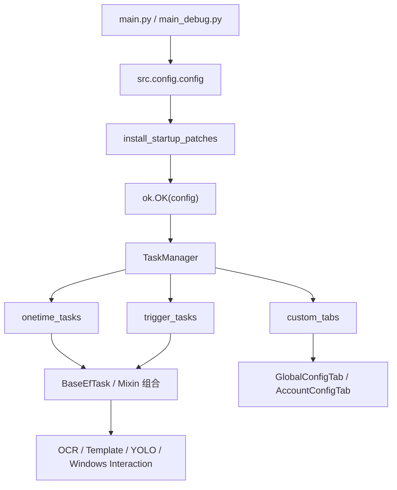
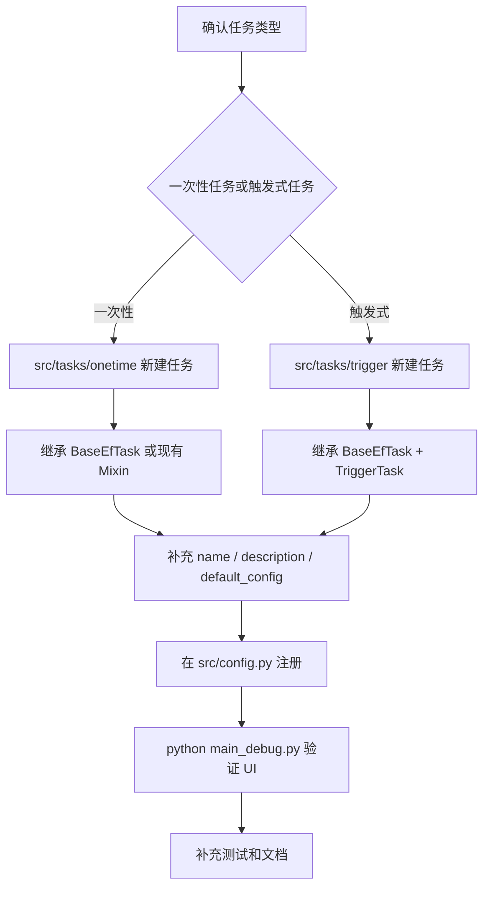
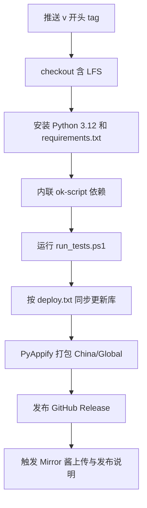
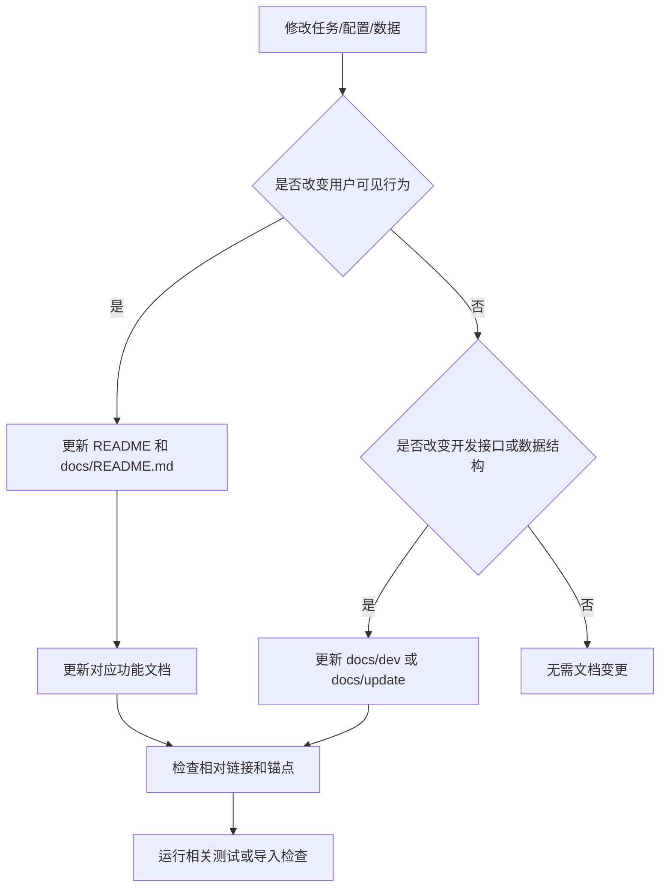

# ok-ef 开发文档

返回：[文档索引](../README.md) / [README](../../README.md)

> 本文档面向希望参与或了解 ok-ef 项目开发的开发者，涵盖项目架构、目录结构、各文件职责、开发流程、测试与发布，以及已完成功能与建议计划表。

---

## 目录

1. [项目概览](#1-项目概览)
2. [架构总览](#2-架构总览)
3. [目录结构与文件职责](#3-目录结构与文件职责)
4. [开发环境搭建](#4-开发环境搭建)
5. [开发流程](#5-开发流程)
6. [测试](#6-测试)
7. [CI / CD 与发布流程](#7-ci--cd-与发布流程)
8. [已完成功能一览](#8-已完成功能一览)
9. [文档同步维护](#9-文档同步维护)

---

## 1. 项目概览

**ok-ef** 是基于 [ok-script](https://github.com/ok-oldking/ok-script) 框架开发的《终末地》游戏自动化工具。  
核心技术栈：

| 层次 | 技术 |
|------|------|
| 底层框架 | ok-script（截图、OCR、模板匹配、UI） |
| 截图 | WGC / BitBlt（Windows） |
| OCR | OnnxOCR + OpenVINO 加速 |
| 目标检测 | YOLOv8 ONNX 模型（OpenVINO 推理） |
| 模板匹配 | OpenCV TM_CCOEFF_NORMED |
| UI | PyQt6 / PySide6 + PyQt-Fluent-Widgets |
| 交互 | Windows PostMessage / Win32 API |
| 语言 | Python 3.12（仅支持此版本） |
| 打包 | PyAppify |

---

## 2. 架构总览



```
main.py / main_debug.py
        │
        ▼
   ok.OK(config)          ← ok-script 框架主入口，负责窗口捕获、任务调度、GUI
        │
        ├── onetime_tasks  ← 用户点击触发的一次性任务
        │       ├── DailyTask           (日常任务聚合)
        │       ├── BattleTask          (刷体力)
        │       ├── DeliveryTask        (自动送货)
        │       ├── TakeDeliveryTask    (运送委托接取)
        │       ├── WarehouseTransferTask (仓库物品转移)
        │       ├── DemoDrawTask        (演算抽牌)
        │       ├── YingTuoTask         (影拓丰碑)
        │       ├── TestStartGame       (启动一次游戏)
        │       ├── DiagnosisTask       (诊断)
        │       ├── RealtimeDetectTask  (实时检测)
        │       └── Test                (开发调试用)
        │
        └── trigger_tasks  ← 后台持续运行的触发式任务
                ├── AutoCombatTask     (自动战斗)
                ├── AutoInteractionTask (自动跳过剧情)
                ├── AutoPickTask       (自动拾取)
                ├── AutoLoginTask      (自动登录/领月卡)
                └── ItemNavigatorTask  (物品导航)
```

### Mixin 继承链（DailyTask 为例）

```
DailyTask
 ├── DailyBuyMixin        (买物资)
 ├── DailyBattleMixin     (刷体力)  ─── BattleMixin, MapMixin, ZipLineMixin
 ├── DailyTradeMixin      (买卖货)  ─── NavigationMixin
 ├── DailyShopMixin       (买信用商店)
 ├── DailyRoutineMixin    (其它日常) ── LiaisonMixin ─── NavigationMixin
 ├── DailyLiaisonMixin    (送礼)    ─── LiaisonMixin
 ├── EndCommandMixin      (外部命令)
 └── AccountMixin         (多账号)  ─── LoginMixin
```

---

## 3. 目录结构与文件职责

```
ok-end-field/
├── main.py                    # 正式版入口：启动 ok.OK(config)
├── main_debug.py              # 调试版入口：config['debug']=True
├── requirements.in            # 顶层依赖（ok-script, onnxocr, openvino, opencv-python）
├── requirements.txt           # 完整锁定依赖（pip-compile 生成）
├── pyappify.yml               # PyAppify 打包配置（China/Global/Debug 三种 Profile）
├── deploy.txt                 # 部分同步到更新库的文件列表
├── run_tests.ps1              # 本地一键跑所有单元测试（PowerShell）
├── auto_release.py/.ps1       # 辅助打版本 tag 的脚本
│
├── src/                       # 项目核心源码
│   ├── config.py              # 全局配置字典（传给 ok.OK），定义所有任务列表、窗口参数、OCR 参数等
│   ├── globals.py             # 全局单例（Globals），可存放跨任务共享状态
│   ├── icons.py               # SVG/PNG 图标加载与预定义图标集
│   │
│   ├── core/                  # 核心基础设施（非任务模块）
│   │   ├── __init__.py
│   │   ├── BaseEfTask.py      # 所有任务的公共基类（继承所有 Mixin）
│   │   ├── BattleConfig.py    # 战斗通用配置管理与描述
│   │   ├── global_config_store.py # 全局配置持久化存储
│   │   └── sequence_parser.py # 排轴字符串解析
│   │
│   ├── patches/               # 启动补丁
│   │   ├── __init__.py
│   │   ├── startup_patches.py  # 补丁安装入口
│   │   ├── cascade_dropdown_patch.py # 级联下拉框补丁
│   │   ├── log_upload_patch.py # 日志上传补丁
│   │   └── ocr_text_fix_patch.py # OCR 文字混淆修正
│   │
│   ├── data/                  # 纯数据层，无 UI 无截图依赖
│   │   ├── __init__.py
│   │   ├── FeatureList.py     # 枚举：所有模板匹配特征名
│   │   ├── characters.py      # 干员数据字典
│   │   ├── characters_utils.py# 干员数据工具函数
│   │   ├── delivery_area.py   # 送货地区数据
│   │   ├── delivery_area_service.py # 送货地区服务
│   │   ├── item_map_query.py  # 物品地图查询
│   │   ├── lang/              # 语言模块（统一 JSON 格式）
│   │   ├── world_map.py       # 地图数据
│   │   ├── world_map_utils.py # 地图数据工具
│   │   └── zh_en.py           # 中英翻译字典
│   │
│   ├── yolo/                  # YOLO 目标检测
│   │   ├── __init__.py
│   │   ├── loader.py          # 模型加载器
│   │   ├── model_registry.py  # 模型注册表
│   │   ├── models.py          # 模型路径与 labels 统一维护
│   │   └── openvino_detector.py # OpenVINO 推理封装
│   │
│   ├── essence/               # 装备词条 OCR 解析
│   │   ├── __init__.py
│   │   ├── essence_recognizer.py # OCR 解析装备词条面板
│   │   └── weapon_data.py    # 武器词条数据 CSV
│   │
│   ├── image/                 # 图像处理工具层
│   │   ├── __init__.py
│   │   ├── frame_processes.py # HSV 颜色掩码提取
│   │   ├── hsv_config.py      # HSVRange 枚举
│   │   ├── login_screenshot.py# 登录界面截图
│   │   └── rotated_template.py# 旋转模板匹配
│   │
│   ├── interaction/           # 游戏交互层（Windows 专用）
│   │   ├── __init__.py
│   │   ├── EfInteraction.py   # 后台交互实现
│   │   ├── Key.py             # 方向键映射
│   │   ├── KeyConfig.py       # 热键配置
│   │   ├── Mouse.py           # 鼠标辅助
│   │   └── ScreenPosition.py  # 屏幕坐标工具
│   │
│   ├── gui/                   # 自定义 UI 页面
│   │   ├── __init__.py
│   │   ├── AccountConfigTab.py # 账号配置页
│   │   ├── GlobalConfigTab.py  # 全局配置页
│   │   └── WebViewDialog.py    # WebView 对话框
│   │
│   └── tasks/                 # 任务层（业务逻辑核心）
│       ├── onetime/           # 📌 一次性任务（用户点击触发）
│       │   ├── __init__.py
│       │   ├── DailyTask.py           # 日常任务聚合
│       │   ├── BattleTask.py          # 单独刷体力
│       │   ├── AutoCombatLogic.py     # 自动战斗核心算法
│       │   ├── DeliveryTask.py        # 自动送货
│       │   ├── TakeDeliveryTask.py    # 运送委托接取
│       │   ├── DemoDrawTask.py        # 演算抽牌
│       │   ├── WarehouseTransferTask.py # 仓库物品转移
│       │   ├── YingTuoTask.py         # 影拓丰碑
│       │   ├── Test.py                # 开发调试用任务
│       │   ├── TestStartGame.py       # 启动游戏
│       │   ├── RealtimeDetectTask.py  # YOLO 实时检测
│       │   └── DiagnosisTask.py       # 诊断
│       │
│       ├── trigger/           # 🔁 触发式任务（后台循环执行）
│       │   ├── __init__.py
│       │   ├── AutoCombatTask.py      # 后台自动战斗
│       │   ├── AutoInteractionTask.py # 自动跳过剧情
│       │   ├── AutoLoginTask.py       # 自动登录/领月卡
│       │   ├── AutoPickTask.py        # 大世界自动拾取
│       │   └── ItemNavigatorTask.py   # 物品导航
│       │
│       ├── account/
│       │   ├── __init__.py
│       │   ├── account_mixin.py       # 多账号模式
│       │   └── account_scope_store.py # 账号作用域配置读写
│       │
│       ├── daily/             # DailyTask 的子 Mixin
│       │   ├── __init__.py
│       │   ├── daily_battle_mixin.py  # 刷体力
│       │   ├── daily_buy_mixin.py     # 买物资
│       │   ├── daily_demo_mixin.py    # 演算相关
│       │   ├── daily_liaison_mixin.py # 送礼
│       │   ├── daily_routine_mixin.py # 其它日常
│       │   ├── daily_shop_mixin.py    # 买信用商店
│       │   ├── daily_task_runner.py   # 日常任务执行器
│       │   ├── daily_trade_mixin.py   # 买卖货
│       │   └── finally_file.py        # 结尾写入文件
│       │
│       └── mixin/             # 通用能力 Mixin（跨任务复用）
│           ├── __init__.py
│           ├── battle_mixin.py        # 战斗能力
│           ├── common.py              # 公共数据结构
│           ├── end_command_mixin.py   # 外部命令
│           ├── game_flow_mixin.py     # 登录弹窗与主界面流程
│           ├── liaison_mixin.py       # 干员联络
│           ├── login_mixin.py         # 登录流程
│           ├── map_mixin.py           # 地图操作
│           ├── navigation_mixin.py    # 导航循环
│           ├── process_manager.py     # 进程管理
│           ├── runtime_mixin.py       # 运行时能力：find_feature、按键、鼠标、YOLO
│           ├── window_arrow_drawing_mixin.py # 窗口箭头绘制
│           ├── ws_position_mixin.py   # WebSocket 位置
│           └── zip_line_mixin.py      # 滑索操作
│
├── assets/                    # 静态资源
│   ├── coco_annotations.json  # COCO 格式标注
│   ├── images/                # 模板匹配图片
│   ├── items/                 # 物品图标
│   ├── lang/                  # 语言 JSON 文件
│   ├── models/yolo/best.onnx  # YOLOv8 ONNX 模型
│   └── ocr_fix/               # OCR 混淆映射
│
├── docs/                      # 功能说明文档
│   ├── 日常任务.md
│   ├── 体力本.md
│   ├── 排轴.md
│   ├── 自动战斗.md
│   ├── 自动送货.md
│   ├── 运送委托接取.md
│   ├── 仓库物品转移.md
│   ├── 物品导航与实时检测.md
│   ├── 账号配置用户指南.md
│   ├── 账号唯一ID与多账户覆盖默认逻辑.md
│   ├── Windows 计划任务.md
│   └── dev/                   # 面向开发者的技术文档
│       ├── QUICKSTART.md
│       ├── DEVELOPMENT.md
│       ├── API.md
│       ├── i18n_OCR配置流程.md
│       ├── 装备词条识别轮子.md
│       ├── 文字识别示例.md
│       ├── 图像模板匹配示例.md
│       ├── 滑索与送货逻辑.md
│       ├── 键盘操作体系.md
│       ├── 切换账户流程分析.md
│       └── 账号唯一ID与多账户覆盖默认逻辑.md
│
├── target_doc/                # 历史草稿区，不作为正式功能文档入口
│
├── configs/                   # 任务/全局配置（JSON）：各任务默认选项、设备配置、UI 配置、账号覆盖
│
├── ok_tasks/                  # 用户自定义任务
│
├── logs/                      # 运行日志（ok-script.log.*）与线程转储
│
├── screenshots/               # 运行时截图目录（调试/故障排查，重启后可能被清理）
│
├── i18n/                      # 国际化翻译文件（zh_CN/zh_TW/en_US/ja_JP/ko_KR/es_ES）
│
├── icons/                     # 程序图标
│
├── tests/                     # 单元测试
│   ├── TestAutoCombat.py          # 战斗状态识别测试
│   ├── TestEssenceImageFeatures.py# 装备词条图像特征资产测试
│   ├── TestEssenceRecognizer.py   # 装备词条 OCR 解析逻辑测试
│   ├── TestSequenceParser.py      # 排轴序列解析测试（覆盖技能/等待等动作解析）
│   ├── TestTakeDeliveryFunctions.py # 运送委托接取逻辑测试
│   └── TestWarehouseSwitchOCR.py  # 仓库切换 OCR 测试
│
├── .github/
│   ├── workflows/
│   │   ├── build.yml              # 主 CI：测试 → 同步更新库 → PyAppify 打包 → GitHub Release
│   │   ├── mirrorchyan_uploading.yml  # Mirror 酱上传
│   │   └── mirrorchyan_release_note.yml # Mirror 酱发布说明
│   └── ISSUE_TEMPLATE/            # Bug 报告模板
│
└── ok_templates/              # 子模块：AnyLabeling 标注工具配置（用于标注新模板图片）
```

---

## 4. 开发环境搭建

### 前提条件

- Windows 10/11（必须，依赖 Win32 API）
- Python **3.12**（严格要求，其它版本不受支持）
- **管理员权限**启动 IDE 或 CMD（模拟按键需要权限）

### 安装步骤

```bash
# 1. 克隆项目
git clone --recurse-submodules https://github.com/AliceJump/ok-end-field.git
cd ok-end-field

# 若首次 clone 未带子模块参数，可补执行
git submodule update --init --recursive

# 2. 安装依赖
pip install -r requirements.txt --upgrade

# 3. 运行 Debug 版本
python main_debug.py
```

> **提示**：安装路径必须是纯英文，避免中文路径导致截图或模型加载失败。

### IDE 推荐配置

- PyCharm / VSCode 以**管理员身份**运行
- 解释器使用 Python 3.12（可使用系统解释器或项目虚拟环境，如 `.venv`）
- 将 `ok-end-field/` 设为项目根目录，保证相对路径（`assets/`、`configs/` 等）正确解析

---

## 5. 开发流程



### 5.1 新增一次性任务

1. 在 `src/tasks/onetime/` 下新建 `MyTask.py`，继承 `BaseEfTask`（或已有的 Mixin 组合）：

   ```python
   from src.core.BaseEfTask import BaseEfTask

   class MyTask(BaseEfTask):
       def __init__(self, *args, **kwargs):
           super().__init__(*args, **kwargs)
           self.name = "我的任务"
           self.description = "任务说明"
           self.default_config = {"选项A": True}
           self.config_description = {"选项A": "选项A的说明"}

       def run(self):
           self.ensure_main()
           # 业务逻辑
   ```

2. 在 `src/config.py` 的 `onetime_tasks` 列表中注册：

   ```python
   ["src.tasks.onetime.MyTask", "MyTask"],
   ```

3. 运行 `main_debug.py` 验证任务出现在 UI 任务列表中。

### 5.2 新增触发式任务

继承 `BaseEfTask` 和 `TriggerTask`，并在 `src/config.py` 的 `trigger_tasks` 列表中注册（放 `src/tasks/trigger/` 目录下），其余同上。

### 5.3 编写 Mixin 扩展

- 新建 `src/tasks/mixin/my_feature_mixin.py`，继承 `BaseEfTask`。
- 只包含一组功能的方法，不包含 `run()`。
- 在需要该功能的任务中通过 Python 多重继承组合：

  ```python
  class DailyTask(MyFeatureMixin, OtherMixin, ...):
      ...
  ```

- **注意 MRO（方法解析顺序）**：`__init__` 中调用 `super().__init__()` 即可，Python 的 C3 线性化会自动处理。`default_config` 使用 `update` 叠加，不要直接赋值以免覆盖其它 Mixin 的配置。

### 5.4 添加新的模板图片（Feature）

1. 以 `main_debug.py` 模式启动程序，框架会根据 `ok_templates/` 子模块下的文件数据自动生成标签列表。
2. 点击 GUI 左侧的**模板 tab**，即可查看所有已加载的截图及其对应的标签 label（详细机制见 ok-script 库文档）。
3. 在 `ok_templates/` 中添加或更新标注文件后并保存到assets，重启程序即可使用新特征模板。
4. 在代码中通过 `self.find_feature(fL.my_new_feature)` 调用新特征；如果需要同时等待多个候选特征，可以传入特征名列表。

> 分辨率适配：本项目默认1080P，若需要精确支持 2K/4K，按命名约定 `feature_name_2k`、`feature_name_4k` 提供对应尺寸的图片，`BaseEfTask.get_feature_by_resolution()` 会自动按分辨率选择；列表参数中的每个特征名也会分别执行这一步适配。

### 5.5 添加新的 OCR 识别逻辑

- 使用 `self.ocr(box=..., match=re.compile("关键字"))` 进行区域 OCR。
- 使用 `self.wait_ocr(match=..., time_out=5)` 等待并返回结果。
- 使用 `self.wait_click_ocr(match=..., box=..., time_out=5)` 等待并点击。
- 若 OCR 有混淆字符问题（如"幹"被识别为"乾"），在 `assets/ocr_fix/ocr_text_fix.json` 中添加错误→正确文本对。系统会自动提取字符级混淆映射，在运行时动态扩展 match pattern。

### 5.6 热键适配

游戏内默认快捷键定义在 `src/interaction/KeyConfig.py`（`DEFAULT_COMMON_KEYS`、`DEFAULT_INDUSTRY_KEYS`、`DEFAULT_COMBAT_KEYS`）。若需要按热键操作，**不要硬编码按键字面值**（如 `'f'`），应通过下列封装函数发送，以自动适配用户自定义按键。

> ⚠️ 若某个按键允许用户自定义，**不可将该按键对应的 UI 元素作为模板图片**，否则用户改键后模板匹配将会失效。

#### 可用的按键发送函数

代码中只允许使用以下四种按键操作方式：

**1. 三个任务方法（在 `BaseEfTask` 子类中使用）**

```python
# 发送通用热键（DEFAULT_COMMON_KEYS 中的按键，如交互键、背包键等）
self.press_key(key: str, down_time: float = 0.02, after_sleep: float = 0, interval: int = -1)

# 发送集成工业专用热键（DEFAULT_INDUSTRY_KEYS）
self.press_industry_key(key: str, down_time: float = 0.02, after_sleep: float = 0, interval: int = -1)

# 发送战斗专用热键（DEFAULT_COMBAT_KEYS）
self.press_combat_key(key: str, down_time: float = 0.02, after_sleep: float = 0, interval: int = -1)
```

`key` 参数传入**默认按键字面值**（如 `'f'`、`'b'`），框架会通过 `KeyConfigManager.resolve_key()` 自动替换为用户的自定义值。

示例：

```python
# ✅ 正确：使用封装函数，支持用户改键
self.press_key('f')          # 交互键，默认 'f'，用户可自定义

# ❌ 错误：硬编码发送，用户改键后失效
self.send_key('f')
```

**2. `self.move_keys`（移动按键，仅用于方向键组合）**

```python
self.move_keys(keys, duration, need_back=False)
```

- `keys`：`str` 或 `list[str]`，仅限 `"w"` / `"a"` / `"s"` / `"d"`
- `duration`：按住时长（秒）
- `need_back`：`True` 时发送前激活游戏窗口，结束后恢复原前台窗口

此方法通过 `keybd_event` 模拟原始按键，适用于需要精确控制方向键持续时间的场景（如自动寻路移动）。方向键当前不在自定义热键范围内，可直接使用字面值。底层实现位于 `src/interaction/Key.py`。

### 5.7 代码规范

- 任务类和 Mixin 均使用中文 `name`/`description`/`config_description`，面向最终用户。
- 方法注释使用中文或中英双语。
- 不要在 Mixin 中直接定义 `name`/`description`（它们属于 Task）。
- 所有新 Mixin 需继承自 `BaseEfTask` 以保证类型正确，即使不直接使用其方法。
- 战斗配置（如 `技能释放`、`启动技能点数`、`排轴` 等）已统一集中在 **全局配置 → 战斗配置** 中管理，通过 `src/core/BattleConfig.py` 的 `DEFAULT_BATTLE_CONFIG` 定义。所有任务通过 `get_battle_config()` 读取同一份配置，不再需多处维护。新增加战斗配置项时只需修改 `BattleConfig.py` 一处。

---

## 6. 测试

### 运行全部测试

```powershell
# PowerShell（Windows）
./run_tests.ps1
```

```bash
# 或逐个运行
python -m unittest tests/TestEssenceRecognizer.py
python -m unittest tests/TestAutoCombat.py
```

### 测试文件说明

| 文件 | 测试内容 |
|------|----------|
| `TestAutoCombat.py` | 战斗/非战斗状态图像识别 |
| `TestEssenceRecognizer.py` | 装备词条 OCR 解析逻辑（`parse_essence_panel`、`_attach_levels`） |
| `TestEssenceImageFeatures.py` | 装备词条图像 Feature 资产匹配 |
| `TestTakeDeliveryFunctions.py` | 运送委托接取 OCR 结果处理逻辑（`process_ocr_results`） |
| `TestWarehouseSwitchOCR.py` | 仓库切换 OCR 识别 |

### 测试注意事项

- 测试全部为**离线单元测试**，不需要运行游戏。
- 新功能开发时，如需截图样本，请在对应测试旁新增明确命名的样本目录并在测试中引用。
- CI 会在每次打 tag 前自动运行所有测试，测试失败则中止发布。

---

## 7. CI / CD 与发布流程

### 触发条件

推送以 `v` 开头的 git tag（如 `v0.2.3`）后自动触发 `.github/workflows/build.yml`。

### CI 步骤



### 下载统计 workflow

`.github/workflows/download_stats.yml` 每天或手动触发 `scripts/download_stats.py`，生成并提交 `assets/downloads.svg`。

环境变量：

- `GITHUB_TOKEN`：由 GitHub Actions 注入，用于访问 release 下载数据并提交生成后的 SVG。
- `GITHUB_REPOSITORY`：由 GitHub Actions 注入；本地运行脚本时可省略，默认使用 `AliceJump/ok-end-field`。

### 手动打版本

```bash
git tag v0.x.y
git push origin v0.x.y
```

或使用项目提供的辅助脚本：

```powershell
# PowerShell
./auto_release.ps1
```

```python
# 或 Python
python auto_release.py
```

---

## 8. 已完成功能一览

### 触发式任务（后台持续运行）

- [x] **自动战斗**：检测战斗开始/结束，自动普攻/技能/必杀/连携技，支持自定义排轴序列
- [x] **自动跳过剧情**：识别跳过按钮并自动确认
- [x] **自动拾取**：大世界白名单/黑名单过滤自动采集
- [x] **自动登录**：自动完成登录流程并领取月卡奖励
- [x] **物品导航**：通过官方地图 WebSocket 或本地 WebSocket 位置数据指向已选物品最近点，支持按键标记已获取

### 一次性任务

- [x] **日常任务**（完整流程，以下均可独立开关）
  - [x] 送礼（干员联络台赠礼、路遇干员交互）
  - [x] 收邮件
  - [x] 据点兑换（遍历所有地区/据点，支持优先货品序列）
  - [x] 转交运送委托 & 领取奖励
  - [x] 造装备（套组制造）
  - [x] 简易制作
  - [x] 收信用（好友助力 + 信用交易所领取）
  - [x] 帝江号收菜（线索收集 + 制造舱 + 培养舱）
  - [x] 买信用商店（武库配额、嵌晶玉，自动刷新）
  - [x] 买卖货（弹性需求物资，价格上下限自动判断）
  - [x] 刷体力（全副本类型，含能量淤积点滑索导航）
  - [x] 买物资（稳定物资，白名单过滤）
  - [x] 活动奖励（周常奖励、理智补给）& 日常奖励领取
  - [x] 多账号模式
- [x] **刷体力**（独立任务，复用日常任务刷体力逻辑）
- [x] **自动送货**（武陵，滑索路径配置化，支持多目标 NPC）
- [x] **运送委托接取**（OCR 识别奖励金额 + 图标识别券种，自动抢单）
- [x] **仓库物品转移**（发货仓库 → 收货仓库，支持多轮次）
- [x] **YOLO 实测扫描 / 实时检测**（循环执行 YOLO 检测，用于在线观察模型和目标识别结果）

### 底层能力

- [x] 后台截图（WGC + BitBlt 双模式）
- [x] OpenVINO 加速 OCR（CPU/NPU 自动选择）
- [x] YOLOv8 ONNX 战斗结束检测（支持 NPU 加速）
- [x] 多分辨率模板匹配适配（1080p/2K/4K）
- [x] HSV 颜色掩码辅助 OCR（金色文字、白色文字）
- [x] 游戏热键配置化（支持用户自定义按键）
- [x] 国际化框架（i18n，支持 6 种语言）
- [x] 滑索导航（距离标识 OCR 识别 + 自动对齐）

---

## 9. 文档同步维护

新增或修改代码时，按下面顺序同步文档，避免 README、功能文档和开发文档漂移。



维护原则：

- 任务列表以 [src/config.py](../../src/config.py) 为准。
- 任务配置项以任务类、Mixin 和 [BattleConfig.py](../../src/core/BattleConfig.py) 为准。
- 主数据以 [world_map.py](../../src/data/world_map.py)、[delivery_area.py](../../src/data/delivery_area.py)、[characters.py](../../src/data/characters.py) 为准。
- 草稿内容放在 `target_doc/` 时必须标明不是正式入口，并在正式文档中链接到已实现功能。

---

## 附录：关键 API 速查

### BaseEfTask 常用方法

| 方法 | 说明 |
|------|------|
| `self.ensure_main()` | 等待并确保进入游戏主界面 |
| `self.find_feature(fL.xxx)` | 模板匹配，返回 Box 列表或 None；也支持传入特征名列表 |
| `self.find_one(fL.xxx)` | 模板匹配，返回第一个 Box 或 None |
| `self.ocr(box=..., match=...)` | OCR 识别指定区域，match 可为字符串/正则 |
| `self.wait_ocr(match=..., time_out=5)` | 等待 OCR 匹配，超时返回 None |
| `self.wait_click_ocr(match=..., box=...)` | 等待 OCR 匹配后点击 |
| `self.click(box_or_xy)` | 点击 Box 中心或绝对坐标 |
| `self.press_key("key")` | 按键（支持 after_sleep） |
| `self.scroll(x, y, count)` | 鼠标滚轮(仅UI滚动) |
| `self.sleep(seconds)` | 等待（支持被中断检测） |
| `self.box_of_screen(x1, y1, x2, y2)` | 按比例创建 Box |
| `self.log_info/log_debug/log_error(msg)` | 日志输出 |
| `self.info_set(key, value)` | 在 UI 状态栏显示当前进度 |
| `self.in_combat_world()` | 判断是否在大世界（非战斗/副本） |
| `self.transfer_to_home_point()` | 传送到帝江号(默认左侧)传送点 |
| `self.align_ocr_or_find_target_to_center(...)` | 移动视角使扫描目标居中 |

### 日志规范（与当前实现对齐）

1. 任务与 Mixin 代码优先使用 `self.log_info/self.log_debug/self.log_error`。
2. 非任务模块（如 `src/interaction`、`src/config.py`）使用模块级 logger：`Logger.get_logger(__name__)`。
3. 运行时代码避免使用 `print` 输出日志；`print` 仅建议用于测试脚本或一次性工具脚本。
4. 账号列表解析中的非法行会直接忽略，不再逐行输出格式错误日志，避免日志噪声。

更多 API：[API 参考](API.md)

### ScreenPosition（self.box）

| 属性 | 说明 |
|------|------|
| `self.box.top` | 上半屏幕 Box |
| `self.box.bottom` | 下半屏幕 Box |
| `self.box.left` | 左半屏幕 Box |
| `self.box.right` | 右半屏幕 Box |
| `self.box.top_left/top_right/bottom_left/bottom_right` | 四象限 Box |
