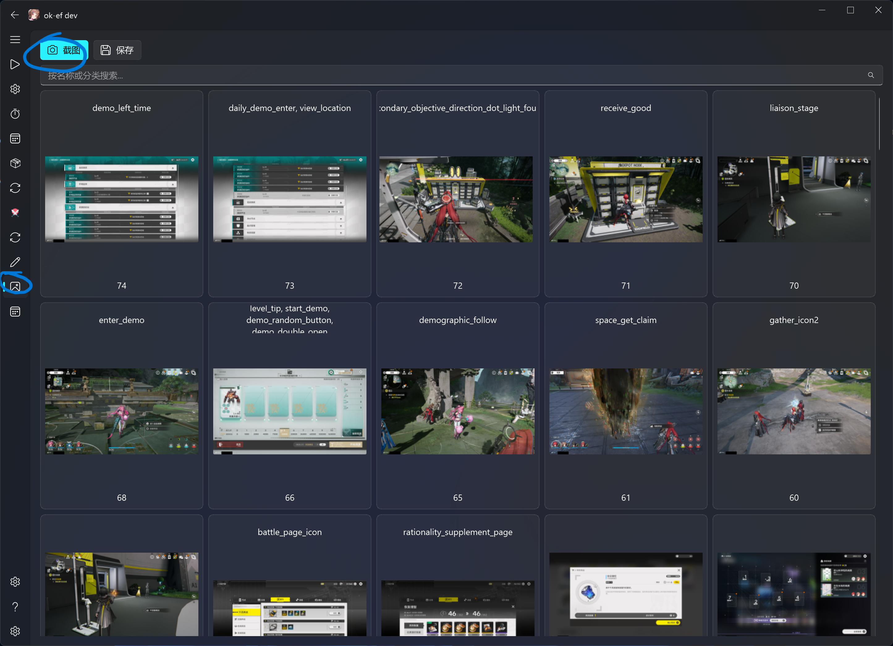
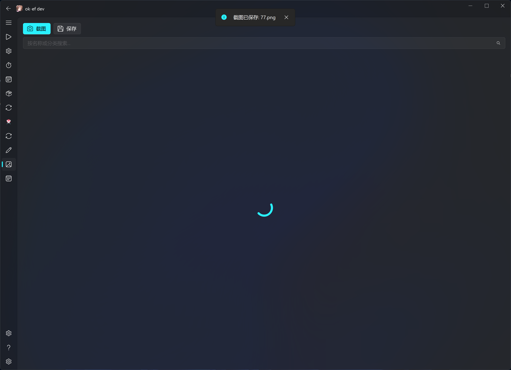
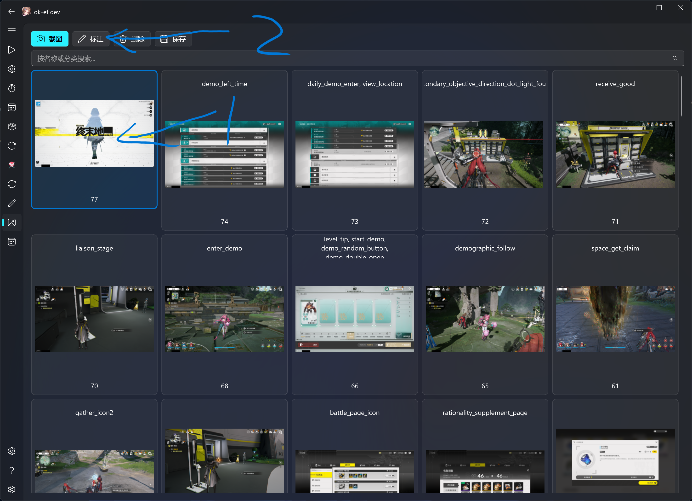
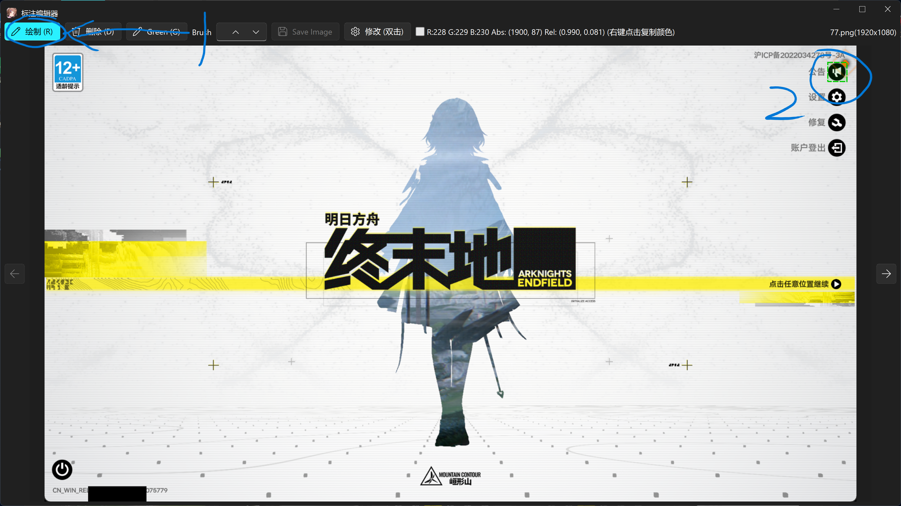
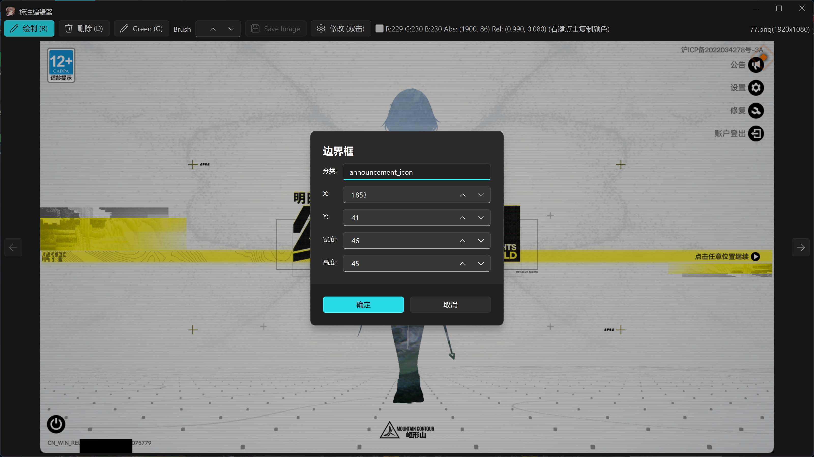
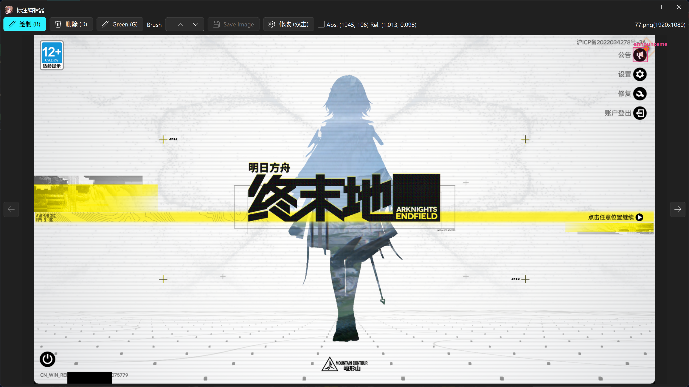
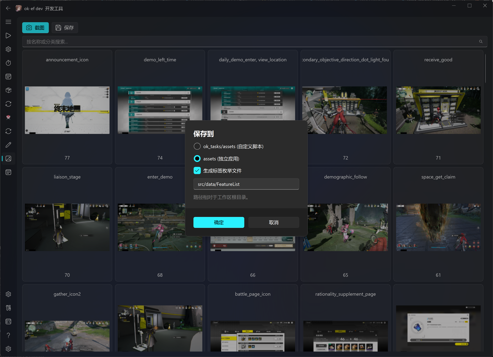
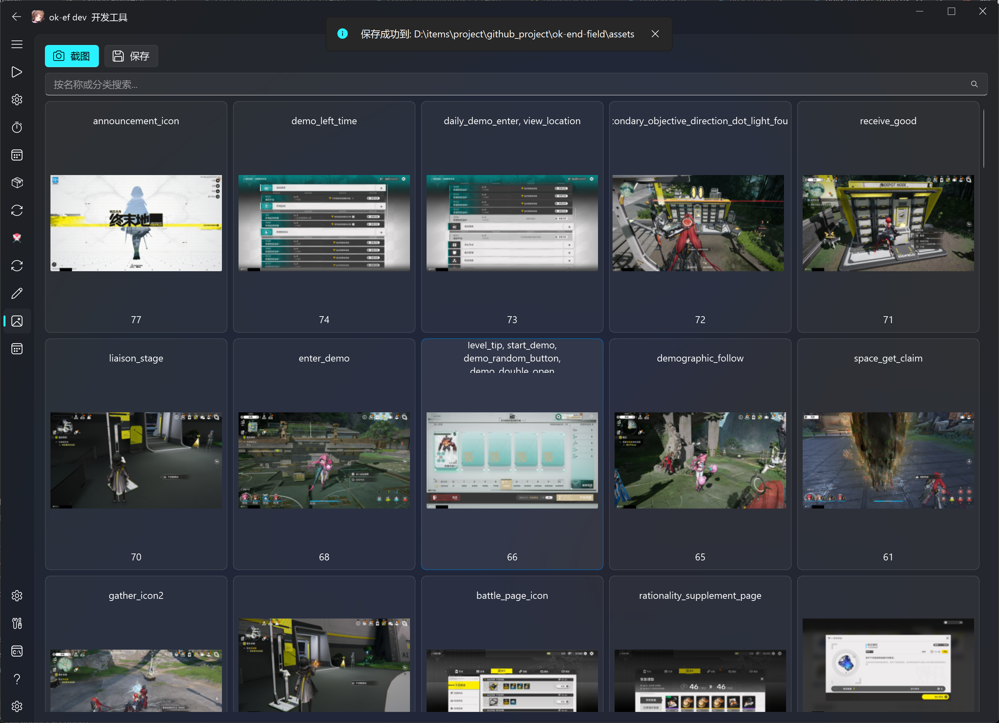

# 修改模板快速开始

> 面向 `AliceJump/ok-end-field` 无权限贡献者，专用于修改游戏截图模板。
>
> | 仓库 | 角色 |
> |------|------|
> | `AliceJump/ok-end-field` | 上游主仓库 |
> | `AliceJump/ok-end-field-x-anylabeling-asset` | 模板源文件 (`ok_templates/`，submodule，默认分支 `main`) |
> | `你的账号/...` | 你的两份 fork |

---

## 先搞懂架构

```
ok_templates/  (子仓库: 原始 PNG + 对应 AnyLabeling JSON + coco_annotations.json)
     │ TemplateTab → Save → "assets (standalone app)"
     ▼
assets/images/ + assets/coco_annotations.json  (主仓库生成物)
src/data/FeatureList.py                         (主仓库生成的标签枚举)
     │
     ▼
self.find_feature(feature=fL.xxx)
     → RuntimeMixin.find_feature
     → get_feature_by_resolution (基础名 / _2k / _4k)
     → ok-script BaseTask.find_feature / FeatureSet
     → OpenCV 模板匹配
```

> **关键**：`ok_templates/` 中与截图同名的原始 PNG、标注 JSON 以及汇总的 `coco_annotations.json` 才是模板源码；主仓库的 `assets/images/`、`assets/coco_annotations.json` 和 `src/data/FeatureList.py` 是 Save 生成物。模板改动必须同时提交子仓库源码和主仓库生成物。

---

## 完整工作流

### ① Fork 两个仓库

| 仓库 | 操作 |
|------|------|
| `AliceJump/ok-end-field` | GitHub → Fork |
| `AliceJump/ok-end-field-x-anylabeling-asset` | GitHub → Fork |

### ② Clone（含 submodule）

```bash
git clone --recursive https://github.com/你的账号/ok-end-field.git
cd ok-end-field
git remote add upstream https://github.com/AliceJump/ok-end-field.git
git fetch upstream
git switch -c update-templates upstream/master
```

> 如果已 clone 但没初始化：`git submodule update --init ok_templates`

主仓库的 `origin` 应指向你的 fork，`upstream` 应指向 `AliceJump/ok-end-field`。主仓库当前默认分支是 `master`；提交前应确认功能分支基于最新的 `upstream/master`。

### ③ 配置子仓库 remote → 从 `main` 签出分支

```bash
cd ok_templates
git remote rename origin upstream
git remote add origin https://github.com/你的账号/ok-end-field-x-anylabeling-asset.git
git fetch --all --prune
git switch --create main --track upstream/main
git switch -c update-x-template
git remote -v
cd ..
```

初始化 submodule 后通常处于 detached HEAD，且 `.gitmodules` 配置的 `origin` 指向上游。上面的命令将该 remote 保留为 `upstream`，再把你的 fork 设为可推送的 `origin`。如果本地已经存在 `main`，使用 `git switch main` 和 `git pull --ff-only upstream main`，不要再次执行 `--create`。

### ④ 修改模板（TemplateTab GUI）

```bash
python main.py
```

#### Step 1 — 截图

**① 点击 Screenshot**



截图自动保存到 `ok_templates/`，推荐 3840×2160 全屏截图。

**② 截图完成后出现在列表中**



---

#### Step 2 — 标注

选中图片 → 点击 Markup

**③ Markup 界面**



**④ 点击绘制 → 框选目标元素（左上→右下）**



**⑤ 输入模板名 → 确认**



> 标签名必须与 `src/data/FeatureList.py` 中的值及代码调用一致。当前约定是小写英文 `snake_case`，按语义使用前缀/后缀，例如角色联络头像用 `contact_<name>`，战斗头像用 `battle_icon_<name>`，图标用 `<name>_icon`，同类变体用 `_2`、`_3`。分辨率专用模板只追加 `_2k` 或 `_4k`；代码通常传不带分辨率后缀的基础名，例如 `self.find_feature(feature=fL.esc)`，由 `get_feature_by_resolution()` 按窗口宽度选择 `esc`、`esc_2k` 或 `esc_4k`。不要沿用仓库中不存在的 `char_`、`box_` 等旧前缀约定。

**⑥ 标注完成**



---

#### Step 3 — 压缩导出

点击 Save → 选择 "assets (standalone app)" → OK

**⑦ 选择导出目标**



**⑧ 导出完成**



---

#### Step 4 — 验证

```bash
cd ok_templates
git status --short --branch
git diff --stat
git diff -- coco_annotations.json

cd ..
git submodule status
git status --short
git diff --submodule=log -- ok_templates
git diff --stat -- assets/coco_annotations.json assets/images src/data/FeatureList.py
git diff -- assets/coco_annotations.json src/data/FeatureList.py
```

还应在 Debug 模式实际调用对应基础标签，确认 1080p/2K/4K 的后缀选择和搜索区域都能命中。提交暂存后，再运行以下命令确认 PR 包含完整内容：

```bash
git diff --cached --submodule=log -- ok_templates
git diff --cached --stat -- assets/coco_annotations.json assets/images src/data/FeatureList.py
git status --short
```

### ⑤ 推送子仓库

```bash
cd ok_templates
git add .
git diff --cached --stat
git diff --cached -- coco_annotations.json
git commit -m "feat: add X template"
git push -u origin update-x-template
```

### ⑥ 创建子仓库 PR

```
你的账号/ok-end-field-x-anylabeling-asset:update-x-template → PR → AliceJump/ok-end-field-x-anylabeling-asset:main
```

**⚠️ 必须先等此 PR 合并再继续。**

### ⑦ 子仓库合并后 → 更新主仓库 PR

```bash
cd ok_templates
git fetch upstream
git switch main
git pull --ff-only upstream main
cd ..
python main.py   # TemplateTab → Save → "assets (standalone app)"
git add ok_templates assets/coco_annotations.json assets/images src/data/FeatureList.py
git diff --cached --submodule=log -- ok_templates
git diff --cached --stat -- assets/coco_annotations.json assets/images src/data/FeatureList.py
git commit -m "feat: update templates and submodule"
git push -u origin update-templates
git status --short --branch
git submodule status
git diff --check upstream/master...HEAD
git diff --stat upstream/master...HEAD
git diff --submodule=log upstream/master...HEAD -- ok_templates
```

创建 PR：

```
你的账号/ok-end-field → PR → AliceJump/ok-end-field
```

---

## 常见错误

| 错误 | 原因 | 解决 |
|------|------|------|
| `Permission denied` push 失败 | remote 仍指向上游 | `git remote set-url origin` 改到你的 fork |
| `git submodule status` 出现 `+` | 子仓库当前 checkout 的 commit 与主仓库索引记录的 gitlink 不同；不表示该 commit 一定“不在上游” | 用 `git diff --submodule=log -- ok_templates` 确认差异；应更新时在主仓库暂存 `ok_templates`，不应更新时切回索引记录的 commit |
| `git submodule status` 出现 `-` / `U` | `-` 表示未初始化；`U` 表示 gitlink 有合并冲突 | 初始化 submodule；冲突则先在子仓库选定正确 commit，再在主仓库暂存 gitlink |
| submodule `dirty` | 未提交修改 | `cd ok_templates && git status` |
| 找不到模板 `not found in featureDict` | 没 compress / 名称不对应 | 确认 category name 与代码调用一致 |
| `cv2.error` | 模板比搜索区域大 | 检查 bbox 范围 |

---

## 速查

```bash
# 初始化
git clone --recursive https://github.com/你的账号/ok-end-field.git
cd ok-end-field

# 改 remote
cd ok_templates
git remote rename origin upstream
git remote add origin https://github.com/你的账号/ok-end-field-x-anylabeling-asset.git
git fetch --all --prune
git switch --create main --track upstream/main
git switch -c update-x-template
cd ..

# 修改模板 → 压缩导出
python main.py
# Screenshot → Markup(框选+命名) → Save(assets)

# 推子仓库
cd ok_templates
git add . && git diff --cached --stat && git commit -m "feat: add X template" && git push -u origin update-x-template
# → 创建 SubRepo PR，等合并

# 子仓库合并后
cd ok_templates
git fetch upstream && git switch main && git pull --ff-only upstream main
cd ..
python main.py  # TemplateTab → Save
git add ok_templates assets/coco_annotations.json assets/images src/data/FeatureList.py
git diff --cached --submodule=log -- ok_templates
git diff --cached --stat -- assets/coco_annotations.json assets/images src/data/FeatureList.py
git commit -m "feat: update templates" && git push -u origin update-templates
# → 创建 MainRepo PR
```

> **一句话**：改子仓库 → compress → 子仓库 PR → 子仓库合并 → 重新 compress → 主仓库 PR。
