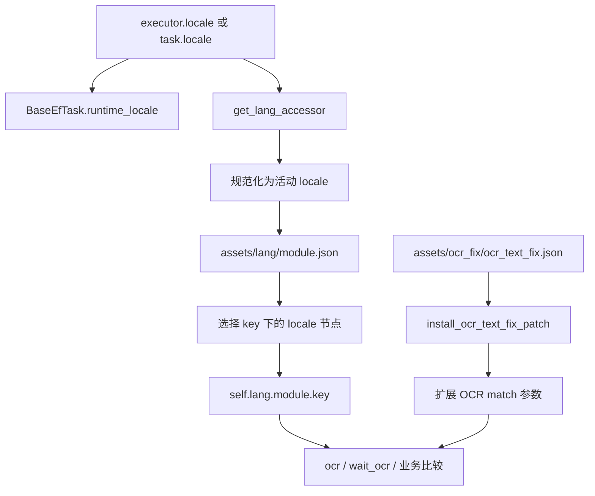

# i18n 与 OCR 配置流程

返回：[文档索引](../zh-CN/index.md) / [README](https://github.com/AliceJump/ok-end-field/blob/master/README.md)

本文区分两套用途不同的语言资源：

- `i18n/<locale>/LC_MESSAGES/ok.po`：GUI/gettext 翻译。
- `assets/lang/<module>.json`：任务 OCR 匹配器和本地化业务文本。

两者不能互相替代。

## 1. 运行链路



入口 `main.py`/`main_debug.py` 在导入并启动 `ok` 应用前调用 `install_startup_patches()`。OCR 补丁对 `TaskExecutor.__init__` 和 `OCR.fix_match_regex` 安装一次性 monkey patch。

## 2. 活动 locale

活动 OCR locale 由 `src/data/lang/__init__.py` 的 `ACTIVE_LOCALES_CONFIG` 明确控制：

```python
ACTIVE_LOCALES_CONFIG = {
    "zh_CN": True,
    "zh_TW": True,
    "en_US": False,
    "ja_JP": False,
    "ko_KR": False,
    "es_ES": False,
}
```

因此当前 `SUPPORTED_LOCALES == ("zh_CN", "zh_TW")`。JSON 和 gettext 目录中存在英语、日语、韩语、西班牙语内容，不代表这些语言已启用为任务 OCR locale。

locale 来源和规范化规则：

1. 有 executor 时读取 `self.executor.locale`；否则读取 `self.locale`。
2. 支持 `Enum`、带 `name` 属性/方法的 locale 对象和字符串。
3. `-` 转为 `_`，并对活动 locale 做大小写宽容匹配。
4. 非活动、未知或空 locale 回退 `zh_CN`。

`BaseEfTask.runtime_locale` 只暴露提取到的原始字符串；真正的活动 locale 规范化发生在 `LangAccessor` 中。

## 3. 统一 JSON schema

资源路径是单文件：

```text
assets/lang/<module>.json
```

不存在运行时使用的 `assets/lang/<module>/<locale>.json` 目录结构。统一文件以业务 key 为第一层，以 locale 为第二层：

```json
{
  "k_confirm": {
    "zh_CN": {"string": "确认"},
    "zh_TW": {"string": "確認"},
    "en_US": {"string": "Confirm"}
  },
  "k_number": {
    "zh_CN": {"pattern": "^\\d+$"},
    "zh_TW": {"pattern": "^\\d+$"}
  },
  "k_accept": {
    "zh_CN": {"terms": ["接取", "接受"]},
    "zh_TW": {"terms": ["接取", "接受"]}
  }
}
```

每个 locale 节点应只使用一种值：

| 节点 | 访问结果 | 用途 |
|------|----------|------|
| `{"string": "确认"}` | `str` | 固定文本或业务显示文本 |
| `{"pattern": "^\\d+$"}` | 编译后的 `re.Pattern` | 正则 OCR 匹配 |
| `{"terms": ["A", "B"]}` | `list` | 多个候选值 |

如果 locale 节点本身不是字典，则原样返回。直接属性解析检查顺序为 `string`、`pattern`、`terms`；`build_matcher` 检查顺序为 `pattern`、`string`、`terms`。不要在同一个 locale 节点混放这些字段。

加载一个 key 时的值回退顺序：

1. 当前规范化 locale。
2. 当前为 `zh_TW` 时仍回退 `zh_TW`，否则回退 `zh_CN`。
3. 该 key 下第一个可用 locale 值。

模块文件不存在、JSON 读取失败或 key 不存在时返回空模块/`None`；不会按旧目录结构寻找其它文件。

## 4. 代码访问

```python
result = self.wait_ocr(
    match=self.lang.DeliveryTask.k_ae8fb114,
    box=self.box.bottom,
    time_out=5,
)

self.wait_click_ocr(
    match=self.lang.daily_battle_mixin.k_b56d9ac6,
    box=self.box.bottom_right,
    time_out=5,
)
```

安全读取并提供代码级 fallback：

```python
from src.data.lang import get_lang_module_value

matcher = get_lang_module_value(
    self.lang,
    "DeliveryTask",
    "k_ae8fb114",
    fallback="确认",
)
```

业务数据仍以中文 canonical key 保存时，使用现有工具转换：

- `src/data/world_map_utils.py`：`get_world_map_matcher`、`get_world_map_text`、`is_world_map_text`。
- `src/data/characters_utils.py`：`get_localized_name_by_canonical`、`get_contact_list_with_feature_list`。

## 5. OCR 混淆补丁

配置文件：

```text
assets/ocr_fix/ocr_text_fix.json
```

schema 是完整文本的 `OCR 错误文本 -> 正确文本`：

```json
{
  "乾員聯絡": "幹員聯絡"
}
```

当前补丁 **不会替换 OCR 输出文本，也不会写入 `TaskExecutor.text_fix`**。实际行为是：

1. 只读取长度相同的错误/正确文本对。
2. 对每个不同字符构建 `正确字符 -> OCR 错误字符`，例如 `幹 -> 乾`。
3. 同一正确字符映射到多个不同错字时，保留先前映射并跳过冲突。
4. 在框架原有 `OCR.fix_match_regex` 处理后，扩展调用方的 `match`。

不同 `match` 类型的行为：

| 输入 | 补丁行为 |
|------|----------|
| `str` | 生成原文和混淆变体，最多 4 个；有多个时返回列表 |
| `re.Pattern` | 只扩展安全的字面字符；字符类内追加错字，保留 flags |
| `list` | 递归扩展并摊平结果 |
| 其它 | 原样返回 |

正则转义、量词、分组和其它结构标记不会被重写；混淆字符本身是正则元字符时跳过。编译或处理失败会返回原始 match。这是一层匹配兼容，不是 OCR 结果标准化，因此业务代码读取 `box.name` 时仍可能看到原始误识文本。

旧 `src/data/ocr_normalize_map.py` 机制已不存在。若需要业务输出标准化，应在明确的业务解析层实现，不能假定全局补丁已改写文本。

## 6. 新增 OCR 文本

1. 确定模块名，通常与使用它的任务类或 Python 模块一致，例如 `DeliveryTask`、`login_mixin`。
2. 编辑 `assets/lang/<module>.json`，新增顶层 key。
3. 至少为当前活动 locale `zh_CN`、`zh_TW` 增加同名节点。
4. 节点只选 `string`、`pattern`、`terms` 之一。
5. 在代码中引用 `self.lang.<module>.<key>`。
6. 运行语言引用测试并实测 OCR 区域。

```powershell
.\.venv\Scripts\python.exe -m unittest tests.TestCheckLang
```

`TestCheckLang` 当前只扫描形如 `self.lang.<module>.k_xxx` 的引用，只校验 `zh_CN` 和 `zh_TW`：

- 模块文件不存在或两个 locale 都缺 key：失败。
- 只缺一个活动 locale：记录 warning，不导致失败。
- 非 `k_` 命名的访问（例如 `self.lang.login_mixin.ms`）不在该测试正则的覆盖范围内，需要人工检查。

## 7. GUI gettext

GUI 文本使用：

```text
i18n/<locale>/LC_MESSAGES/ok.po
```

当前仓库有 `zh_CN`、`zh_TW`、`en_US`、`ja_JP`、`ko_KR`、`es_ES` catalog。相关验证：

```powershell
.\.venv\Scripts\python.exe -m unittest tests.TestGuiI18n
.\.venv\Scripts\python.exe -m unittest tests.TestPoLocaleConsistency
```

`TestPoLocaleConsistency` 检查 catalog 重复/空翻译、占位符一致性、部分语言不应复制英文 fallback，以及已知运行时污染 msgid。它不决定 OCR `SUPPORTED_LOCALES`。

## 8. 工具状态

`scripts/i18n/` 下的可用工具：

- `sync_*.py`：官方译名同步进 lang JSON 与 ok.po（world_map / map_mark / wiki_item / character / official_i18n 各数据源一个脚本）。
- `gen_lang_stubs.py`：扫描 lang JSON 生成 `src/data/lang/_lang_typed.py` 类型提示存根。
- `lang_fill_missing.py`：缺失语言节点补全与审计（`--dry-run` 幂等）。
- `restore_empty_po_entries.py`：从任意 git ref 的历史 po 恢复被清空的翻译。

针对旧 `assets/lang/<module>/<locale>.json` 目录 schema 的批量翻译与迁移工具已随 schema 切换删除。

当前可靠流程是手工编辑统一 JSON，使用 `TestCheckLang` 校验引用，再人工复核正则和游戏专有名词。

## 9. 排查清单

语言节点未生效时依次检查：

1. 文件是否为 `assets/lang/<module>.json`。
2. 顶层 key 和代码属性是否完全一致。
3. 运行时 locale 是否在 `ACTIVE_LOCALES_CONFIG` 中启用。
4. locale 节点是否只包含一个合法类型字段。
5. 正则字符串是否为有效 Python 正则。
6. `TestCheckLang` 未覆盖的非 `k_` key 是否人工补齐。

OCR 稳定误识时，先确认是否只是匹配问题。只有等长字符混淆适合加入 `ocr_text_fix.json`；长度变化、词序变化或仅某一业务成立的纠错应在语言 pattern 或业务解析中处理。
