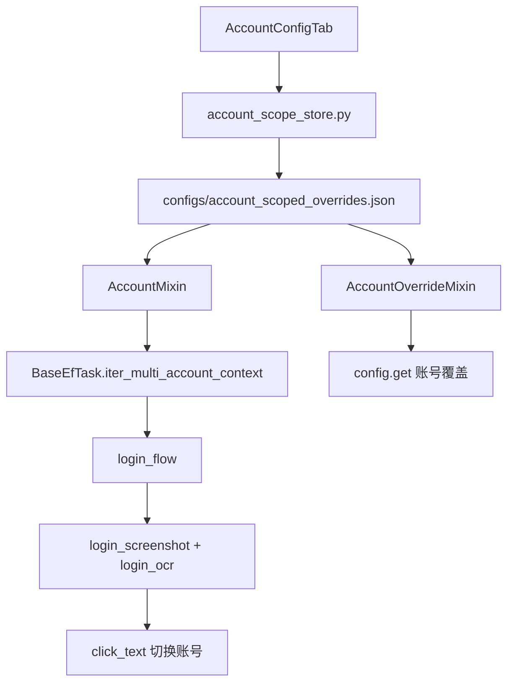
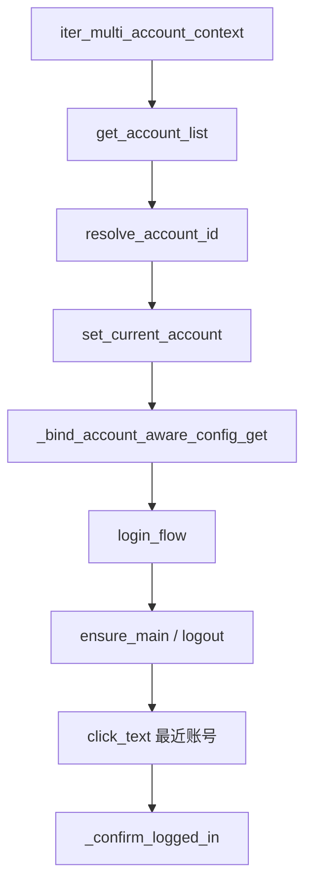
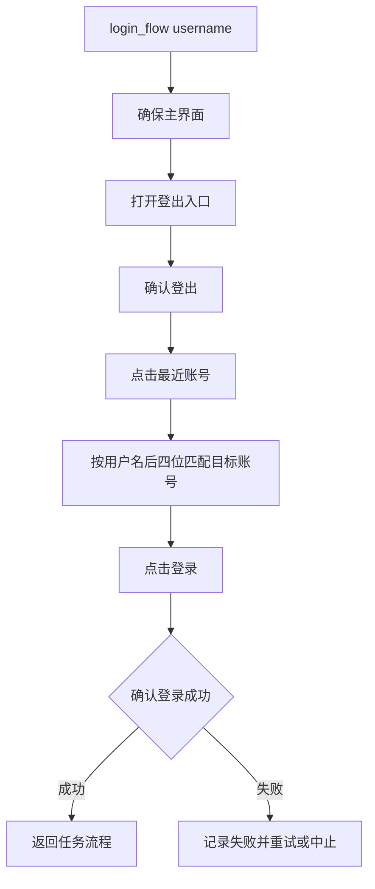
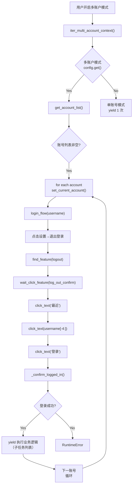

# 切换账户流程分析

返回：[文档索引](../zh-CN/index.md) / [README](https://github.com/AliceJump/ok-end-field/blob/master/README.md)

> 基于 `ok-script` 框架（`.venv/Lib/site-packages/ok`）+ 本项目代码
>
> 本文聚焦**登录切换的执行流程**（GUI → 账号存储 → Mixin → login_flow）；账号身份规则与覆盖配置的默认行为见 [账号唯一ID与多账户覆盖默认逻辑](账号唯一ID与多账户覆盖默认逻辑.md)。

---

## 一、整体架构



```
┌─────────────────────────────────────────────────────────────┐
│                    GUI 配置层                                 │
│  AccountConfigTab (PySide6 + qfluentwidgets)                 │
│  账号列表管理 / 账号-任务覆盖编辑                             │
└──────────────────┬──────────────────────────────────────────┘
                   │
┌──────────────────▼──────────────────────────────────────────┐
│              数据持久化层                                      │
│  account_scope_store.py                                       │
│  configs/account_scoped_overrides.json                        │
│  账号ID注册表 / 覆盖字典 / 文件缓存 + 线程锁                   │
└──────────────────┬──────────────────────────────────────────┘
                   │
┌──────────────────▼──────────────────────────────────────────┐
│              Mixin 层（运行时注入）                             │
│  AccountMixin (继承 LoginMixin)                               │
│  │  - 添加"多账户模式"、"多账户独立配置"配置项                  │
│  │  - get_account_list() 解析任务页账号列表                    │
│  AccountOverrideMixin                                         │
│     - 首次绑定 config.get() → _config_get_with_account_override│
│     - 运行时按 current_account_id 读取覆盖                     │
└──────────────────┬──────────────────────────────────────────┘
                   │
┌──────────────────▼──────────────────────────────────────────┐
│           任务执行层（框架核心）                                │
│  BaseEfTask.iter_multi_account_context()                      │
│  │  - 读取"多账户模式"开关和账号列表                           │
│  │  - 循环调用 set_current_account() + login_flow()            │
│  DailyTaskRunner / DeliveryTask 业务循环                       │
└──────────────────┬──────────────────────────────────────────┘
                   │
┌──────────────────▼──────────────────────────────────────────┐
│           登录切换层（OCR + 鼠标点击）                          │
│  login_flow()                                                 │
│    登出 → 选最近账号 → 点登录 → 确认                          │
│  click_text()                                                 │
│    login_screenshot(自定义截图) + pyautogui.click(自定义点击)   │
└─────────────────────────────────────────────────────────────┘
```

---

## 二、函数调用链逐级分析



### 2.1 入口：`iter_multi_account_context()` — 账号循环调度

**定义位置：** [`src/core/BaseEfTask.py`](../../src/core/BaseEfTask.py) `::` `BaseEfTask.iter_multi_account_context`
**来源：** ✅ 本项目实现（框架 `BaseTask` 无此概念）

```
iter_multi_account_context(repeat_times, empty_accounts_message, ...)
  │
  ├─ self.config.get("多账户模式")       → 框架 BaseTask.config 字典
  │                                       [.venv/Lib/site-packages/ok/task/task.py]
  │
  ├─ self.get_account_list()             → 本项目
  │   └─ [`AccountMixin.get_account_list`](../../src/tasks/account/account_mixin.py)
  │       └─ resolve_account_id()        → 本项目
  │           └─ [`account_scope_store.resolve_account_id`](../../src/tasks/account/account_scope_store.py)
  │
  ├─ self.set_current_account(username, account_id)   → 本项目
  │   └─ [`BaseEfTask.set_current_account`](../../src/core/BaseEfTask.py)
  │       └─ _bind_account_aware_config_get()          → 本项目
  │           └─ [`AccountOverrideMixin._bind_account_aware_config_get`](../../src/core/base_mixin/account_override_mixin.py)
  │
  └─ self.login_flow(username)           → 本项目
      └─ [`LoginMixin.login_flow`](../../src/tasks/mixin/login_mixin.py)
```

---

### 2.2 `login_flow()` — 实际切换账号流程



**定义位置：** [`src/tasks/mixin/login_mixin.py`](../../src/tasks/mixin/login_mixin.py) `::` `LoginMixin.login_flow`
**来源：** ✅ **本项目完全自实现**

```
login_flow(username)
  │
  │  【阶段1：确保已登出】
  ├─ self.wait_ocr(ms, box=bottom_left)       → 框架 OCR 引擎
  ├─ self.ensure_main()                        → 本项目封装 [`game_flow_mixin.py`](../../src/core/base_mixin/game_flow_mixin.py)
  │   └─ 最终 → 框架 BaseTask
  ├─ self.find_one(fL.main_out)                → 本项目封装 [`runtime_mixin.find_one`](../../src/core/base_mixin/runtime_mixin.py)
  │   └─ 最终 → 框架 BaseTask.find_one()
  ├─ self.click(result)                        → 本项目封装 [`runtime_mixin.click`](../../src/core/base_mixin/runtime_mixin.py)
  │   └─ → 框架 BaseTask.click()
  │       └─ → [`EfInteraction.click`](../../src/interaction/EfInteraction.py#L39)  ✅ 本项目重写
  │
  │  【阶段2：找登出按钮并登出】
  ├─ self.find_feature(fL.logout)              → 本项目封装 [`runtime_mixin.find_feature`](../../src/core/base_mixin/runtime_mixin.py)
  │   └─ 最终 → 框架 BaseTask.find_feature()
  ├─ self.click(result[0])                     → 同上
  ├─ self.wait_click_feature(fL.log_out_confirm)  → 框架 BaseTask.wait_click_feature()
  │
  │  【阶段3：切换到目标账号】
  ├─ self.click_text(re.compile("最近"))        → ✅ 本项目实现 [`login_mixin.click_text`](../../src/tasks/mixin/login_mixin.py)
  ├─ self.click_text(re.compile(username[-4:])) → ✅ 同上（当前实现直接使用后四位）
  ├─ self.click_text("登录")                    → ✅ 同上
  │
  │  【阶段4：确认登录成功】
  └─ self._confirm_logged_in()                 → 本项目 [`login_mixin._confirm_logged_in`](../../src/tasks/mixin/login_mixin.py)
      └─ self.find_feature(fL.logout)          → 框架
```

---

### 2.3 `click_text()` — OCR 找字 + 点击（核心登录交互）

**定义位置：** [`src/tasks/mixin/login_mixin.py`](../../src/tasks/mixin/login_mixin.py) `::` `LoginMixin.click_text`
**来源：** ✅ **本项目完全自实现，不经过框架点击链路**

```
click_text(match, box, need_wait_disappear, success_match)
  │
  │  【截图】
  ├─ self.login_ocr(match, box, need_active=False)    → 本项目 [`game_flow_mixin.login_ocr`](../../src/core/base_mixin/game_flow_mixin.py)
  │   │
  │   ├─ self.login_screenshot()                      → ✅ 本项目 [`game_flow_mixin.login_screenshot`](../../src/core/base_mixin/game_flow_mixin.py)
  │   │   └─ capture_window_by_screen(self.hwnd.hwnd) → ✅ 本项目 [`src/image/login_screenshot.py#L55`](../../src/image/login_screenshot.py#L55)
  │   │        pyautogui.screenshot() + win32gui.ClientToScreen 裁剪
  │   │        ❌ 完全绕过框架的 DesktopDuplication/BitBlt/WGC 截图体系
  │   │
  │   └─ super().ocr(frame=img, ...)                  → 框架 BaseTask.ocr()
  │        ↑ 使用自定义截图帧，调用框架 OCR 接口；当前 `src/config.py` 配置为 `onnxocr`
  │        ✅ 复用框架的文字识别引擎
  │
  │  【点击】
  └─ run_at_window_pos(self.hwnd.hwnd, pyautogui.click, x, y)   → ✅ 本项目 [`Mouse.py#L318`](../../src/interaction/Mouse.py#L318)
       │
       ├─ win32gui.ClientToScreen(hwnd, (x, y))       # 坐标转换
       └─ pyautogui.click(screen_x, screen_y)          # ❌ 直接 pyautogui
                                                        # 完全绕过框架点击系统
                                                        # 不走 self.click() / EfInteraction.click()
```

---

### 2.4 `login_screenshot()` — 自定义截图

**定义位置：** [`src/core/base_mixin/game_flow_mixin.py`](../../src/core/base_mixin/game_flow_mixin.py) `::` `GameFlowMixin.login_screenshot`
**来源：** ✅ **本项目独立实现**

```
login_screenshot(need_active=True)
  │
  ├─ self.active_and_send_mouse_delta()    → 本项目 [`Mouse.py`](../../src/interaction/Mouse.py)
  │
  └─ capture_window_by_screen(self.hwnd.hwnd)  → ✅ 本项目 [`src/image/login_screenshot.py#L55`](../../src/image/login_screenshot.py#L55)
       │
       ├─ win32gui.ClientToScreen(hwnd, (0, 0))  # 获取客户区左上角屏幕坐标
       ├─ win32gui.GetClientRect(hwnd)            # 获取客户区尺寸
       ├─ pyautogui.screenshot()                  # 全屏截图（PIL.Image）
       └─ cropped = screen.crop((left, top, ...)) # 裁剪窗口客户区
       ❌ 完全不经过框架 capture 体系
       （框架使用 DesktopDuplicationCaptureMethod / BitBltCaptureMethod / WGC）
```

---

### 2.5 `login_ocr()` — 登录场景 OCR

**定义位置：** [`src/core/base_mixin/game_flow_mixin.py`](../../src/core/base_mixin/game_flow_mixin.py) `::` `GameFlowMixin.login_ocr`
**来源：** 🔀 混合（自定义截图 + 框架 OCR 引擎）

```
login_ocr(match, box, ...)
  │
  ├─ self.login_screenshot()    → ✅ 本项目 [`game_flow_mixin.login_screenshot`](../../src/core/base_mixin/game_flow_mixin.py)（自定义截图源）
  │
  └─ super().ocr(frame=img, ...)  → 框架 BaseTask.ocr()
       │                           [.venv/Lib/site-packages/ok/task/task.py]
       └─ self.ocr_fun(lib)()
            └─ `src/config.py` 的 `ocr.lib = "onnxocr"` → 框架 `onnx_ocr`
```

---

### 2.6 `find_feature()` / `find_one()` — 模板匹配

**定义位置：** [`src/core/base_mixin/runtime_mixin.py`](../../src/core/base_mixin/runtime_mixin.py) `::` `RuntimeMixin.find_feature` / `RuntimeMixin.find_one`
**来源：** 🔀 本项目封装 + 框架引擎

```
find_feature(feature_name, ...)
  │
  ├─ self.get_feature_by_resolution(name)    → 本项目（分辨率映射）
  │
  └─ super().find_feature(...)               → 框架 BaseTask.find_feature()
       │                                      [.venv/Lib/site-packages/ok/task/task.py]
       └─ self.executor.feature_set.find_feature(self.executor.frame, ...)
            ↑ 使用框架的 executor.frame（框架截图）做模板匹配
            ✅ 截图源和匹配引擎全部来自框架

find_one(...)
  └─ self.find_feature(...)                  → 同上
```

---

### 2.7 `click()` — 通用点击（非 `click_text`）

**定义位置：** [`src/core/base_mixin/runtime_mixin.py`](../../src/core/base_mixin/runtime_mixin.py) `::` `RuntimeMixin.click`
**来源：** 🔀 本项目封装 + 本项目 `EfInteraction`

```
click(x, y, ...)
  │
  ├─ self.find_danger()        → 本项目 [`runtime_mixin.py`](../../src/core/base_mixin/runtime_mixin.py)（危险态检测）
  │
  └─ super().click(...)        → 框架 BaseTask.click()
       │                        [.venv/Lib/site-packages/ok/task/task.py]
       └─ self.executor.interaction.click(x, y, ...)
            │
            └─ [`EfInteraction.click`](../../src/interaction/EfInteraction.py#L39)  → ✅ 本项目
                 │
                 ├─ 继承框架 PostMessageInteraction
                 ├─ 重写了 click() → 添加 try_activate() 窗口激活逻辑
                 └─ Win32 PostMessage(WM_LBUTTONDOWN / WM_LBUTTONUP) 发送鼠标事件
```

---

### 2.8 `EfInteraction.click()` — 框架级点击的最终执行者

**定义位置：** [`src/interaction/EfInteraction.py#L30`](../../src/interaction/EfInteraction.py#L30) `::` `class EfInteraction` / [`EfInteraction.py#L39`](../../src/interaction/EfInteraction.py#L39) `::` `EfInteraction.click`  
**来源：** ✅ **本项目重写**（继承框架 `PostMessageInteraction`）

```
EfInteraction.click(x, y, down_time, key, ...)
  │
  ├─ try_activate()                              → 本项目（激活窗口）
  │   ├─ 判断窗口是否为前台
  │   ├─ 若非前台 → self.activate() → PostMessage(WM_ACTIVATE)
  │   └─ 记录鼠标位置
  │
  ├─ win32api.SetCursorPos((abs_x, abs_y))        # Win32 API 移动鼠标
  │
  └─ self.post(WM_LBUTTONDOWN, MK_LBUTTON, pos)  → 继承框架 PostMessageInteraction
       ├─ self.post(WM_LBUTTONUP, 0, pos)           Win32 PostMessage 到窗口
       └─ SetCursorPos(self.cursor_position)        # 移回原位
```

---

### 2.9 `AccountOverrideMixin` — 运行时覆盖注入

**定义位置：** [`src/core/base_mixin/account_override_mixin.py`](../../src/core/base_mixin/account_override_mixin.py) `::` `_bind_account_aware_config_get`
**来源：** ✅ **本项目完全自实现**

```
_bind_account_aware_config_get()
  │
  └─ 首次调用时绑定（后续账号切换复用同一包装器）：
       config.get = _patched_get
       config._raw_get = 原始 get   # 保留原始方法
       │
       _patched_get(key, default):
         │
         ├─ base = raw_get(key, default)            # 读任务原始配置
         │
         ├─ _is_account_override_enabled()           # 检查"多账户独立配置"开关
          │   └─ [`account_override_mixin.py`](../../src/core/base_mixin/account_override_mixin.py)
         │
         ├─ account_overrides = get_account_task_overrides(
          │       current_account_id, task_name)       → 本项目 [`account_scope_store.py`](../../src/tasks/account/account_scope_store.py)
         │
         └─ if key in account_overrides:
              return _coerce_override_value(base, overrides[key])  # 类型转换
```

---

### 2.10 `account_scope_store` — 整个持久化层

**定义位置：** [`src/tasks/account/account_scope_store.py`](../../src/tasks/account/account_scope_store.py)  
**来源：** ✅ **本项目完全自实现**

| 函数 | 行号 | 职责 |
|------|------|------|
| `get_store_path()` | [`#L22`](../../src/tasks/account/account_scope_store.py#L22) | 返回 `configs/account_scoped_overrides.json` 路径 |
| `parse_account_list_text()` | [`#L70`](../../src/tasks/account/account_scope_store.py#L70) | 解析账号列表文本（兼容 `账号,密码` 格式） |
| `_normalize()` | [`#L227`](../../src/tasks/account/account_scope_store.py#L227) | 数据清洗：注册表、覆盖和地图 content 标准化，旧用户名键迁移为 ID |
| `load_overrides()` | [`#L324`](../../src/tasks/account/account_scope_store.py#L324) | 加载覆盖文件（带 mtime 缓存 + 线程锁） |
| `save_overrides()` | [`#L352`](../../src/tasks/account/account_scope_store.py#L352) | 保存标准化覆盖文件 |
| `sync_account_list_text()` | [`#L397`](../../src/tasks/account/account_scope_store.py#L397) | 同步账号列表 → 注册表 ID 映射，并移除持久化密码 |
| `resolve_account_id()` | [`#L412`](../../src/tasks/account/account_scope_store.py#L412) | 用户名 → account_id 解析，可选择是否创建 |
| `get_account_task_overrides()` | [`#L435`](../../src/tasks/account/account_scope_store.py#L435) | 按 account_id + task_name 读取覆盖，兼容用户名旧键 |
| `set_account_task_overrides()` | [`#L541`](../../src/tasks/account/account_scope_store.py#L541) | 写入完整任务覆盖字典 |
| `_find_account_id_by_username()` | [`#L158`](../../src/tasks/account/account_scope_store.py#L158) | 在注册表中按当前用户名查找 ID，可选匹配 aliases |
| `_generate_account_id()` | [`#L186`](../../src/tasks/account/account_scope_store.py#L186) | `uuid4` 生成 `acc_xxxxxxxxxxxx` 格式 ID |

**运行时数据文件：** `configs/account_scoped_overrides.json`。该文件由程序运行时生成，不是仓库内保证存在的静态文档资源，因此这里不使用 Markdown 链接。

```json
{
  "account_list_text": "...",
  "account_registry": {
    "acc_bd19daf07452": { "username": "...", "aliases": ["..."] }
  },
  "accounts": {
    "acc_781af5ebb0cd": {
      "DailyTask": { "⭐送礼": true, "⭐刷体力": true, "其他配置": "..." }
    }
  }
}
```

---

## 三、使用框架 vs 本项目的精确边界

### 3.1 ✅ 使用框架的部分

| 功能 | 框架类/方法 | 说明 |
|------|-----------|------|
| **OCR 文字识别接口** | `BaseTask.ocr()` → `ocr_fun(lib)` | 本项目 `login_ocr()` 通过 `super().ocr()` 调用；当前 `src/config.py` 选择 `onnxocr` 后端 |
| **模板匹配引擎** | `BaseTask.find_feature()` → `FeatureSet.find_feature()` | `find_feature()` / `find_one()` 最终委托到此处 |
| **任务配置设施** | `BaseTask.config` + `default_config` + `config_description` + `config_type` | 框架初始化配置元数据并由 GUI 渲染；本项目任务负责声明具体配置项 |
| **特征资源加载** | `FeatureSet` | 框架读取本项目维护的 `assets/coco_annotations.json` 和 `assets/images/`；业务标签由 `src/data/FeatureList.py` 声明 |
| **GUI 框架** | `PySide6` + `qfluentwidgets` | `CustomTab`、`ConfigCard`、`NavigationItemPosition` |
| **任务生命周期** | `BaseTask` + `TriggerTask` | 任务的 `run()` / `on_destroy()` / 触发调度 |
| **OCR 匹配后排序** | `sort_boxes()` | 框架工具函数 |
| **窗口消息发送基类** | `PostMessageInteraction` | `EfInteraction` 继承此基类的 `post()` 方法 |
| **信号/通信系统** | `CommunicateHandler` | `screenshot` 保存、`draw_box` 等 |

### 3.2 ❌ 本项目的部分（框架没有提供任何能力）

| 功能 | 文件 | 跳转 | 说明 |
|------|------|------|------|
| **账号 ID 注册表** | [`account_scope_store.py`](../../src/tasks/account/account_scope_store.py) | `_find_account_id_by_username()` / `_generate_account_id()` | `acc_uuid` 生成、用户名 ↔ ID 映射、`aliases` 管理 |
| **账号覆盖存储** | [`account_scope_store.py`](../../src/tasks/account/account_scope_store.py) | `load_overrides()` / `update_overrides()` | JSON 文件读写、mtime 缓存、线程锁 |
| **运行时覆盖注入** | [`account_override_mixin.py`](../../src/core/base_mixin/account_override_mixin.py) | `_bind_account_aware_config_get` | 首次包装 `config.get()`，读取时按当前 context 解析覆盖 |
| **多账号配置项声明** | [`account_mixin.py`](../../src/tasks/account/account_mixin.py) | [`#L5`](../../src/tasks/account/account_mixin.py#L5) | "多账户模式"、"多账户独立配置"、"账号列表" |
| **账号列表解析** | [`account_mixin.py`](../../src/tasks/account/account_mixin.py) | `get_account_list()` | 解析用户名并非创建式调用 `resolve_account_id()` |
| **多账号循环执行** | [`BaseEfTask.py`](../../src/core/BaseEfTask.py) | `iter_multi_account_context()` | 设置/清理账号 context 并生成执行轮次 |
| **登出→切账号→登录** | [`login_mixin.py`](../../src/tasks/mixin/login_mixin.py) | `login_flow()` | 整个登录切换流程 |
| **OCR 文字点击** | [`login_mixin.py`](../../src/tasks/mixin/login_mixin.py) | `click_text()` | 自定义截图 + pyautogui 点击 |
| **自定义截图** | [`login_screenshot.py`](../../src/image/login_screenshot.py) | [`#L55`](../../src/image/login_screenshot.py#L55) | `capture_window_by_screen()` — pyautogui + 裁剪 |
| **自定义鼠标点击** | [`EfInteraction.py`](../../src/interaction/EfInteraction.py) | [`#L39`](../../src/interaction/EfInteraction.py#L39) | 继承框架，重写 `click()` 添加窗口激活逻辑 |
| **危险态检测与处置** | [`runtime_mixin.py`](../../src/core/base_mixin/runtime_mixin.py) | `find_danger()` / `click()` | 本项目在通用点击前匹配 `danger_1`～`danger_5`（按分辨率映射到现有 `_2k` 资源），命中后结束游戏并抛出异常；框架只提供底层模板匹配能力 |
| **GUI 覆盖编辑器** | [`AccountConfigTab.py`](../../src/gui/AccountConfigTab.py) | `render_task_editor()` / `_save_pending_changes()` | 以虚拟配置编辑并保存当前账号的完整任务配置快照，同时合并并发文件变化 |
| **覆盖编辑虚拟配置** | [`AccountConfigTab.py`](../../src/gui/AccountConfigTab.py) | `InMemoryConfig` / `_coerce_like()` | 包装配置控件并按基础值转换类型 |
| **任务编排器** | [`daily_task_runner.py`](../../src/tasks/daily/daily_task_runner.py) | `DailyTaskRunner` | 按账号分组记录失败、轮次汇总 |

### 3.3 🔀 混合（框架 + 本项目各一部分）

| 功能 | 框架提供 | 本项目提供 |
|------|---------|-----------|
| **`login_ocr()`** | `super().ocr()` — 调用框架 OCR 引擎 | `login_screenshot()` — 自定义截图源 |
| **`find_feature()`** | `super().find_feature()` — 框架模板匹配 | `get_feature_by_resolution()` — 分辨率资源映射；危险态检测不在此方法中，而在本项目 `RuntimeMixin.click()` 的前置步骤中 |
| **`EfInteraction.click()`** | `PostMessageInteraction.post()` — 消息发送 | 重写 `click()` — 窗口激活、鼠标移动逻辑 |
| **`AccountConfigTab`** | `CustomTab` 基类 + `ConfigCard` 渲染控件 | 覆盖编辑数据流、`_build_virtual_config()`、CRUD |
| **`RuntimeMixin.click()`** | `super().click()` — 框架点击调度 | `find_danger()` — 危险态检测前置 |

---

## 四、流程图



---

## 五、关键设计决策

1. **登录交互为什么要自己写 `click_text()` 而不是用框架的 `find_feature` + `click`？**  
   因为登录界面的 UI 元素是文字（"最近"、"登录"按钮文字），不是预注册的特征图片模板，所以只能用 OCR 识别文字位置再点击。

2. **为什么 `click_text` 不用框架的 `self.click()` 而用 `pyautogui.click()`？**  
   `self.click()` 走的是 `EfInteraction` → `PostMessage` 向窗口发送消息，但游戏登录界面（用户中心 WebView）可能不响应 `PostMessage` 鼠标事件，需要用全局级别鼠标事件（`pyautogui.click` + `SetCursorPos`）。

3. **为什么 `login_screenshot` 不用框架的 `self.executor.frame`？**  
   游戏弹窗/登录界面可能无法被框架的 `DesktopDuplication` / `BitBlt` 捕获（如 UWP 弹窗或某些渲染层覆盖），`pyautogui.screenshot()` 是后备方案。
