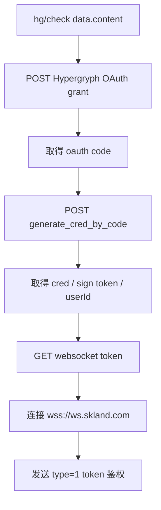
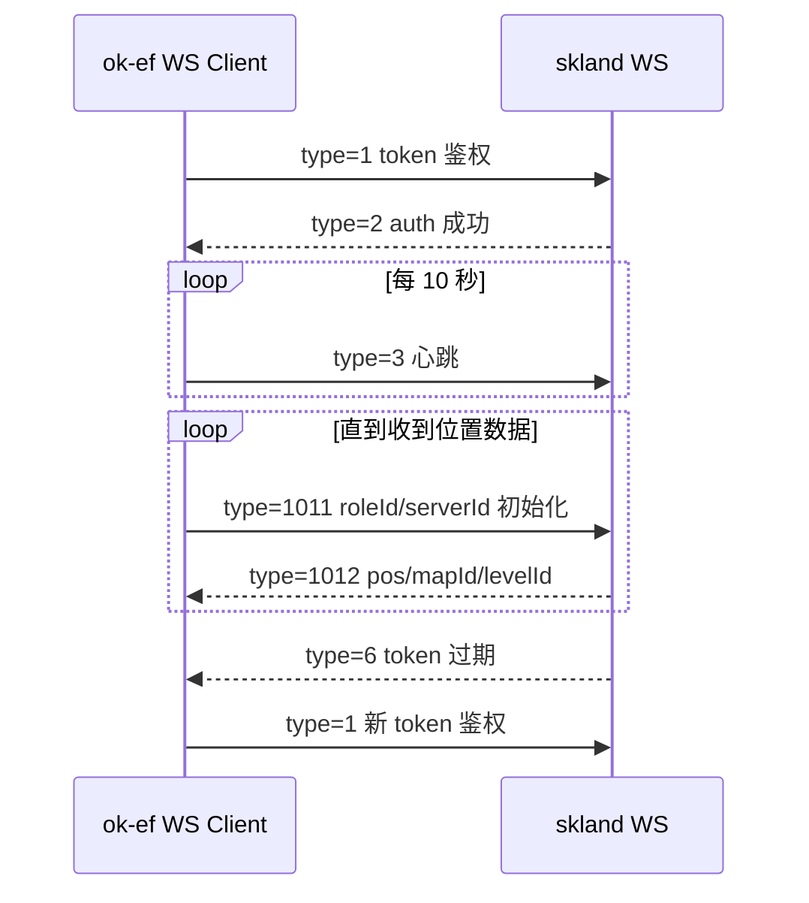
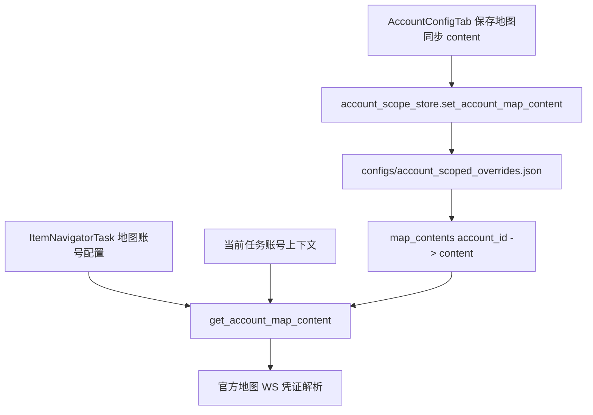
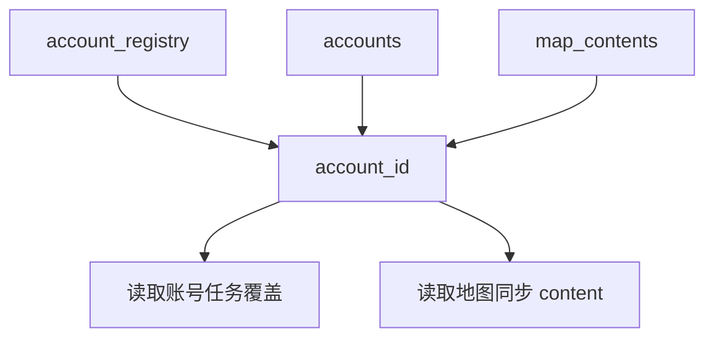
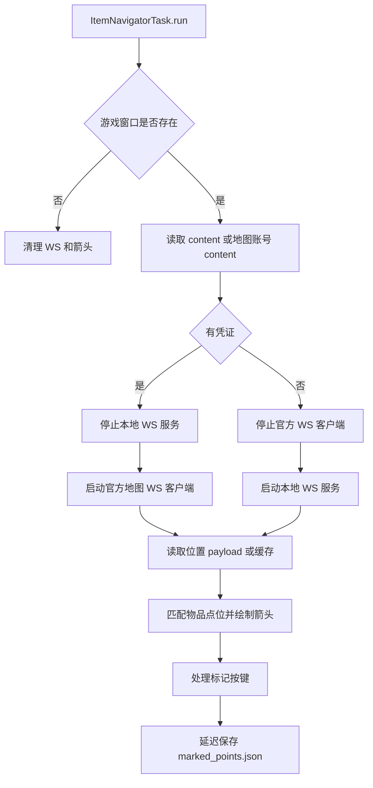

# 地图官方 WebSocket 客户端实现

返回：[文档索引](../README.md) / [README](../../README.md)

## 概述

替换油猴脚本转发方案，直接在项目内集成终末地官方地图的 `wss://ws.skland.com` WebSocket 客户端。
每个账号（玩家角色）需要独立的 `hg/check` credential 才能建立连接。
凭证可填写在任务直接输入（`content` 字段）或存储在账号配置页（`map_contents` 中），项目自动执行 OAuth 换取流程。

## 凭证输入方式

### 方式一：任务直接输入
`ItemNavigatorTask.default_config['content']` —— 直接填入 `hg/check` 接口返回的 `data.content` 字符串。

### 方式二：账号配置页（推荐）
`AccountConfigTab` 中的"地图同步 content"区域，每个账号存储一份 `data.content`。
数据持久化在 `configs/account_scoped_overrides.json` 的 `map_contents` 字段中。

### 凭证解析优先级
1. 任务 `content` 非空 → 直接使用
2. 任务 `地图账号` 非空 → 从 `map_contents` 读取该账号的 content
3. 任务当前登录账号 context → 从 `map_contents` 读取

### 不带凭证时的回退
`content` 和 `地图账号` 均为空时，自动启动旧的本地 WS 服务端模式（监听 `ws://127.0.0.1:3001`），兼容油猴脚本或其他外部来源。

## OAuth → WebSocket 登录全链路



## HTTP 签名算法

```
headers = {
    "platform": "3",
    "vName": "1.0.0",
    "timestamp": str(timestamp),
    "dId": device_id or "",
}

sign_payload = path + (query if GET else body) + timestamp
compact_headers = {"platform":"3","timestamp":"...","dId":"...","vName":"1.0.0"}
sign_payload += json.dumps(compact_headers, separators=(",", ":"))

digest = hmac.new(sign_token.encode(), sign_payload.encode(), sha256).hexdigest()
sign = md5(digest.encode()).hexdigest()
headers["sign"] = sign
```

### timestamp 处理
`clientTime` = 换取 cred 时的本地时间戳；`serverTime` = 换取 cred 时的服务器响应 timestamp。
之后每次签名：`adjusted = serverTime + (now - clientTime)`，确保时间戳随流逝时间同步推进。

## WebSocket 协议



| type | 方向 | 说明 |
|------|------|------|
| 1 | C→S | token 鉴权：`{token: wss_token}` |
| 2 | S→C | auth 成功确认 |
| 3 | C→S | 心跳（每 10s） |
| 6 | S→C | token 过期（`code=10002`），需重新获取 ws token 后发 type=1 |
| 1011 | C→S | 初始化：`{roleId, serverId}`（每 5s 发送一次直到收到 1012） |
| 1012 | S→C | 位置数据：`{data: {pos: {x,y,z}, mapId, levelId}}` |

客户端收到的位置数据通过 `_push_ws_payload()` 放入统一队列，与本地 WS 服务端模式共用同一套消费逻辑。

## 多账号架构



### 数据流


```text
configs/account_scoped_overrides.json
├── map_contents          ← 账号 → hg/check content 映射
│   ├── "acc_xxx": "data.content string"
│   └── ...
├── accounts              ← 任务级覆盖（已有）
└── account_registry      ← 账号 ID 注册表
```

### 相关 API (`account_scope_store.py`)
- `get_account_map_content(account, account_name="")` → str
- `set_account_map_content(account, content)` → None
- 内部 `_resolve_account_id_for_read/write()` 处理 ID/用户名解析

### UI (`AccountConfigTab.py`)
- 重新构建账户下拉时，从 `map_contents` 键集合中也拉入账号列表
- 地图 content 编辑区：TextEdit + 保存/清空按钮，绑定 `save_current_map_content` / `clear_current_map_content`

## 安全退出机制

### 1. 游戏窗口退出检测
`_is_game_window_alive()` 检查 `win32gui.IsWindow(hwnd) && win32gui.IsWindowVisible(hwnd)`。
- WS 客户端主循环每轮收包前检查，窗口不存在则 `return` 退出协程，不会自动重连。
- `ItemNavigatorTask.run()` 第一行也检查，失效时调用 `_cleanup_navigator_runtime()` 清理所有 WS 资源和箭头。

### 2. 消费者空闲超时
导航任务每次通过 `_recv_ws_position_payload()` 或 `_recv_ws_position_payload_or_cached()` 读取位置时，更新 `_map_ws_last_consume_at = time.time()`。
WS 客户端线程检查 `_map_ws_should_stop_for_idle_consumer()`，若超过 `_map_ws_consumer_idle_timeout`（默认 30s）未被读取，则主动退出。
解决 executor disable 任务后 WS 线程继续空转的问题。

## ItemNavigatorTask 关键变更

### 移除的功能
- `support_multi_account` 标记 —— 不再参与多账号覆盖 UI
- 旧版 JSON/Cookie/`key=value` 格式凭证解析

### 新增配置项
| 配置键 | 类型 | 说明 |
|--------|------|------|
| `content` | str | 可选。直接填写 `hg/check data.content` |
| `地图账号` | dropdown | 可选。从账号配置页选择已保存 content 的账号 |

### `run()` 流程


## 相关文件

| 文件 | 职责 |
|------|------|
| `src/tasks/mixin/ws_position_mixin.py` | WS 客户端核心：OAuth 换取、HTTP 签名、WS 协议、退出控制 |
| `src/tasks/trigger/ItemNavigatorTask.py` | 导航任务：凭证解析、位置消费、箭头渲染、标记逻辑 |
| `src/tasks/account/account_scope_store.py` | 持久化：`map_contents` 字段的读写、账号解析 |
| `src/gui/AccountConfigTab.py` | UI：账号配置页，包含地图 content 编辑 |

相关文档：[物品导航与实时检测](../物品导航与实时检测.md) / [账号配置用户指南](../账号配置用户指南.md)
