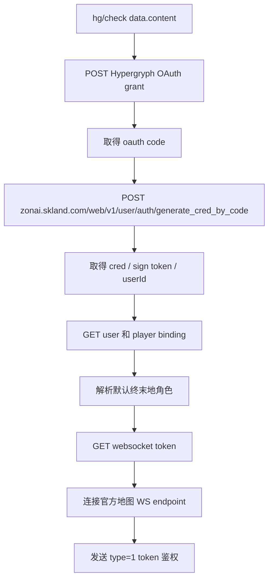
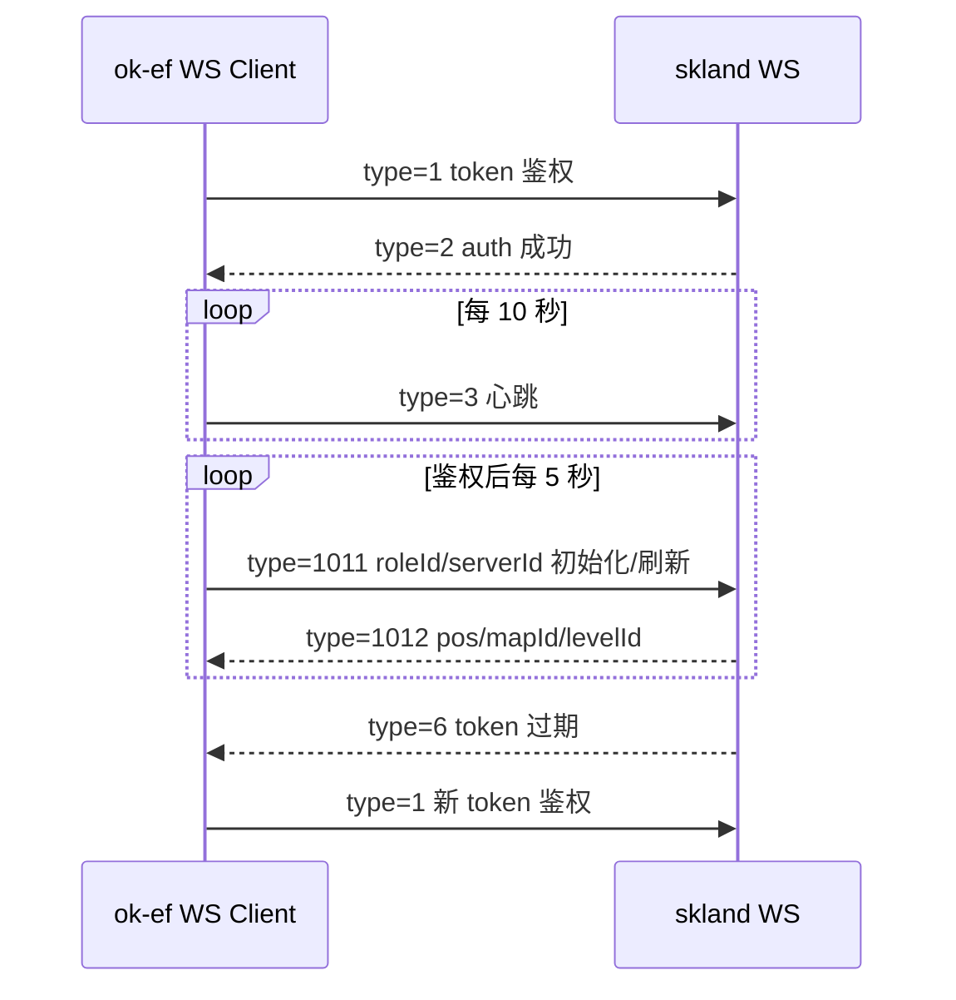
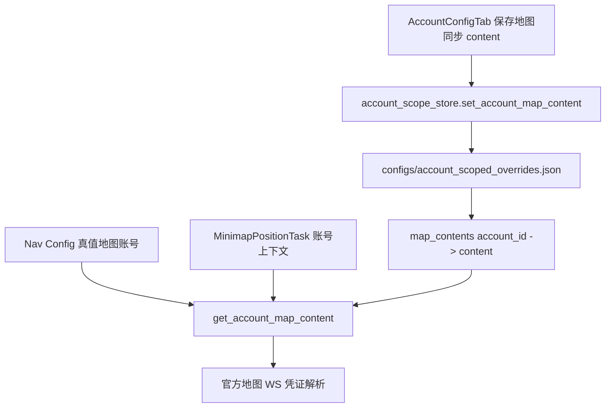
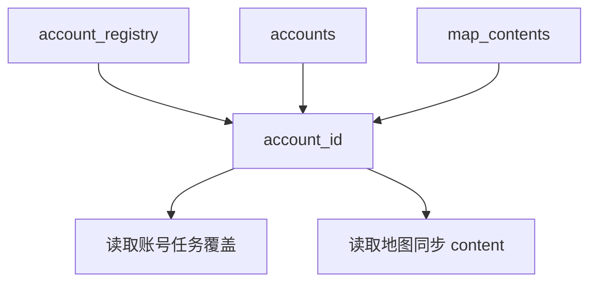
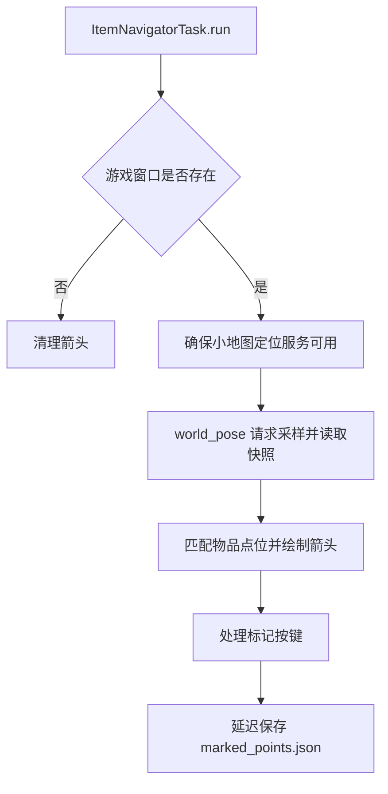

# 地图官方 WebSocket 客户端实现

返回：[文档索引](../zh-CN/index.md) / [README](https://github.com/AliceJump/ok-end-field/blob/master/README.md)

## 概述

在保留油猴脚本转发兼容模式的同时，项目内集成终末地官方地图的 `wss://ws.skland.com/ws/v1/game/endfield/map` WebSocket 客户端。
每个账号（玩家角色）需要独立的 `hg/check` credential 才能建立连接。
凭证统一配置在全局「导航配置」的「真值content」，或存储在账号配置页
（`map_contents` 中）后用「真值地图账号」选择。项目自动执行 OAuth 换取流程。

## 凭证输入方式

### 方式一：全局导航配置直接输入
`Nav Config` 的「真值content」直接填入 `hg/check` 接口返回的 `data.content` 字符串。

### 方式二：账号配置页（推荐）
`AccountConfigTab` 中的"地图同步 content"区域，每个账号存储一份 `data.content`。
数据持久化在 `configs/account_scoped_overrides.json` 的 `map_contents` 字段中。

### 凭证解析优先级
1. 全局「真值content」非空 → 直接使用
2. 全局「真值地图账号」非空 → 从 `map_contents` 读取该账号的 content
3. `MinimapPositionTask` 当前账号 context → 从 `map_contents` 读取

### 不带凭证时的回退
官方真值为空时，`MinimapPositionTask` 自动启动本地 WS 服务端模式
（监听 `ws://127.0.0.1:3001`），兼容油猴脚本或其他外部来源。

## OAuth → WebSocket 登录全链路


```mermaid
flowchart TD
    A[hg/check data.content] --> B[POST Hypergryph OAuth grant]
    B --> C[取得 oauth code]
    C --> D[POST zonai.skland.com/web/v1/user/auth/generate_cred_by_code]
    D --> E[取得 cred / sign token / userId]
    E --> F[GET user 和 player binding]
    F --> G[解析默认终末地角色]
    G --> H[GET websocket token]
    H --> I[连接官方地图 WS endpoint]
    I --> J[发送 type=1 token 鉴权]
```

## HTTP 签名算法

```
headers = {
    "platform": "3",
    "vName": "1.0.0",
    "timestamp": str(timestamp),
    "dId": device_id or "",
}

sign_payload = path + (query if GET else body) + timestamp
compact_headers = {"platform":"3","timestamp":"...","dId":"...","vName":"1.0.0"}
sign_payload += json.dumps(compact_headers, separators=(",", ":"))

digest = hmac.new(sign_token.encode(), sign_payload.encode(), sha256).hexdigest()
sign = md5(digest.encode()).hexdigest()
headers["sign"] = sign
```

### timestamp 处理
`clientTime` = 换取 cred 时的本地时间戳；`serverTime` = 换取 cred 时的服务器响应 timestamp。
之后每次签名：`adjusted = serverTime + (now - clientTime)`，确保时间戳随流逝时间同步推进。

## WebSocket 协议


```mermaid
sequenceDiagram
    participant C as ok-ef WS Client
    participant S as skland WS
    C->>S: type=1 token 鉴权
    S-->>C: type=2 auth 成功
    loop 每 10 秒
        C->>S: type=3 心跳
    end
    loop 鉴权后每 5 秒
        C->>S: type=1011 roleId/serverId 初始化/刷新
        S-->>C: type=1012 pos/mapId/levelId
    end
    S-->>C: type=6 token 过期
    C->>S: type=1 新 token 鉴权
```

| type | 方向 | 说明 |
|------|------|------|
| 1 | C→S | token 鉴权：`{token: wss_token}` |
| 2 | S→C | auth 成功确认 |
| 3 | C→S | 心跳（每 10s） |
| 6 | S→C | token 过期（`code=10002`），需重新获取 ws token 后发 type=1 |
| 1011 | C→S | 初始化/刷新：`{roleId, serverId}`（鉴权后每 5s 发送一次） |
| 1012 | S→C | 位置数据：`{data: {pos: {x,y,z}, mapId, levelId}}` |

客户端收到的位置数据通过 `_push_ws_payload()` 放入位置所有者队列。定位任务消费后，
统一把融合坐标发布为 `RuntimeStateHub` 的 `world.pose` 主题，业务任务只读取该快照。

### 角色解析规则

1. 先请求 `/web/v1/user`；再请求 `/api/v1/game/player/binding`。若后者失败且 cred 响应带 `userId`，则以 `uid=userId` 重试。
2. 优先读取 `data.gameMap.endfield`；缺失时在 `data.list` 中查找 `appCode == "endfield"`。
3. `bindingList` 优先选择 `isDefault` 项，否则取第一项。
4. 角色优先取该项的 `defaultRole`，否则取 `roles[0]`；最终必须同时有 `roleId` 与 `serverId`。

## 多账号架构


```mermaid
flowchart TD
    A[AccountConfigTab 保存地图同步 content] --> B[account_scope_store.set_account_map_content]
    B --> C[configs/account_scoped_overrides.json]
    C --> D[map_contents account_id -> content]
    E[Nav Config 真值地图账号] --> F[get_account_map_content]
    G[MinimapPositionTask 账号上下文] --> F
    D --> F
    F --> H[官方地图 WS 凭证解析]
```

### 数据流

```mermaid
flowchart TD
    A[account_registry] --> B[account_id]
    C[accounts] --> B
    D[map_contents] --> B
    B --> E[读取账号任务覆盖]
    B --> F[读取地图同步 content]
```

```text
configs/account_scoped_overrides.json
├── map_contents          ← 账号 → hg/check content 映射
│   ├── "acc_xxx": "data.content string"
│   └── ...
├── accounts              ← 任务级覆盖（已有）
└── account_registry      ← 账号 ID 注册表
```

### 相关 API (`account_scope_store.py`)
- `get_account_map_content(account, account_name="")` → str
- `set_account_map_content(account, content)` → None
- 内部 `_resolve_account_id_for_read/write()` 处理 ID/用户名解析

### UI (`AccountConfigTab.py`)
- 重新构建账户下拉时，从 `map_contents` 键集合中也拉入账号列表
- 地图 content 编辑区：单行 `LineEdit`，随当前账号配置统一保存

## 安全退出机制

### 1. 游戏窗口退出检测
`_is_game_window_alive()` 检查 `win32gui.IsWindow(hwnd) && win32gui.IsWindowVisible(hwnd)`。
- WS 客户端主循环每轮收包前检查，窗口不存在则 `return` 退出协程，不会自动重连。
- `ItemNavigatorTask.run()` 第一行也检查，失效时清理箭头；定位任务自行管理共享 WS 生命周期。

### 2. 消费者空闲超时
定位任务每次通过 `_recv_ws_position_payload()` 读取位置时，更新 `_map_ws_last_consume_at = time.time()`。
WS 客户端线程检查 `_map_ws_should_stop_for_idle_consumer()`，若超过 `_map_ws_consumer_idle_timeout`（初始化默认 10s）未被读取，则主动退出。每次从队列取得新位置，或在队列为空时返回有效缓存位置，都会刷新消费时间。
解决 executor disable 任务后 WS 线程继续空转的问题。

## 运行时状态消费

### `ItemNavigatorTask.run()` 流程

```mermaid
flowchart TD
    A[ItemNavigatorTask.run] --> B{游戏窗口是否存在}
    B -->|否| C[清理箭头]
    B -->|是| D[确保小地图定位服务可用]
    D --> E[world_pose 请求采样并读取快照]
    E --> F[匹配物品点位并绘制箭头]
    F --> G[处理标记按键]
    G --> H[延迟保存 marked_points.json]
```

## 相关文件

| 文件 | 职责 |
|------|------|
| `src/localization/ws_position_mixin.py` | WS 客户端核心：OAuth 换取、HTTP 签名、WS 协议、退出控制 |
| `src/tasks/localization/MinimapPositionTask.py` | 共享定位生产者：凭证解析、WS 生命周期、`world.pose` 发布 |
| `src/tasks/mixin/runtime_state_mixin.py` | 任务侧状态读取与定位采样控制面 |
| `src/tasks/trigger/ItemNavigatorTask.py` | 物品导航：读取 `world.pose`、箭头渲染、标记逻辑 |
| `src/tasks/account/account_scope_store.py` | 持久化：`map_contents` 字段的读写、账号解析 |
| `src/gui/AccountConfigTab.py` | UI：账号配置页，包含地图 content 编辑 |

相关文档：[物品导航与实时检测](../zh-CN/物品导航与实时检测.md) / [账号配置用户指南](../zh-CN/账号配置用户指南.md)
