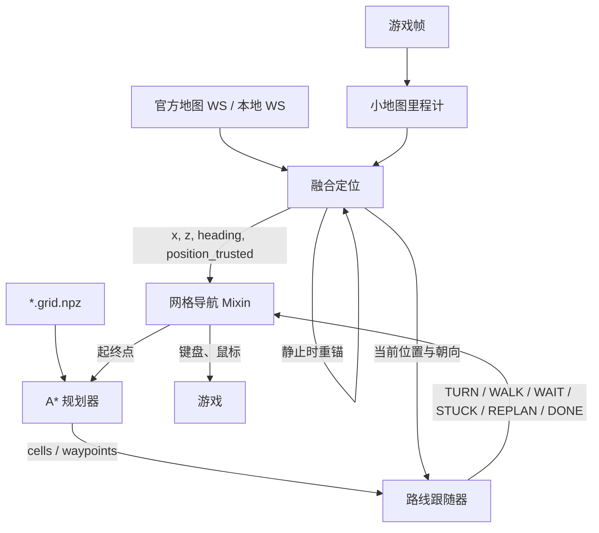

# 网格导航与小地图定位

返回：[文档索引](../zh-CN/README.md) / [API 参考](API.md) / [开发指南](DEVELOPMENT.md)

本文说明二维网格导航的模块边界、坐标约定、运行时状态与调试入口。实现以当前源码和单元测试为准；涉及具体数值时，以配置默认值和 `src/nav/*` 为准。

## 1. 能力边界

项目中有两条容易混淆的导航链路：

| 链路 | 输入 | 输出 | 面向场景 |
|---|---|---|---|
| 物品导航 `ItemNavigatorTask` | 官方地图 WS 或本地 WS 的当前位置、物品点位 | 浮层箭头与目标信息 | 指向附近采集点 |
| 网格导航 `GridNavigationMixin` | 融合定位、`*.grid.npz`、目标世界坐标 | 键盘/鼠标动作与路径状态 | 在二维可行走网格上自动移动 |

网格导航不直接读取物品点位，也不拥有定位源。它依赖常驻的 `MinimapPositionTask` 提供统一、可信的实时坐标和朝向。

## 2. 模块分层

| 模块 | 职责 | 不负责 |
|---|---|---|
| `src/tasks/trigger/MinimapPositionTask.py` | 常驻定位生产者；维护 WS 位置源与最新状态快照 | 路径规划与游戏输入 |
| `src/tasks/mixin/minimap_odometry.py` | 从小地图纹理估计高频相对位移 | WS 校准、绝对坐标 |
| `src/tasks/mixin/minimap_position_fusion.py` | 用静止 WS 坐标重锚，融合里程计增量 | 网格通行判断 |
| `src/tasks/mixin/minimap_position_mixin.py` | 编排里程计、融合、位置源和可信状态 | A* 与动作执行 |
| `src/nav/grid_io.py` | 稠密网格、坐标换算、`*.grid.npz` 读写 | 路径规划 |
| `src/nav/grid_planner.py` | A*、风险/墙距代价、起终点吸附、航点简化 | 按键与鼠标 |
| `src/nav/route_follower.py` | 把航点转换为 `TURN/WALK/WAIT/STUCK/REPLAN/DONE` | 直接操作游戏 |
| `src/tasks/mixin/grid_navigation_mixin.py` | 组织定位、规划、动作执行、校准、重规划与脱困 | 纯算法实现 |

`src/nav/` 是纯 Python 模块，不依赖 `ok` 框架，可独立测试和复用。

## 3. 运行时数据流



所有消费方应把当前帧交给同一个 `MinimapPositionTask.minimap_position(frame=...)`，避免位置、朝向来自不同帧。

## 4. 坐标与单位

### 4.1 世界系

- 水平位置统一表示为 `(x, z)`，单位为米。
- 朝向统一使用罗盘方位角：正北 `0°`、正东 `90°`、正南 `180°`、正西 `270°`，顺时针增大。
- 世界 `+x` 方向为东，世界 `+z` 方向为北。

### 4.2 地图系

- 图像坐标使用 OpenCV 约定：`x` 向右、`y` 向下。
- 小地图纹理移动方向与玩家移动方向相反。相位相关得到内容位移 `(dx, dy)` 后，玩家地图系位移为 `(-dx, -dy)`。
- 轴映射把地图系像素位移转换到世界米位移：

```text
world_delta = map_to_world_px @ map_delta_px
```

### 4.3 网格系

```text
world = origin + (i, j) * cell_size
```

- `i` 是行，沿世界 `z`；`j` 是列，沿世界 `x`。
- `origin` 是数组下标 `(0, 0)` 格最小角的世界坐标。
- 当前导航网格是二维的；`origin[1]` 仅作溯源记录，不参与换算。

## 5. 配置来源

分辨率相关参数集中在全局 `Nav Config`，不要复制到单个任务：

- `真值content` / `真值地图账号`：定位真值来源。
- `比例尺常数(米)`：非标准档位的 `比例尺 = 常数 / 画面宽度` 兜底。
- `1K/2K/4K比例尺(米/像素)`：对应 `1920/2560/3840` 宽的精确档位。
- `1K/2K/4K轴映射(逗号4值)`：地图系像素到世界米的 `2x2` 矩阵。

任务侧只保留运行策略：

- WS 稳定等待与连续命中数。
- 距离触发的停车校准阈值。
- 里程计位移提交阈值。
- 网格目录、缩放、规划代价、航点容差、卡住与脱困参数。

完整默认值和用户说明见 `src/core/NavConfig.py`、`src/tasks/mixin/minimap_position_mixin.py` 与 `src/tasks/mixin/grid_navigation_mixin.py`。

## 6. 定位信任顺序

网格导航主循环按以下顺序消费定位，不能颠倒：

1. `anchor_set=True` 且本轮存在 `x/z`。
2. `position_trusted=True`。普通重锚后会撤销信任，必须停车等待下一次静止 WS 校准；`too_long_dt` 属于良性换锚，不撤销。
3. 本拍存在有效里程计测量。`shift_too_small` 仍是有效测量，只是累计位移尚未达到提交阈值。
4. 以上条件都满足后，跟随器才允许继续 `WALK` 或重新规划。

静止判定要求小地图里程计低速；若已收到至少两次 WS 样本，还要求 WS 位移低于阈值。没有 WS 样本时仍可用里程计判断静止，但只有收到 WS 后才能执行重锚。

## 7. 网格与规划策略

`*.grid.npz` 包含两个成员：

| 成员 | 内容 |
|---|---|
| `cells` | `uint8` 二维数组，`0=未知`、`1=可行走`、`2=阻挡` |
| `meta` | UTF-8 JSON 字符串，包含 `origin`、`cell_size`、`map_name`、`zoom`、坐标系、文件和 schema 版本 |

读写时会校验 `magic`、`schema_version`、数组维度和状态值，不会把结构不匹配的文件静默当成网格使用。

规划器的核心规则：

- 可行走格基础代价为 `1`，斜向为 `sqrt(2)`。
- 未知格可通行时乘以 `risk_cost`，用于表达探索风险。
- 阻挡格不可通行，斜向移动不能穿墙或切未知墙角。
- `margin` 和 `wall_penalty` 提供离墙偏好，但不会封死窄路。
- `frontier_margin` 和 `frontier_penalty` 偏好已知自由区域内部。
- 精确搜索因 `max_expand` 触顶时，可按 `risk_cost` 加权重搜；加权只改变搜索顺序，不改变碰撞规则。
- 失败原因区分“搜索触顶”“禁止穿越未知格”和“可达区域确实穷尽”。

## 8. 调试与验证

调试任务：

- `MinimapRealtimePosition`：逐拍查看融合坐标、朝向、速度、WS 与里程计位移。
- `MinimapNavigateToPoint`：按世界坐标规划；开启“仅规划不移动”可只检查路径。
- `MinimapRegionCheck`：检查当前分辨率下小地图环带区域。
- `MinimapScaleCapture`：采集静止截图与 WS 坐标，用于比例尺标定。

常用测试：

```powershell
uv run --locked python -m unittest tests.TestMinimapOdometry tests.TestMinimapPositionFusion tests.TestMinimapPositionMixin -v
uv run --locked python -m unittest tests.TestNavGridIO tests.TestNavGridPlanner tests.TestNavRouteFollower tests.TestGridNavigationMixin -v
```

## 9. 排查顺序

出现导航异常时，先按定位链路排查，再看规划：

1. 实时位置任务是否有 `x/z`，`position_trusted` 是否为真。
2. `odom_reason` 是否长期不是 `ok` 或 `shift_too_small`。
3. 静止校准是否持续生效，`error` 在校准后是否接近零。
4. 当前地图、缩放与 `*.grid.npz` 是否能唯一匹配。
5. 规划失败原因是触顶、未知格策略还是连通性。
6. 最后检查跟随器动作、卡住判定与输入权限。
