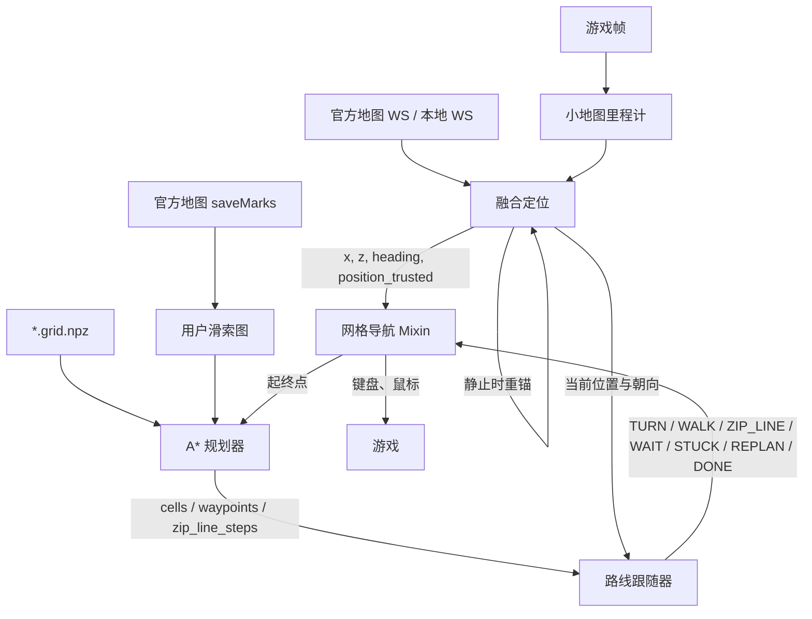

# 网格导航与小地图定位

返回：[文档索引](../zh-CN/README.md) / [API 参考](API.md) / [开发指南](DEVELOPMENT.md)

本文说明二维网格导航的模块边界、坐标约定、运行时状态与调试入口。实现以当前源码和单元测试为准；涉及具体数值时，以配置默认值和 `src/nav/*` 为准。

## 1. 能力边界

项目中有两条容易混淆的导航链路：

| 链路 | 输入 | 输出 | 面向场景 |
|---|---|---|---|
| 物品导航 `ItemNavigatorTask` | 官方地图 WS 或本地 WS 的当前位置、物品点位 | 浮层箭头与目标信息 | 指向附近采集点 |
| 网格导航 `GridNavigationMixin` | 融合定位、`*.grid.npz`、目标世界坐标 | 键盘/鼠标动作与路径状态 | 在二维可行走网格上自动移动 |

网格导航不直接读取物品点位，也不拥有定位源。它依赖常驻的 `MinimapPositionTask` 提供统一、可信的实时坐标和朝向。

## 2. 模块分层

| 模块 | 职责 | 不负责 |
|---|---|---|
| `src/tasks/trigger/MinimapPositionTask.py` | 常驻定位生产者；维护 WS 位置源与最新状态快照 | 路径规划与游戏输入 |
| `src/tasks/mixin/minimap_odometry.py` | 从小地图纹理估计高频相对位移 | WS 校准、绝对坐标 |
| `src/tasks/mixin/minimap_position_fusion.py` | 用静止 WS 坐标重锚，融合里程计增量 | 网格通行判断 |
| `src/tasks/mixin/minimap_position_mixin.py` | 编排里程计、融合、位置源和可信状态 | A* 与动作执行 |
| `src/nav/grid_io.py` | 稠密网格、坐标换算、`*.grid.npz` 读写 | 路径规划 |
| `src/nav/grid_planner.py` | A*、风险/墙距代价、起终点吸附、滑索图接入、航点简化 | 按键与鼠标 |
| `src/nav/zip_line_graph.py` | 用户滑索点解析、80m/110m 连接图 | 游戏输入 |
| `src/nav/route_follower.py` | 把航点转换为 `TURN/WALK/ZIP_LINE/WAIT/STUCK/REPLAN/DONE` | 直接操作游戏 |
| `src/tasks/mixin/zip_line_mixin.py` | 上下索按钮、直接对准/OCR、滑索场景状态判定 | 网格规划 |
| `src/tasks/mixin/grid_navigation_mixin.py` | 组织定位、规划、动作执行、校准、重规划与脱困 | 纯算法实现 |

`src/nav/` 是纯 Python 模块，不依赖 `ok` 框架，可独立测试和复用。

## 3. 运行时数据流



所有消费方应把当前帧交给同一个 `MinimapPositionTask.minimap_position(frame=...)`，避免位置、朝向来自不同帧。

## 4. 坐标与单位

### 4.1 世界系

- 水平位置统一表示为 `(x, z)`，单位为米。
- 朝向统一使用罗盘方位角：正北 `0°`、正东 `90°`、正南 `180°`、正西 `270°`，顺时针增大。
- 世界 `+x` 方向为东，世界 `+z` 方向为北。

### 4.2 地图系

- 图像坐标使用 OpenCV 约定：`x` 向右、`y` 向下。
- 小地图纹理移动方向与玩家移动方向相反。相位相关得到内容位移 `(dx, dy)` 后，玩家地图系位移为 `(-dx, -dy)`。
- 轴映射把地图系像素位移转换到世界米位移：

```text
world_delta = map_to_world_px @ map_delta_px
```

### 4.3 网格系

```text
world = origin + (i, j) * cell_size
```

- `i` 是行，沿世界 `z`；`j` 是列，沿世界 `x`。
- `origin` 是数组下标 `(0, 0)` 格最小角的世界坐标。
- 当前导航网格是二维的；`origin[1]` 仅作溯源记录，不参与换算。

## 5. 配置来源

分辨率相关参数集中在全局 `Nav Config`，不要复制到单个任务：

- `真值content` / `真值地图账号`：定位真值来源。
- `比例尺常数(米)`：非标准档位的 `比例尺 = 常数 / 画面宽度` 兜底。
- `1K/2K/4K比例尺(米/像素)`：对应 `1920/2560/3840` 宽的精确档位。
- `1K/2K/4K轴映射(逗号4值)`：地图系像素到世界米的 `2x2` 矩阵。

这些运行策略只由 `MinimapPositionTask` 持有，网格导航和实时位置任务不再重复暴露同名配置：

- WS 稳定等待与连续命中数。
- 距离触发的停车校准阈值。
- 里程计位移提交阈值。

网格导航自己的任务配置只保留网格目录、缩放、规划代价、航点容差、转向、卡住与脱困参数。

「使用滑索路径」控制是否读取当前账号的滑索点。它依赖全局 `Nav Config` 中可用的
官方地图 `content`；本地 WS 模式没有账号滑索数据，因此只会走普通网格路线。

旧版任务配置会在框架校验前迁移：`真值content` 和 `真值地图账号` 转入全局 `Nav Config`；旧比例尺和轴映射因缺少历史分辨率，会完整备份到 `configs/global_config_migration_backup/`，需要按当前分辨率重新确认。

完整默认值和用户说明见 `src/core/NavConfig.py`、`src/tasks/mixin/minimap_position_mixin.py` 与 `src/tasks/mixin/grid_navigation_mixin.py`。

## 6. 定位信任顺序

网格导航主循环按以下顺序消费定位，不能颠倒：

1. `anchor_set=True` 且本轮存在 `x/z`。
2. `position_trusted=True`。普通重锚后会撤销信任，必须停车等待下一次静止 WS 校准；`too_long_dt` 属于良性换锚，不撤销。
3. 本拍存在有效里程计测量。`shift_too_small` 仍是有效测量，只是累计位移尚未达到提交阈值。
4. 以上条件都满足后，跟随器才允许继续 `WALK` 或重新规划。

静止判定要求小地图里程计低速；若已收到至少两次 WS 样本，还要求 WS 位移低于阈值。没有 WS 样本时仍可用里程计判断静止，但只有收到 WS 后才能执行重锚。

常驻定位任务会持续检查分辨率、比例尺、轴映射和真值来源。分辨率或映射变化时重建里程计；真值来源变化时清空绝对锚点并等待重新校准。地图 WS 认证失败后按 30 秒冷却重试。

## 7. 网格与规划策略

`*.grid.npz` 包含两个成员：

| 成员 | 内容 |
|---|---|
| `cells` | `uint8` 二维数组，`0=未知`、`1=可行走`、`2=阻挡` |
| `meta` | UTF-8 JSON 字符串，包含 `origin`、`cell_size`、`map_name`、`zoom`、坐标系、文件和 schema 版本 |

读写时会校验 `magic`、`schema_version`、数组维度和状态值，不会把结构不匹配的文件静默当成网格使用。

规划器的核心规则：

- 可行走格基础代价为 `1`，斜向为 `sqrt(2)`。
- 未知格可通行时乘以 `risk_cost`，用于表达探索风险。
- 阻挡格不可通行，斜向移动不能穿过阻挡墙角；启用风险通行时未知格仍可通行，只检查两侧正交格是否为阻挡。
- `margin` 和 `wall_penalty` 提供离墙偏好，但不会封死窄路。
- `frontier_margin` 和 `frontier_penalty` 偏好已知自由区域内部。
- 精确搜索因 `max_expand` 触顶时，可按 `risk_cost` 加权重搜；加权只改变搜索顺序，不改变碰撞规则。
- 失败原因区分“搜索触顶”“禁止穿越未知格”和“可达区域确实穷尽”。

## 8. 用户滑索接入

### 8.1 数据抓取

滑索点来自已签名的官方地图接口：

```text
GET /web/v1/game/endfield/map/mark/list?mapId=...&roleId=...&serverId=...
```

只读取 `data.saveMarks`，并通过 `data.markTemplates` 将 `templateId` 映射为：

| 模板名 | 最大连接距离 |
|---|---:|
| `滑索架` | 80m |
| `长距滑索架` | 110m |

节点使用 `pos.x/y/z`。连接边不直接使用接口字段，而是按以下约束推导：

- 仅连接同一 `mapId` 的点；
- 两端都有 `levelId` 时，必须位于同一层级；
- 使用三维欧氏距离，避免同一 X/Z、不同楼层的点被二维投影误连；
- 距离不超过两端连接半径的较大值。因此一端为长距滑索架时，另一端上限为
  110m。

一次导航会缓存当前地图的滑索图。认证或接口暂时失败时不缓存失败结果，后续重规划
可以再次尝试；接口成功但没有滑索时才缓存空结果。每次启动新的导航或规划前都会
清空该快照并重新读取当前账号的滑索数据，同一次导航内部的偏航重规划继续复用本次
已抓取的快照。

### 8.2 规划模型

`GridPlanner` 在构建 A* 时把每个滑索点吸附到最近的可通行格。每个可连接滑索对
会生成双向转移边，因此滑索可以跨越普通网格中不连通的区域：

```text
普通滑索边：distance * zip_line_cost_factor + zip_line_boarding_cost
```

滑索转移仍受 A* 的起终点可达性约束：角色必须能从起点走到上索点，并从下索点继续
走到终点。规划结果在保持兼容的 `cells/waypoints` 之外增加 `zip_line_steps`，
每个步骤记录：

- 上索/下索节点及三维距离；
- 网格落脚格；
- 路线中对应的上索/下索航点下标；
- 该步骤在 A* 中的等效代价。

`GridRouteFollower` 遇到 `zip_line_steps` 时输出独立的 `ZIP_LINE` 动作，并且不会
把上索点到下索点的百米空中直线当成普通行走边。导航层调用已有
`ZipLineMixin.board_zip_line` 复用自动送货的三阶段查找并点击「登上滑索架」；按钮优先
使用 `climb_the_zip_line` 模板匹配，OCR 仅作为兼容兜底。随后调用
`zip_line_list_go` 完成距离 OCR、点击与推进，成功后继续下索点后的网格路线。
地图计算距离与游戏显示距离不一致时，导航会使用一个受限容差匹配相邻显示值，例如
官方坐标的 `42.4m` 可匹配游戏内 `45m`，但不会匹配 `80m`。上下索点严格绑定到两端
滑索节点；滑索两端的空中连接不参与网格碰撞检查，也不会在连接路径中间生成任何
可上下索的航点。滑索配置中的「滑索目标选择方式」可选择「直接对准」或「OCR」。
「直接对准」使用两端滑索的 `(x,z)` 计算世界方位，并通过只转视角、不按 W 的
`aim_view_to_bearing()` 将方位误差收敛到 ±3° 后直接点击执行；若点击未触发滑索，
会依次调整俯仰角后重试。「OCR」模式则继续使用距离数字进行对中和点击。自动送货
没有世界方位数据时会自动使用 OCR。

中间滑索架只需要存在于用户滑索图中，不要求能映射到当前网格的可行走格；角色不会
在中途上下索。规划器会在完整滑索网络内搜索连通链，再把“可上索滑索 -> 可下索滑索”
的整条链合成一条 A* 边。例如 `A -> B -> C` 中若 `B` 位于未知格，只要 `A/C` 可到，
仍会生成 `A -> C` 的组合边，并在执行时依次乘坐 `A -> B`、`B -> C`。

### 8.3 执行状态机

导航执行滑索时遵循以下状态转换：

| 当前状态 | 判定 | 动作 |
|---|---|---|
| 待登索 | 计划首节点与当前滑索节点不同 | 查找并点击「登上滑索架」 |
| 待续乘 | 错误落点重规划后仍在同一滑索架 | 跳过登索，直接对准下一段 |
| 滑索间移动 | `move_to_the_target` 与 `move_to_the_target_2` 均不存在 | 等待，不重复发送 `E` |
| 到达下一段 | 模板存在且原始 WS 坐标进入目标滑索架范围 | 进入下一段滑索 |
| 未触发 | 模板存在且 WS 仍在起点范围 | 重新对准后重试 |
| 错误落点 | 模板存在、停稳，但 WS 不在起点和目标附近 | 不下索，从当前实际滑索架重新规划 |

执行链使用模板而不是融合坐标判断上下索状态。模板是“当前是否站在滑索架上”的唯一
视觉依据；WS 坐标只用于区分当前位于起点、目标还是错误滑索架。

### 8.4 重规划与不变量

错误落点重规划必须满足以下不变量：

1. 到达的一定是滑索架，因此错误落点无需先下索。
2. 当前 WS 优先匹配最近的滑索节点，并以该节点作为新的规划起点。
3. 重规划目标始终是原最终目标，而不是上次未到达的滑索节点。
4. 未映射到网格的滑索节点允许作为起点；规划器会先沿滑索图搜索可映射锚点。
5. 同一锚点上“前缀链 + 后续链”必须合并为一次执行，不能在中间重新登索。
6. 所有候选锚点都要比较完整路线实际代价，不能只因候选锚点离当前位置近就直接采用。
7. 同一连接连续 5 次未触发滑索后，按两端三维坐标记为不可用；当前任务实例内后续导航也会绕开。

候选路线必须优先避免“先到某锚点、再沿原边返回当前节点”的重复滑索。规划器会
计算每条完整候选路线，而不是使用“滑索图距离 + 直线估算”直接返回第一个候选。

### 8.5 实现边界

当前实现仍有以下边界：

- 节点坐标来自官方地图，连接半径是对游戏规则的几何近似；
- 当前只用坐标推导直连边，不推断连续移动“R”记录的完整链；
- 同一距离文本存在歧义时，仍受现有 OCR 对齐策略限制；
- 滑索数据没有绝对坐标真值时不可用，导航会回退到普通网格。

## 9. 调试与验证

调试任务：

- `MinimapRealtimePosition`：逐拍查看融合坐标、朝向、速度、WS 与里程计位移。
- `MinimapNavigateToPoint`：按世界坐标规划；开启“仅规划不移动”可只检查路径。
- `MinimapRegionCheck`：检查当前分辨率下小地图环带区域。
- `MinimapScaleCapture`：采集静止截图与 WS 坐标，用于比例尺标定。
- 滑索调试日志重点查看：`执行滑索链`、`已到达下一滑索附近`、`到达了非目标滑索架`、
  `滑索连接不可用`、`错误落点已匹配滑索架节点`。
- 滑索节点可能在不同抓取批次中获得不同内部 ID；屏蔽记录和日志均使用世界坐标，不依赖节点哈希。

常用测试：

```powershell
uv run --locked python -m unittest tests.TestMinimapOdometry tests.TestMinimapPositionFusion tests.TestMinimapPositionMixin -v
uv run --locked python -m unittest tests.TestNavGridIO tests.TestNavGridPlanner tests.TestNavZipLineGraph tests.TestNavRouteFollower tests.TestGridNavigationMixin tests.TestFindZipLineBoardButton -v
```

## 10. 排查顺序

出现导航异常时，先按定位链路排查，再看规划：

1. 实时位置任务是否有 `x/z`，`position_trusted` 是否为真。
2. `odom_reason` 是否长期不是 `ok` 或 `shift_too_small`。
3. 静止校准是否持续生效，`error` 在校准后是否接近零。
4. 当前地图、缩放与 `*.grid.npz` 是否能唯一匹配。
5. 规划失败原因是触顶、未知格策略还是连通性。
6. 最后检查跟随器动作、卡住判定与输入权限。
