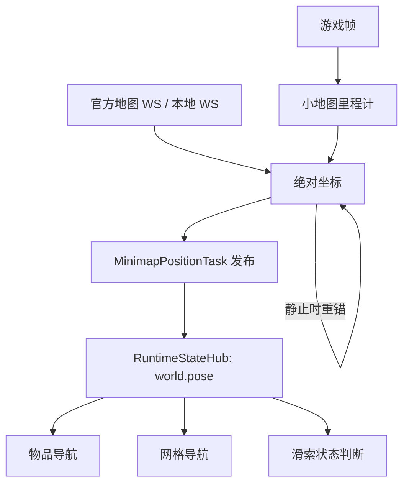

# 小地图定位

返回：[文档索引](../zh-CN/README.md) / [API 参考](API.md) / [开发指南](DEVELOPMENT.md) /
[网格导航](网格导航.md)

本文只说明实时定位链路。路径规划、路线跟随和游戏输入见[网格导航](网格导航.md)。

## 1. 职责边界

定位由唯一的 `MinimapPositionTask` 维护：

- 接收官方地图 WS 或本地 WS 的绝对坐标；
- 从小地图纹理估计高频相对位移；
- 在静止时用 WS 坐标重锚；
- 同时产出水平坐标、高度、朝向、可信状态和诊断字段；
- 通过 `RuntimeStateHub` 发布 `world.pose`。

物品导航、网格导航、滑索和其他任务只读取 `world.pose`，不直接启动 WS、里程计或融合器。

## 2. 模块

| 模块 | 职责 | 不负责 |
|---|---|---|
| `src/tasks/localization/MinimapPositionTask.py` | 常驻定位生产者；维护位置源并发布状态 | 路径规划、游戏输入 |
| `src/localization/minimap_position_mixin.py` | 编排里程计、融合、位置源和可信状态 | A* 与动作执行 |
| `src/localization/minimap_odometry.py` | 从小地图纹理估计相对位移 | WS 校准、绝对坐标 |
| `src/localization/minimap_position_fusion.py` | 用静止 WS 坐标重锚并融合位移 | 网格通行判断 |
| `src/localization/ws_position_mixin.py` | 官方地图 WS、本地 WS 和认证协议 | 路径与业务判断 |
| `src/tasks/mixin/runtime_state_mixin.py` | 向业务任务提供统一坐标读取接口 | 定位算法 |
| `src/runtime_state/` | 保存 latest-value 状态快照与主题契约 | 采样和融合 |

## 3. 数据流



ok-script 执行器是单线程协作调度。长任务运行期间，其他 TriggerTask 不会并行运行，因此
消费者通过 `RuntimeStateMixin.world_pose(frame=...)` 请求定位所有者采样一帧并发布快照。

## 4. 坐标系

### 4.1 世界系

- 水平位置统一为 `(x, z)`，单位为米；
- 朝向使用罗盘方位角：正北 `0°`、正东 `90°`、正南 `180°`、正西 `270°`；
- 世界 `+x` 为东，世界 `+z` 为北。

### 4.2 地图系

- 图像坐标使用 OpenCV 约定：`x` 向右、`y` 向下；
- 小地图纹理移动方向与玩家移动方向相反；
- 相位相关得到内容位移 `(dx, dy)` 后，玩家地图系位移为 `(-dx, -dy)`；
- 轴映射负责把地图系像素转换为世界米：

```text
world_delta = map_to_world_px @ map_delta_px
```

## 5. 位置源

### 5.1 官方地图 WS

全局 `Nav Config` 的「真值content」或「真值地图账号」提供登录凭证。客户端执行：

```text
content -> HG OAuth -> 地图 cred/token -> 角色绑定 -> WebSocket token
        -> wss://ws.skland.com/ws/v1/game/endfield/map
```

位置消息来源于 `type=1012`，解析 `mapId` 和 `pos.x/y/z`。

### 5.2 本地 WS

没有官方真值时，定位任务监听 `ws://127.0.0.1:3001`。油猴脚本拦截官方地图页的
WebSocket，并把原始 JSON 转发给本地端口。该模式也需要保持网页地图和位置同步开启。

## 6. 融合策略

WS 坐标绝对但有延迟，小地图里程计高频但会漂移。融合规则是：

```text
静止时：P0 = WS(x, z)，并清零里程计
移动时：P = P0 + map_to_world @ odometry_delta
再次静止：用新的 WS 坐标重新校准
```

静止判定要求：

- 小地图里程计低速；
- 已经收到至少两次 WS 样本时，WS 相邻样本的位移也必须足够小。

移动途中收到的 WS 样本不会暂存，也不会在以后补用，否则会把已推进的位置拉回。

### 6.1 关键帧视觉锚定链校正（导航位置修正）

静止重锚只能把漂移限制在两个静止点之间；移动距离越长，累计错位越大。实时链路额外维护
一个关键帧视觉锚定链校正器，只输出位置，不落盘、不截图、不绘图：

- 每拍把当前小地图圆环加入局部滑动窗口；
- 新切片和最近若干拍建立相位相关相对平移边；
- 静止校准的 WS 坐标作为高权重绝对锚点，并向后续关键帧传播；
- 关键帧之间继续建立视觉重叠边，使 WS 绝对基准沿 `A -> B -> C -> ...` 传递；
- 用 Huber IRLS + PCG 求解局部窗口和关键帧锚定链，把最新位置发布为 `world.pose.x/z`。

原始融合坐标保留在 `raw_x/raw_z`，关键帧视觉锚定链校正量、边数、锚点数、残差和原因记录在
`visual_anchor_chain_*` 字段。校正失败或超过安全上限时回退原始融合值。

离线的 `MinimapPositionRecorder` 和 `stitch_records()` 只用于事后诊断与参考图，
不进入导航实时链路。

## 7. 配置

定位的标定与真值参数集中在全局 `Nav Config`：

- `真值content` / `真值地图账号`：绝对坐标来源；
- `比例尺常数(米)`：非标准档位的兜底比例尺；
- `1K/2K/4K比例尺(米/像素)`：对应 `1920/2560/3840` 宽；
- `1K/2K/4K轴映射(逗号4值)`：地图系像素到世界米的矩阵；

运行时参数保存在「小地图定位」任务配置：

- `WS等待稳定秒数` / `WS稳定最小位置数`；
- `航点校准最小距离(米)`；
- `位移提交阈值(像素)`。
- `关键帧视觉锚定链校正`：是否启用实时位置修正；
- `关键帧视觉锚定链校正窗口(拍)` / `关键帧视觉锚定链校正边间隔(拍)` /
  `关键帧视觉锚定链校正最小响应`；
- `关键帧视觉锚定链校正锚点权重` / `关键帧视觉锚定链校正修正上限(米)`；
- `关键帧视觉锚定链校正关键帧间隔(拍)` / `关键帧视觉锚定链校正关键帧边数` /
  `关键帧视觉锚定链校正关键帧最小响应` / `关键帧视觉锚定链校正关键帧锚点权重`。

分辨率、比例尺或轴映射变化时，定位器会重建。真值来源变化时，绝对锚点会清空并等待重新校准。

## 8. `world.pose` 契约

主要字段：

| 字段 | 含义 |
|---|---|
| `x` / `y` / `z` | 世界坐标；`y` 为最新 WS 高度 |
| `heading` / `heading_score` | 罗盘方位角和置信度 |
| `map_id` | 当前地图 |
| `position_trusted` / `trust_reason` | 绝对坐标是否可信 |
| `anchor_set` / `rest` | 是否已锚定、当前是否静止 |
| `odom_ok` / `odom_reason` | 是否有有效位移样本 |
| `sync_seq` / `sync_checked` / `sync_needed` | 静止校准状态 |
| `sync_residual` | 校准前原始融合误差，以及上一拍关键帧视觉锚定链校正输出误差 |
| `ws` / `ws_xyz` | 最新 WS 水平坐标和完整坐标 |
| `sample_t` / `source` | 采样时间和数据源 |
| `raw_x` / `raw_z` | 关键帧视觉锚定链校正前的原始融合坐标 |
| `visual_anchor_chain_x` / `visual_anchor_chain_z` | 校正后的坐标（仅有效时） |
| `visual_anchor_chain_correction_px` / `visual_anchor_chain_correction_m` | 本拍校正量 |
| `visual_anchor_chain_nodes` / `visual_anchor_chain_edges` / `visual_anchor_chain_anchors` | 局部窗口节点、边和 WS 锚点数 |
| `visual_anchor_chain_min_response` / `visual_anchor_chain_median_response` | 新边的相关响应（最小值 / 中位数） |
| `visual_anchor_chain_residual_median` / `visual_anchor_chain_residual_max` | 校正后的边残差 |
| `visual_anchor_chain_reason` | 局部校正结果（`ok` / `no_edges` / `correction_too_large` 等） |
| `visual_anchor_chain_keyframe_reason` | 关键帧视觉锚定链校正的关键帧更新结果 |

消费者必须检查 `position_trusted`。快照超过 `max_age` 后返回 `None`，不能继续拿旧坐标执行动作。

## 9. 调试与测试

定位相关调试任务位于 `src/tasks/localization/`：

- `MinimapRealtimePosition`：逐拍查看融合坐标、朝向、速度、WS 和里程计位移；
- `MinimapPositionRecorder`：逐拍落盘融合状态、原始里程计位移、校准残差和小地图切片，
  结束后生成 `fused` / `odom` 两种像素对齐拼接图；
- `MinimapRegionCheck`：检查当前分辨率下的小地图环带区域；
- `MinimapScaleCapture`：采集静止截图与 WS 坐标，用于比例尺标定；
- `MinimapTurnToHeading`：验证朝向读取和转向闭环。

采样记录的产物在 `logs/minimap_position_recorder/<时间戳>/`：`samples.jsonl` 是逐拍
数据，`calibrations.jsonl` 是每次静止校准的残差，`patches/` 是 BGRA 圆环切片，
`stitch_*_fused*.png` / `stitch_*_odom*.png` 分别是按融合坐标和连续里程计轨迹拼接的
参考图。需要换拼接参数时用：

```powershell
uv run --locked python scripts/data-capture/stitch_minimap_recorder.py `
  logs/minimap_position_recorder/<时间戳>
```

常用测试：

```powershell
uv run --locked python -m unittest tests.TestMinimapOdometry tests.TestMinimapPositionFusion tests.TestMinimapPositionMixin -v
uv run --locked python -m unittest tests.TestRuntimeStateHub tests.TestRuntimeStateMixin -v
```

定位异常排查顺序：

1. `world.pose` 是否存在且未过期；
2. `anchor_set` 和 `position_trusted` 是否为真；
3. `odom_reason` 是否长期不是 `ok` 或 `shift_too_small`；
4. 静止校准后的 `error` 是否接近零；
5. 比例尺、轴映射和 `map_id` 是否匹配当前分辨率与地图。
