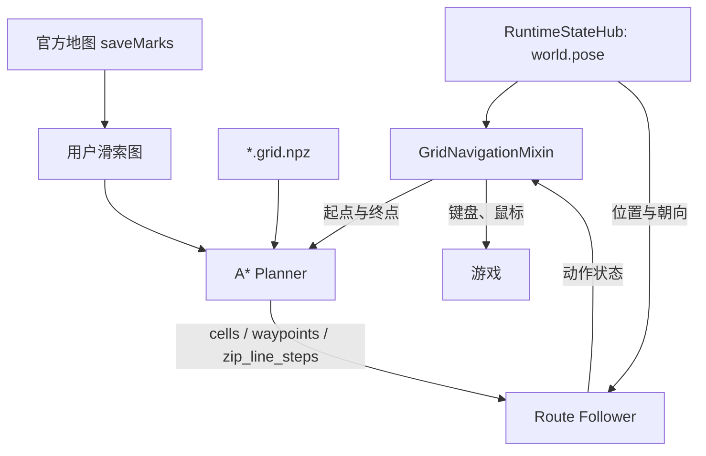

# 网格导航

返回：[文档索引](../zh-CN/README.md) / [API 参考](API.md) / [开发指南](DEVELOPMENT.md) /
[小地图定位](小地图定位.md)

本文只说明二维网格规划、路线跟随和游戏输入。坐标来源、融合和校准见
[小地图定位](小地图定位.md)。

## 1. 职责边界

网格导航接收目标世界坐标，消费可信的 `world.pose`，然后：

- 加载当前地图的 `*.grid.npz`；
- 在可行走网格上做 A*；
- 把路径转换成 `TURN/WALK/ZIP_LINE/WAIT/STUCK/REPLAN/DONE`；
- 执行键盘、鼠标和滑索操作；
- 处理重规划、卡住、脱困和周期校准。

它不直接读取物品点位，也不启动 WS、小地图里程计或融合器。

导航代码不导入 `src/localization/`。位置、朝向和朝向控制通过 `PoseProvider`
接口获得，具体实现由运行状态适配层注入。

## 2. 模块

| 模块 | 职责 | 不负责 |
|---|---|---|
| `src/nav/grid_io.py` | 稠密网格、坐标换算、`*.grid.npz` 读写 | 路径规划 |
| `src/nav/grid_planner.py` | A*、风险与墙距代价、起终点吸附、滑索图接入 | 游戏输入 |
| `src/nav/route_follower.py` | 把航点转换成动作状态 | 直接操作游戏 |
| `src/nav/zip_line_graph.py` | 用户滑索点解析和连接图 | 网格规划 |
| `src/tasks/navigation/mixin/grid_navigation_mixin.py` | 组织定位、规划、动作、重规划和脱困 | 纯算法实现 |
| `src/tasks/navigation/mixin/zip_line_mixin.py` | 登索、上下索 UI 和滑索执行 | 网格规划 |

`src/nav/` 是纯 Python 模块，不依赖 `ok` 框架，可独立测试。

## 3. 数据流



网格导航主循环必须先确认定位可信，再允许路线跟随器继续行走或重新规划。

`src/nav/` 只包含纯算法，不依赖定位实现；导航任务和导航 Mixin 也只依赖
`world.pose` 与 `PoseProvider` 接口。

## 4. 坐标与网格

```text
world = origin + (i, j) * cell_size
```

- `i` 是行，沿世界 `z`；
- `j` 是列，沿世界 `x`；
- `origin` 是数组下标 `(0, 0)` 格最小角的世界坐标；
- 当前导航网格是二维的，`origin[1]` 只作溯源记录，不参与换算。

`*.grid.npz` 包含：

| 成员 | 内容 |
|---|---|
| `cells` | `uint8` 二维数组，`0=未知`、`1=可行走`、`2=阻挡` |
| `meta` | UTF-8 JSON，包含 `origin`、`cell_size`、`map_name`、`zoom` 和 schema 版本 |

读取时会校验 `magic`、`schema_version`、数组维度和状态值。

## 5. 配置

网格参数集中在全局 `Nav Config`：

- `地图id(留空自动)`；
- `网格目录`、`网格文件(可选)`、`网格Zoom(可选)`；
- `使用滑索路径`；
- `仅规划不移动`；
- `等待定位超时(秒)`；
- 规划、代价、转向、冲刺、卡住和脱困参数。

`MinimapNavigateToPoint` 的任务配置只保留目标 `X/Z`，其余参数从 `Nav Config` 读取。

## 6. A* 规划

规划器核心规则：

- 可行走格基础代价为 `1`，斜向为 `sqrt(2)`；
- 未知格可通行时乘以 `risk_cost`；
- 阻挡格不可通行，斜向移动不能穿过阻挡墙角；
- `margin` 和 `wall_penalty` 提供离墙偏好，但不会封死窄路；
- `frontier_margin` 和 `frontier_penalty` 偏好已知自由区域内部；
- 精确搜索超过 `max_expand` 时可按风险代价加权重搜；
- 失败原因区分搜索触顶、禁止穿越未知格和可达区域穷尽。

## 7. 路线跟随与执行

路线跟随器输出：

- `TURN`：转向；
- `WALK`：按住 `W` 移动；
- `ZIP_LINE`：执行滑索步骤；
- `WAIT`：等待状态稳定；
- `STUCK`：进入脱困；
- `REPLAN`：偏航或路径失效后重新规划；
- `DONE`：到达目标。

普通行走开始后，如果当前规划航段超过 `15m`，导航会在按住 `W` 时按一次 `shift`
进入冲刺。松开 `W` 后冲刺状态清除。

## 8. 定位协作

网格导航消费 `world.pose` 时按以下顺序判断：

1. `anchor_set=True` 且本轮存在 `x/z`；
2. `position_trusted=True`；
3. 本拍存在有效里程计样本；
4. 以上条件满足后，路线跟随器才允许 `WALK` 或重新规划。

普通重锚后必须停车等待静止校准。`too_long_dt` 属于良性换锚，不撤销信任。

达到指定航点数量或累计移动距离后，导航会主动停车请求重新校准；定位服务完成校准后，
导航再继续原路线。

## 9. 用户滑索

### 9.1 数据

滑索点来自官方地图接口：

```text
GET /web/v1/game/endfield/map/mark/list?mapId=...&roleId=...&serverId=...
```

只读取 `data.saveMarks`，通过 `data.markTemplates` 映射：

| 模板名 | 最大连接距离 |
|---|---:|
| `滑索架` | 80m |
| `长距滑索架` | 110m |

连接约束：

- 仅连接同一 `mapId`；
- 两端都有 `levelId` 时必须同层；
- 使用三维欧氏距离；
- 距离不超过两端连接半径的较大值。

### 9.2 规划

每个滑索点会吸附到最近的可通行格。可连接滑索对生成双向转移边：

```text
普通滑索边：distance * zip_line_cost_factor + zip_line_boarding_cost
```

规划器支持把中间滑索链合成一条 A* 边。例如 `A -> B -> C` 中若 `B` 位于未知格，
只要 `A/C` 可到，仍可规划成 `A -> C`，执行时依次乘坐两段。若 `B` 本身能映射到
可行走格，正常情况下仍保持 `A -> B -> C` 连续执行，不在中间点重复按 `F`。只有
后续连接确认失败并封禁后，重规划才会改为在 `B` 下索并使用普通网格路线。

### 9.3 执行

执行状态：

| 状态 | 判定 | 动作 |
|---|---|---|
| 待登索 | 距计划上索点 `<=5m` | 按一次 `ctrl` 切步行；保持 `W` 连续接近，在移动中读取最新 WS 并持续搜索模板；模板出现立即停车并按 `F` |
| 待续乘 | 错误落点重规划后仍在同一滑索架 | 跳过登索，直接对准下一段 |
| 滑索间移动 | 两个移动模板都不存在 | 等待，不重复发送 `E` |
| 到达下一段 | 模板存在且 WS 进入目标范围 | 进入下一段 |
| 按 `F` 后未登索 | `fL.esc` 在约 `1.5s` 后仍存在 | 短暂按 `S` 后退约 `0.6s`，下一轮从最新 WS 重新计算入口方位后再走 |
| 接近搜索超时 | 连续接近 `20s` 仍未检测到模板 | 先在入口附近短距 W/A/D/S 搜索；多轮仍失败才短暂后退约 `0.6s`，不直接长距离远离 |
| 未触发 | 已上索后模板存在且 WS 仍在起点范围 | 重新对准后重试 |
| 错误落点 | 停稳后 WS 不在起点和目标附近 | 不下索，从实际滑索架重新规划 |

模板是“是否在滑索架上”的视觉依据；网格登索只使用最新 WS 与入口滑索坐标计算接近方位。
下索前必须检查滑索节点的实际坐标是否落在可通行格：可通行时 A* 会比较“原地下索步行”和“继续乘坐滑索”；不可通行时不能下索，只能继续沿滑索图移动。滑索链的目标节点也必须是可通行格，否则不能把该节点作为实际下索终点。

### 9.4 重规划

错误落点重规划不变量：

1. 错误落点一定是滑索架，无需先下索；
2. 最新 WS 使用三维坐标优先匹配最近滑索节点，避免同 X/Z、不同楼层误认；
3. 目标始终是原最终目标；
4. 未映射网格的滑索节点可作为起点；
5. 前缀链和后续链合并为一次执行；
6. 候选路线比较完整实际代价，不只看节点距离；
7. 直接对准失败时保留本段实际起终点的三维坐标，只封禁该连接；
8. 同一连接连续 5 次未触发后，本次任务实例内标记不可用。

## 10. 调试与测试

导航调试任务：

- `MinimapNavigateToPoint`：按世界坐标规划；开启「仅规划不移动」可只检查路径；
- 滑索日志重点查看：`执行滑索链`、`已到达下一滑索附近`、`到达了非目标滑索架`、
  `滑索连接不可用`、`错误落点已匹配滑索架节点`。

常用测试：

```powershell
uv run --locked python -m unittest tests.TestNavGridIO tests.TestNavGridPlanner tests.TestNavZipLineGraph tests.TestNavRouteFollower tests.TestGridNavigationMixin tests.TestFindZipLineBoardButton -v
```

排查顺序：

1. 先确认 `world.pose` 可信；
2. 检查当前地图、缩放与网格文件是否唯一匹配；
3. 判断规划失败是搜索触顶、未知格策略还是连通性问题；
4. 检查跟随器动作、滑索步骤、卡住判定和输入权限。
