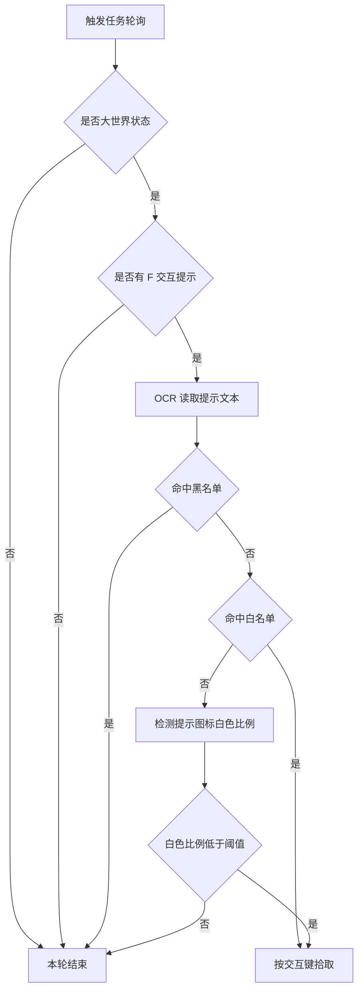

# 自动拾取（AutoPickTask）

返回：[文档首页](../zh-CN/index.md) / [README](https://github.com/AliceJump/ok-end-field/blob/master/README.md)

本文对应已实现触发任务 `AutoPickTask`，是面向开发者的实现状态说明，不作为正式用户入口。实现位于 [src/tasks/trigger/AutoPickTask.py](../../src/tasks/trigger/AutoPickTask.py)。

## 当前实现

- 界面名称：自动拾取
- 任务类型：触发式任务，注册在 [src/config.py](../../src/config.py) 的 `trigger_tasks`
- 默认配置：`_enabled = True`
- 运行条件：`in_combat_world()` 返回真，且屏幕出现 `F` 交互提示

## 白名单与黑名单

白名单来自 `AutoPickTask.white_list`：

```text
采集, 萤壳虫, 打开, 荞花, 灰芦麦, 灼壳虫, 苦叶椒, 柱状菌, 酮化灌木, 柑实, 触碰, 激活, 芽针, 多齿叶, 砂叶
```

黑名单来自 `AutoPickTask.black_list`：

```text
协议核心, 激活箱子
```

## 检测流程



相关文档：[物品导航与实时检测](../zh-CN/物品导航与实时检测.md)
