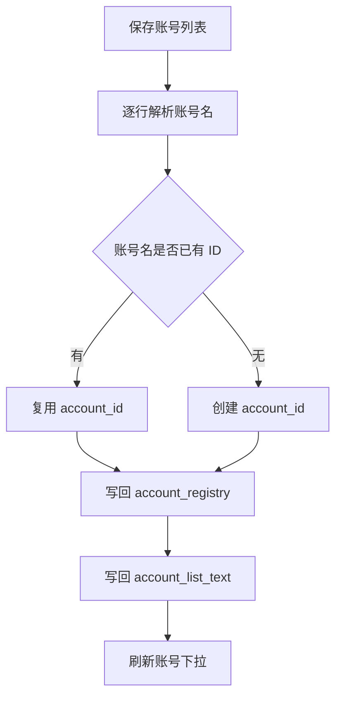

# 账号唯一ID与多账户覆盖默认逻辑

返回：[开发文档索引](../README.md) / [README](../../README.md)

本文说明当前版本下，从第一次启动软件开始，账号身份与账号覆盖配置的默认行为。

## 1. 首次启动时会发生什么

1. 软件会加载账号覆盖存储文件 `configs/account_scoped_overrides.json`。
2. 如果该文件不存在或无法解析，会使用内置空结构：
   - `account_list_text`: 空字符串
   - `account_registry`: 空对象
   - `accounts`: 空对象
   - `map_contents`: 空对象
3. 此时系统里还没有任何账号ID、账号覆盖或地图同步 content。

## 2. 账号身份规则（默认且固定）

当前规则已经固定为：

1. 账号名（手机号）是默认稳定身份来源。
2. 密码不参与身份判定，任务页旧格式 `账号,密码` 中的密码会被忽略。
3. 账号名不变：复用原 `account_id`。
4. 账号名变化：直接创建新的 `account_id`。

也就是说，账号名变化不会自动继承旧账号的覆盖配置。

## 3. 在账号配置页点击“保存账号列表”时

当你在“账号配置”页保存账号列表后，会执行以下流程：

1. 解析每行账号名（手机号）。
2. 兼容旧格式 `账号,密码`，但密码会被忽略。
3. 对每个账号名查找是否已有 `account_id`：
   - 找到则复用。
   - 找不到则新建。
4. 写回 `account_registry`（账号ID到账号名映射）和 `account_list_text`。
5. 状态栏会显示本次“复用ID数量”和“新建ID数量”。

## 4. 任务覆盖是怎么存的

账号任务覆盖按下面结构存储：

1. `accounts[account_id][task_class_name][config_key] = override_value`
2. 账号覆盖的主键是 `account_id`，不是密码。
3. 读取时支持旧数据兼容（历史上用账号名当键的结构仍可回退读取）。

地图同步 `content` 独立存储在 `map_contents[account_id]`，供 [物品导航](../物品导航与实时检测.md) 读取官方地图 WebSocket 凭证。

## 5. 任务运行时怎么读取覆盖

运行任务时，配置读取顺序是：

1. 先读任务原始配置值（base value）。
2. 检查是否允许账号覆盖：
   - 如果任务配置里有“多账户独立配置”，则必须该开关为 `True`。
   - 如果任务配置里没有该开关，则默认允许覆盖（兼容逻辑）。
3. 使用 `current_account_id`（或兼容回退账号名）读取当前任务覆盖。
4. 如果该键存在覆盖值，则用覆盖值替换原值。

## 6. 首次启动下的默认开关状态

对于继承 `AccountMixin` 的任务，默认配置是：

1. 多账户模式：`False`
2. 多账户独立配置：`False`
3. 账号列表：示例文本（账号1、账号2、账号3）

因此第一次启动后，如果你不改任务开关：

1. 多账户循环不会启用。
2. 账号覆盖也不会生效（因为“多账户独立配置”默认是关）。

## 7. 账号页账号列表 与 任务账号列表 的关系

两者当前是独立的：

1. 账号配置页保存的是覆盖系统自己的 `account_list_text`，用于账号ID管理和覆盖编辑。
2. 任务运行时 `get_account_list()` 读取的是任务自身配置里的“账号列表”。
3. 所以账号页改了账号列表，不会自动同步到各任务“账号列表”字段。
4. 当前任务运行只读取账号名；旧格式 `账号,密码` 中密码字段会被忽略。
5. 任务页账号列表中的空行和账号名为空的行会被跳过。

## 8. 哪些任务会显示在账号配置页

账号配置页只展示显式声明 `support_multi_account = True` 的任务。
当前典型任务包括：

1. `DailyTask`
2. `DeliveryTask`

`ItemNavigatorTask` 使用账号页保存的地图同步 `content`，但不声明 `support_multi_account`，因此不作为多账号任务覆盖项展示。

## 9. 实操建议

为了让“账号覆盖”按预期生效，建议按顺序操作：

1. 在账号配置页保存账号列表（仅账号名）。
2. 在对应任务页开启“多账户独立配置”。
3. （如需多账号循环）再开启“多账户模式”并维护任务页账号列表。
4. 回到账号配置页按账号与任务编辑覆盖项。

相关文档：[账号配置用户指南](../账号配置用户指南.md) / [物品导航与实时检测](../物品导航与实时检测.md) / [API 参考](API.md)
