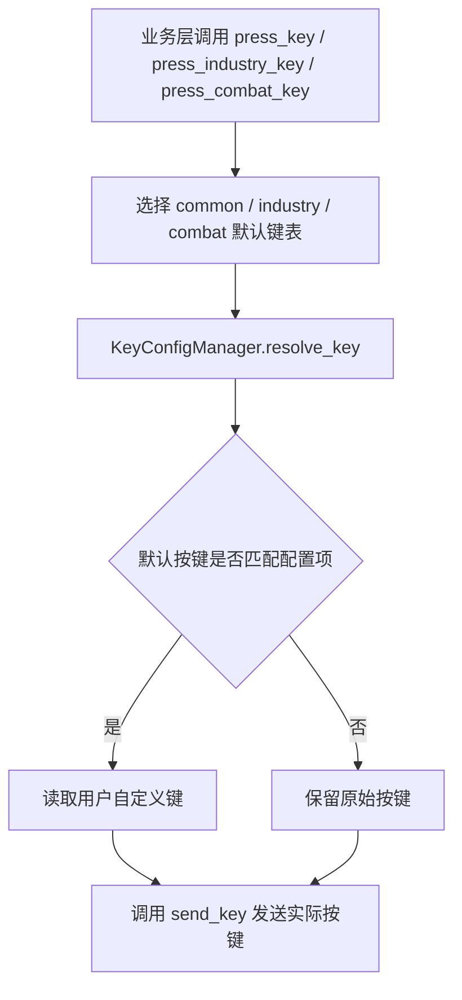

# 项目键盘操作体系说明

返回：[文档索引](../README.md) / [README](../../README.md)

本项目支持高度可配置的游戏键盘操作，所有热键均可通过配置自定义，支持多场景（通用、工业、战斗）下的快捷键映射。本文档详细介绍键盘操作的设计、默认键位、扩展方式及开发注意事项。

---

## 1. 按键配置体系概览

- **可配置热键统一管理**：业务代码通过 `KeyConfigManager` 解析通用、工业和战斗键位；移动键、系统修饰键及少数游戏固定键保留底层发送路径。
- **三大类热键**：
  - 通用（common）：如地图、交互、背包等
  - 集成工业（industry）：如工业规划、放置传送带等
  - 战斗（combat）：如连携技等
- **国际化支持**：所有键名均有 i18n 支持，便于多语言适配。

---

## 2. 默认键位表

### 通用（DEFAULT_COMMON_KEYS）

| 配置键名           | 默认按键   | 说明     |
|--------------------|------------|----------|
| Dodge Key          | lshift     | 闪避     |
| Jump Key           | space      | 跳跃     |
| Interact Key       | f          | 交互     |
| Backpack Key       | b          | 背包     |
| Valuables Key      | n          | 贵重品   |
| Team Key           | u          | 队伍     |
| Operator Key       | c          | 干员     |
| Mission Key        | j          | 任务     |
| Track Key          | v          | 追踪     |
| Map Key            | m          | 地图     |
| Baker Key          | h          | 帝江号   |
| Mail Key           | k          | 邮件     |
| Handbook Key       | f8         | 手册     |
| Recruitment Key    | f9         | 招募     |
| Quick Tool Key     | r          | 快捷工具 |

### 集成工业（DEFAULT_INDUSTRY_KEYS）

| 配置键名             | 默认按键   | 说明       |
|----------------------|------------|------------|
| Industry Plan Key    | t          | 工业规划   |
| Place Belt Key       | e          | 放置传送带 |
| Place Pipeline Key   | q          | 放置管道   |
| Equipment List Key   | z          | 设备列表   |
| Overview Mode Key    | capslock   | 全局视图   |
| Storage Mode Key     | x          | 仓库模式   |
| Area Build Key       | y          | 区域建造   |
| Blueprint Key        | f1         | 蓝图       |
| Product Icon Toggle Key | f4      | 产品图标切换 |

### 战斗（DEFAULT_COMBAT_KEYS）

| 配置键名        | 默认按键 | 说明     |
|-----------------|----------|----------|
| Link Skill Key  | e        | 连携技   |

---

## 3. 按键调用方式

### 3.1 业务层接口

- `press_key(key, **kwargs)`：发送通用按键（如地图、交互等）。
- `press_industry_key(key, **kwargs)`：发送工业专用热键。
- `press_combat_key(key, **kwargs)`：发送战斗专用热键。
- `press_esc()`：仅过剧情（对话时）触发 ESC。

前三个接口定义在 [`RuntimeMixin`](../../src/core/base_mixin/runtime_mixin.py)，签名为 `(key, down_time=0.02, after_sleep=0, interval=-1)`，并把解析后的键传给 `send_key()`。`press_esc()` 定义在 [`GameFlowMixin`](../../src/core/base_mixin/game_flow_mixin.py)，只允许用于剧情对话跳过。项目当前没有 `press_game_key()` 公共方法。

### 3.2 按键映射流程

1. 业务层调用如 `press_key('m')`。
2. 通过 `KeyConfigManager.resolve_key('m', 'common')` 在对应默认键表中反查配置项名。
3. 若用户有自定义，则取自定义值，否则用默认值。
4. 最终通过底层 `send_key`进行物理按键模拟。

### 3.3 未知键与异常

- `resolve_key()` 不校验键名：默认表中找不到键，或 `key_type` 不是 `common/industry/combat` 时，原样返回传入的 `key`。
- `RuntimeMixin.send_key()` 会先激活游戏窗口，再委托框架 `BaseTask.send_key()`；框架会先用 `validate_key()` 校验单字符和已知命名键，无效键会抛出 `HotkeyConfigException`，项目层不捕获该异常。
- 校验通过后，`EfInteraction._convert_key()` 再把常见别名（如 `esc`、`lctrl`、`pageup`）转换为 `pynput` 键对象；底层发送异常仍会向调用方传播。
- 因此新增业务键位时应先加入 [`KeyConfig.py`](../../src/interaction/KeyConfig.py) 的对应默认表；不要依赖未知键的透传作为配置机制。

---

## 4. 用户自定义与国际化

- 用户可通过配置文件自定义所有热键。
- 支持多语言键名，语言资源目录：[i18n](../../i18n)。

---

## 5. 开发注意事项

- **可配置游戏热键不得直接使用 `send_key`**，必须通过 `press_key`、`press_industry_key` 或 `press_combat_key` 调用（第 6 节列出的例外除外）。
- 若热键可自定义，则不可用作模板图片（否则模板匹配会因用户自定义失效）。
- 详细开发规范：[DEVELOPMENT.md](DEVELOPMENT.md)。

---

## 6. 直接使用底层键盘接口的位置

以下是当前直接调用 `send_key` / `send_key_down` / `send_key_up` 或 Win32 `keybd_event` 的项目代码。部分调用没有就地注释，表中按当前行为记录，不代表所有绕过键位映射的调用都合理：

| 文件 | 行号/方法 | 按键 | 原因 |
|------|----------|------|------|
| `src/core/base_mixin/runtime_mixin.py` | `press_key` / `press_industry_key` / `press_combat_key` 方法体 | 动态 | 这三个方法本身就是对 `send_key` 的配置映射封装 |
| `src/core/base_mixin/runtime_mixin.py` | `click_with_alt` 方法 | `alt` | `alt` 为系统修饰键，用于 alt+点击操作 |
| `src/interaction/Key.py` | `move_keys` 方法 | 动态移动键 | 持续按下和释放移动键的底层辅助函数 |
| `src/interaction/Mouse.py` | `active_and_send_mouse_delta` 的窗口激活回退 | Win32 `VK_MENU` | `SetForegroundWindow` 失败时用 `win32api.keybd_event` 短按 Alt 解除前台窗口限制 |
| `src/core/base_mixin/game_flow_mixin.py` | `skip_dialog` 方法 | `esc` | `esc` 为系统通用退出键 |
| `src/tasks/onetime/AutoCombatLogic.py` | 普通技能释放逻辑 | 动态技能键 | 技能键为游戏固定不可配置键，不经过 `KeyConfigManager` 管理 |
| `src/tasks/mixin/battle_mixin.py` | `use_ult` 方法 | `1`/`2`/`3`/`4` | 终极技键位为游戏固定不可配置键，不经过 `KeyConfigManager` 管理 |
| `src/tasks/mixin/liaison_mixin.py` | 干员交互导航回调 / `click_chat_box` 方法 | `alt` | `alt` 为系统修饰键，用于 alt+点击干员聊天框，非游戏可配置热键 |
| `src/tasks/mixin/liaison_mixin.py` | 导航过程中释放移动键 | `w` | `w` 为方向移动键，不属于游戏可配置热键 |
| `src/tasks/mixin/navigation_mixin.py` | `navigate_until_target` 方法 | `w` / `s` | `w`/`s` 为方向移动键，用于持续移动/后退搜索，不属于游戏可配置热键 |
| `src/tasks/daily/misc/daily_reward_mixin.py` | 每日奖励领取逻辑 | `esc` | `esc` 为系统通用退出键 |
| `src/tasks/daily/daily_task_runner.py` | 任务开始前切奔跑模式 | `shift` | `shift` 为奔跑切换键，游戏固定不可配置键 |
| `src/tasks/trigger/AutoInteractionTask.py` | `run` 方法 | `esc` | `esc` 为系统通用退出键，非游戏可配置热键 |
| `src/tasks/onetime/WarehouseTransferTask.py` | 仓库切换检测逻辑 | `esc` | `esc` 为系统通用退出键，非游戏可配置热键 |
| `src/tasks/onetime/WarehouseTransferTask.py` | `_ctrl_click` 方法 | Win32 `VK_CONTROL` | 直接用 `win32api.keybd_event` 按下/释放 Ctrl，以配合点击多选；不经过 `send_key` 或 `KeyConfigManager` |
| `src/tasks/mixin/zip_line_mixin.py` | `zip_line_list_go` / `ensure_click_on_zip_line` 方法 | `e` | 滑索推进交互键为游戏固定不可改绑键，且短距离滑索需高频重复输入避免漏触发 |
| `src/tasks/onetime/DeliveryTask.py` | 取货/送达导航 | `v` | 导航循环中重置追踪视野；`v` 同时是可配置的 `Track Key` 默认值，当前直接发送会绕过用户改绑，是已知例外而非固定键 |
| `src/tasks/onetime/YingTuoTask.py` | 丰碑交互 | `e` | 当前任务直接发送固定交互键；修改该流程时应重新确认是否仍不可改绑 |

> **说明**：大多数调用属于系统修饰/退出键、移动键或当前流程认定的固定游戏键。`DeliveryTask` 直接发送的 `v` 是可配置 `Track Key` 的默认值，因而不会遵循用户改绑；`YingTuoTask` 的固定 `e` 也应在修改流程时重新确认。当前并非每个例外都有代码注释；新增或调整直接底层调用时，应添加原因注释并同步本表。

---

## 7. 参考

- [热键配置器代码](../../src/interaction/KeyConfig.py)
- [按键函数封装](../../src/core/base_mixin/runtime_mixin.py)
- [应用配置](../../src/config.py)
- 开发文档：[API.md](API.md), [DEVELOPMENT.md](DEVELOPMENT.md)
- 国际化资源：`../../i18n/`

---

扩展新热键时，请在 [KeyConfig.py](../../src/interaction/KeyConfig.py) 的默认键表中补充，并完善 [i18n](../../i18n) 资源。
