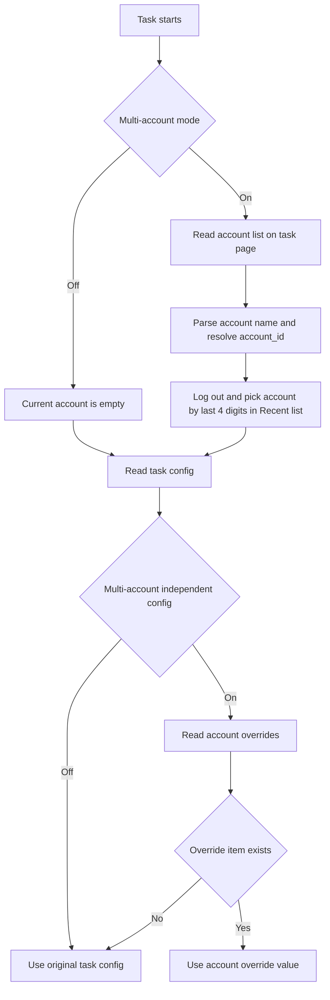

# Account Configuration User Guide

Back: [Documentation home](index.md) / [README](../../README.md)

This is a simplified document for daily use — it only explains how to configure and use the feature.

## 1. Understand the two configurations first

1. Account configuration page: manages account identity (account name / phone number), map-sync `content`, and per-account task override parameters. No passwords are entered; saving removes password text from the old format.
2. Task configuration page: manages the task switches themselves and the list of accounts to run with. The current `AccountMixin` is compatible with the old `账号,密码` format, but only reads the account name; the password field is ignored and never used for login.

## 2. Quick start

1. Open the account configuration page and fill in one account name (phone number) per row in the "Account list".
2. Click "Save account list".
3. Select the account and task, modify the override parameters for that account under that task as needed, and save.
4. For official-map sync in Item Navigation, fill in the account's `data.content` in the "Map sync content" single-line input and save.
5. Go back to the corresponding task page, fill in the run account list (one account name per row; the old `账号,密码` format is accepted), and enable as needed:
   - Multi-account mode
   - Multi-account independent configuration

## 3. Key rules

1. The account name (phone number) is the user-side identity key; when saving the account list, the program generates an internal `account_id` for each new account name.
2. Passwords are not saved, not part of identity, and not used for login.
3. Saving the same account name again reuses its internal `account_id`; changing to a new account name is treated as a new account and generates a new ID. If the old account had overrides or map `content`, the old record is still kept.

## 4. Common scenarios

1. Only want to adjust parameters for one account:
   - Select that account and task on the account configuration page, modify, and save.
2. Want to rotate multiple accounts through a task:
   - Make sure each account has appeared in the game login page's "Recent" list, fill in one full phone number per row on the task page, and enable multi-account mode.
3. Want independent configuration for multiple accounts:
   - Enable multi-account independent configuration on the task page.
4. Want Item Navigation to use a specific account's official-map sync:
   - Save that account's map-sync `content` on the account configuration page, then select "Map account" in the Item Navigation task.
5. Can't see a task on the account configuration page:
   - That task does not currently support the multi-account independent configuration display.

## 5. Override reading flow

## 6. FAQ

1. Why is there no password field on the account configuration page?
   - Because account switching relies on the game login page's "Recent" account list and does not enter a password. The password field in the old format is completely ignored.
2. I changed the account list on the account configuration page but the main task didn't change?
   - That's normal. The account list on the account page and the one on the task page are independent.
3. What happens if the task page account list format is wrong?
   - Writing only the account name per row is the normal format; no comma is needed. Empty lines and rows with an empty account name are ignored; the old password field after a comma is also ignored.
4. Why is a full phone number recommended?
   - The program clicks the "Recent" account by the last four digits of the entered value. If several recent accounts share the same last four digits, the wrong account may be selected; make sure the last four digits are unique.

## 7. Related documents

Implementation logic: [dev/Account unique ID and multi-account override logic](../dev/账号唯一ID与多账户覆盖默认逻辑.md)

Related feature: [Item Navigation & Realtime Detection](item-navigation.md)
