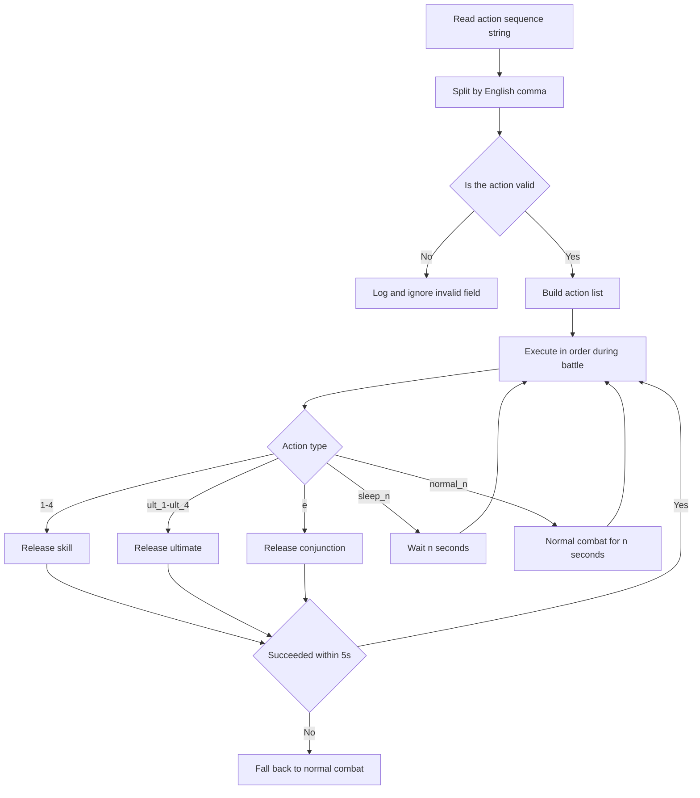

# Action Sequence (Timeline)

Back: [Documentation home](index.md) / [README](../../README.md)

Controls the priority order of skill releases.

---

## Format

The following values are accepted; both English commas `,` and Chinese commas `，` work as separators, and surrounding whitespace and empty fields are cleaned up:

```text
1,2,3,4          # Operator skill
ult_1~ult_4      # Operator ultimate
e                # Conjunction skill
sleep_[n]        # Wait n seconds (e.g. sleep_1.5)
normal_[n]       # Temporarily run normal combat for n seconds
```

---

## Example

```text
ult_2,1,e,ult_1,sleep_1.5,ult_3
```

Means:

* Try operator 2's ultimate first
* Then try operator 1's skill
* Then try the conjunction skill
* Try operator 1's ultimate
* Wait 1.5 seconds
* Try operator 3's ultimate
* Back to step 1 (try operator 2's ultimate)

---

## Behavior

* The program loops through the sequence trying skills in order, while still re-locking the target and dodging forward on the "No-digit operation interval" period
* A successful skill, ultimate, or conjunction advances to the next item and resets the 5-second timer
* `sleep_n` blocks and waits for n seconds, then advances and resets the timer; the parser accepts any float, but a negative value passed to `time.sleep` raises an exception and ends the current auto-combat, so the value must actually be >= 0
* `normal_n` temporarily runs normal combat for n seconds; n must be greater than 0; afterwards the action sequence resumes and the timer resets
* If a skill action has not succeeded within 5 seconds of the last success, this battle permanently falls back to normal combat and never returns to the action sequence

---

## Use cases

* Control burst order
* Prioritize key skills
* Combine with conjunctions or specific tactics
* Avoid skills being consumed by mistake
* `sleep` works well with long-burst operators like Iffy

## Parsing and execution flow



---

## Notes

* An English comma `,` is recommended; Chinese commas are also parsed
* Order matters a lot
* Do not use a negative `sleep_n`; it passes parsing but fails at runtime and interrupts the current auto-combat
* Invalid fields are ignored; if the config is empty or no valid field remains after filtering, it falls back to the default sequence `1,2,3`

Related documents: [Auto Combat](auto-combat.md) / [Stamina Farming](stamina-farming.md)
