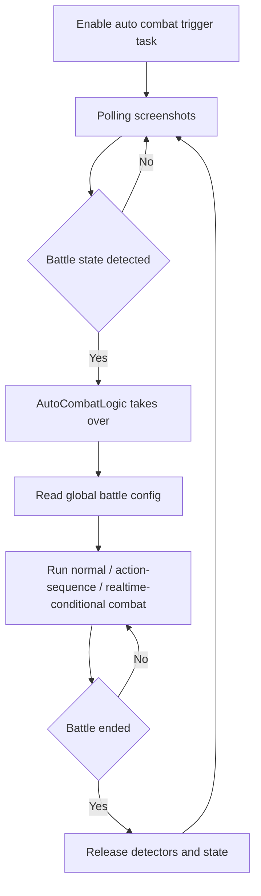

# Auto Combat

Back: [Documentation home](index.md) / [README](../../README.md)

## Overview

Automatically detects battle state, executes the skill-release logic once in battle, and stops the round when the battle ends to wait for the next one. It is a registered trigger task and must be enabled in the task panel; it only takes over combat when at least 1 skill point is detected and the squad UI is present.

The combat logic is identical to the one used by Stamina Farming; see [Stamina Farming](stamina-farming.md).

## Trigger flow

---

## Requirements

> Make sure the resolution is at least **1920x1080 (1080P)**; below 1080P is not guaranteed to work

## Battle configuration (shared globally)

> All battle-related config items are now managed centrally in **「Global Config → Battle Config」**;
> configure once and it applies to Auto Combat, Stamina Farming, Daily Tasks, and every other battle-related task — no need to set them repeatedly in multiple places.

### Skill release

The `Skill` release order is a sortable list, default `1,2,3`, selectable from 1 to 4 without duplicates. In normal mode, skills are cycled from this list when neither a conjunction nor an ultimate is released.

---

### Skill points to start

When the 「Skill Point Bar」 reaches this value, the skill sequence starts. Valid range 1–3.

---

### Completion notification

Whether to send a system notification when the battle ends.

---

### No-digit operation interval

The minimum interval in seconds for periodically re-locking the target + dodging forward during battle; default 6, clamped to 1–30 seconds at runtime.

---

### Initial wait time after entering battle

Wait this many seconds after entering battle before starting to release skills.

---

### Enable action sequence

When enabled, skills are used in the order defined by the 「Action Sequence」. If an action has not succeeded for 5 consecutive seconds, this battle permanently falls back to normal logic.

See [Action Sequence](action-sequence.md).

---

### Action sequence

A custom-order string for skill release; only effective when 「Enable action sequence」 is on.

See [Action Sequence](action-sequence.md) for format and usage.

---

### Enable realtime conditions

When enabled, the action sequence is ignored. Trigger conditions and sequences can be edited in the panel.

If the realtime condition sequence is empty or entirely invalid, it automatically falls back to normal mode.

---

### Release ultimate immediately / Release conjunction immediately

When this frame produces no unconditional action, try to release the ultimate or conjunction immediately according to the switches. Priority: ultimate > conjunction.

Only effective when realtime conditions are enabled.

Related documents: [Stamina Farming](stamina-farming.md) / [Action Sequence](action-sequence.md) / [API reference](../dev/API.md)
