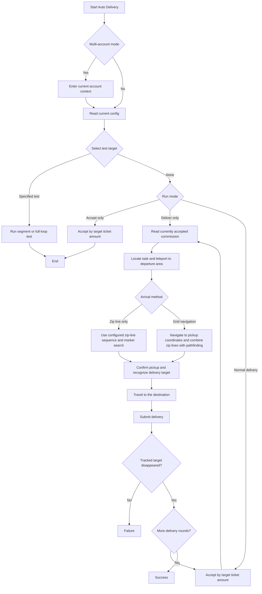

# Auto Delivery

Back: [Documentation home](index.md) / [README](https://github.com/AliceJump/ok-end-field/blob/master/README.md)

## Overview

Automatically accepts commissions of the currently selected region and delivers goods to the corresponding receivers along the configured paths. In normal mode each account runs at most 3 rounds of accept-and-deliver. The standalone task now uses a single 「Run mode」 selector for 「Normal delivery / Accept only / Deliver only」 so the old conflicting pair of booleans cannot both be enabled; non-normal and path-test modes do not rotate accounts.

The configuration, regions, and targets come from [DeliveryTask.py](../../src/tasks/onetime/DeliveryTask.py) and [delivery_area.py](../../src/data/delivery_area.py).

---

## Options and configuration

### Target ticket amount

Valid values come from `DELIVERY_TARGET_TICKET_NUM_OPTIONS`, currently `163000`, `159000`, `119000`, `79800`, `73100`.

The UI shows it as a priority sequence of target ticket amounts, default `119000`, and multiple amounts can be configured. The accept loop searches in list order; once an earlier amount is hit, later amounts are no longer searched; only when no commission is available for an earlier amount does it try the next one.

---

### Multi-account mode

Auto Delivery can run as a standalone task or as the `⭐Auto Delivery` subtask of Daily Tasks. The standalone task keeps the full multi-account and test entries; the daily subtask reuses the daily task's account loop and only runs the full delivery flow.

* With 「Multi-account mode」 enabled, the task switches through the accounts in the 「Account list」 one by one to run Auto Delivery.
* With 「Multi-account independent configuration」 enabled, the same delivery task can override regular configs like target ticket amount, region switching, and arrival method per account; the zip-line config lives in 「Global Config / Zip Line Config」 and is shared across tasks, but each account can also have its own zip-line overrides on the account page.
* The account list has one account per row; the old `账号, 密码` format is compatible but the password field is ignored. Account switching uses the 「Recent」 list on the game login page and does not enter a password.
* The standalone task keeps 「Select test target」 plus a single 「Run mode」 selector with 「Normal delivery / Accept only / Deliver only」. The daily-task entry shows the target ticket amount, region, and arrival method.
* Auto Delivery is a fatal task inside Daily Tasks: only a fully confirmed submission returns success. A failure or exception stops the remaining daily flow and closes the game instead of running the final reset.

---

### Region switching

> Select the current delivery region via the dropdown

Switching uses that region's:

* Commission location recognition rules
* Delivery target list
* The corresponding delivery-point zip-line config (matched by location)

---

### Path to {location} delivery point

> The zip-line distance sequence from the commission location to the corresponding delivery point

Delivery zip lines and silt-point zip lines are shown separately in the global zip-line config via the category dropdown. After selecting 「Zip Line Config」 on the account page, any route can be overridden per account.

Determines the path from the accepted commission location to the pickup point. Config keys are named 「Path to {location} delivery point」, one key per delivery location; Wuling currently includes:

* 「Path to Wuling City delivery point」 (Wuling City)
* 「Path to Test Park delivery point」 (Test Park)

When the corresponding location config is empty, this round of delivery fails directly; it does not borrow another location's route.

**Example:**

> 50,34

---

## Workflow

Normal and daily delivery record the current stage (accept, transfer, pickup, post-pickup target recognition, zip line, submission). Grid navigation uses pickup/destination coordinates and automatically combines zip lines with normal pathfinding; the legacy mode keeps the configured zip-line sequences. Any critical step that cannot be confirmed returns failure. In particular, a post-pickup failure does not attempt the Daily Tasks final-reset teleport.

### Changyun

> The zip-line distance sequence from the delivery point to the Changyun NPC

Determines the path from the delivery point to the Changyun NPC.

**Example:**

> 20,15,40

---

### Recycling

> The zip-line distance sequence from the delivery point to the recycling station

Determines the path from the delivery point to the recycling station (for recycling-type commissions).

**Example:**

> 10,25

---

### Yanning

> The zip-line distance sequence from the delivery point to the Yanning NPC

Determines the path from the delivery point to the Yanning NPC, used to complete the corresponding commission's delivery flow.

**Example:**

> 30,18,22

---

### Qilun

> The zip-line distance sequence from the delivery point to the Qilun NPC

Determines the path from the delivery point to the Qilun NPC, used to complete the corresponding commission's delivery flow.

**Example:**

> 45,12

---

### Zhaozhao

> The zip-line distance sequence from the delivery point to the Zhaozhao NPC

Determines the path from the delivery point to the Zhaozhao NPC, used to complete the corresponding commission's delivery flow.

**Example:**

> 18,26

---

### Pei Lingrong

> The zip-line distance sequence from the delivery point to the Pei Lingrong NPC

Determines the path from the delivery point to the Pei Lingrong NPC, used to complete the corresponding commission's delivery flow.

**Example:**

> 12,34

---

### Ahe

> The zip-line distance sequence from the delivery point to the Ahe NPC

Determines the path from the delivery point to the Ahe NPC, used to complete the corresponding commission's delivery flow.

**Example:**

> 22,16

The complete targets in the current region data:

* Wuling City: Changyun, Recycling, Yanning, Qilun, Yushi, Su Baiyi, Prim
* Test Park: Zhaozhao, Pei Lingrong, Ahe

---

## Feature options

### Whether to enable scroll-zoom view

This config has moved to 「Global Config / Zip Line Config」 and is shared by both the delivery and stamina-farming tasks.

When enabled, the view is automatically scrolled and zoomed when aligning the zip line.

* May improve alignment success
* May also **significantly reduce success** in some cases

**Suggestions:**

* When enabled, prefer wide or dark hair (hat) (Bieli, Saixi)
* Avoid yellow-white hair or hats (recognition may be affected)

---

### Accept only

> Prerequisite: Select test target =「None」

Only accepts commissions of the currently selected region, without running the delivery flow.

Supports 7.31w, 7.98w, 11.9w, 15.9w, and 16.3w, with accept priority determined front-to-back by the configured list.

---

### Deliver only

> Prerequisite: Select test target =「None」, and a commission of the currently selected region has been accepted and is in a deliverable state

Starts automatic recognition and runs the delivery flow.

---

### Select test target

For debugging or path testing.

* Default: **None** (runs the full flow normally)
* Optional: specify a zip-line fork sequence (for single-path testing)
* **Full-loop test**:

  * Tests the full flow of every delivery target in turn
  * Requires the task to be locked at or near the delivery point

---

### Terminate the game on exception

When the script detects an abnormal situation, it automatically closes the game and script to prevent subsequent tasks from hanging or game resource occupation.

---

### Exit after completion

When the task finishes, it automatically:

* Exits the game
* Closes the App

---

## Additional notes

> All paths are 「zip-line distance sequences」, executed in order.

* Only the 「Wuling」 region is currently configured, and the default region is also Wuling; an invalid region value falls back to Wuling.
* When accepting a commission, the location is cached from the commission text. Wuling City searches for the transfer point at the top of the map, Test Park searches on the right side of the map; if the location is not recognized or the config for that location is missing, this round of delivery fails without falling back to a generic map area.

* The zip-line advance phase always uses the E key to trigger connection points (low-level key input), unaffected by the generic hotkey config.
* The reason is that this interaction key cannot be rebinded in-game, and high-frequency repeated input reduces the probability of missing short-distance zip-line triggers.

---

Related documents: [Zip Line & Delivery Logic](../dev/滑索与送货逻辑.md) / [Delivery Area Maintenance Workflow](../update/送货地区维护工作流.md) / [Delivery Commission Pickup](delivery-pickup.md)
