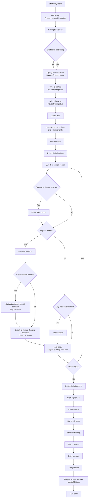
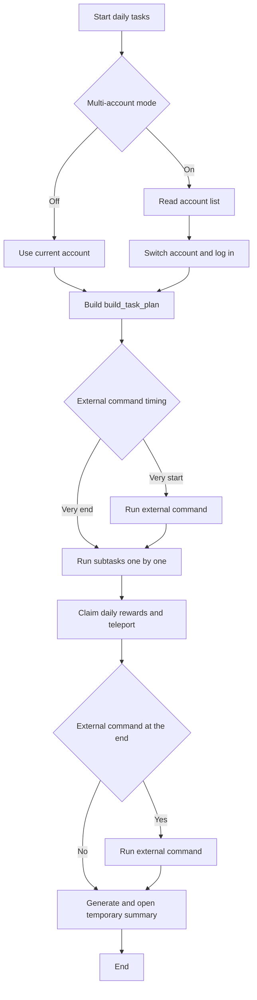

# Daily Tasks

Back: [Documentation home](index.md) / [README](../../README.md)

## Overview

Subtasks are toggled with ⭐ marks and run top-down in order. Except for 「⭐Dijiang one-click store」 and 「⭐Run external command」 which default to off, all current daily-plan subtasks default to on; the 「Buy materials」 option in 『⭐Region Building』 is not enabled by default. 『⭐Run external command』 can be scheduled to run at the very start or the very end of the task via the 「External command timing」 dropdown.

If ESC is pressed repeatedly, raise 『Settings / Delay after main-screen single action』 (1.5 or higher recommended).

### Subtasks and run order

The subtasks and run order are defined in `build_task_plan()` of [DailyTask.py](../../src/tasks/onetime/DailyTask.py). Brief summary:



> Normal case

  1. Gift giving: raise operator favorability via 「Dijiang / Operator Contact Station / Give Gift」; this subtask needs to teleport to a specific location
  2. Dijiang one-click store: open the backpack and click 「One-click Store」 (off by default)
  3. Simple crafting: go to the 「Simple Crafting」 interface and craft items
  4. Dijiang harvest: choose to collect clues, manufacturing bay, and training bay per 『⭐Dijiang harvest』
  5. Collect mail: go to the 「Mailbox」 and claim mail
  6. Handover commissions and claim rewards: the first time entering a region's 「Warehouse Node」, claim the 「Commissions I handed over」 rewards once, then hand over all delivery commissions
  7. Auto delivery: automatically accept the commissions of the currently selected region and deliver goods to the corresponding receivers along the configured paths
  8. Region building: per region, first run 「Outpost Exchange」, then buy/sell (buy first); if 「Buy materials」 is enabled, switch directly to the stable material demand to buy, then switch back to flexible-demand materials to sell
  9. Craft equipment: go to 「Equipment Crafting / Set Equipment Crafting」 and craft the first item in the list
  10. Collect credit: visit a friend's 「Dijiang」 and boost at the 「Visitor Terminal」 to earn credit
  11. Buy credit shop: prioritize 「Arsenal Quota」, 「Inlaid Jade」, and recognized discounted items; after refreshing, try buying other purchasable items
  12. Stamina farming: spend 「Stamina」 farming training materials
  13. Event rewards: claim weekly rewards, stamina supply, and scratch cards per 『⭐Event rewards』
  14. Daily rewards: claim rewards in 「Operation Handbook / Daily」 and 「Pass」 (Battle Pass)
  15. Computation: run the computation tasks
  16. Teleport to the right transfer point of Dijiang and wait for the next run

> When 「Dijiang one-click store」, 「Simple crafting」, and 「Dijiang harvest」 run consecutively, only the first task confirms being on Dijiang; the following tasks share that state. Gift giving still teleports separately to specific locations like Cambridge.

> External commands run at the very end of the task by default; you can change 「External command timing」 to 「At the very start of the task」 to run them first.

### Execution flow



> Multi-account mode (all accounts must have been logged in before in-game, and any one account must remain logged in)

 1. First try switching to the first account
 2. Run dailies after switching
 3. After dailies, try switching to the second account
 4. Loop until there are no accounts left to switch to

## Subtask introduction

### Gift giving

> Checklist: 「Dijiang/Cambridge」 can be teleported to, 「Operator Contact Station」 is available, enable 「Buy materials」 in 『⭐Region Building』, and enable 『Whether to buy gifts』 to ensure gifts are sufficient.

Improve operator favorability via 「Dijiang / Operator Contact Station / Give Gift」. If an operator is encountered on the way, interact directly to finish the gift.

The character teleports to 「Dijiang/Cambridge」, walks to the 「Operator Contact Station」, and finally interacts to complete the gift.

Options: 『⭐Gift giving』『Max gift attempts』『Gifts per time』『Preferred gift target』. Defaults: on, `2`, `2`, and the first item of the character list respectively.

### Dijiang one-click store

> Checklist: the 「Dijiang」 area is reachable and the backpack can be opened normally. **Make sure that usable items such as healing potions are not mistakenly stored before enabling.**

Whether to open the backpack on Dijiang and click 「One-click Store」. The task teleports to Dijiang, presses B to open the backpack, and clicks after OCR-recognizing the 「Store」 button.

> Note: it only directly clicks 「One-click Store」; please confirm the one-click store options do not include usable items before enabling.

Options: 『⭐Dijiang one-click store』

### Collect mail

> Checklist: the 「Mailbox」 is available.

Whether to go to the 「Mailbox」 and claim mail.

Options: 『⭐Collect mail』

### Outpost exchange

> Checklist: 「Region Building / Outpost Management」 is available and at least one outpost can trade. Enable 「Buy materials」 in 『⭐Region Building』 to prevent dispatch tickets from overflowing.

Obtain dispatch tickets through trading in 「Region Building / Outpost Management」.

The program traverses all outposts in all regions to obtain as many dispatch tickets as possible. **The goods the program supports trading** are listed in `goods_dict` in [world_map.py](../../src/data/world_map.py).

Options: 『⭐Outpost exchange』『Trading goods priority sequence』『Outpost exchange only buys priority goods』

When 『Outpost exchange only buys priority goods』 is enabled, only goods in the 「Trading goods priority sequence」 are exchanged when that sequence is non-empty; when the sequence is empty, the original logic is used.

#### Trading goods priority sequence

The 『Trading goods priority sequence』 option is empty by default, in which case the program recognizes *goods the outpost accepts* and trades the *program-supported goods* among them in **random order**.

To make the program trade in order, fill the 『Trading goods priority sequence』 with **regular expressions separated by English commas `,`**, so that:

- For **priority goods** that are both *accepted by the outpost* and *supported by the program*, they are traded in **fill order**.
- Other goods are traded in random order after the priority goods.
- Wrong / not accepted / not supported goods names are ignored.

#### Example

Game version 1.1: Valley 4's `20 Crystal Shell + 24 Citrus Canned + 18 Selected Buckwheat Cure Capsule + 18 High-capacity Valley Battery` is the full-output mineral line; Wuling's `6 High-quality Needle Injection + 12 Mid-capacity Wuling Battery` is the version's full-output line.

You can fill the 『Trading goods priority sequence』 with `晶体外壳,\b柑实罐头,精选荞愈,高容谷地,优质芽针,中容武陵` to save batteries in Valley 4 (moving power reduces Wuling battery consumption) and consume medicines first in Wuling (preventing medicine overflow from blocking the battery line).

### Handover delivery commissions

> Checklist: 「Region Building / Warehouse Node / Delivery Commission List」 and 「Commissions I handed over」 are available.

Whether to claim the 「Commissions I handed over」 reward once in 「Region Building / Warehouse Node」 and hand over all delivery commissions. The program claims the reward on the first entry into any region's 「Warehouse Node」, then traverses all regions to hand over all commissions.

There may be cases of unclaimed commissions / damaged goods, so maximum profit cannot be guaranteed.

Options: 『⭐Handover delivery commissions』. Reward claiming is enabled by default.

### Simple crafting

> Checklist: 「Simple Crafting interface has craftable items」.

Whether to go to the 「Simple Crafting」 interface and craft items.

Options: 『⭐Simple crafting』

### Craft equipment

> Checklist: 「Equipment Crafting / Set Equipment Crafting」 is available. Daily equipment originals production is no less than 50.

Whether to go to 「Equipment Crafting / Set Equipment Crafting」 and craft one **first-item-in-list** piece of equipment. Make sure you have enough **equipment originals** and dispatch tickets.

Options: 『⭐Craft equipment』

### Collect credit

> Checklist: the 「Dijiang」 area is reachable. Own at least 25 friends. 「Procurement Center / Credit Exchange」 is available.

Whether to visit a friend's 「Dijiang」 and boost at the 「Visitor Terminal」 to earn credit. After boosting, go to 「Procurement Center / Credit Exchange」 to collect all boosts.

If the option 『Try only training bay』 is enabled, it first tries to boost only the friend's 「Training Bay」 on Dijiang. If not possible, it boosts another bay at least once.

Options: 『⭐Collect credit』『Try only training bay』

### Dijiang harvest

> Checklist: the 「Dijiang」 area is reachable.

Whether to run the master switch for the subtasks **Collect clues**, **Manufacturing bay**.

Options: 『⭐Dijiang harvest』

#### Collect clues

> Checklist: the 「Dijiang/Reception Room」 area is reachable.

Whether to go to 「Dijiang/Reception Room」 and collect all clues. Once all clues are collected, start intelligence exchange.

To increase the intelligence exchange frequency (more credit to exchange for gacha resources), adding more friends is recommended.

Options: 「Collect clues」 in 『⭐Dijiang harvest』

#### Manufacturing bay

> Checklist: all 「Dijiang/Manufacturing Bay」 areas are reachable. Each area has a crafted item set. Each area has at least one assigned character.

Whether to go to 「Dijiang/Manufacturing Bay」 and collect training materials. The to-be-crafted quantity is topped up after collecting.

To improve manufacturing efficiency, assign characters with suitable talents.

Options: 「Manufacturing bay」 in 『⭐Dijiang harvest』

#### Training bay

Whether to go to 「Dijiang/Training Bay」, collect training materials, and start training again.

Options: 「Training bay」 in 『⭐Dijiang harvest』

### Buy credit shop

> Checklist: 「Procurement Center / Credit Exchange」 is available.

Whether to purchase at 「Procurement Center / Credit Exchange」. Each round prioritizes 「Arsenal Quota」, 「Inlaid Jade」, and recognized discounted items, refreshing at most at a credit cost of `80/120/160/201`; refresh only happens when the credit after the estimated refresh is strictly greater than the fixed value `210`. When refreshing is no longer possible, it also tries buying other purchasable items on the page.

『Credit shop reserve credit』 is the stop threshold after a successful purchase: the program does not reserve this credit before purchasing, but after deducting the item price, it stops further purchases when the remaining credit is less than or equal to this value. This config does not control refreshing; refreshing always uses the fixed `210` above.

Options: 『⭐Buy credit shop』『Credit shop reserve credit』

### Buy/sell

> Checklist: the 「Dijiang」 area is reachable. Own at least 25 friends. 「Region Building / Material Dispatch / Flexible Demand Materials」 is available. Enable 「Outpost Exchange」 in 『⭐Region Building』 to ensure enough dispatch tickets, and 「Buy materials」 to prevent overflow.

Whether to trade with friends in 「Flexible Demand Materials」 to earn dispatch tickets. It automatically fetches goods info, then decides whether to trade using the price upper/lower bounds. (Unless the purchasable quantity is about to overflow, in which case it always trades.)

In buy-only mode, only buying is performed, not selling. It does not fetch all info to speed up the flow.

The **goods the program currently supports trading** are listed in `exchange_goods_dict` in [world_map.py](../../src/data/world_map.py).

Options: 「Buy/sell」 in 『⭐Region Building』『Buy only, no sell』『Wuling buy price』『Wuling sell price』『Wuling』『Valley 4 buy price』『Valley 4 sell price』『Valley 4』

### Buy materials

> Checklist: 「Region Building / Material Dispatch / Stable Material Demand」 is available. Enable 「Outpost Exchange」 in 『⭐Region Building』 to ensure enough dispatch tickets.

Whether to buy materials with dispatch tickets in 「Region Building / Material Dispatch / Stable Material Demand」. Buys the first item in the first row of 「Daily Consumables」, 「Industrial Goods」, and 「Humanities Products」 in order.

The 『Shopping whitelist』 option defaults to empty, meaning it buys the first material in the first row of 「Daily Consumables」 and 「Industrial Goods」; if 『Whether to buy gifts』 is `true`, it also buys the first material in the first row of 「Humanities Products」.

This option accepts several **regular expressions separated by English commas (,)**: if any of them matches a material in the first row, it is bought; if none match, it is skipped. Recommended: `刻写,助剂,理智,寻访,高级,高阶,折金票`.

**It is recommended to manually buy out one-time materials that do not refresh** to avoid weird issues (though it is compatible).

Options: 「Buy materials」 in 『⭐Region Building』『Shopping whitelist』『Whether to buy gifts』

### Stamina farming

See [Stamina Farming](stamina-farming.md).

### Event rewards

> Checklist: 「Event Center / Weekly Tasks」 is available.

Whether to claim rewards in the 「Event Center」 per the 『⭐Event rewards』 multi-select. All three options are selected by default.

Options: 『⭐Event rewards』, choices: 「Weekly rewards」, 「Stamina supply」, 「Scratch cards」

### Daily rewards

> Checklist: 「Operation Handbook / Daily」 and 「Pass」 are available.

Whether to claim rewards in 「Operation Handbook / Daily」 and 「Pass」.

Options: 『⭐Daily rewards』

### Teleport to the right transfer point of Dijiang

> Checklist: the Dijiang area is reachable.

Teleport to the right transfer point of 「Dijiang」.

Options: 『⭐Teleport to the right transfer point of Dijiang』

### Run external command

> Checklist: the external program can be launched directly from the command line.

Runs an external command once at the very start or the very end of the daily task, selected via the 「External command timing」 dropdown. Options control whether to wait for the command to exit, and whether to skip the launch when the target command is already running. It can be combined with other scripts that perform specific tasks via the command line for better daily handling.

Options: 『⭐Run external command』『External command』『External command starts at』『External command wait for exit』『Skip when external command is running』『External command timing』

Command examples (keep them short, following the command-line task launch style):

```bash
# MXU (Windows): autostart mode, specify the instance (task tab) name
mxu.exe --autostart --instance 日常任务

# MXU (Linux / macOS): specify instance, exit after run completes
./mxu --autostart -i 日常任务 --quit-after-run

# Generic: run a local script
python scripts/daily_extra.py
```

Notes:

- Absolute paths or stable relative paths are recommended.
- 『External command starts at』 is optional; if filled, it is used as the command working directory; otherwise the default directory is used.
- Quote paths or arguments containing spaces according to the current system shell rules.
- `mxu.exe` is Windows-only; Linux / macOS usually use `./mxu`.
- `-i` / `--instance` specifies the instance (task tab) name.
- `-q` / `--quit-after-run` exits after the automated run completes.
- With 『External command wait for exit』 enabled, it waits for the command to finish and judges success/failure by the exit code.
- With 『Skip when external command is running』 enabled, if the target command is already running, this launch is skipped.
- Keep arguments short and avoid over-long single-line commands.

### Other options

 1. Terminate the game on exception
 2. Only exit the game
 3. Exit after completion

Related documents: [Stamina Farming](stamina-farming.md) / [Account Configuration User Guide](account-configuration.md) / [API reference](../dev/API.md)
