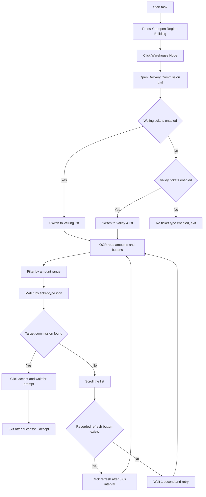

# Delivery Commission Pickup

Back: [Documentation home](index.md) / [README](../../README.md)

## Overview

Automatically grabs commissions in 「Region Building / Warehouse Node / Delivery Commission List」, filtering for high-value commissions that match the criteria and accepting them automatically.

---

## Prerequisites

Staying on the game main screen is enough. After the task starts it will automatically:

1. Press `Y` to open Region Building.
2. Click 「Warehouse Node」.
3. Click 「Delivery Commission List」.

Then it enters the automatic filter-and-accept flow and exits automatically after a successful accept.

---

## Options and configuration

### Accept Valley tickets

Whether to grab 「Valley 4」 delivery commissions.

Default: off

---

### Accept Valley tickets minimum amount (10k)

The minimum reward amount (10k) for Valley-ticket commissions; commissions below this are not accepted.

Default: `5.0`

---

### Accept Valley tickets maximum amount (10k)

The maximum reward amount (10k) for Valley-ticket commissions; commissions above this are not accepted (to prevent OCR misreads from accepting abnormal commissions).

Default: `40.0`

---

### Accept Wuling tickets

Whether to grab 「Wuling」 delivery commissions.

Default: on

---

### Accept Wuling tickets minimum amount (10k)

The minimum reward amount (10k) for Wuling-ticket commissions.

Default: `5.0`

---

### Accept Wuling tickets maximum amount (10k)

The maximum reward amount (10k) for Wuling-ticket commissions.

Default: `15.0`

---

## Workflow

---

## Notes

- This task inherits `TriggerTask` but is registered in `onetime_tasks` as a one-time grab flow started manually by the user. It exits automatically after a successful accept and does not deliver goods (use [Auto Delivery](auto-delivery.md) for delivery).
- When both ticket types are enabled, the task first enters the Wuling list but matches both ticket icons within the current list; it does not switch to the Valley 4 list to keep searching. It only enters the Valley 4 list when only Valley tickets are enabled.
- The list scrolls once per round, and the scroll direction reverses after a refresh; the refresh click interval is at least 5.6 seconds.
- If the refresh button cannot be located, it retries every second and does not auto-exit after 10 cumulative failures; stop the task manually if needed.
- If the program reports 「insufficient permissions」, run it as **administrator**.

Related documents: [Auto Delivery](auto-delivery.md) / [Delivery Area Maintenance Workflow](../update/送货地区维护工作流.md)
