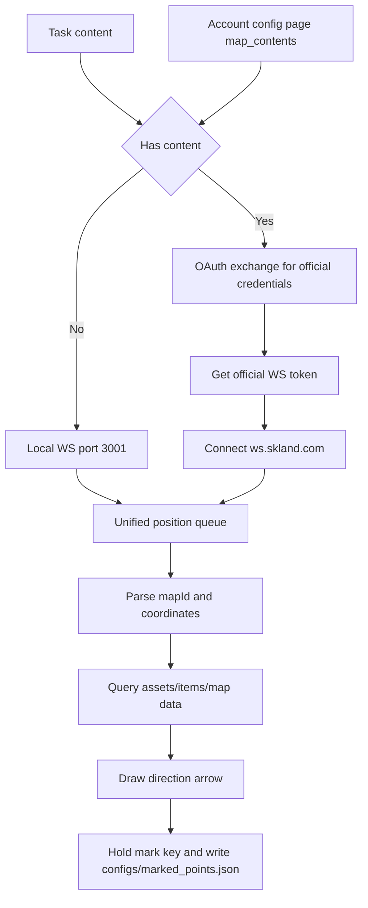

# Item Navigation & Realtime Detection

Back: [Documentation home](index.md) / [README](https://github.com/AliceJump/ok-end-field/blob/master/README.md)

## Overview

This document covers two trigger/debug tasks:

- `ItemNavigatorTask` (UI name: Item Navigation): uses the official-map WebSocket when a valid `content` is available; otherwise starts a local WebSocket service pointing to the nearest gathering point of the selected item, and supports pressing a key to mark it as collected.
- `RealtimeDetectTask` (UI name: Realtime Detection): runs YOLO detection in a loop for observing model, target-class, and confidence performance online.

---

## Item Navigation

### Prerequisites

- It is recommended to save the official-map sync `content` on the account configuration page, or fill in `content` directly in the task config.
- When `content` is not configured, an external script or tool is needed to push position data to the local `ws://127.0.0.1:3001`.
- Item point data comes from `assets/items/map/summary.json` and `assets/items/map/item_names.json`.
- Mark results are written to `configs/marked_points.json`, used to avoid re-pointing to already-marked points.

### Configuration items

| Config item | Default | Description |
|---|---:|---|
| `content` | empty string | Optional. Fill in the `data.content` from the JSON returned by `web-api.skland.com/account/info/hg/check`. When present, the official-map WebSocket is preferred. See "Obtaining content" below. |
| `地图账号` (Map account) | empty string | Optional. When `content` is empty, reads the map-sync content saved for that account on the account configuration page. |
| `选择物品` (Select item) | `[]` | List of item names to navigate; no target is filtered when empty. |
| `标记按键` (Mark key) | `f` | The key pressed to mark an item as "collected" when close to the target. |
| `标记按住时长` (Mark hold duration) | `2.0` | Seconds the mark key must be held. Timing starts only within a horizontal distance of 20 of the target; reaching the duration marks it as collected. `0`, negative, or non-numeric values fall back to the default 2 seconds. |

### Obtaining content

`content` is the account credential for official map sync; you need to grab it once from your browser:

1. Open a browser and press `F12` to open DevTools.
2. Visit <https://game.skland.com/map/endfield> and log in.
3. Switch to the **Network** tab and type `https://web-api.skland.com/account/info/hg/check` in the filter box.
4. Select that request in the filtered list and read `data.content` from the **Response**
   (a long string).
5. Paste it into the task's `content` parameter; **or** save it as `地图同步 content` on the
   account configuration page and then pick that account via `地图账号` in the task.

> Pick either route: putting it directly in `content` is handy for a one-off run, while saving it on
> the account page suits long-term multi-account use. `content` is equivalent to a login session —
> never paste it into issues, chat groups, or screenshots.

### Data flow

### Notes

- Item Navigation depends on the current map ID and coordinate data; without point data it cannot produce a valid direction.
- The task draws a direction arrow on the window; if you cannot see the arrow, first check whether the WebSocket position data is working.
- "Local WS fallback" only happens when the task has no `content`. If `content` is configured but the official auth or connection fails, the current run does not automatically switch to local WS; clear the task `content` and uncheck/clear the map account to use local mode.
- Marking requires holding the key for the duration set by `标记按住时长` (default 2 seconds) within a horizontal distance of 20; releasing the key early or leaving the range cancels the current timing. The value is re-read every cycle, so changes apply without restarting the task.
- The Tampermonkey-script help button opens the temporary help document and script directory.

---

## Realtime Detection

### Use cases

Realtime Detection is for debugging YOLO models, not a daily-automation flow. It continuously takes screenshots and runs object detection, useful for observing how a model and target class hit.

### Configuration items

| Config item | Default | Description |
|---|---:|---|
| `YOLO模型` (YOLO model) | `yolo.default_model` in [src/config.py](../../src/config.py) | Model config key; the actual model and labels are maintained in [src/yolo/models.py](../../src/yolo/models.py). |
| `检测目标` (Detect target) | The first label of the current model | The target class to observe. |
| `检测置信度` (Detect confidence) | `0.7` | Range `0` to `1`; the higher, the stricter. |
| `扫描间隔(秒)` (Scan interval (seconds)) | `0.2` | The wait after each detection. |

### Notes

- The target name must exist in the selected model's labels, otherwise the task errors out immediately.
- This task loops; when stopped it outputs the total scan count, hit rounds, and highest confidence.

Related documents: [Official Map WS Client Implementation](../dev/地图官方WS客户端实现.md) / [Account Configuration User Guide](account-configuration.md)
