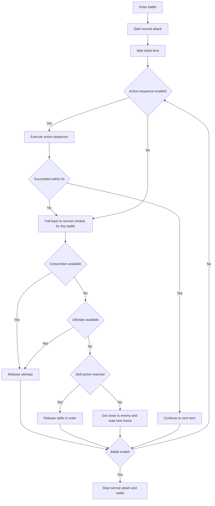

# Stamina Farming

Back: [Documentation home](index.md) / [README](../../README.md)

## Configuration requirements

> Make sure the resolution is at least **1920x1080 (1080P)**; below 1080P is not guaranteed to work

## Combat logic

There are two combat logics: normal combat and action-sequence combat. All battle configurations (skill release order, skill points to start, action sequence, etc.) are now managed centrally in **「Global Config → Battle Config」** — configure once and it applies to Stamina Farming, Auto Combat, Daily Tasks, etc., with no need for repeated setup.

At the start of every battle it first locks onto the target and holds the left mouse button for continuous normal attacks, then waits for the **initial wait time after entering battle** (default 3 seconds) before releasing skills. The left mouse button is released when the battle exits or an exception occurs.

### Normal combat

The logic is:

In normal mode each frame first tries the conjunction, then any available ultimate; if neither is released and skill points reach the **skill points to start** (default 2), skills are cycled from the **skill release** order (default `1,2,3`). During battle it also periodically re-locks the target and dodges forward on the **no-digit operation interval** (default 6 seconds, clamped to 1–30 seconds at runtime).

### Action-sequence combat

When enabled, the action sequence is executed. If the last successful action was more than 5 seconds ago and the current one still fails, this battle permanently falls back to normal mode and never re-enables the sequence even after later successes. `sleep_n` and `normal_n` count as successful actions when they complete and reset the timer.

Action sequence notes: [Action Sequence](action-sequence.md)

## Consuming time-limited stamina items

If the option 『Consume time-limited stamina items』 is enabled, the program checks the remaining validity and quantity of time-limited emergency stamina boosters in the backpack before each stamina-farming run:

- **If the currently selected stamina item is measured in "hours", the entire stock of that type is used directly; this branch does not cap the usable quantity at the 1000-stamina limit.**
- **If measured in "days", it is consumed by the following formula:**

> Used = min(max(1, ceil(2 × quantity ÷ remaining days)), quantity, quantity usable up to the 1000-stamina limit)

That is, "day" items consume roughly 2/n of the stock each day (rounded up), bounded by the 1000-stamina cap; "hour" items have no such quantity cap. The program sorts by "hours first, then ascending remaining validity", but each run only processes the first item after sorting — it does not drain every type.

---

## Normal stages

Stages need to be unlocked in advance, and **all first-clear rewards at every difficulty must be claimed.**

Characters need some investment to avoid dying; at least raise **character and weapon level to 81**.

If the option 『Stand still only』 for 「Heavy Energy Silt Points」 is enabled, choose the character with the **highest HP** to stay on the front line to avoid dying. That character needs to be **maxed at level 90** and carry **HP-restoring items**.

It is recommended to bring **characters with crowd-control/grouping abilities** to reduce battle time.

### Low/high reward self-select

Supports automatically switching reward tiers in the following stages:

- Operator EXP
- Operator promotion
- Skill enhancement
- Weapon promotion

The 『Stamina reward tier』 option can be configured in both 『Task / Daily Tasks / Stamina Farming』 and 『Task / Stamina Farming』, with the following choices:

- Keep current: do not switch the reward tier.
- Low tier: after clicking "Go", automatically enters "Self-select" and picks the tier corresponding to the top button.
- High tier: after clicking "Go", automatically enters "Self-select" and picks the tier corresponding to the bottom button.

Priority notes:

- When the "stage sequence" is not enabled, the 『Stamina reward tier』 config is used.
- When the "stage sequence" is enabled, the 『Stamina reward tier』 config is ignored and controlled by the sequence item suffix (see below).

Switching flow notes:

- After clicking "Go", recognizes the "Self-select" button at the bottom right and clicks it.
- Recognizes where "Current" is: top means the current tier is low, bottom means the current tier is high.
- If it differs from the target tier, clicks the "Select/Current" button of the target tier.
- Then executes Back until "Enter" is recognized at the bottom right, then returns to the main flow to continue farming.

## Crisis Recurrence

「Crisis Recurrence」 is a boss-type stage that costs **120 stamina** per run.

Supported stages: Rodan, Trinity, Chalk Realm Guard, Ruan Yi, Nephes.

---

## Crisis Rehearsal (high-tier stages)

「Crisis Rehearsal」 is a high-tier material stage that costs **80 stamina** per run. The program uses image features (not OCR) to locate stages, to handle the special layout.

Supported stages: D96 Steel, Ultra-range Luminance Tube, Tachyon Filter Lattice, Quadrant Fitting Fluid, Three-phase Nanosheet.

---

## Heavy Energy Silt Points

Checklist:

1. The 「Pre-inscribed attribute」 of the Heavy Energy Silt Point is set. Not sure how to choose? Try this [essence calculator](https://ef.yituliu.cn/tools/essence-calculator/).
2. The nearest 「Protocol Transfer Point」 to the Heavy Energy Silt Point can be teleported to. If after teleporting you can **walk straight (no obstacles)** (e.g. 「Hub Zone」 and 「Qingbo Village」), you can **skip the remaining checklist items**.
3. After teleporting you can **directly board the 1st 「Long-range Zip Line Frame」**. Make sure that after passing the 1st, 2nd, 3rd...nth 「Long-range Zip Line Frame」 in order, the character can **walk straight (no obstacles)** to the Heavy Energy Silt Point.
4. Make sure the 2nd–nth frames can be moved through continuously with E. (Setup: in game, move along the zip line in order and press R 「Assign continuous movement connection points」.)
5. Record the distance between the 1st and 2nd frames and fill it into 「Global Config / Zip Line Config」 under the corresponding stage name (e.g. 「Source Stone Research Park」).

Notes:

- The program locates transfer points by image features. To ensure recognition succeeds, the character **must not be near the Protocol Transfer Point**, otherwise the character position icon breaks the transfer-point feature.
- The program uses OCR to read the distance between the 1st and 2nd frames to determine which is the 2nd. To ensure recognition succeeds, this distance must be **unique** — i.e. **it must not equal the distance to any other visible frame (reachable or not) from the 1st frame.**
- For recognition to succeed, when boarding the 1st frame and looking at the 2nd, the distance label is best placed on a **dark, solid, simple background**.
- If the character ends up far from the Heavy Energy Silt Point after clearing enemies, the program will **re-path via teleport + zip line (second pathfinding) after a recognition failure (timeout)** to claim the reward; execution time may increase.

Special reminders:

- Heavy Energy Silt Points are located in the open world with a complex environment, so **the chance of failure is relatively high.**
- You can find the file `DailyBattleMixin_battleGather_Exception` under `./screenshots` for failure screenshots. (Note: the screenshot folder is cleared before each run; back it up yourself if needed.)
- (Recommended) Upload the screenshot to issue [#58](https://github.com/AliceJump/ok-end-field/issues/58) to help the developers. Providing some logs (in `./logs`) would be even better.

Related code:

- Nearest transfer point `to_near_transfer_point`
- Zip line movement `zip_line_list_go`
- Walking `navigate_until_target`

## Continue farming after stamina runs out

When the option 『Continue farming count after stamina runs out』 is greater than 0:

- After stamina is insufficient, the program keeps entering battle and clicks 「Give up」 at settlement (no reward claimed, no stamina spent).
- Only supported for 「Heavy Energy Silt Points」 (challenge mode).
- If the current stage is not a Heavy Energy Silt Point, this config is ignored and a log entry is shown.

This feature suits cases where you need extra defeat/battle actions but do not need the reward.

## Specified squad number

The default is 「No squad switch」; alternatively choose `1` to `5`. Normal stages switch before re-entering after the first entry; Heavy Energy Silt Points open the squad panel to switch before activation. If the target squad number is not recognized, a log entry is recorded and it continues — it does not force-stop.

## Automatic stage rotation

Supports automatic stage rotation via 「Stamina farming start date」 and 「Stage sequence」:

- "Stamina farming start date": defaults to the date when the task config was first built, in the format "2026-04-05"; can be changed to today or any past date.
- "Stage sequence": fill in multiple stage names (comma-separated), e.g. "干员经验,干员进阶,钱币收集".
- Supports the suffixes "低阶/高阶" (low/high), e.g. "干员经验低阶,技能提升高阶,钱币收集".
- The suffix only applies to "干员经验/干员进阶/技能提升/武器进阶".
- Without a suffix (e.g. "干员经验"), the current reward tier is kept unchanged.
- Stage names must be one of the following:

    干员经验, 干员进阶, 钱币收集, 技能提升,
    武器经验, 武器进阶,
    罗丹, 三位一体, 白垩界卫, 阮一, 聂菲斯,
    D96钢, 超距辉映管, 快子遴捡晶格, 象限拟合液, 三相纳米片,
    枢纽区, 源石研究园, 试验园区, 矿脉源区, 供能高地, 武陵城, 清波寨, 首墩, 藏剑谷, 应龙关, 北部禁区

- The program automatically computes which stage to farm today based on the "Stamina farming start date" and "Stage sequence".
- If the "Stage sequence" is empty, automatic rotation is disabled and the "Stamina stage" config is used.
- If an invalid stage name is entered (i.e. any name not in the supported list), the whole rotation is abandoned and the "Stamina stage" config is used directly.
- If the "Stamina farming start date" is in the future, it automatically falls back to the "Stamina stage" config.
- The automatic selection process is logged.

Related documents: [Auto Combat](auto-combat.md) / [Action Sequence](action-sequence.md) / [Daily Tasks](daily-tasks.md)

Example:

- Stamina farming start date: 2026-04-05
- Stage sequence: 干员经验,武器经验,钱币收集

Then day 1 farms "干员经验", day 2 farms "武器经验", day 3 farms "钱币收集", day 4 loops back to "干员经验"…
