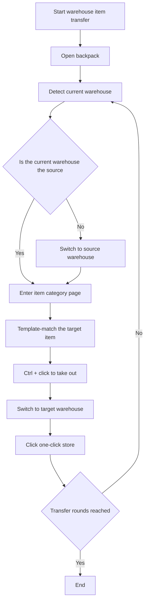

# Warehouse Item Transfer

Back: [Documentation home](index.md) / [README](../../README.md)

## Overview

Takes specified items out of the 「Source Warehouse」, switches to the 「Target Warehouse」 and one-click-stores them, repeating for the configured number of rounds. It is used for moving materials between region warehouses (currently only supports the Chinese version of the game).

---

## Prerequisites

It is recommended to start the task on the game main screen and make sure both warehouses are connected.

The task automatically tries to open the backpack and runs the rest of the flow.

---

## Options and configuration

### Source warehouse

Which warehouse to take items from.

Valid values:

| Option | Description |
|------|------|
| `valley4` | Valley 4 warehouse |
| `wuling` | Wuling warehouse |

Default: `valley4`

---

### Target warehouse

Which warehouse to transfer items into.

Valid values are the same as the source warehouse, and **must not be the same as the source warehouse**.

Default: `wuling`

---

### Item

The name of the item to transfer.

The currently supported item list can be found in [world_map.py](../../src/data/world_map.py) under `item_to_warehouse_dict`.

---

### Transfer rounds

The total number of transfer rounds; each round completes one 「take out → switch warehouse → store」 flow.

Default: `10`

---

## Workflow

---

## Notes

- The source warehouse and the target warehouse must not be the same.
- If the selected item icon cannot be recognized (not in the supported list), the task errors out and stops.
- It is recommended to make sure both warehouses are 「connected」 before starting the task.

Related documents: [Master Data Maintenance Workflow](../update/主数据维护工作流.md) / [API reference](../dev/API.md)
