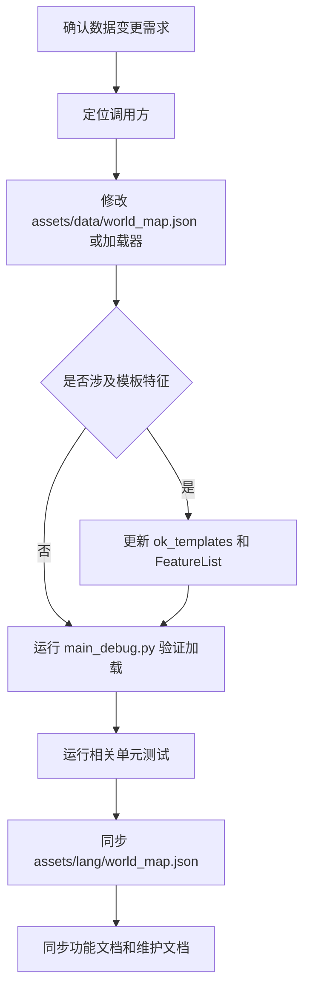

# 世界地图维护工作流

返回：[文档索引](../zh-CN/README.md) / [README](../../README.md)

> 数据已剥离为 JSON：`assets/data/world_map.json`（纯数据），由 `src/data/world_map.py`（薄加载器）读取，保持原导入路径兼容；涉及 FeatureList 枚举的 `higher_order_feature_dict` 仍在加载器中。`permanent_dict`（影拓丰碑敌人列表）在 JSON 中维护。

## 主要维护点

### 1. 地区列表：驱动任务遍历

**影响的功能**：

- [daily_trade_mixin.py](../../src/tasks/daily/daily_trade_mixin.py) 中的买卖货任务会按 `areas_list` 逐区执行
- [daily_outpost_mixin.py](../../src/tasks/daily/misc/daily_outpost_mixin.py) 中的据点兑换任务会按 `areas_list` 遍历所有地区
- [daily_buy_mixin.py](../../src/tasks/daily/daily_buy_mixin.py) 中的买物资流程也依赖地区列表
- [daily_logistics_mixin.py](../../src/tasks/daily/misc/daily_logistics_mixin.py) 的物流相关流程也读取地区列表

**维护要点**：

- 新增地区时，必须先把地区名加入 `areas_list`
- 地区名会直接影响日常任务的遍历范围和配置项名称
- 地区顺序会影响任务执行顺序

---

### 2. 据点字典：决定地区内可处理的据点

**影响的功能**：

- [world_map_utils.py](../../src/data/world_map_utils.py) 通过 `get_area_by_outpost_name()` 反查据点所属地区，并由 `get_goods_by_outpost_name()` 返回该地区的 `goods_dict`
- [daily_outpost_mixin.py](../../src/tasks/daily/misc/daily_outpost_mixin.py) 的据点兑换任务会从 `outpost_dict` 逐个取出据点执行兑换
- 当前直接业务调用方只有据点兑换流程；自动送货使用独立的 `delivery_area.py` 地点/NPC 数据，不读取 `outpost_dict`

**维护要点**：

- 新增或调整据点时，要同步更新 `outpost_dict`（注意：应统一使用"据点"术语，避免与其他模块混淆）
- 修改据点名称后，要检查所有按名称反查地区的流程是否还能匹配

---

### 3. 商品字典：驱动据点兑换识别与优先项

**影响的功能**：

- [world_map_utils.py](../../src/data/world_map_utils.py) 的 `get_goods_by_outpost_name()` 会按据点所属地区返回可交易货物
- [daily_outpost_mixin.py](../../src/tasks/daily/misc/daily_outpost_mixin.py) 的据点兑换任务按据点所属地区读取 `goods_dict`
- [daily_routine_mixin.py](../../src/tasks/daily/daily_routine_mixin.py) 会汇总 `goods_dict`，生成「交易货品优先序列」的可选项
- 买卖货任务只按 `areas_list` 遍历并从界面 OCR 采集交易信息，不读取 `goods_dict`

**维护要点**：

- 新增据点兑换可识别/可排序的货物时，更新 `goods_dict`；送货货物和买卖货扫描不由该字典驱动
- 商品必须按地区分组，否则据点兑换无法拿到正确的可交易物品列表
- 商品变动会影响据点兑换的 OCR 候选、规范化和「交易货品优先序列」配置选项，不会改变游戏内兑换 UI 自身的商品列表

---

### 4. 兑换商品字典：当前主要是预留配置

**影响的功能**：

- 目前代码里没有直接消费 `exchange_goods_dict` 的业务逻辑
- 文档和配置层面保留了这个结构，便于后续扩展兑换 UI 或交易逻辑

**维护要点**：

- 现在不要把它当作主流程数据源
- 如果后续要接入真正的兑换功能，再补充调用方

---

### 5. 关卡字典和消耗表：驱动战斗任务

**影响的功能**：

- [daily_battle_mixin.py](../../src/tasks/daily/daily_battle_mixin.py) 会用 `stages_dict` 生成关卡选择项
- [world_map_utils.py](../../src/data/world_map_utils.py) 的 `get_stage_category()` 会反查关卡所属分类
- `stages_cost` 会影响体力/消耗计算
- `higher_order_feature_dict` 只服务高阶关卡的模板识别和特殊处理

**维护要点**：

- 新关卡先放进 `stages_dict`
- 关卡消耗统一维护在 `stages_cost`
- 只有高阶关卡才需要维护 `higher_order_feature_dict`
- `stages_list` 是派生数据，不要手改

---

### 6. 仓库映射：驱动物品转移

**影响的功能**：

- [仓库物品转移.md](../../docs/zh-CN/仓库物品转移.md) 对应的物品选择依赖 `item_to_warehouse_dict`
- 仓库转移任务会按这个字典把物品归类到矿物、产物等仓库类别

**维护要点**：

- 新增物品类别时补充映射
- 映射变更会直接影响仓库转移任务的可选项和分类结果

---

## 通用维护流程

1. 先确认调用方使用了哪些数据
2. 修改对应配置（均在 `assets/data/world_map.json`）：
   - 地区：`areas_list`
   - 据点：`outpost_dict`
   - 商品：`goods_dict`
   - 关卡：`stages_dict`
   - 消耗：`stages_cost`
   - 仓库映射：`item_to_warehouse_dict`
   - 影拓丰碑敌人：`permanent_dict`
3. 如有高阶关卡，再补 `higher_order_feature_dict`（在 `src/data/world_map.py` 加载器内，因含 FeatureList 枚举）
4. `scripts/sync_world_map_langs.py` 会自动为主数据新增的名称补齐 `assets/lang/world_map.json` 节点（官方有译名则填，无则至少 zh_CN）；官方新增名称会打印 MANUAL 提示人工决定是否加入主数据
5. 运行相关任务验证数据是否生效

---

## 关键注意事项

- **先看调用方，再改数据**：`world_map.py` 里的字段不是孤立配置，改之前先确认哪些任务模块在用
- **商品字典影响范围有限**：`goods_dict` 影响据点兑换识别、筛选和优先序列配置，不驱动买卖货扫描、自动送货或游戏内商品列表
- **关卡分两层维护**：普通关卡只维护分类和消耗，高阶关卡才维护模板特征
- **兑换商品目前偏预留**：`exchange_goods_dict` 暂时不是主流程数据源
- **派生数据不要手改**：`stages_list` 由 `stages_dict` 自动生成

---

## 依赖关系

- [daily_trade_mixin.py](../../src/tasks/daily/daily_trade_mixin.py) 只读取地区列表，不读取 `goods_dict`
- [daily_outpost_mixin.py](../../src/tasks/daily/misc/daily_outpost_mixin.py) 读取地区列表、据点列表和商品配置
- [daily_routine_mixin.py](../../src/tasks/daily/daily_routine_mixin.py) 汇总商品配置以生成交易货品优先序列
- [daily_logistics_mixin.py](../../src/tasks/daily/misc/daily_logistics_mixin.py) 读取地区列表
- [daily_battle_mixin.py](../../src/tasks/daily/daily_battle_mixin.py) 读取关卡分类、消耗和高阶特征
- [world_map_utils.py](../../src/data/world_map_utils.py) 负责据点到地区、据点到商品、关卡到分类的反查
- [仓库物品转移.md](../../docs/zh-CN/仓库物品转移.md) 对应仓库映射字典的使用说明

---

## 通用验证步骤

1. 运行 `python -m compileall src/data src/tasks/daily` 检查语法和导入前的基础结构。
2. 运行 `python -m unittest tests.TestCheckLang tests.TestPoLocaleConsistency tests.TestOutpostExchange`；涉及送货地区时追加 `tests.TestDeliveryAreaConfig`，涉及仓库映射时追加 `tests.TestWarehouseSwitchOCR`。
3. 运行 `python main_debug.py` 验证配置控件和数据加载。
4. 检查日志并遍历受影响的日常任务，确认当前语言 OCR、据点顺序和商品选项均正确。

相关文档：[日常任务](../zh-CN/日常任务.md) / [刷体力](../zh-CN/体力本.md) / [仓库物品转移](../zh-CN/仓库物品转移.md)
