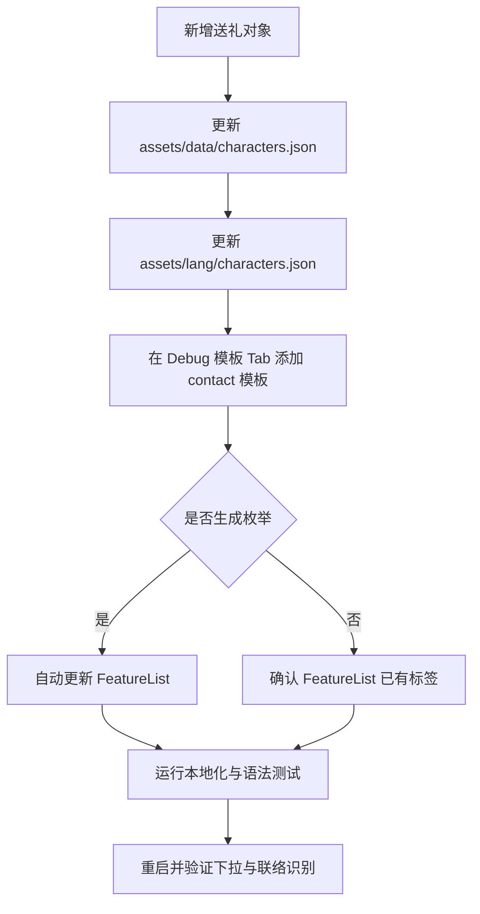

# 日常送礼维护工作流

返回：[文档索引](../README.md) / [README](../../README.md)

简短说明：新增联络（送礼）对象时，需要同步角色主数据、本地化识别名和 `*_contact` 模板。角色主数据的 `zh` 字段决定「优先送礼对象」下拉中的规范中文值；模板与角色的 `en` 字段匹配后，该对象才会进入按当前语言本地化的实际可联络集合。

角色主数据（canonical）已剥离为 JSON：`assets/data/characters.json`，由 `src/data/characters.py`（薄加载器）读取，保持原导入路径兼容。

步骤：



1. 在 [`assets/data/characters.json`](../../assets/data/characters.json) 中添加角色条目（示例）：

```json
"han_mei": {
    "zh": "寒梅",
    "en": "hanmei",
    "stars": 5
}
```

> 提示：新干员的官方多语言译名可自动同步（`scripts/sync_character_langs.py`，数据源 endfield.wiki.gg）；该脚本会自动补 `assets/lang/characters.json` 节点，但 canonical 的 `en`（内部 ID）需人工确认。

2. 在程序的 Debug → 模板 Tab 中框选联络模板并保存（命名示例：`hanmei_contact`）。保存后模板会写入 `assets` 并可选生成枚举。

3. 在 [`assets/lang/characters.json`](../../assets/lang/characters.json) 中为角色字典键（示例中的 `han_mei`）补齐现有 locale。运行时通过这个键生成当前语言的联络识别映射；缺项时会回退到 canonical 的 `zh`。这不会改变下拉框保存和显示的规范中文值。

说明/验证：

- 模板保存后，若勾选“保存枚举”，工具会把 `hanmei_contact`（或相应名字）写入 `src/data/FeatureList.py`。如果未勾选，也可手动在 `FeatureList` 中添加 `hanmei_contact`。
- 「优先送礼对象」下拉直接来自 `characters.all_list`，其值始终是 canonical 中的规范中文名，不随界面语言本地化；所以只添加角色数据也会出现选项。
- 实际可联络集合由 `get_contact_list_with_feature_list(self.lang)` 计算：映射键是 `characters.json` 提供的当前语言识别名，映射值是模板标签。`FeatureList` 标签必须与角色的 `en + '_contact'` 完全一致。缺少模板或枚举时，选项虽然可见，但自动联络无法使用该对象。

验证命令：

```powershell
python -m compileall src/data/characters.py src/data/characters_utils.py
python -m unittest tests.TestCheckLang tests.TestPoLocaleConsistency
```

随后运行 `python main_debug.py`，确认下拉显示规范中文名，并在目标游戏语言下实际验证本地化名称映射及该角色的联络模板可以命中。

最小原则：不修改任务流程代码；只维护角色数据、本地化 JSON 和一个联络模板/枚举，并完成聚焦验证。

相关文档：[日常任务](../日常任务.md) / [图像模板匹配示例](../dev/图像模板匹配示例.md)
