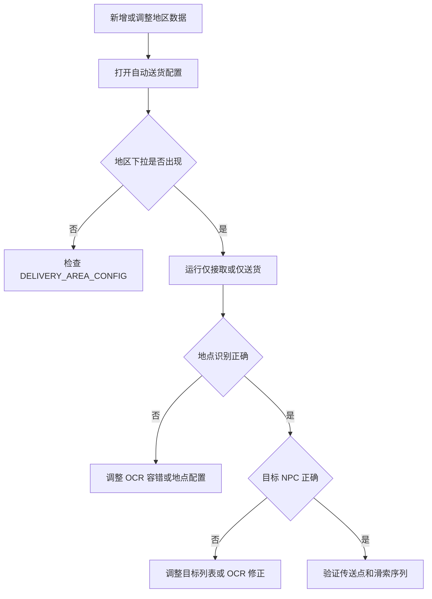

# 送货地区维护工作流

返回：[文档索引](../zh-CN/README.md) / [README](../../README.md)

本文说明自动送货模块在新增或调整地区时应该如何维护。通常只需要更新地区数据和对应模板资源，不必修改送货流程本身。

---

## 一、适用场景

以下情况建议按这份流程处理：

1. 新增一个送货地区。
2. 调整现有地区的委托地点、目标 NPC 或 OCR 容错规则。
3. 补充新的接单特征标签或模板标注。
4. 修正某个地区的传送点搜索区域。
5. 新增接单券数或补齐多语言地点/NPC 名称。

---

## 二、先改数据

送货地区的主配置集中在 [src/data/delivery_area.py](../../src/data/delivery_area.py)。

### 2.1 地区配置结构

每个地区通常需要补齐以下字段：

| 字段                             | 作用                        |
| ------------------------------ | ------------------------- |
| `task_model_area`              | 地区名。若与地区名一致，可以省略。         |
| `feature_label_area_code`      | 接单特征标签前缀，例如武陵使用 `wuling`。 |
| `delivery_locations`           | 当前地区可识别的区域名列表。            |
| `delivery_targets_by_location` | 每个地点对应的目标 NPC 列表。         |
| `transfer_search_area`         | 每个地点在地图里搜索传送点时使用的区域。      |
| `ocr_priority_locations`       | 预留的 OCR 地点优先顺序；当前只有 service 访问器，任务流程尚未调用。 |

读取和校验这些字段的入口位于 [src/data/delivery_area_service.py](../../src/data/delivery_area_service.py)，任务流程不应自行复制地区映射。

### 2.2 新增地区时的最小修改

如果只是新增一个地区，建议直接参考 [src/data/delivery_area.py](../../src/data/delivery_area.py) 里现有的“武陵”配置，补一份完整块：

1. 先填写地区名。
2. 再填写对应区域名列表和每个地点对应的目标 NPC。
3. 为每个地点补上传送点搜索区域。
4. 按需要补充新的接单特征标签。

### 2.3 接单特征标签

接单券数需要先加入 `DELIVERY_TARGET_TICKET_NUM_OPTIONS`。`format_delivery_ticket_price_code()` 会自动把正整数转换为万券价格码，无需维护第二张映射表。

系统会把目标券数转换成价格码，再拼成形如 `wuling_7_31w` 的标签。

券价格码的含义如下：

| 价格码     | 含义      |
| ------- | ------- |
| `7_31w` | 7.31 万券 |
| `7_98w` | 7.98 万券 |
| `11_9w` | 11.9 万券 |
| `15_9w` | 15.9 万券 |
| `16_3w` | 16.3 万券 |

当前下拉值为 `163000`、`159000`、`119000`、`79800`、`73100`。新增数值后，必须存在 `{feature_label_area_code}_{价格码}` 的基础标签；否则 `get_accept_feature_labels()` 会返回空列表，即使 `_2k/_4k` 变体已经存在也不会启用该券数。

如果新增地区需要接单特征模板：

1. 先在 `feature_label_area_code` 中定义地区前缀。
2. 再确认 [src/data/FeatureList.py](../../src/data/FeatureList.py) 里已经存在对应标签，例如 `wuling_7_31w`。
3. 如果没有，在模板 Tab 里框选裁图后保存；命名格式为 `{feature_label_area_code}_{券价格码}`。
4. 保存时建议勾选“保存枚举”，填入 `src/data/FeatureList`，这样会自动生成对应 `FeatureList` 枚举，后续代码可直接引用，避免手写标签字符串导致拼写错误。
5. 建议一并补齐 `_2k`、`_4k` 等变体。

当前代码会在任务配置里自动读取地区列表，所以只要 `DELIVERY_AREA_CONFIG` 里增加了新地区，UI 下拉框也会自动出现新选项。

### 2.4 地点、NPC 与本地化

`delivery_area.py` 使用简体中文规范名作为数据键。新增地区、地点或目标 NPC 后，还要在 [`assets/lang/world_map.json`](../../assets/lang/world_map.json) 中补齐对应条目和现有 locale：

1. 地区和地点用于地图文本、地点提取与传送区域回填。
2. NPC 名用于 `get_delivery_target_ocr_pattern()` 生成当前语言 OCR 匹配器。
3. 等长字符的稳定 OCR 混淆可加入 `assets/ocr_fix/ocr_text_fix.json`。运行时补丁会扩展传入 OCR 的字符串/正则匹配条件，使其容忍错字，但不会改写 OCR 输出文本；不要把错字写进规范主数据。

---

## 四、验证顺序



建议按下面顺序检查，能最快定位问题：

1. 打开任务配置页，确认地区下拉框里已经出现新地区。
2. 运行一次“仅接取”或“仅送货”流程，验证地点识别是否正确。
3. 检查目标 NPC 是否能被 OCR 正确识别。
4. 如果传送点选择错误，再回头调整 `transfer_search_area`；配置支持 `{"preset": "top"}` 或 `x/y/to_x/to_y` 相对坐标。
5. 如果接单按钮识别失败，确认基础价格标签存在，再补模板和分辨率变体。
6. 运行聚焦测试：

```powershell
python -m unittest tests.TestDeliveryAreaConfig tests.TestCheckLang tests.TestPoLocaleConsistency
```

新增券数时应在 `TestDeliveryAreaConfig.test_get_accept_feature_labels_returns_mapping_by_target_ticket` 中补期望值；新增自定义区域字段时补 service 层测试，不要只依赖手工运行。

---

## 五、维护原则

1. 地区数据优先放在 [src/data/delivery_area.py](../../src/data/delivery_area.py)，不要把地区逻辑散落到任务类里。
2. 等长字符混淆的匹配容错由 `assets/ocr_fix/ocr_text_fix.json` 统一维护；它扩展匹配条件而不改写识别结果。长度变化、词序变化或业务专属规则应维护在语言 pattern 或对应解析逻辑中。
3. 使用框架的模板 Tab 功能添加模板。
4. 新地区先补数据，再补模板，最后做一次最小闭环验证。

相关文档：[自动送货](../zh-CN/自动送货.md) / [滑索与送货逻辑](../dev/滑索与送货逻辑.md)
