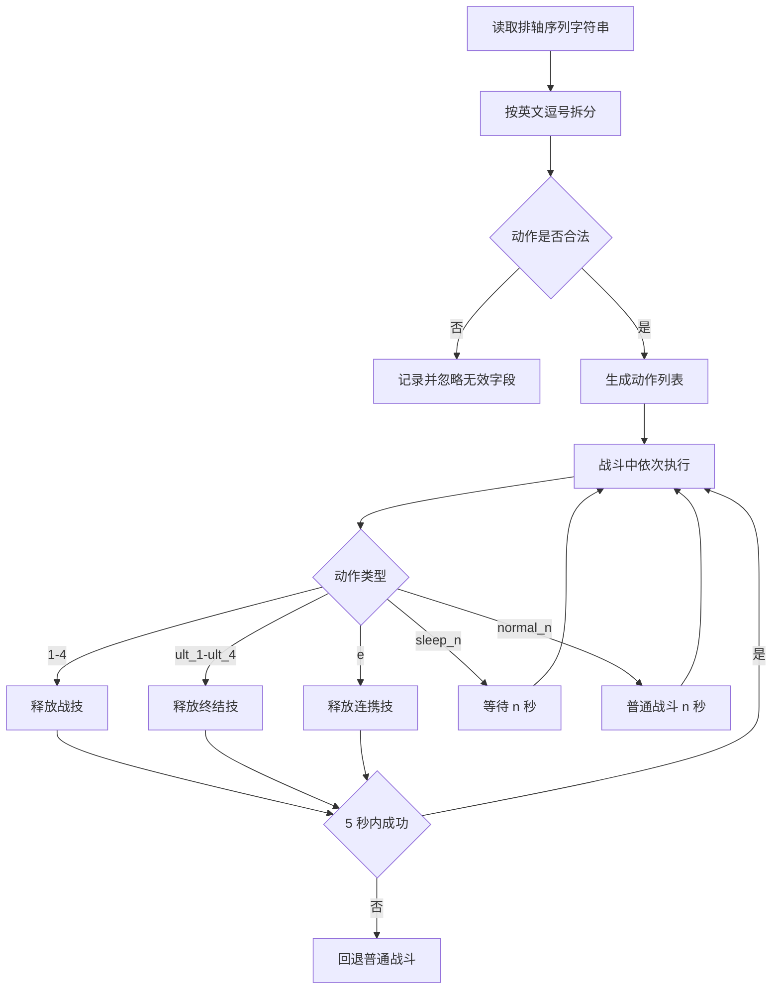

# 排轴序列

返回：[文档索引](index.md) / [README](https://github.com/AliceJump/ok-end-field/blob/master/README.md)

用于控制技能释放的优先级顺序。

---

## 格式说明

接受以下值；英文逗号 `,` 和中文逗号 `，` 均可作为分隔符，字段前后空白和空字段会被清理：

```text
1,2,3,4          # 干员战技
ult_1~ult_4      # 干员终结技
e                # 连携技能
sleep_[n]        # 等待 n 秒（如 sleep_1.5）
normal_[n]       # 临时进入普通战斗 n 秒
```

---

## 示例

```text
ult_2,1,e,ult_1,sleep_1.5,ult_3
```

表示：

* 优先尝试干员2的终结技
* 然后尝试干员1的战技
* 再尝试连携技能
* 尝试干员1的终结技
* 等待1.5秒
* 尝试干员3的终结技
* 回到第一步(尝试干员2的终结技)

---

## 行为逻辑

* 系统会按照顺序循环尝试技能，同时仍按「无数字操作间隔」周期锁敌并向前闪避
* 战技、终结技和连携技成功后推进到下一项并重置 5 秒计时
* `sleep_n` 会阻塞等待 n 秒，完成后推进并重置计时；解析器接受任意浮点数，但负数传给 `time.sleep` 会抛出异常并结束本次自动战斗，因此实际必须大于等于 0
* `normal_n` 临时执行普通战斗 n 秒，n 必须大于 0；完成后恢复排轴并重置计时
* 某个技能动作距上次成功达到 5 秒仍未成功时，本场战斗永久回退普通战斗，不再恢复排轴

---

## 使用场景

* 控制爆发顺序
* 优先释放关键技能
* 配合连携或特定战术
* 避免技能被错误消耗
* sleep可配合伊冯之类的长时爆发干员

## 解析与执行流程



---

## 注意事项

* 推荐使用英文逗号 `,`；中文逗号也可解析
* 顺序非常重要
* 不要填写负数 `sleep_n`；虽然能通过解析，但运行时无效并会中断本次自动战斗
* 非法字段会被忽略；若配置为空或过滤后没有有效字段，则回退默认序列 `1,2,3`

相关文档：[自动战斗](自动战斗.md) / [体力本](体力本.md)
