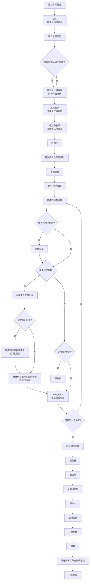
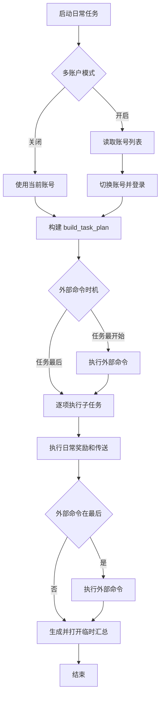

# 日常任务

返回：[文档索引](README.md) / [README](../../README.md)

## 概述

子任务开关用⭐标出，自上而下顺序执行。除「⭐帝江号一键存放」和「⭐执行外部命令」默认关闭外，其余当前任务计划子任务默认开启；『⭐地区建设』中的「买物资」选项默认不启用。『⭐执行外部命令』可通过「外部命令执行时机」下拉框选择在任务最开始或最后执行。

如果出现反复按ESC的情形，请调高『设置/主界面单次动作后延迟』（建议1.5以上）。

### 子任务和运行顺序

子任务和运行顺序定义在 [DailyTask.py](../../src/tasks/onetime/DailyTask.py) 的 `build_task_plan()`。简短概括如下：



> 普通情况

  1. 送礼：通过「帝江号/干员联络台/赠送礼物」提升干员好感度；该任务需要传送到特定地点
  2. 帝江号一键存放：打开背包并点击「一键存放」（默认关闭）
  3. 简易制作：前往「简易制作界面」制作物品
  4. 帝江号收菜：按『⭐帝江号收菜』选择收集线索、制造舱、培养舱
  5. 收邮件：前往「邮箱」领取邮件
  6. 转交委托与奖励领取：首次进入任意地区的「仓储结点」后先领取一次「我转交的委托」奖励，再转交全部运送委托
  7. 自动送货：自动接取当前选择地区的委托，按照配置路径将货物送至对应接收者
  8. 地区建设：按地区先执行「据点兑换」，再执行买卖货的买；如启用「买物资」，直接切换到稳定物资需求购买，完成后再切回弹性需求物资执行卖
  9. 造装备：前往「装备制造/套组装备制造」并制作一件列表首位的装备
  10. 收信用：前往好友的「帝江号」并在「访客终端」上进行助力获得信用
  11. 买信用商店：优先采购「武库配额」「嵌晶玉」和识别到的折扣商品，刷新结束后再尝试购买其他可购商品
  12. 刷体力：消耗「理智」刷取培养材料
  13. 活动奖励：按『⭐活动奖励』选择领取周常奖励、理智补给和刮刮乐
  14. 日常奖励：领取「行动手册/日常」和「通行证」中的奖励
  15. 演算：执行演武集算任务
  16. 传送到帝江号右侧传送点，等待下一次执行

> 「帝江号一键存放」「简易制作」「帝江号收菜」连续执行时，仅第一个任务确认是否位于帝江号，后续任务共享该状态。送礼仍单独传送到剑桥等特定地点。

> 外部命令默认在任务最后执行；可在配置中将「外部命令执行时机」改为「任务最开始」使其最先执行。

### 执行流程



> 多账号模式（必须先在游戏中登录过列表内账号，并保持任意账号已登录）

 1. 首先尝试切换第一个账号
 2. 切换账号后执行日常
 3. 完成日常后尝试切换第二个账号
 4. 循环直到没有账号可以切换

## 子任务介绍

### 送礼

> 检查单：「帝江号/剑桥」可传送，「干员联络台」可用，在『⭐地区建设』中启用「买物资」，并开启『是否买礼物』确保礼物充足。

通过「帝江号/干员联络台/赠送礼物」提升员好感度。如果途中偶遇干员，则直接交互完成送礼。

角色会传送到「帝江号/剑桥」，然后走向「干员联络台」，最后交互完成送礼。

选项：『⭐送礼』『送礼任务最多尝试次数』『一次送礼个数』『优先送礼对象』。当前默认分别为开启、`2`、`2` 和角色列表首项。

### 帝江号一键存放

> 检查单：「帝江号」区域可达，背包界面可正常打开。**确认开启前不会将治疗药等可用道具误存入仓库。**

是否在「帝江号」打开背包并点击「一键存放」。任务会传送至帝江号，按 B 打开背包，通过 OCR 识别「存放」按钮后点击。

> 注意：仅直接点击「一键存放」，请确认一件存放选项中不含可用道具项再开启此选项。

选项：『⭐帝江号一键存放』

### 收邮件

> 检查单：「邮箱」可用。

是否前往「邮箱」领取邮件。

选项：『⭐收邮件』

### 据点兑换

> 检查单：「地区建设/据点管理」可用，至少一个据点可交易。在『⭐地区建设』中启用「买物资」确保调度券不溢出。

在「地区建设/据点管理」中通过交易获得调度券。

程序会遍历所有地区所有据点，尽可能获得全部调度券。**程序支持的交易货品** 详见文件 [world_map.py](../../src/data/world_map.py) 中的列表 `goods_dict` 。

选项：『⭐据点兑换』『交易货品优先序列』『据点兑换仅购买优先商品』

开启『据点兑换仅购买优先商品』后，仅当「交易货品优先序列」不为空时，只兑换其中的商品；优先序列为空时按原逻辑兑换。

#### 交易货品优先序列

选项『交易货品优先序列』默认为空，此时程序会识别 *据点接受的货品*，对于其中 *程序支持的交易货品* 按照 **随机顺序** 交易。

如果想要程序按顺序进行交易，可以在选项『交易货品优先序列』中 **依次填入 正则表达式 并用英文逗号 `,` 隔开** ，如此以来：

- 对于 **优先货品** ，如果同时属于 *据点接受的货品* 和 *程序支持的交易货品* ，那么按照 **填写顺序** 交易。
- 对于其它货品，在优先货品后按照随机顺序交易。
- 错误的/据点不接受的/程序不支持的 货品名称会被忽略。

#### 例子

游戏版本1.1，四号谷地 `20晶体外壳 + 24柑实罐头 + 18精选荞愈胶囊 + 18高容谷地电池` 毕业满矿产线，武陵 `6优质芽针针剂 + 12中容武陵电池` 版本毕业产线。

选项『交易货品优先序列』可以填入 `晶体外壳,\b柑实罐头,精选荞愈,高容谷地,优质芽针,中容武陵`，这样可以在四号谷地节余电池（搬运发电减少武陵电池消耗）并且在武陵优先消耗药品（防止药品爆仓阻塞污水堵住电池产线）。

### 转交运送委托

> 检查单：「地区建设/仓储结点/委托运送列表」和「我转交的委托」可用。

是否在「地区建设/仓储结点」中领取一次「我转交的委托」奖励，并转交全部运送委托。程序会在首次进入任意地区的「仓储结点」时先领取奖励，然后遍历所有区域转交全部委托。

可能出现 委托未领取/货物摔坏 情形，不能确保获得最大收益。

选项：『⭐转交运送委托』。奖励领取默认启用。

### 简易制作

> 检查单：「简易制作界面有可制作的物品」可用。

是否前往「简易制作界面」制作物品。

选项：『⭐简易制作』

### 造装备

> 检查单：「装备制造/套组装备制造」可用。装备原件日产不小于50。

是否前往「装备制造/套组装备制造」并制作一件 **列表首位** 的装备。请确保有足够的 **装备原件** 和调度券。

选项：『⭐造装备』

### 收信用

> 检查单：「帝江号」区域可达。拥有至少25个好友。「采购中心/信用交易所」可用。

是否前往好友的「帝江号」并在「访客终端」上进行助力获得信用。助力结束后，前往「采购中心/信用交易所」收取全部助力。

若选项『尝试仅收培育室』开启，则优先尝试仅助力好友「帝江号」上的「培养仓」。如果不能，至少助力一次其它舱室。

选项：『⭐收信用』『尝试仅收培育室』

### 帝江号收菜

> 检查单：「帝江号」区域可达。

是否执行一下任务的总开关 **收集线索**,**制造舱**

选项：『⭐帝江号收菜』

#### 收集线索

> 检查单：「帝江号/会客室」区域可达。

是否前往「帝江号/会客室」收集全部线索。若集齐线索，则开启情报交流。

如果想要提高情报交流频率（获得更多的信用来兑换抽卡资源），建议多加好友。

选项：『⭐帝江号收菜』中的「收集线索」

#### 制造仓

> 检查单：所有的「帝江号/培养仓」区域可达。每个区域设好待制造物品。每个区域至少安排一名角色。

是否前往「帝江号/制造仓」收取培养材料。收取后会补足待制造数量。

如果想要提高制造效率，请安排天赋合适的角色。

选项：『⭐帝江号收菜』中的「制造舱」

#### 培养舱

是否前往「帝江号/培养舱」收取培养材料并直接再次培养。

选项：『⭐帝江号收菜』中的「培养舱」

### 买信用商店

> 检查单：「采购中心/信用交易所」可用。

是否在「采购中心/信用交易所」采购。每轮优先购买「武库配额」「嵌晶玉」及识别到的折扣商品，并最多按 `80/120/160/201` 信用成本刷新；只有预计刷新后信用严格大于固定值 `210` 才会刷新。不能继续刷新时，还会尝试购买页面中其他可购商品。

『信用商店保留信用』是购买成功后的停止阈值：程序不会在购买前预留这部分信用，而是在扣除商品价格后，剩余信用小于等于该值时停止后续采购。该配置不控制刷新；刷新始终使用上述固定 `210` 判定。

选项：『⭐买信用商店』『信用商店保留信用』

### 买卖货

> 检查单：「帝江号」区域可达。拥有至少25个好友。「地区建设/物资调度/弹性需求物资」可用。在『⭐地区建设』中启用「据点兑换」确保调度券充足、「买物资」确保调度券不溢出。

是否在「弹性需求物资」与好友交易赚取调度券。自动获取货物信息，然后用价格上下限判定是否交易。（除非可购买数量即将溢出，这种情况下必定交易。）

只买不卖模式下，只进行购买操作，不进行卖出操作。并不会获取所有信息以加速任务流程。

当前 **程序支持的交易物资** 详见文件 [world_map.py](../../src/data/world_map.py) 中的列表 `exchange_goods_dict` 。

选项：『⭐地区建设』的「买卖货」『只买不卖』『武陵买入价』『武陵卖出价』『武陵』『四号谷地买入价』『四号谷地卖出价』『四号谷地』

### 买物资

> 检查单：「地区建设/物资调度/稳定物资需求」可用。在『⭐地区建设』中启用「据点兑换」确保调度券充足。

是否在「地区建设/物资调度/稳定物资需求」中通过调度券购买物资。依次购买「日用消耗」「工业货品」「人文物产」首行某个物品。

选项『购物白名单』默认留空，表示购买「日用消耗」「工业货品」首行首个物资；若『是否买礼物』为 `true`，也会购买「人文物产」首行首个物资。

该选项可以填入用 **英文逗号(,)** 隔开的若干 **正则表达式** ，如果任一可以匹配首行的某个物资，那么购买，如果都不匹配，那么跳过。推荐设为 `刻写,助剂,理智,寻访,高级,高阶,折金票` 。

**建议手动购完 不刷新的一次性物资**，以避免奇怪的问题（虽然能兼容）。

选项：『⭐地区建设』的「买物资」『购物白名单』『是否买礼物』

### 刷体力

详见 [体力本.md](./体力本.md) 。

### 活动奖励

> 检查单：「活动中心/每周事物」可用。

是否按『⭐活动奖励』多选项领取「活动中心」中的奖励。当前三个选项默认全部选中。

选项：『⭐活动奖励』，可选「周常奖励」「理智补给」「刮刮乐」

### 日常奖励

> 检查单：「行动手册/日常」和「通行证」可用。

是否领取「行动手册/日常」和「通行证」中的奖励。

选项：『⭐日常奖励』

### 传送到帝江号右侧传送点

> 检查单：帝江号区域可达。

传送到「帝江号」右侧传送点。

选项：『⭐传送到帝江号右侧传送点』

### 执行外部命令

> 检查单：外部程序可通过命令行直接启动。

在日常任务最开始或最后执行一次外部命令，通过「外部命令执行时机」下拉框选择。可通过选项控制是否等待命令退出，也可在检测到目标命令已运行时跳过本次启动。可结合其他能够通过命令行执行特定任务的脚本使用，以更好地实现游戏日常处理。

选项：『⭐执行外部命令』『外部命令』『外部命令起始于』『外部命令等待退出』『外部命令已运行时跳过』『外部命令执行时机』

命令示例（参考命令行启动任务的写法，尽量保持简短）：

```bash
# MXU（Windows）：开机自启动模式，指定实例（任务标签页）名
mxu.exe --autostart --instance 日常任务

# MXU（Linux / macOS）：指定实例，执行完成后自动退出
./mxu --autostart -i 日常任务 --quit-after-run

# 通用：执行本地脚本
python scripts/daily_extra.py
```

填写说明：

- 建议使用绝对路径或稳定的相对路径。
- 『外部命令起始于』可选；填写后作为命令工作目录，不填则使用默认目录。
- 路径或参数含空格时，请按当前系统 shell 规则加引号。
- `mxu.exe` 仅适用于 Windows，Linux / macOS 通常是 `./mxu`。
- `-i` / `--instance` 用于指定实例（任务标签页）名。
- `-q` / `--quit-after-run` 表示自动执行完成后退出。
- 开启『外部命令等待退出』后，会等待该命令结束并根据退出码判定成功与失败。
- 开启『外部命令已运行时跳过』后，检测到目标命令已在运行会直接跳过本次启动。
- 参数尽量简短，避免超长单行命令。

### 其他选项

 1. 发生异常时终止游戏
 2. 仅退出游戏
 3. 完成后退出

相关文档：[刷体力](体力本.md) / [账号配置用户指南](账号配置用户指南.md) / [API 参考](../dev/API.md)
