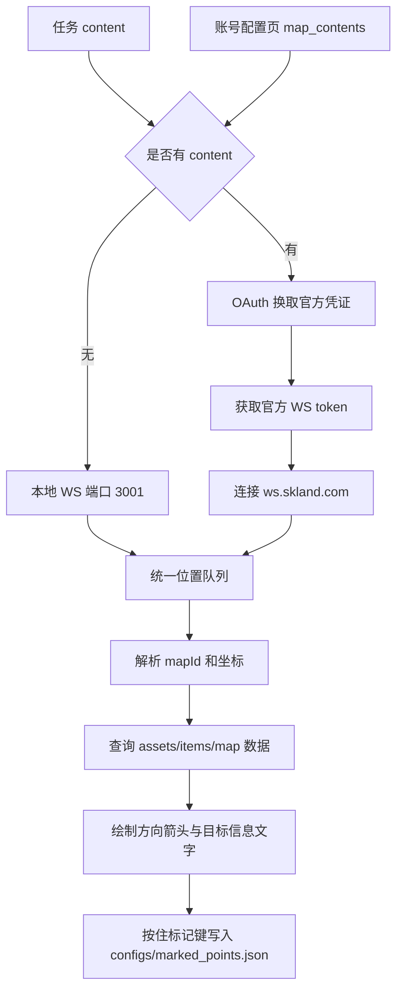

# 物品导航与实时检测

返回：[文档索引](index.md) / [README](https://github.com/AliceJump/ok-end-field/blob/master/README.md)

## 概述

本文覆盖两个触发式/调试类任务：

- `ItemNavigatorTask`（界面名称：物品导航）：有有效 `content` 时使用官方地图 WebSocket；未取得任何 `content` 时启动本地 WebSocket 服务，指向所选物品的最近采集点，并支持按键标记已获取。
- `RealtimeDetectTask`（界面名称：实时检测）：循环运行 YOLO 检测，用于在线观察模型、目标类别和置信度表现。

---

## 物品导航

### 使用前提

- 推荐在账号配置页保存官方地图同步 `content`，或在任务配置中直接填写 `content`。
- 未配置 `content` 时，需要启用外部脚本或工具向本地 `ws://127.0.0.1:3001` 推送位置数据。
- 物品点位数据来自 `assets/items/map/summary.json` 和 `assets/items/map/item_names.json`。
- 标记结果写入 `configs/marked_points.json`，用于避免重复指向已经标记的点位。

### 配置项

| 配置项 | 默认值 | 说明 |
|---|---:|---|
| `content` | 空字符串 | 可选。直接填写 `web-api.skland.com/account/info/hg/check` 返回 JSON 中的 `data.content`。有值时优先使用官方地图 WebSocket。获取步骤见下方「获取 content」。 |
| `地图账号` | 空字符串 | 可选。`content` 为空时，从账号配置页读取该账号保存的地图同步 content。 |
| `选择物品` | `[]` | 参与导航的物品名称列表；为空时不会筛选出目标。 |
| `标记按键` | `f` | 接近目标后用于标记“已获取”的按键。 |
| `标记按住时长` | `2.0` | 连续按住标记键的秒数。进入水平距离 20 以内才开始计时，达到该时长即标记为已获取。填 `0`、负数或非数字会回退为默认 2 秒。 |
| `浮层信息` | 开 | 在浮层上显示当前指向目标的物品名、距离、方位与高度。关闭后浮层只保留箭头。 |
| `浮层文字透明度` | `92` | 浮层文字的透明度，取值 0-100（0 完全透明，100 完全不透明）。**仅在 `浮层信息` 开启时显示。** |
| `浮层背景透明度` | `59` | 浮层文字黑色底板的透明度，取值 0-100（0 表示不绘制底板）。**仅在 `浮层信息` 开启时显示。** |
| `浮层字号` | `26` | 浮层文字字号，按 1080p 窗口高度为基准的像素值，会随窗口高度等比缩放。**仅在 `浮层信息` 开启时显示。** |

> 透明度与字号每轮读取，改动后在 UI 中即时生效，无需重启任务。`浮层文字透明度` / `浮层背景透明度` / `浮层字号` 三项在 `浮层信息` 关闭时会被隐藏。

### 获取 content

`content` 是官方地图同步的账号凭证，需要自己从浏览器里取一次。步骤：

1. 打开浏览器，按 `F12` 打开开发者工具。
2. 访问 <https://game.skland.com/map/endfield> 并登录。
3. 切到 **「网络 / Network」** 标签，在筛选框里输入
   `https://web-api.skland.com/account/info/hg/check`。
4. 在筛选后的请求列表里选中该请求，从 **「响应 / Response」** 中取 `data.content` 的值
   （是一长串字符串）。
5. 把该值填入任务的 `content` 参数；**或**填入账号配置页的 `地图同步 content`，
   再回到任务用「地图账号」选择该账号。

> 两种填法二选一即可：直接填任务 `content` 适合临时用一次；存到账号配置页适合多账号长期使用。
> `content` 等同于登录态，不要贴到 issue、聊天群或截图里。

### 数据流

### 注意事项

- 物品导航依赖当前地图 ID 与坐标数据，点位数据缺失时不会产生有效指向。
- 任务会在窗口上绘制方向箭头；若看不到箭头，先确认 WebSocket 位置数据是否正常。
- 浮层在方向箭头下方直接显示当前指向的物品名、水平距离、八方位（北、东北、东、东南、南、西南、西、西北）与上下高度；方位与箭头朝向共用同一坐标系，两者始终一致。附近目标的小箭头以**长度表示高差**（同高最短、高差越大越长），箭头朝上表示目标在玩家上方。文字块停止刷新 2 秒后自动消失。
- 文字块的纵向位置会跟随「附近目标」黄色标记云团的原始像素半径下移，因此在 1024×576 到 2560×1440 等各分辨率下都与云团保持约 16px 间隙，不会被标记压住。
- 关闭 `浮层信息` 后浮层只保留箭头，并且会立即清掉已显示的文字。headless（无 Qt）模式下浮层没有逐像素透明度：`浮层背景透明度` 为 `0` 时不绘制底板，大于 `0` 时按该值把底板色向中性色混合，近似半透明观感。
- “本地 WS 回退”只发生在任务没有取得 `content` 时。若已配置 `content` 但官方鉴权或连接失败，当前运行不会自动改用本地 WS；应清空任务 `content` 并取消/清空地图账号后再使用本地模式。
- 标记需要在目标水平距离 20 内连续按住标记键达到「标记按住时长」（默认 2 秒）；中途松键或离开范围会取消本次计时。该配置每轮读取，改动后无需重启任务。
- 油猴脚本帮助按钮会打开临时帮助文档和脚本目录。

---

## 实时检测

### 使用场景

实时检测用于调试 YOLO 模型，不是面向日常自动化流程的任务。它会持续截图并执行目标检测，便于观察某个模型和目标类别的命中情况。

### 配置项

| 配置项 | 默认值 | 说明 |
|---|---:|---|
| `YOLO模型` | [src/config.py](../../src/config.py) 中 `yolo.default_model` | 模型配置键，实际模型和标签维护在 [src/yolo/models.py](../../src/yolo/models.py)。 |
| `检测目标` | 当前模型 labels 的第一个目标 | 要观察的目标类别。 |
| `检测置信度` | `0.7` | 取值范围 `0` 到 `1`，值越高越严格。 |
| `扫描间隔(秒)` | `0.2` | 每次检测后的等待时间。 |

### 注意事项

- 目标名称必须存在于所选模型的 labels 中，否则任务会直接报错。
- 该任务会循环运行，停止时会输出总扫描次数、命中轮次和最高置信度。

相关文档：[地图官方 WS 客户端实现](../dev/地图官方WS客户端实现.md) / [账号配置用户指南](账号配置用户指南.md)
