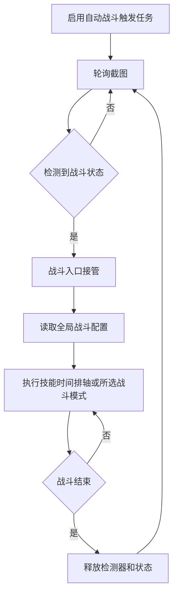

# 自动战斗

返回：[文档索引](index.md) / [README](https://github.com/AliceJump/ok-end-field/blob/master/README.md)

## 概述

自动检测战斗状态，在进入战斗后自动执行技能释放逻辑，战斗结束后停止本轮并继续等待下一场。它是注册的触发式任务，需在任务界面启用；只在检测到至少 1 格技力且队伍 UI 存在时接管战斗。

战斗逻辑与「刷体力」中的战斗逻辑相同，详见 [体力本.md](./体力本.md)。

## 触发流程

---

## 使用要求

> 确保分辨率大于等于**1920x1080（1080P）**，低于 1080P 不保证正常运行

## 战斗配置（全局共享）

> 所有战斗相关的配置项现在集中在 **「全局配置 → 战斗配置」** 中统一管理，
> 一次配置即可应用到「自动战斗」「刷体力」「日常任务」等所有涉及战斗的任务，无需多处重复设置。

### 终结技释放方式

可以选择终结技释放方式：

- 长按技能按键（默认）
- Alt + 技能按键

---

### 技能时间排轴与战斗模式

「技能时间排轴」默认关闭。开启后使用独立的时间排轴调度，详见 [技能时间排轴说明](../dev/skill-timing-mode.md)。关闭时显示「战斗模式」下拉框，同一时刻只选择一种策略：

| 战斗模式 | 行为 | 展开的子配置 |
| --- | --- | --- |
| 普通模式 | 按指定角色顺序循环释放战技 | 技能释放、启动技能点数、自动释放推荐技能 |
| 自动技能列表 | 识别队伍，并按角色增强链过滤技能列表 | 无 |
| 伤害优先排轴 | 识别队伍，按伤害生成可重复循环的自动排轴；默认选项 | 无 |
| 固定排轴 | 按手写序列执行；连续 5 秒动作失败时本场回退普通模式 | 排轴序列 |
| 实时条件 | 按实时条件选择动作；序列为空或全部非法时回退普通模式 | 实时条件序列、立即释放终结技、立即释放连携技 |

「启用排轴」「启用实时条件」「自动技能列表」「伤害优先排序」旧布尔开关只保留用于配置兼容，不再作为独立开关显示。普通模式的相关设置如下。

### 技能释放

「战技」释放角色顺序是可排序列表，默认 `1,2,3`，可从 1 至 4 中选择且不允许重复。普通模式在连携技和终结技均未释放时按该列表循环出技。

---

### 启动技能点数

当「技力条」达到该数值时，开始执行技能序列。取值范围 1–3。

---

### 完成通知

战斗结束后是否发送系统通知。

---

### 无数字操作间隔

战斗中周期触发锁敌 + 向前闪避的最小间隔秒数，默认 6；运行时限制为 1 至 30 秒。

---

### 进入战斗后的初始等待时间

进入战斗后等待该时间（秒）后才开始释放技能。该配置属于战斗入口控制，不属于技能策略；即使启用「技能时间排轴」，也仍然生效。

### 仅协议空间启用初始等待

默认关闭。关闭时保持原行为：所有战斗都使用「进入战斗后的初始等待时间」。

开启后，仅协议空间保留这段等待；普通战斗检测到战斗 UI 后直接开始自动操作。协议空间优先复用战斗逻辑现有的终结技就绪检测：当前可见队员的终结技全部就绪时视为热启动；左上角「撤离」按钮仍作为兜底特征。

这个选项用于协议空间“战斗 UI 已出现，但敌人尚未正式进场”的开局阶段，避免因为战斗状态提前成立而过早释放技能。

---

### 固定排轴

将「战斗模式」选为「固定排轴」后，按照「排轴序列」中定义的顺序使用技能。某个动作连续 5 秒未成功时，本场战斗永久回退普通逻辑。

详见 [排轴.md](./排轴.md)。

---

### 排轴序列

技能释放的自定义顺序字符串，仅在「战斗模式」选择「固定排轴」时显示并生效。

格式和用法详见 [排轴.md](./排轴.md)。

---

### 实时条件

将「战斗模式」选为「实时条件」后，可在面板编辑触发条件和序列。

当实时条件序列为空或全部非法时，自动回退普通模式。

---

### 立即释放终结技 / 立即释放连携技

本帧无条件动作产出时，按开关尝试立即释放终结技或连携技。优先级：终结技 > 连携技。

仅在「战斗模式」选择「实时条件」时显示并生效。

相关文档：[体力本](体力本.md) / [排轴](排轴.md) / [API 参考](../dev/API.md)
