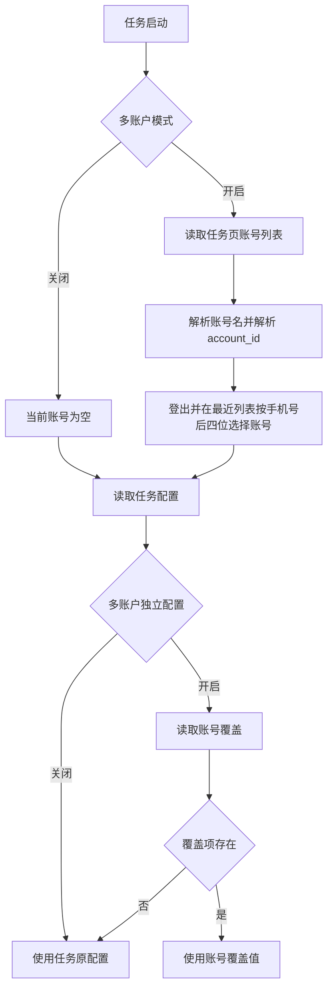

# 账号配置用户指南

返回：[文档索引](README.md) / [README](../../README.md)

这是一份面向日常使用的简版文档，只讲怎么配、怎么用。

## 1. 先理解两套配置

1. 账号配置页：管理账号身份（账号名/手机号）、地图同步 `content` 和账号任务覆盖参数，不填密码。保存时会删除旧格式中的密码文本。
2. 任务配置页：管理任务本身开关与运行账号列表。当前 `AccountMixin` 会兼容 `账号,密码` 旧格式，但只读取账号名，密码字段会被忽略且不会用于登录。

## 2. 快速上手

1. 打开账号配置页，在“账号列表”每行填一个账号名（手机号）。
2. 点击“保存账号列表”。
3. 选择账号和任务，按需修改该账号在该任务下的覆盖参数并保存。
4. 如需物品导航官方地图同步，在“地图同步 content”的单行输入框中填写该账号的 `data.content` 并保存。
5. 回到对应任务页，填写运行账号列表（每行一个账号名；旧格式 `账号,密码` 可被兼容），并按需开启：
   - 多账户模式
   - 多账户独立配置

## 3. 关键规则

1. 账号名（手机号）是用户侧身份键；保存账号列表时，程序会为新账号名生成内部 `account_id`。
2. 密码不保存、不参与身份判定，也不参与登录。
3. 原账号名再次保存会复用内部 `account_id`；改成新账号名会被视为新账号并生成新 ID。旧账号已有覆盖或地图 `content` 时，旧记录仍会保留。

## 4. 常见场景

1. 只想给某个账号单独调参数：
   - 在账号配置页选中该账号和任务，修改后保存。
2. 想多账号轮换跑任务：
   - 确保各账号曾出现在游戏登录页的「最近」列表，在任务页每行填写一个完整手机号并开启多账户模式。
3. 想多账号独立配置：
   - 在任务页开启多账户独立配置。
4. 想给物品导航使用某个账号的官方地图同步：
   - 在账号配置页保存该账号的地图同步 `content`，再在物品导航任务中选择“地图账号”。
5. 账号配置页看不到某个任务：
   - 该任务当前不支持多账号独立配置展示。

## 6. 覆盖读取流程

## 7. 常见问题

1. 为什么账号配置页不填密码？
   - 因为切换账号依赖游戏登录页的「最近」账号列表，不输入密码。旧格式中的密码字段完全忽略。
2. 我改了账号配置页账号列表，主任务没跟着变？
   - 正常。账号页账号列表与任务页账号列表是独立的。
3. 任务页账号列表格式写错会怎样？
   - 每行只写账号名是正常格式，不需要逗号。空行、账号名为空的行会被忽略；逗号后的旧密码字段也会被忽略。
4. 为什么建议填写完整手机号？
   - 程序按填写值的后四位点击「最近」账号。若多个最近账号后四位相同，可能选错账号；请确保后四位唯一。

## 8. 相关文档

实现逻辑：[账号唯一ID与多账户覆盖默认逻辑](../dev/账号唯一ID与多账户覆盖默认逻辑.md)

相关功能：[物品导航与实时检测](物品导航与实时检测.md)
