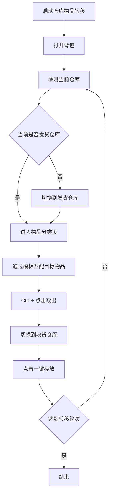

# 仓库物品转移

返回：[文档索引](README.md) / [README](../README.md)

## 概述

从「发货仓库」取出指定物品，切换到「收货仓库」后一键存放，循环执行指定轮次。适用于跨区仓库之间的物资搬运（目前仅支持中文版游戏）。

---

## 前置条件

建议在游戏主界面启动任务，并确保两个仓库均已连接。

任务会自动尝试打开背包并执行后续流程。

---

## 选项和配置

### 发货仓库

从哪个仓库取货。

可选值：

| 选项 | 说明 |
|------|------|
| `valley4` | 四号谷地仓库 |
| `wuling` | 武陵仓库 |

默认：`valley4`

---

### 收货仓库

将货物转运到哪个仓库。

可选值同发货仓库，**不能与发货仓库相同**。

默认：`wuling`

---

### 物品

选择要转移的物品名称。

当前支持的物品列表见源码 [world_map.py](../src/data/world_map.py) 中的 `item_to_warehouse_dict`。

---

### 转移轮次

执行倒货的总轮次数，每轮完成一次「取货 → 切换仓库 → 存放」流程。

默认：`10`

---

## 工作流程

---

## 注意事项

- 发货仓库与收货仓库不能选择同一个仓库。
- 若所选物品图标无法识别（未在支持列表中），任务将报错终止。
- 建议确保两个仓库均处于「已连接」状态后再启动任务。

相关文档：[主数据维护工作流](update/主数据维护工作流.md) / [开发指南](dev/DEVELOPMENT.md)
