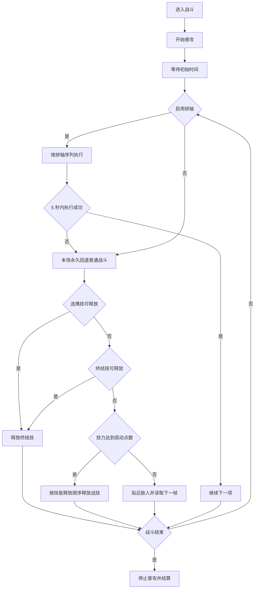

# 体力本

返回：[文档索引](README.md) / [README](../README.md)

## 配置要求

> 确保分辨率大于等于**1600x900**，否则可能无法正常使用

## 战斗逻辑

有普通战斗和排轴战斗两种战斗逻辑。所有战斗配置（技能释放顺序、启动技能点数、排轴序列等）现在集中在 **「全局配置 → 战斗配置」** 中统一管理，一次配置即可同时应用于「刷体力」「自动战斗」「日常任务」等任务，无需多处重复设置。

每次战斗开始时先锁敌并按住鼠标左键持续普攻，再等待 **进入战斗后的初始等待时间**（默认 3 秒），然后开始释放技能。战斗退出或异常时会释放鼠标左键。

### 普通战斗

逻辑如下：

普通模式每帧先尝试连携技，再尝试任意可用终结技；若都未释放且技力达到 **启动技能点数**（默认 2），按 **技能释放**（默认 `1,2,3`）循环释放战技。战斗期间还会按 **无数字操作间隔**（默认 6 秒，运行时限制为 1 至 30 秒）周期锁敌并向前闪避。

### 排轴战斗

启用排轴后按排轴序列执行。如果距上一个成功动作达到 5 秒仍未成功，当前这场战斗会永久回退普通模式，不会在后续动作成功后重新启用排轴。`sleep_n` 与 `normal_n` 完成时都算成功动作并重置该计时。

排轴说明：[排轴](排轴.md)

## 消耗限时体力药

若启用选项『消耗限时体力药』，程序会在每次刷体力前检测背包中限时应急理智加强剂的剩余时效和数量：

- **若当前选择到“小时”单位的体力药，会直接使用该类型的全部库存；此分支不按 1000 理智上限计算可用数量。**
- **若为“天”单位，则按以下公式消耗：**

> 使用数量 = min(max(1, ceil(2 × 数量 ÷ 剩余天数)), 数量, 距 1000 理智上限可使用的数量)

即“天”单位药每天消耗约 2/n 比例的库存（向上取整），并受 1000 理智上限约束；“小时”单位药没有这项数量上限。程序按“小时优先、剩余时效升序”排序，但每次运行只处理排序后的第一种药，不会遍历消耗所有类型。

---

## 一般副本

副本需要提前开图， **领完所有等级的首通奖励。**

角色需要一定练度以避免暴毙，至少培养到 **角色和武器等级81级** 。

如果打开针对「重度能量淤积点」的选项『仅站桩』，请选择 **生命值最高** 的角色前台站场以避免暴毙。该角色需要 **升满90级** 并携带 **回复生命值的药物** 。

推荐携带 **有聚怪能力的角色** 以减少战斗时间。

### 低高阶奖励自选

支持在以下副本中自动切换奖励档位：

- 干员经验
- 干员进阶
- 技能提升
- 武器进阶

在『任务 / 日常任务 / 刷体力』与『任务 / 刷体力』中都可配置『体力本奖励档位』，可选：

- 保持当前：不切换奖励档位。
- 低阶：点击“前往”后，自动进入“自选”，选择上方（top）按钮对应档位。
- 高阶：点击“前往”后，自动进入“自选”，选择下方（bottom）按钮对应档位。

优先级说明：

- 未启用“刷本序列”时，使用『体力本奖励档位』配置。
- 启用“刷本序列”时，忽略『体力本奖励档位』配置，由序列项后缀控制（见下文）。

切换流程说明：

- 点击“前往”后识别右下角“自选”并点击。
- 识别“当前”所在位置：top 表示当前为低阶，bottom 表示当前为高阶。
- 若与目标档位不一致，点击目标档位的“选择/当前”按钮。
- 随后执行返回，直到右下角识别到“进入”，再回到主流程继续刷本。

## 危境再现

「危境再现」是 Boss 类副本，每次消耗 **120 理智**。

支持的副本：罗丹、三位一体、白垩界卫、阮一、聂菲斯。

---

## 危境预演（高阶关卡）

「危境预演」是高阶材料副本，每次消耗 **80 理智**。程序使用图像特征（而非 OCR）来定位关卡，以应对特殊界面布局。

支持的副本：D96钢、超距辉映管、快子遴捡晶格、象限拟合液、三相纳米片。

---

## 重度能量淤积点

检查单：

1. 该「重度能量淤积点」的「预刻写属性」已设置。不知道怎么选？试试这个[基质计算器](https://ef.yituliu.cn/tools/essence-calculator/) 。
2. 该「重度能量淤积点」最近的「协议传送点」可以传送。若传送后可以 **直线前往（无障碍物）** （比如「枢纽区」和「清波寨」），则可以 **跳过后续检查项** 。
3. 传送后可 **直接登上第1个「长距滑索架」** 。确保依次经过第1,2,3...n个「长距滑索架」后，角色下来可以 **直线前往（无障碍物）** 该「重度能量淤积点」。
4. 确保这些第2-n个「长距滑索架」可以按e连续移动。（设置方法：在游戏中，用滑索依次移动，按R「指定连续移动连接点」。）
5. 记录第1-2个「长距滑索架」之间的距离，填入『任务 / 刷体力』对应副本名称（比如『源石研究园』）的设置中。

注意事项：

- 程序通过图像特征来判断传送点。为了确保识别成功，角色 **不能位于该「协议传送点」附近** ，否则角色位置图标会破坏传送点特征。
- 程序通过OCR识别第1-2个滑索之间的距离来判断谁是第2个滑索。为了确保识别成功，这个距离应该是 **唯一** 的。也就是说， **不可与第1个滑索可见（无论是否可达）的其它滑索的距离相同。**
- 为了确保识别成功，登上第1个滑索观察第2个滑索，距离标识最好处于 **深色纯色简单背景** 中。
- 如果消灭敌人后角色远离「重度能量淤积点」，那么程序会 **在识别失败（超时）后进行传送滑索移动（二次寻路）** 领取奖励，执行时间可能变长。

特别提醒：

- 「重度能量淤积点」位于大世界中，环境比较复杂， **执行失败的可能性比较大。**
- 可以在文件夹 `./screenshots` 下查找文件 `DailyBattleMixin_battleGather_Exception` 获取执行失败时的截图。（请注意，截图文件夹每次运行前都会清空，如有需要请自行备份。）
- （推荐）将截图上传到 issue [#58](https://github.com/AliceJump/ok-end-field/issues/58) 以帮助开发者解决问题。要是能提供部分日志（位于文件夹 `./logs`）那就再好不过了。

相关代码：

- 最近的传送点 `to_near_transfer_point`
- 滑索移动 `zip_line_list_go`
- 行走 `navigate_until_target`

## 体力刷完后继续刷取次数

当选项『体力刷完后继续刷取次数』大于 0 时：

- 在理智不足后，程序会继续进入战斗并在结算时点击「放弃」（不领取奖励、不消耗理智）。
- 仅支持「重度能量淤积点」（挑战模式）。
- 若当前副本不是「重度能量淤积点」，则该配置会被忽略并在日志中提示。

该功能适合在需要额外完成击败/战斗类行为但不需要领取奖励时使用。

## 指定的队伍编号

默认「不换队伍」，也可选择 `1` 至 `5`。一般副本在首次进入后、再次进入前切换；重度能量淤积点在激发前打开队伍界面切换。未识别到目标队伍编号时会记录日志并继续，不会强制中止。

## 刷体力自动轮换功能

支持通过“刷体力开始日期”与“刷本序列”实现副本自动轮换：

- “刷体力开始日期”：默认是首次构建任务配置时的当天日期，格式为“2026-04-05”；可改为当天或历史某天。
- “刷本序列”：填写多个副本名（用逗号分隔），如“干员经验,干员进阶,钱币收集”。
- 支持后缀“低阶/高阶”，例如“干员经验低阶,技能提升高阶,钱币收集”。
- 后缀仅对“干员经验/干员进阶/技能提升/武器进阶”生效。
- 未写后缀（如“干员经验”）时，保持当前奖励档位不切换。
- 副本名必须为下列之一：

    干员经验, 干员进阶, 钱币收集, 技能提升,
    武器经验, 武器进阶,
    罗丹, 三位一体, 白垩界卫, 阮一, 聂菲斯,
    D96钢, 超距辉映管, 快子遴捡晶格, 象限拟合液, 三相纳米片,
    枢纽区, 源石研究园, 试验园区, 矿脉源区, 供能高地, 武陵城, 清波寨, 首墩, 藏剑谷

- 当前代码虽已将“藏剑谷”注册为可选副本，但尚未配置其最近传送点搜索区域；选择该副本后，重度能量淤积点的自动导航会在传送步骤失败，暂不能完整执行。

- 程序会根据“刷体力开始日期”与“刷本序列”自动计算今天刷哪个副本。
- 若“刷本序列”留空，则不启用自动轮换，使用“体力本”配置。
- 若填写了无效副本名（即有任何一个不在支持列表中），则全部放弃自动轮换，直接使用“体力本”配置。
- 若“刷体力开始日期”在未来，则自动回退为“体力本”配置。
- 日志会输出自动选择过程。

相关文档：[自动战斗](自动战斗.md) / [排轴](排轴.md) / [日常任务](日常任务.md)

示例：

- 刷体力开始日期：2026-04-05
- 刷本序列：干员经验,武器经验,钱币收集

则第1天刷“干员经验”，第2天刷“武器经验”，第3天刷“钱币收集”，第4天循环回“干员经验”……
