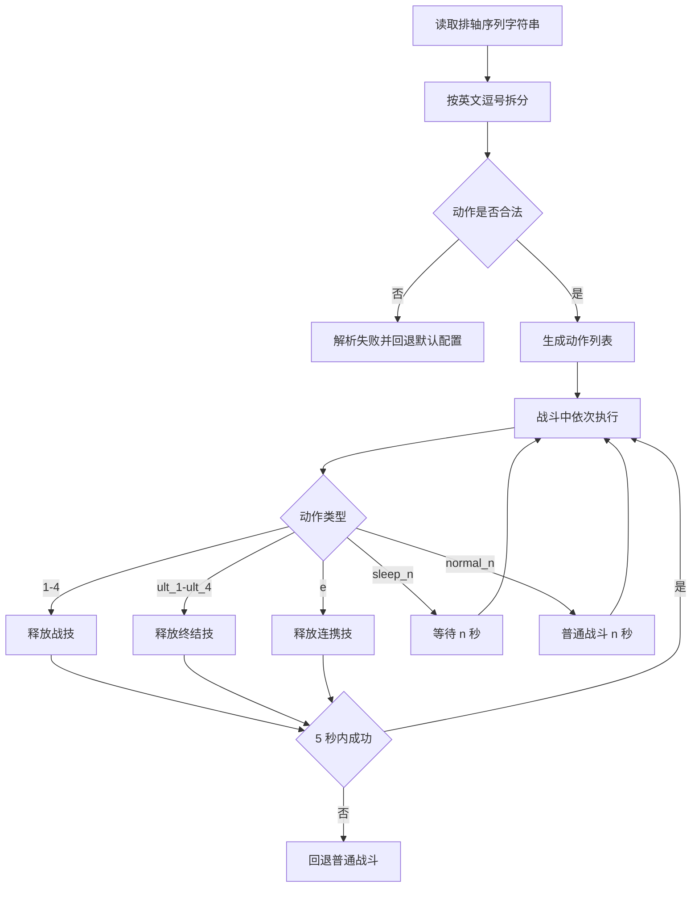

# 排轴序列

返回：[文档索引](README.md) / [README](../README.md)

用于控制技能释放的优先级顺序。

---

## 格式说明

仅接受以下值，并使用英文逗号 `,` 分隔：

```text
1,2,3,4          # 干员战技
ult_1~ult_4      # 干员终结技
e                # 连携技能
sleep_[n]        # 等待 n 秒（如 sleep_1.5）
normal_[n]       # 临时进入普通战斗 n 秒
```

---

## 示例

```text
ult_2,1,e,ult_1,sleep_1.5,ult_3
```

表示：

* 优先尝试干员2的终结技
* 然后尝试干员1的战技
* 再尝试连携技能
* 尝试干员1的终结技
* 等待1.5秒
* 尝试干员3的终结技
* 回到第一步(尝试干员2的终结技)

---

## 行为逻辑

* 系统会按照顺序依次尝试技能
* 期间不会尝试贴近敌人(向敌人闪避)
* 一旦5s内未释放某个技能(等待除外)：

  * 停止继续尝试后续技能
  * 回退到基础战斗

---

## 使用场景

* 控制爆发顺序
* 优先释放关键技能
* 配合连携或特定战术
* 避免技能被错误消耗
* sleep可配合伊冯之类的长时爆发干员

## 解析与执行流程



---

## 注意事项

* 必须使用英文逗号 `,`
* 顺序非常重要
* 非法字段可能被忽略或导致异常

相关文档：[自动战斗](自动战斗.md) / [体力本](体力本.md)
