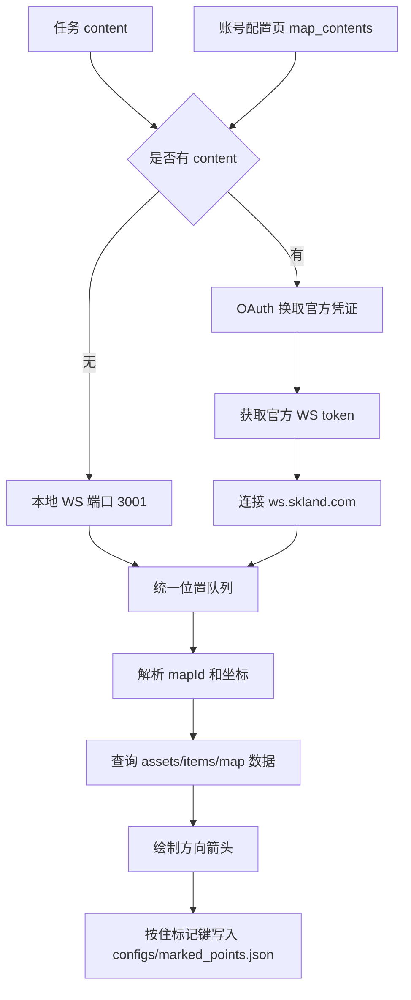

# 物品导航与实时检测

返回：[文档索引](README.md) / [README](../README.md)

## 概述

本文覆盖两个触发式/调试类任务：

- `ItemNavigatorTask`（界面名称：物品导航）：优先使用官方地图 WebSocket 获取玩家位置；未配置凭证时回退到本地 WebSocket 服务，指向所选物品的最近采集点，并支持按键标记已获取。
- `RealtimeDetectTask`（界面名称：实时检测）：循环运行 YOLO 检测，用于在线观察模型、目标类别和置信度表现。

---

## 物品导航

### 使用前提

- 推荐在账号配置页保存官方地图同步 `content`，或在任务配置中直接填写 `content`。
- 未配置 `content` 时，需要启用外部脚本或工具向本地 `ws://127.0.0.1:3001` 推送位置数据。
- 物品点位数据来自 `assets/items/map/summary.json` 和 `assets/items/map/item_names.json`。
- 标记结果写入 `configs/marked_points.json`，用于避免重复指向已经标记的点位。

### 配置项

| 配置项 | 默认值 | 说明 |
|---|---:|---|
| `content` | 空字符串 | 可选。直接填写 `web-api.skland.com/account/info/hg/check` 返回 JSON 中的 `data.content`。有值时优先使用官方地图 WebSocket。 |
| `地图账号` | 空字符串 | 可选。`content` 为空时，从账号配置页读取该账号保存的地图同步 content。 |
| `选择物品` | `[]` | 参与导航的物品名称列表；为空时不会筛选出目标。 |
| `标记按键` | `f` | 接近目标后用于标记“已获取”的按键。 |
| `标记按住时长` | `0.8` | 按住标记按键达到该时长后，当前目标会被标记为已获取。 |

### 数据流

### 注意事项

- 物品导航依赖当前地图 ID 与坐标数据，点位数据缺失时不会产生有效指向。
- 任务会在窗口上绘制方向箭头；若看不到箭头，先确认 WebSocket 位置数据是否正常。
- 油猴脚本帮助按钮会打开临时帮助文档和脚本目录。

---

## 实时检测

### 使用场景

实时检测用于调试 YOLO 模型，不是面向日常自动化流程的任务。它会持续截图并执行目标检测，便于观察某个模型和目标类别的命中情况。

### 配置项

| 配置项 | 默认值 | 说明 |
|---|---:|---|
| `YOLO模型` | [src/config.py](../src/config.py) 中 `yolo.default_model` | 模型配置键，实际模型和标签维护在 [src/yolo/models.py](../src/yolo/models.py)。 |
| `检测目标` | 当前模型 labels 的第一个目标 | 要观察的目标类别。 |
| `检测置信度` | `0.7` | 取值范围 `0` 到 `1`，值越高越严格。 |
| `扫描间隔(秒)` | `0.2` | 每次检测后的等待时间。 |

### 注意事项

- 目标名称必须存在于所选模型的 labels 中，否则任务会直接报错。
- 该任务会循环运行，停止时会输出总扫描次数、命中轮次和最高置信度。

相关文档：[地图官方 WS 客户端实现](dev/地图官方WS客户端实现.md) / [账号配置用户指南](账号配置用户指南.md)
