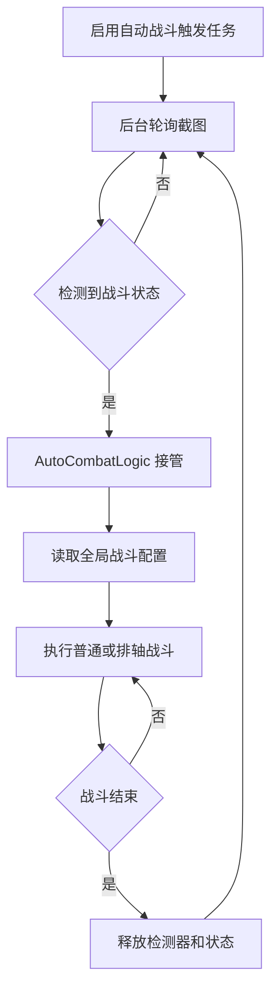

# 自动战斗

返回：[文档索引](README.md) / [README](../README.md)

## 概述

自动检测战斗状态，在进入战斗后自动执行技能释放逻辑，战斗结束后停止本轮并继续等待下一场。它是注册的触发式任务，需在任务界面启用；只在检测到至少 1 格技力且队伍 UI 存在时接管战斗。

战斗逻辑与「刷体力」中的战斗逻辑相同，详见 [体力本.md](./体力本.md)。

## 触发流程

---

## 使用要求

> 确保分辨率大于等于**1600x900**，否则可能无法正常使用

## 战斗配置（全局共享）

> 所有战斗相关的配置项现在集中在 **「全局配置 → 战斗配置」** 中统一管理，
> 一次配置即可应用到「自动战斗」「刷体力」「日常任务」等所有涉及战斗的任务，无需多处重复设置。

### 技能释放

「战技」释放角色顺序是可排序列表，默认 `1,2,3`，可从 1 至 4 中选择且不允许重复。普通模式在连携技和终结技均未释放时按该列表循环出技。

---

### 启动技能点数

当「技力条」达到该数值时，开始执行技能序列。取值范围 1–3。

---

### 后台结束战斗通知

战斗结束后是否发送系统通知（仅在后台运行时生效）。

---

### 无数字操作间隔

战斗中周期触发锁敌 + 向前闪避的最小间隔秒数，默认 6；运行时限制为 1 至 30 秒。

---

### 进入战斗后的初始等待时间

进入战斗后等待该时间（秒）后才开始释放技能。

---

### 启用排轴

启用后按照「排轴序列」中定义的顺序使用技能。某个动作连续 5 秒未成功时，本场战斗永久回退普通逻辑。

详见 [排轴.md](./排轴.md)。

---

### 排轴序列

技能释放的自定义顺序字符串，仅在「启用排轴」开启时生效。

格式和用法详见 [排轴.md](./排轴.md)。

相关文档：[体力本](体力本.md) / [排轴](排轴.md) / [API 参考](dev/API.md)
