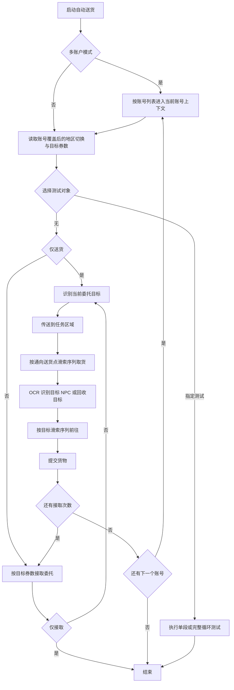

# 自动送货

返回：[文档索引](README.md) / [README](../README.md)

## 概述

自动接取当前选择地区的委托，按照配置路径将货物送至对应接收者，直到次数用完。该任务支持多账户执行和多账户独立配置。

配置、地区和目标来自 [DeliveryTask.py](../src/tasks/onetime/DeliveryTask.py) 与 [delivery_area.py](../src/data/delivery_area.py)。

---

## 选项和配置

### 目标券数

可选值来自 `DELIVERY_TARGET_TICKET_NUM_OPTIONS`，当前为 `73100`、`79800`、`119000`。

这是目标券数优先级序列，不是单选值。默认 `119000`；可配置多个券数，任务会按列表顺序优先抢前面的券数。

---

### 多账户模式

自动送货继承 `AccountMixin`，并声明 `support_multi_account = True`。

* 开启「多账户模式」后，任务会按「账号列表」逐个切换账号执行自动送货。
* 开启「多账户独立配置」后，同一送货任务可按账号覆盖目标券数、地区切换、仅接取、仅送货、滑索路径等任务配置。
* 账号列表每行一个账号；兼容旧格式 `账号, 密码`，但密码字段会被忽略。

---

### 地区切换

> 通过下拉框选择当前送货地区

切换后会使用该地区的：

* 委托地点识别规则
* 送货目标列表
* 对应的送货点滑索配置（按地点匹配）

---

### 通向送货点

> 通向送货点的滑索距离序列

决定自动前往接取货物点的路径。

**示例：**

> 50,34

---

## 工作流程

### 常沄

> 从送货点前往常沄 NPC 的滑索距离序列

决定从送货点前往常沄 NPC 的路径。

**示例：**

> 20,15,40

---

### 资源

> 从送货点前往资源回收站的滑索距离序列

决定从送货点前往资源回收站的路径（用于回收类委托）。

**示例：**

> 10,25

---

### 彦宁

> 从送货点前往彦宁 NPC 的滑索距离序列

决定从送货点前往彦宁 NPC 的路径，用于完成对应委托的送货流程。

**示例：**

> 30,18,22

---

### 齐纶

> 从送货点前往齐纶 NPC 的滑索距离序列

决定从送货点前往齐纶 NPC 的路径，用于完成对应委托的送货流程。

**示例：**

> 45,12

---

### 赵昭

> 从送货点前往赵昭 NPC 的滑索距离序列

决定从送货点前往赵昭 NPC 的路径，用于完成对应委托的送货流程。

**示例：**

> 18,26

---

### 裴令容

> 从送货点前往裴令容 NPC 的滑索距离序列

决定从送货点前往裴令容 NPC 的路径，用于完成对应委托的送货流程。

**示例：**

> 12,34

---

### 阿禾

> 从送货点前往阿禾 NPC 的滑索距离序列

决定从送货点前往阿禾 NPC 的路径，用于完成对应委托的送货流程。

**示例：**

> 22,16

---

## 功能选项

### 是否启用滚动放大视角

启用后，在对齐滑索时会自动滚动放大视角。

* 可能提高对齐成功率
* 也可能在某些情况下**明显降低成功率**

**建议：**

* 启用时尽量使用宽大头发或深色头发(帽子)(别礼、赛希)
* 避免使用黄白头发或帽子（识别可能受影响）

---

### 仅接取

> 前置：选择测试对象 =「无」

仅接取当前选择地区委托，不执行送货流程。

会按照「目标券数」优先级序列尝试接取对应委托（7.31w、7.98w 或 11.9w）。

---

### 仅送货

> 前置：选择测试对象 =「无」，且已接取当前选择地区委托并处于可送货状态

启动自动识别并执行送货流程。

---

### 选择测试对象

用于调试或路径测试。

* 默认：**无**（正常执行完整流程）
* 可选：指定滑索分叉序列（用于单路径测试）
* **完整循环测试**：

  * 会依次测试每个送货目标的完整流程
  * 需要将任务锁定在送货点或其附近

---

### 发生异常时终止游戏

当脚本检测到异常情况时，自动关闭游戏和脚本，防止后续脚本其他任务卡死或游戏资源占用。

---

### 完成后退出

任务完成后自动执行：

* 退出游戏
* 关闭 App

---

## 补充说明

> 所有路径均为「滑索距离序列」，按顺序依次执行。

* 当前版本会自动根据任务区域与地点配置切换传送点搜索方向（具体规则见地区配置数据）。

* 滑索推进阶段固定使用 E 键触发连接点（底层按键输入），不受通用热键配置影响。
* 原因是该交互键在游戏内不可改绑，且高频重复输入可降低短距离滑索漏触发概率。

---

相关文档：[滑索与送货逻辑](dev/滑索与送货逻辑.md) / [送货地区维护工作流](update/送货地区维护工作流.md) / [运送委托接取](运送委托接取.md)
