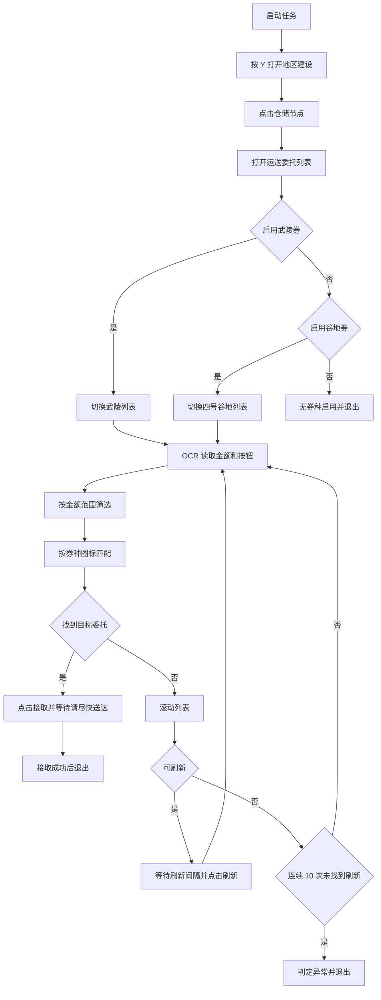

# 运送委托接取

返回：[文档索引](README.md) / [README](../README.md)

## 概述

自动在「地区建设/仓储结点/运送委托列表」中抢单，筛选符合条件的高价值委托并自动接取。

---

## 前置条件

保持在游戏主界面即可。任务启动后会自动执行：

1. 按 `Y` 打开地区建设。
2. 点击「仓储节点」。
3. 点击「运送委托列表」。

随后进入自动筛选与接取流程，接取成功后自动退出。

---

## 选项和配置

### 接取谷地券

是否抢取「四号谷地」类型的运送委托。

默认：关闭

---

### 接取谷地券最低金额(万)

接取谷地券委托的最低报酬金额（万），低于此金额的委托不接取。

默认：`5.0`

---

### 接取谷地券最高金额(万)

接取谷地券委托的最高报酬金额（万），高于此金额的委托不接取（防止 OCR 误识别导致接取异常委托）。

默认：`40.0`

---

### 接取武陵券

是否抢取「武陵」类型的运送委托。

默认：开启

---

### 接取武陵券最低金额(万)

接取武陵券委托的最低报酬金额（万）。

默认：`5.0`

---

### 接取武陵券最高金额(万)

接取武陵券委托的最高报酬金额（万）。

默认：`15.0`

---

## 工作流程

---

## 注意事项

- 本任务继承 `TriggerTask`，但注册在 `onetime_tasks` 中，作为用户手动启动的一次性抢单流程使用。接取成功后自动退出，不执行送货操作（送货请使用 [自动送货](自动送货.md)）。
- 若程序提示「权限不足」，请以 **管理员身份** 运行程序。

相关文档：[自动送货](自动送货.md) / [送货地区维护工作流](update/送货地区维护工作流.md)
