# 角色技能强化/反应依赖可视化

## 目录

- [总览](#总览)
- [6星角色](#6星角色)
  - [莱万汀](#莱万汀)
  - [伊冯](#伊冯)
  - [洁尔佩塔](#洁尔佩塔)
  - [余烬](#余烬)
  - [骏卫](#骏卫)
  - [卡缪](#卡缪)
  - [黎风](#黎风)
  - [洛茜](#洛茜)
  - [弭弗](#弭弗)
  - [汤汤](#汤汤)
  - [庄方宜](#庄方宜)
  - [管理员](#管理员)
  - [艾尔黛拉](#艾尔黛拉)
  - [诀](#诀)
  - [梨诺](#梨诺)
  - [别礼](#别礼)
- [5星角色](#5星角色)
  - [陈千语](#陈千语)
  - [大潘](#大潘)
  - [昼雪](#昼雪)
  - [赛希](#赛希)
  - [狼卫](#狼卫)
  - [佩丽卡](#佩丽卡)
  - [弧光](#弧光)
  - [阿列什](#阿列什)
  - [艾维文娜](#艾维文娜)
- [4星角色](#4星角色)
  - [埃特拉](#埃特拉)
  - [安塔尔](#安塔尔)
  - [卡契尔](#卡契尔)
  - [秋栗](#秋栗)
  - [萤石](#萤石)

---

## 总览

| 统计项 | 数量 |
|--------|------|
| 角色总数 | 30 |
| 6星角色 | 16 |
| 5星角色 | 9 |
| 4星角色 | 5 |
| 反应总数 | 47 |
| 限制总数 | 26 |
| 检测信息 | 40+ |

---

## 6星角色

### 莱万汀

**基本信息**
| 属性 | 值 |
|------|-----|
| 角色ID | chr_0016_laevat |
| 星级 | ★★★★★★ |
| 元素 | 灼热 |
| 职业 | 突击 |
| 武器类型 | 单手剑 |

**技能列表**

| 技能名称 | 类型 | 元素 | 倍率 | 失衡 | 技力 | 强化态 |
|----------|------|------|------|------|------|--------|
| 燃烬 | 普通攻击 | 灼热 | - | - | - | ❌ |
| 焚灭 | 战技 | 灼热 | 140%+14%+770% | 10 | 100 | ✅ 熔火层数 |
| 沸腾 | 连携技 | 灼热 | 540% | 10 | - | ❌ |
| 黄昏 | 终结技 | 灼热 | - | - | 300 | ✅ 强化普攻 |

**依赖关系图**

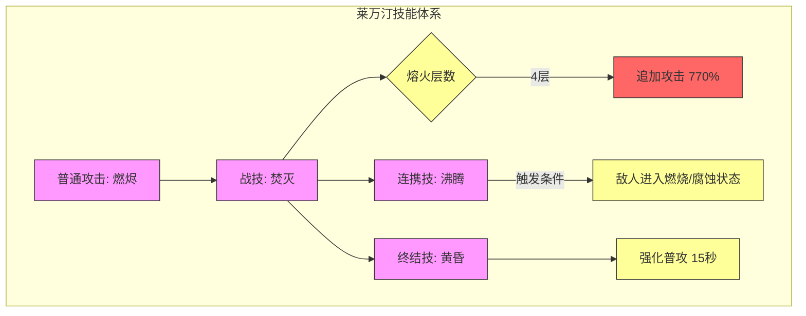

**反应链**

| 反应ID | 触发条件 | 效果 |
|--------|----------|------|
| R001 | 敌人进入燃烧状态 | 触发连携技沸腾 |
| R002 | 熔火层数达到4层 | 触发焚灭追加攻击 |

---

### 伊冯

**基本信息**
| 属性 | 值 |
|------|-----|
| 角色ID | chr_0017_yvonne |
| 星级 | ★★★★★★ |
| 元素 | 寒冷 |
| 职业 | 突击 |
| 武器类型 | 手铳 |

**技能列表**

| 技能名称 | 类型 | 元素 | 倍率 | 失衡 | 技力 | 强化态 |
|----------|------|------|------|------|------|--------|
| 雀跃扳机 | 普通攻击 | 寒冷 | - | - | - | ❌ |
| 冰冰弹·β型 | 战技 | 寒冷 | 250%+150%+200%/层 | 10 | 100 | ✅ 冻结触发 |
| 速冻仔·υ37 | 连携技 | 寒冷 | 100%+200% | 10 | - | ❌ |
| 冷冻射手 | 终结技 | 寒冷 | - | - | 220 | ✅ 强化普攻 |

**依赖关系图**

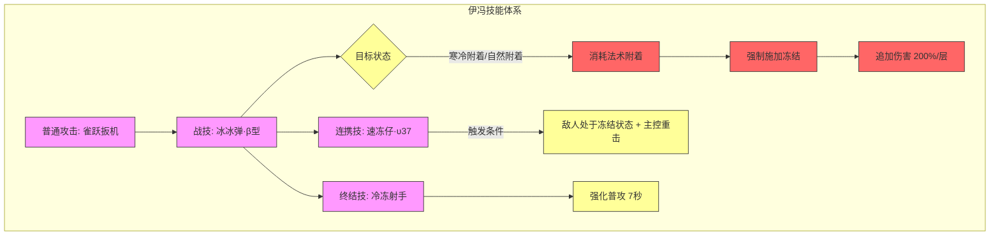

**反应链**

| 反应ID | 触发条件 | 效果 |
|--------|----------|------|
| R003 | 敌人处于冻结状态 + 主控干员重击 | 触发连携技速冻仔·υ37 |
| R004 | 战技命中处于寒冷附着或自然附着的敌人 | 消耗所有法术附着，强制施加冻结 |

---

### 洁尔佩塔

**基本信息**
| 属性 | 值 |
|------|-----|
| 角色ID | chr_0013_aglina |
| 星级 | ★★★★★★ |
| 元素 | 自然 |
| 职业 | 辅助 |
| 武器类型 | 施术单元 |

**技能列表**

| 技能名称 | 类型 | 元素 | 倍率 | 失衡 | 技力 | 强化态 |
|----------|------|------|------|------|------|--------|
| 秘杖·束能技艺 | 普通攻击 | 自然 | - | - | - | ❌ |
| 秘杖·引力模式 | 战技 | 自然 | 219%+130% | 10 | 100 | ❌ |
| 秘杖·矩阵位移 | 连携技 | 自然 | 315% | 5 | - | ❌ |
| 秘杖·重力场 | 终结技 | 自然 | 750% | 20 | 90 | ✅ 法术脆弱增强 |

**依赖关系图**

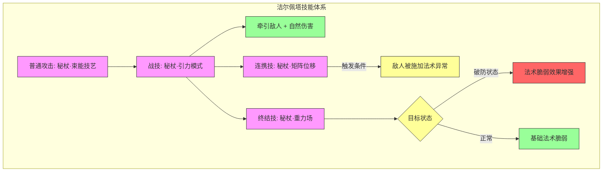

**反应链**

| 反应ID | 触发条件 | 效果 |
|--------|----------|------|
| R005 | 敌人被施加法术异常 | 触发连携技矩阵位移 |
| R006 | 目标处于破防状态 | 终结技重力场法术脆弱效果随破防层数额外提升 |

---

### 余烬

**基本信息**
| 属性 | 值 |
|------|-----|
| 角色ID | chr_0009_azrila |
| 星级 | ★★★★★★ |
| 元素 | 灼热 |
| 职业 | 重装 |
| 武器类型 | 双手剑 |

**技能列表**

| 技能名称 | 类型 | 元素 | 倍率 | 失衡 | 技力 | 强化态 |
|----------|------|------|------|------|------|--------|
| 陷阵剑术 | 普通攻击 | 物理 | - | - | - | ❌ |
| 进军 | 战技 | 灼热 | 390% | 10 | 100 | ❌ |
| 前线援护 | 连携技 | 物理 | 230% | 10 | - | ❌ |
| 重燃誓约 | 终结技 | 灼热 | 650% | 25 | 100 | ❌ |

**依赖关系图**

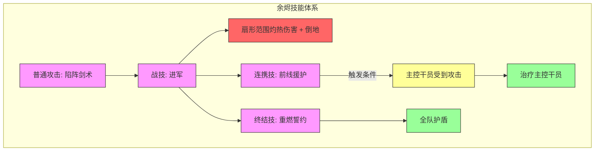

**反应链**

| 反应ID | 触发条件 | 效果 |
|--------|----------|------|
| R007 | 主控干员受到攻击 | 触发连携技前线援护 |
| R008 | 受到来自敌人的伤害 | 攻击力+6%，持续7秒，最多叠加3层 |

---

### 骏卫

**基本信息**
| 属性 | 值 |
|------|-----|
| 角色ID | chr_0029_pograni |
| 星级 | ★★★★★★ |
| 元素 | 物理 |
| 职业 | 先锋 |
| 武器类型 | 单手剑 |

**技能列表**

| 技能名称 | 类型 | 元素 | 倍率 | 失衡 | 技力 | 强化态 |
|----------|------|------|------|------|------|--------|
| 全面攻势 | 普通攻击 | 物理 | - | - | - | ❌ |
| 粉碎阵线 | 战技 | 物理 | 192%+238% | 10 | 100 | ✅ 破防层数消耗 |
| 盈月邀击 | 连携技 | 物理 | 95%+122%+149%+297% | 13 | - | ❌ |
| 盾卫旗队，上前 | 终结技 | 物理 | 300%+100%+450% | 10 | 90 | ✅ 铁誓消耗 |

**依赖关系图**

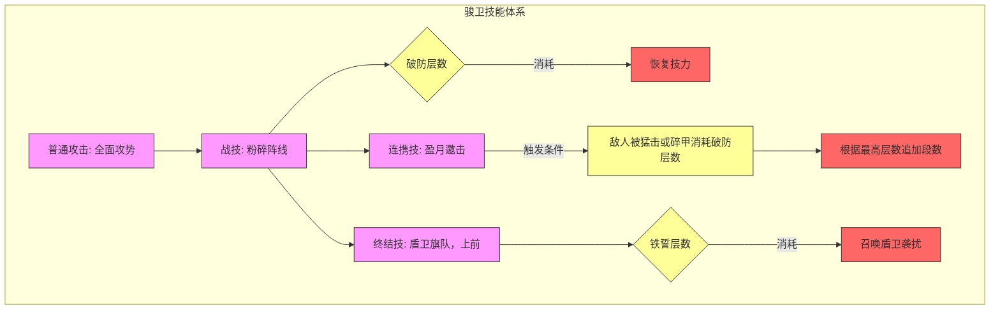

**反应链**

| 反应ID | 触发条件 | 效果 |
|--------|----------|------|
| R009 | 敌人被猛击或碎甲消耗破防层数 | 触发连携技盈月邀击 |
| R010 | 战技命中敌人时消耗破防层数 | 基于消耗的破防层数恢复技力 |
| R011 | 终结技期间消耗铁誓 | 召唤盾卫袭扰敌人 |

---

### 卡缪

**基本信息**
| 属性 | 值 |
|------|-----|
| 角色ID | chr_0033_camille |
| 星级 | ★★★★★★ |
| 元素 | 灼热 |
| 职业 | 先锋 |
| 武器类型 | 长柄武器 |

**技能列表**

| 技能名称 | 类型 | 元素 | 倍率 | 失衡 | 技力 | 强化态 |
|----------|------|------|------|------|------|--------|
| 歃血涤罪 | 普通攻击 | 灼热 | - | - | - | ❌ |
| 驱火焚影 | 战技 | 灼热 | 200% | 10 | 100 | ✅ 衔火血翼盘桓 |
| 锥心之棘 | 连携技 | 灼热 | 300%+500% | 20 | - | ❌ |
| 猩红坠雨 | 终结技 | 灼热 | 600% | 15 | 130 | ✅ 追猎状态 |

**依赖关系图**

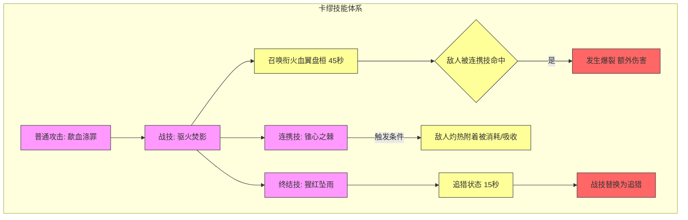

**反应链**

| 反应ID | 触发条件 | 效果 |
|--------|----------|------|
| R012 | 敌人的灼热附着被消耗或吸收 | 触发连携技锥心之棘 |
| R013 | 衔火血翼盘桓的敌人被连携技命中 | 发生爆裂，受到额外灼热伤害 |

---

### 黎风

**基本信息**
| 属性 | 值 |
|------|-----|
| 角色ID | chr_0015_lifeng |
| 星级 | ★★★★★★ |
| 元素 | 物理 |
| 职业 | 近卫 |
| 武器类型 | 长柄武器 |

**技能列表**

| 技能名称 | 类型 | 元素 | 倍率 | 失衡 | 技力 | 强化态 |
|----------|------|------|------|------|------|--------|
| 摧破 | 普通攻击 | 物理 | - | - | - | ❌ |
| 荡浊身 | 战技 | 物理 | 86%+86%+268% | 10 | 100 | ❌ |
| 忿怒相 | 连携技 | 物理 | 105%+375% | 10 | - | ❌ |
| 不动心 | 终结技 | 物理 | 400%+400%+600% | 5 | 90 | ✅ 连击消耗 |

**依赖关系图**

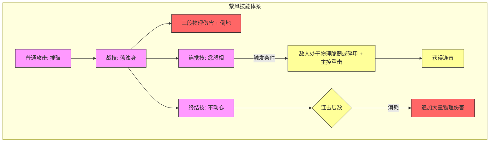

**反应链**

| 反应ID | 触发条件 | 效果 |
|--------|----------|------|
| R014 | 处于物理脆弱或碎甲状态的敌人受到主控干员重击 | 触发连携技忿怒相 |
| R015 | 终结技消耗连击 | 追加大量物理伤害 |

---

### 洛茜

**基本信息**
| 属性 | 值 |
|------|-----|
| 角色ID | chr_0028_wulfa |
| 星级 | ★★★★★★ |
| 元素 | 物理 |
| 职业 | 近卫 |
| 武器类型 | 单手剑 |

**技能列表**

| 技能名称 | 类型 | 元素 | 倍率 | 失衡 | 技力 | 强化态 |
|----------|------|------|------|------|------|--------|
| 沸腾狼血 | 普通攻击 | 物理 | - | - | - | ❌ |
| 血红之影 | 战技 | 物理 | 192%+288% | 20 | 100 | ❌ |
| 燎影时刻 | 连携技 | 物理 | 150%+300%+180%/层 | 5 | - | ✅ 暴击率/暴击伤害提升 |
| "利爪"奇袭 | 终结技 | 灼热 | 600%+250%+750% | 25 | 110 | ✅ 暴击伤害提升 |

**依赖关系图**

```mermaid
graph TD
    subgraph 洛茜技能体系
        A[普通攻击: 沸腾狼血] --> B[战技: 血红之影]
        B --> C{目标状态}
        C -->|有破防| D[释放狼之珀 灼热伤害]
        B --> E[连携技: 燎影时刻]
        E -->|触发条件| F[敌人同时处于破防和法术附着]
        F --> G[连携技可发动两次]
        G --> H[暴击率/暴击伤害提升 15秒]
        B --> I[终结技: "利爪"奇袭]
        I --> J{暴击}
        J -->|是| K[暴击伤害提升 10秒]
    end
    
    style A fill:#f9f,stroke:#333
    style B fill:#f9f,stroke:#333
    style C fill:#ff9,stroke:#333
    style D fill:#f66,stroke:#333
    style E fill:#f9f,stroke:#333
    style F fill:#ff9,stroke:#333
    style G fill:#f66,stroke:#333
    style H fill:#ff9,stroke:#333
    style I fill:#f9f,stroke:#333
    style J fill:#ff9,stroke:#333
    style K fill:#f66,stroke:#333
```

**反应链**

| 反应ID | 触发条件 | 效果 |
|--------|----------|------|
| R016 | 敌人同时处于破防和法术附着状态 | 触发连携技燎影时刻 |

---

### 弭弗

**基本信息**
| 属性 | 值 |
|------|-----|
| 角色ID | chr_0031_mifu |
| 星级 | ★★★★★★ |
| 元素 | 物理 |
| 职业 | 近卫 |
| 武器类型 | 双手剑 |

**技能列表**

| 技能名称 | 类型 | 元素 | 倍率 | 失衡 | 技力 | 强化态 |
|----------|------|------|------|------|------|--------|
| 剑行拳意 | 普通攻击 | 物理 | - | - | - | ❌ |
| 清波三艺 | 战技 | 物理 | 150%+200%+600% | 10 | 100 | ✅ 三段战技替换 |
| 拳出无悔 | 连携技 | 物理 | 250% | 10 | - | ❌ |
| 绝心 | 终结技 | 物理 | 700% | 20 | 80 | ❌ |

**依赖关系图**

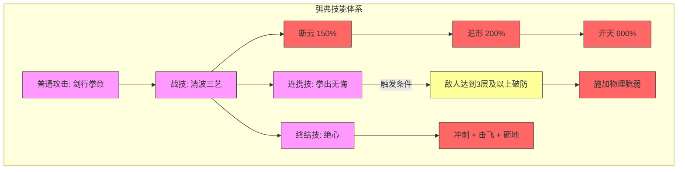

**反应链**

| 反应ID | 触发条件 | 效果 |
|--------|----------|------|
| R017 | 敌人达到3层及以上破防 | 触发连携技拳出无悔 |

---

### 汤汤

**基本信息**
| 属性 | 值 |
|------|-----|
| 角色ID | chr_0027_tangtang |
| 星级 | ★★★★★★ |
| 元素 | 寒冷 |
| 职业 | 术师 |
| 武器类型 | 手铳 |

**技能列表**

| 技能名称 | 类型 | 元素 | 倍率 | 失衡 | 技力 | 强化态 |
|----------|------|------|------|------|------|--------|
| 崩你脑壳！ | 普通攻击 | 寒冷 | - | - | - | ❌ |
| 踏潮卷浪！ | 战技 | 寒冷 | 180%+300% | 10 | 100 | ✅ 水龙卷系统 |
| 河水，助我！ | 连携技 | 寒冷 | 240% | 10 | - | ❌ |
| 大当家盯着呢！ | 终结技 | 寒冷 | 320%+400%+700% | 15 | 90 | ✅ 古老图形封锁 |

**依赖关系图**

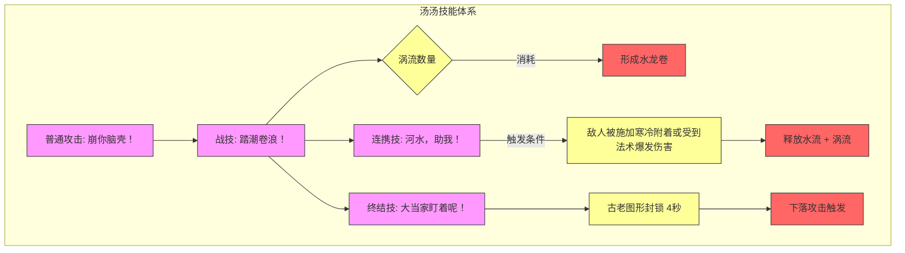

**反应链**

| 反应ID | 触发条件 | 效果 |
|--------|----------|------|
| R018 | 敌人被施加寒冷附着或受到法术爆发伤害 | 触发连携技河水，助我！ |
| R019 | 战技消耗涡流 | 形成额外水龙卷 |

---

### 庄方宜

**基本信息**
| 属性 | 值 |
|------|-----|
| 角色ID | chr_0030_zhuangfy |
| 星级 | ★★★★★★ |
| 元素 | 电磁 |
| 职业 | 突击 |
| 武器类型 | 施术单元 |

**技能列表**

| 技能名称 | 类型 | 元素 | 倍率 | 失衡 | 技力 | 强化态 |
|----------|------|------|------|------|------|--------|
| 伏击 | 普通攻击 | 物理 | - | - | - | ❌ |
| 靶向鱼雷 | 战技 | 电磁 | 280%+420% | 10 | 100 | ❌ |
| 反隐协议 | 连携技 | 电磁 | 320% | 10 | - | ❌ |
| 全域追踪 | 终结技 | 电磁 | 600% | 20 | 100 | ❌ |

**依赖关系图**

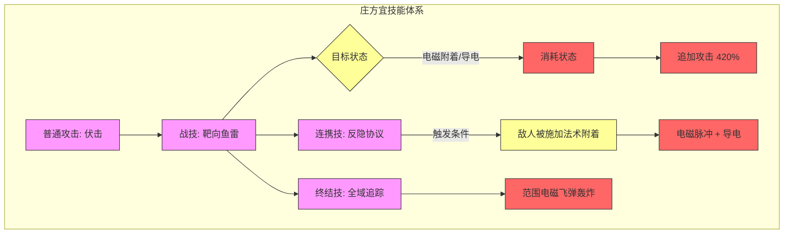

**反应链**

| 反应ID | 触发条件 | 效果 |
|--------|----------|------|
| R030 | 战技命中处于电磁附着或导电状态的敌人 | 消耗电磁附着，追加一次攻击 |
| R032 | 敌人被施加法术附着 | 触发连携技反隐协议 |

---

### 管理员

**基本信息**
| 属性 | 值 |
|------|-----|
| 角色ID | chr_9000_endmin |
| 星级 | ★★★★★★ |
| 元素 | 物理 |
| 职业 | 近卫 |
| 武器类型 | 单手剑 |

**技能列表**

| 技能名称 | 类型 | 元素 | 倍率 | 失衡 | 技力 | 强化态 |
|----------|------|------|------|------|------|--------|
| 基础剑术 | 普通攻击 | 物理 | - | - | - | ❌ |
| 制敌一击 | 战技 | 物理 | 300%+200%/层 | 10 | 100 | ✅ 破甲效果 |
| 协同作战 | 连携技 | 物理 | 250% | 10 | - | ❌ |
| 终末一击 | 终结技 | 物理 | 800% | 25 | 90 | ❌ |

**依赖关系图**

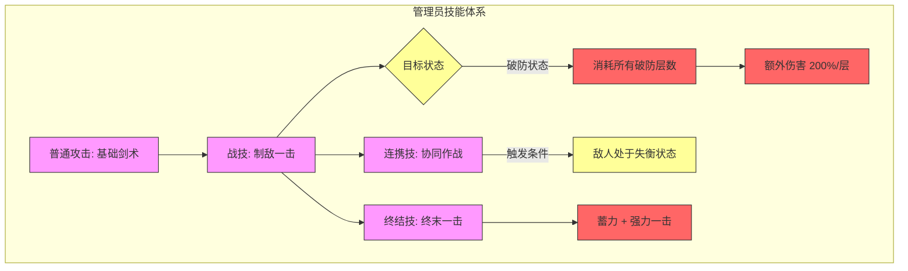

**反应链**

| 反应ID | 触发条件 | 效果 |
|--------|----------|------|
| R031 | 战技命中处于破防状态的敌人 | 消耗所有破防层数，造成额外伤害 |

---

### 艾尔黛拉

**基本信息**
| 属性 | 值 |
|------|-----|
| 角色ID | chr_0025_ardelia |
| 星级 | ★★★★★★ |
| 元素 | 自然 |
| 职业 | 辅助 |
| 武器类型 | 施术单元 |

**技能列表**

| 技能名称 | 类型 | 元素 | 倍率 | 失衡 | 技力 | 强化态 |
|----------|------|------|------|------|------|--------|
| 自然之息 | 普通攻击 | 自然 | - | - | - | ❌ |
| 藤蔓缠绕 | 战技 | 自然 | 300% | 10 | 100 | ❌ |
| 生命涌流 | 连携技 | 自然 | 200% | 5 | - | ❌ |
| 自然之怒 | 终结技 | 自然 | 150%/秒 | 0 | 100 | ✅ 自然领域 |

**依赖关系图**

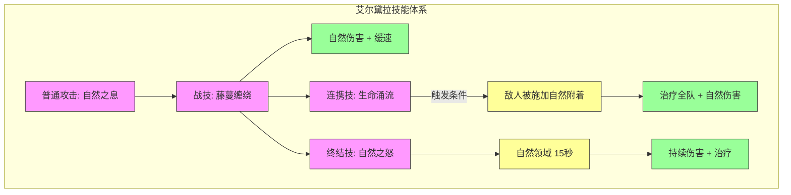

**反应链**

| 反应ID | 触发条件 | 效果 |
|--------|----------|------|
| R035 | 敌人被施加自然附着 | 触发连携技生命涌流 |

---

### 诀

**基本信息**
| 属性 | 值 |
|------|-----|
| 角色ID | chr_0032_lizhiyan |
| 星级 | ★★★★★★ |
| 元素 | 自然 |
| 职业 | 术师 |
| 武器类型 | 施术单元 |

**技能列表**

| 技能名称 | 类型 | 元素 | 倍率 | 失衡 | 技力 | 强化态 |
|----------|------|------|------|------|------|--------|
| 自然疗法 | 普通攻击 | 自然 | - | - | - | ❌ |
| 生息之种 | 战技 | 自然 | 250%+350% | 10 | 100 | ✅ 种子爆发 |
| 万物共鸣 | 连携技 | 自然 | 280% | 10 | - | ❌ |
| 生命之树 | 终结技 | 自然 | 700% | 20 | 100 | ❌ |

**依赖关系图**

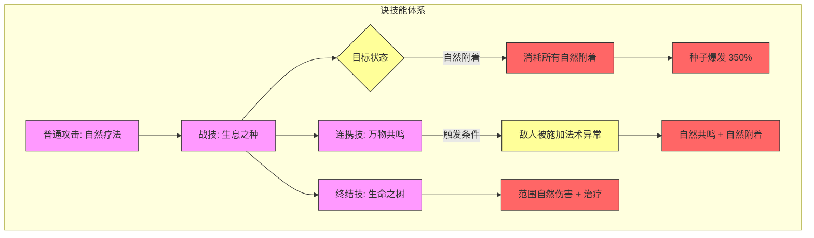

**反应链**

| 反应ID | 触发条件 | 效果 |
|--------|----------|------|
| R033 | 种子命中处于自然附着的敌人 | 消耗所有自然附着，造成额外伤害 |
| R034 | 敌人被施加法术异常 | 触发连携技万物共鸣 |

---

### 梨诺

**基本信息**
| 属性 | 值 |
|------|-----|
| 角色ID | chr_0035_liino |
| 星级 | ★★★★★★ |
| 元素 | 电磁 |
| 职业 | 辅助 |
| 武器类型 | 长柄武器 |

**技能列表**

| 技能名称 | 类型 | 元素 | 倍率 | 失衡 | 技力 | 强化态 |
|----------|------|------|------|------|------|--------|
| 雷光斩 | 普通攻击 | 物理 | - | - | - | ❌ |
| 雷光连斩 | 战技 | 电磁 | 200%/段 | 10 | 100 | ❌ |
| 雷光爆发 | 连携技 | 电磁 | 350% | 10 | - | ❌ |
| 雷神降临 | 终结技 | 电磁 | 750% | 20 | 100 | ❌ |

**依赖关系图**

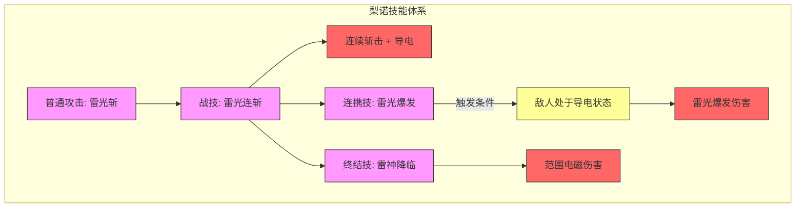

**反应链**

| 反应ID | 触发条件 | 效果 |
|--------|----------|------|
| R038 | 敌人处于导电状态 | 触发连携技雷光爆发 |
| R039 | 敌人被施加法术附着 | 触发连携技雷光爆发 |

---

### 别礼

**基本信息**
| 属性 | 值 |
|------|-----|
| 角色ID | chr_0026_lastrite |
| 星级 | ★★★★★★ |
| 元素 | 寒冷 |
| 职业 | 突击 |
| 武器类型 | 双手剑 |

**技能列表**

| 技能名称 | 类型 | 元素 | 倍率 | 失衡 | 技力 | 强化态 |
|----------|------|------|------|------|------|--------|
| 寒霜剑术 | 普通攻击 | 寒冷 | - | - | - | ❌ |
| 低温症 | 战技 | 寒冷 | 200%+4%/层 | 10 | 100 | ✅ 寒冷脆弱 |
| 冰封斩 | 连携技 | 寒冷 | 400% | 15 | - | ❌ |
| 绝对零度 | 终结技 | 寒冷 | 800%×1.5 | 25 | 100 | ✅ 寒冷脆弱增强 |

**依赖关系图**

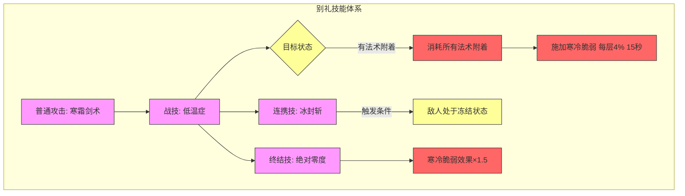

**反应链**

| 反应ID | 触发条件 | 效果 |
|--------|----------|------|
| R036 | 敌人处于冻结状态 | 触发连携技冰封斩 |
| R037 | 战技命中处于法术附着的敌人 | 消耗所有法术附着，施加寒冷脆弱 |

---

## 5星角色

### 陈千语

**基本信息**
| 属性 | 值 |
|------|-----|
| 角色ID | chr_0005_chen |
| 星级 | ★★★★★ |
| 元素 | 物理 |
| 职业 | 近卫 |
| 武器类型 | 单手剑 |

**技能列表**

| 技能名称 | 类型 | 元素 | 倍率 | 失衡 | 技力 | 强化态 |
|----------|------|------|------|------|------|--------|
| 破飞霞 | 普通攻击 | 物理 | - | - | - | ❌ |
| 归穹宇 | 战技 | 物理 | 380% | 10 | 100 | ❌ |
| 见天河 | 连携技 | 物理 | 270% | 10 | - | ❌ |
| 冽风霜 | 终结技 | 物理 | 81%×7+1023% | 20 | 70 | ❌ |

**依赖关系图**

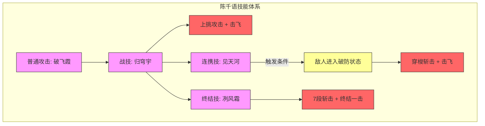

**反应链**

| 反应ID | 触发条件 | 效果 |
|--------|----------|------|
| R020 | 敌人进入破防状态 | 触发连携技见天河 |

---

### 大潘

**基本信息**
| 属性 | 值 |
|------|-----|
| 角色ID | chr_0018_dapan |
| 星级 | ★★★★★ |
| 元素 | 物理 |
| 职业 | 突击 |
| 武器类型 | 双手剑 |

**技能列表**

| 技能名称 | 类型 | 元素 | 倍率 | 失衡 | 技力 | 强化态 |
|----------|------|------|------|------|------|--------|
| 滚刀切！ | 普通攻击 | 物理 | - | - | - | ❌ |
| 颠勺！ | 战技 | 物理 | 300% | 10 | 100 | ❌ |
| 加料！ | 连携技 | 物理 | 650% | 15 | - | ❌ |
| 切丝入锅！ | 终结技 | 物理 | 50%×6+400% | 20 | 90 | ✅ 备料状态 |

**依赖关系图**

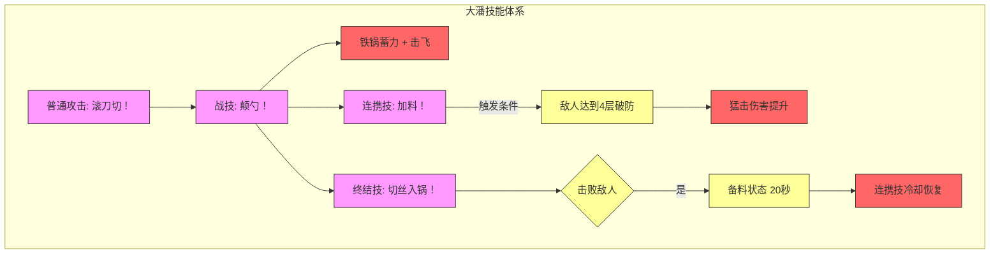

**反应链**

| 反应ID | 触发条件 | 效果 |
|--------|----------|------|
| R021 | 敌人达到4层破防 | 触发连携技加料！ |
| R022 | 终结技击败敌人 | 获得备料状态，连携技冷却恢复 |

---

### 昼雪

**基本信息**
| 属性 | 值 |
|------|-----|
| 角色ID | chr_0014_aurora |
| 星级 | ★★★★★ |
| 元素 | 寒冷 |
| 职业 | 重装 |
| 武器类型 | 双手剑 |

**技能列表**

| 技能名称 | 类型 | 元素 | 倍率 | 失衡 | 技力 | 强化态 |
|----------|------|------|------|------|------|--------|
| 霜刃 | 普通攻击 | 物理 | - | - | - | ❌ |
| 冰封护盾 | 战技 | 寒冷 | 300% | 10 | 100 | ✅ 护盾叠加 |
| 寒冰冲锋 | 连携技 | 寒冷 | 250% | 10 | - | ❌ |
| 冰川之怒 | 终结技 | 寒冷 | 600% | 20 | 100 | ❌ |

**依赖关系图**

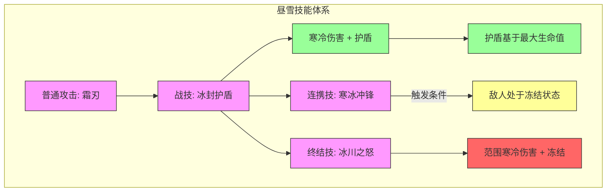

**反应链**

| 反应ID | 触发条件 | 效果 |
|--------|----------|------|
| R040 | 敌人处于冻结状态 | 触发连携技寒冰冲锋 |

---

### 赛希

**基本信息**
| 属性 | 值 |
|------|-----|
| 角色ID | chr_0011_seraph |
| 星级 | ★★★★★ |
| 元素 | 寒冷 |
| 职业 | 辅助 |
| 武器类型 | 施术单元 |

**技能列表**

| 技能名称 | 类型 | 元素 | 倍率 | 失衡 | 技力 | 强化态 |
|----------|------|------|------|------|------|--------|
| 冷却 | 普通攻击 | 寒冷 | - | - | - | ❌ |
| 分布式拒绝服务 | 战技 | 寒冷 | 324（治疗）+15%（增幅） | 0 | 100 | ✅ 支援晶体 |
| 压力测试 | 连携技 | 寒冷 | 450% | 10 | - | ❌ |
| 栈溢出 | 终结技 | 寒冷 | 24%（寒冷增幅）+24%（自然增幅） | 0 | 80 | ✅ 寒冷增幅+自然增幅 |

**依赖关系图**

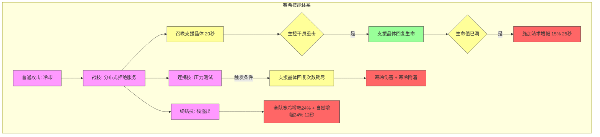

**反应链**

| 反应ID | 触发条件 | 效果 |
|--------|----------|------|
| R041 | 主控干员对敌人造成重击 | 触发连携技压力测试 |

---

### 狼卫

**基本信息**
| 属性 | 值 |
|------|-----|
| 角色ID | chr_0006_wolfgd |
| 星级 | ★★★★★ |
| 元素 | 灼热 |
| 职业 | 术师 |
| 武器类型 | 手铳 |

**技能列表**

| 技能名称 | 类型 | 元素 | 倍率 | 失衡 | 技力 | 强化态 |
|----------|------|------|------|------|------|--------|
| 多重连射 | 普通攻击 | 灼热 | - | - | - | ❌ |
| 灼热弹痕 | 战技 | 灼热 | 230%+850% | 10 | 100 | ❌ |
| 爆裂手雷·β型 | 连携技 | 灼热 | 135% | 10 | - | ❌ |
| 狼之怒 | 终结技 | 灼热 | 72%×5 | 15 | 90 | ❌ |

**依赖关系图**

```mermaid
graph TD
    subgraph 狼卫技能体系
        A[普通攻击: 多重连射] --> B[战技: 灼热弹痕]
        B --> C[连射 + 灼热附着]
        C --> D{目标状态}
        D -->|燃烧/导电| E[消耗状态 + 追加攻击 850%]
        B --> F[连携技: 爆裂手雷·β型]
        F -->|触发条件| G[敌人被施加法术附着]
        G --> H[手雷爆炸 + 灼热附着]
        B --> I[终结技: 狼之怒]
        I --> J[5段灼热伤害 + 燃烧]
    end
    
    style A fill:#f9f,stroke:#333
    style B fill:#f9f,stroke:#333
    style C fill:#f66,stroke:#333
    style D fill:#ff9,stroke:#333
    style E fill:#f66,stroke:#333
    style F fill:#f9f,stroke:#333
    style G fill:#ff9,stroke:#333
    style H fill:#f66,stroke:#333
    style I fill:#f9f,stroke:#333
    style J fill:#f66,stroke:#333
```

**反应链**

| 反应ID | 触发条件 | 效果 |
|--------|----------|------|
| R042 | 敌人被施加法术附着 | 触发连携技爆裂手雷·β型 |

---

### 佩丽卡

**基本信息**
| 属性 | 值 |
|------|-----|
| 角色ID | chr_0004_pelica |
| 星级 | ★★★★★ |
| 元素 | 电磁 |
| 职业 | 术师 |
| 武器类型 | 施术单元 |

**技能列表**

| 技能名称 | 类型 | 元素 | 倍率 | 失衡 | 技力 | 强化态 |
|----------|------|------|------|------|------|--------|
| 协议α·突破 | 普通攻击 | 电磁 | - | - | - | ❌ |
| 协议ω·雷击 | 战技 | 电磁 | 400% | 10 | 100 | ❌ |
| 即时协议·闪链 | 连携技 | 电磁 | 180% | 10 | - | ❌ |
| 协议ε·70.41κ | 终结技 | 电磁 | 1000% | 20 | 80 | ❌ |

**依赖关系图**

```mermaid
graph TD
    subgraph 佩丽卡技能体系
        A[普通攻击: 协议α·突破] --> B[战技: 协议ω·雷击]
        B --> C[电磁能量从天而降]
        B --> D[连携技: 即时协议·闪链]
        D -->|触发条件| E[主控干员对敌人造成重击]
        E --> F[电磁轰击 + 导电]
        B --> G[终结技: 协议ε·70.41κ]
        G --> H[轨道漂浮物毁灭性打击]
    end
    
    style A fill:#f9f,stroke:#333
    style B fill:#f9f,stroke:#333
    style C fill:#f66,stroke:#333
    style D fill:#f9f,stroke:#333
    style E fill:#ff9,stroke:#333
    style F fill:#f66,stroke:#333
    style G fill:#f9f,stroke:#333
    style H fill:#f66,stroke:#333
```

**反应链**

| 反应ID | 触发条件 | 效果 |
|--------|----------|------|
| R043 | 主控干员对敌人造成重击 | 触发连携技即时协议·闪链 |

---

### 弧光

**基本信息**
| 属性 | 值 |
|------|-----|
| 角色ID | chr_0007_ikut |
| 星级 | ★★★★★ |
| 元素 | 电磁 |
| 职业 | 先锋 |
| 武器类型 | 单手剑 |

**技能列表**

| 技能名称 | 类型 | 元素 | 倍率 | 失衡 | 技力 | 强化态 |
|----------|------|------|------|------|------|--------|
| 循迹逐猎 | 普通攻击 | 物理 | - | - | - | ❌ |
| 疾风迅雷 | 战技 | 电磁 | 101%×2+405% | 10 | 100 | ✅ 导电消耗 |
| 鸣雷 | 连携技 | 电磁 | 350% | 5 | - | ❌ |
| 轰雷掣电 | 终结技 | 电磁 | 350%+550% | 10 | 90 | ❌ |

**依赖关系图**

```mermaid
graph TD
    subgraph 弧光技能体系
        A[普通攻击: 循迹逐猎] --> B[战技: 疾风迅雷]
        B --> C[瞬闪斩击 ×2]
        C --> D{目标状态}
        D -->|导电状态| E[消耗导电 + 追加攻击 405%]
        E --> F[恢复技力 40]
        B --> G[连携技: 鸣雷]
        G -->|触发条件| H[敌人进入导电状态或导电被消耗]
        H --> I[多次斩击 + 恢复技力]
        B --> J[终结技: 轰雷掣电]
        J --> K[电弧冲刺 + 引爆]
    end
    
    style A fill:#f9f,stroke:#333
    style B fill:#f9f,stroke:#333
    style C fill:#f66,stroke:#333
    style D fill:#ff9,stroke:#333
    style E fill:#f66,stroke:#333
    style F fill:#9f9,stroke:#333
    style G fill:#f9f,stroke:#333
    style H fill:#ff9,stroke:#333
    style I fill:#f66,stroke:#333
    style J fill:#f9f,stroke:#333
    style K fill:#f66,stroke:#333
```

**反应链**

| 反应ID | 触发条件 | 效果 |
|--------|----------|------|
| R044 | 敌人的导电状态被消耗 | 触发连携技鸣雷 |
| R045 | 敌人进入导电状态 | 触发连携技鸣雷 |

---

### 阿列什

**基本信息**
| 属性 | 值 |
|------|-----|
| 角色ID | chr_0024_deepfin |
| 星级 | ★★★★★ |
| 元素 | 寒冷 |
| 职业 | 先锋 |
| 武器类型 | 单手剑 |

**技能列表**

| 技能名称 | 类型 | 元素 | 倍率 | 失衡 | 技力 | 强化态 |
|----------|------|------|------|------|------|--------|
| 基本挥竿法 | 普通攻击 | 物理 | - | - | - | ❌ |
| 非常规路亚 | 战技 | 寒冷 | 450% | 10 | 100 | ✅ 寒冷附着消耗 |
| 凿孔底钓术 | 连携技 | 寒冷 | 300%+480% | 10 | - | ❌ |
| 大鳞，上钩！ | 终结技 | 寒冷 | 980% | 20 | 100 | ❌ |

**依赖关系图**

```mermaid
graph TD
    subgraph 阿列什技能体系
        A[普通攻击: 基本挥竿法] --> B[战技: 非常规路亚]
        B --> C[冰块砸击]
        C --> D{目标状态}
        D -->|寒冷附着| E[消耗所有寒冷附着]
        E --> F[强制施加冻结]
        E --> G[恢复技力 15/25/35/45]
        B --> H[连携技: 凿孔底钓术]
        H -->|触发条件| I[附近目标的法术异常或源石结晶被消耗]
        I --> J[钓鱼 + 恢复技力]
        J --> K{钓起珍鳞 10%}
        K -->|是| L[强化伤害 480% + 额外技力]
        B --> M[终结技: 大鳞，上钩！]
        M --> N[大范围寒冷伤害 + 寒冷附着]
    end
    
    style A fill:#f9f,stroke:#333
    style B fill:#f9f,stroke:#333
    style C fill:#f66,stroke:#333
    style D fill:#ff9,stroke:#333
    style E fill:#f66,stroke:#333
    style F fill:#f66,stroke:#333
    style G fill:#9f9,stroke:#333
    style H fill:#f9f,stroke:#333
    style I fill:#ff9,stroke:#333
    style J fill:#f66,stroke:#333
    style K fill:#ff9,stroke:#333
    style L fill:#f66,stroke:#333
    style M fill:#f9f,stroke:#333
    style N fill:#f66,stroke:#333
```

**反应链**

| 反应ID | 触发条件 | 效果 |
|--------|----------|------|
| R046 | 附近目标的法术异常或源石结晶被消耗 | 触发连携技凿孔底钓术 |

---

### 艾维文娜

**基本信息**
| 属性 | 值 |
|------|-----|
| 角色ID | chr_0012_avywen |
| 星级 | ★★★★★ |
| 元素 | 电磁 |
| 职业 | 突击 |
| 武器类型 | 长柄武器 |

**技能列表**

| 技能名称 | 类型 | 元素 | 倍率 | 失衡 | 技力 | 强化态 |
|----------|------|------|------|------|------|--------|
| 雷枪·疾袭 | 普通攻击 | 物理 | - | - | - | ❌ |
| 雷枪·截回 | 战技 | 电磁 | 150%+168%+432% | 10 | 100 | ❌ |
| 雷枪·掣击 | 连携技 | 电磁 | 380% | 10 | - | ❌ |
| 雷枪·决颤 | 终结技 | 电磁 | 950% | 20 | 100 | ❌ |

**依赖关系图**

```mermaid
graph TD
    subgraph 艾维文娜技能体系
        A[普通攻击: 雷枪·疾袭] --> B[战技: 雷枪·截回]
        B --> C[旋风斩击]
        C --> D[召回雷枪]
        C --> E[召回强雷枪 + 电磁附着]
        B --> F[连携技: 雷枪·掣击]
        F -->|触发条件| G[主控干员对电磁附着/导电目标重击]
        G --> H[掷出3支雷枪]
        B --> I[终结技: 雷枪·决颤]
        I --> J[投下强雷枪 + 大范围伤害]
    end
    
    style A fill:#f9f,stroke:#333
    style B fill:#f9f,stroke:#333
    style C fill:#f66,stroke:#333
    style D fill:#f66,stroke:#333
    style E fill:#f66,stroke:#333
    style F fill:#f9f,stroke:#333
    style G fill:#ff9,stroke:#333
    style H fill:#f66,stroke:#333
    style I fill:#f9f,stroke:#333
    style J fill:#f66,stroke:#333
```

**反应链**

| 反应ID | 触发条件 | 效果 |
|--------|----------|------|
| R047 | 主控干员对处于电磁附着或导电状态的目标进行重击 | 触发连携技雷枪·掣击 |

---

## 4星角色

### 埃特拉

**基本信息**
| 属性 | 值 |
|------|-----|
| 角色ID | chr_0021_whiten |
| 星级 | ★★★★ |
| 元素 | 寒冷 |
| 职业 | 近卫 |
| 武器类型 | 长柄武器 |

**技能列表**

| 技能名称 | 类型 | 元素 | 倍率 | 失衡 | 技力 | 强化态 |
|----------|------|------|------|------|------|--------|
| 噪点 | 普通攻击 | 物理 | - | - | - | ❌ |
| 凝声 | 战技 | 寒冷 | 350% | 10 | 100 | ❌ |
| 失真 | 连携技 | 物理 | 360%+630% | 10 | - | ❌ |
| 震音 | 终结技 | 物理 | 1100% | 20 | 70 | ❌ |

**依赖关系图**

```mermaid
graph TD
    subgraph 埃特拉技能体系
        A[普通攻击: 噪点] --> B[战技: 凝声]
        B --> C[制冷声波 + 寒冷附着]
        B --> D[连携技: 失真]
        D -->|触发条件| E[敌人进入冻结状态]
        E --> F{敌人状态}
        F -->|非冻结| G[360%伤害]
        F -->|冻结| H[630%伤害 + 击飞]
        B --> I[终结技: 震音]
        I --> J{敌人状态}
        J -->|物理脆弱| K[强制造成击飞]
    end
    
    style A fill:#f9f,stroke:#333
    style B fill:#f9f,stroke:#333
    style C fill:#f66,stroke:#333
    style D fill:#f9f,stroke:#333
    style E fill:#ff9,stroke:#333
    style F fill:#ff9,stroke:#333
    style G fill:#f66,stroke:#333
    style H fill:#f66,stroke:#333
    style I fill:#f9f,stroke:#333
    style J fill:#ff9,stroke:#333
    style K fill:#f66,stroke:#333
```

**反应链**

| 反应ID | 触发条件 | 效果 |
|--------|----------|------|
| R023 | 敌人进入冻结状态 | 触发连携技失真 |
| R024 | 敌人处于物理脆弱状态 | 终结技强制造成击飞 |

---

### 安塔尔

**基本信息**
| 属性 | 值 |
|------|-----|
| 角色ID | chr_0023_antal |
| 星级 | ★★★★ |
| 元素 | 电磁 |
| 职业 | 辅助 |
| 武器类型 | 施术单元 |

**技能列表**

| 技能名称 | 类型 | 元素 | 倍率 | 失衡 | 技力 | 强化态 |
|----------|------|------|------|------|------|--------|
| 交换电流 | 普通攻击 | 电磁 | - | - | - | ❌ |
| 指定研究对象 | 战技 | 电磁 | 200% | 0 | 100 | ✅ 聚焦状态 |
| 磁暴试验场 | 连携技 | 电磁 | 340% | 10 | - | ❌ |
| 超频时刻 | 终结技 | 电磁 | 20%（增幅） | 0 | 100 | ❌ |

**依赖关系图**

```mermaid
graph TD
    subgraph 安塔尔技能体系
        A[普通攻击: 交换电流] --> B[战技: 指定研究对象]
        B --> C[施加聚焦 60秒]
        C --> D[电磁脆弱 + 灼热脆弱]
        B --> E[连携技: 磁暴试验场]
        E -->|触发条件| F[被聚焦的敌人进入物理异常或法术附着]
        F --> G[能量爆炸 + 再次施加异常]
        B --> H[终结技: 超频时刻]
        H --> I[全队电磁增幅20% + 灼热增幅20%]
    end
    
    style A fill:#f9f,stroke:#333
    style B fill:#f9f,stroke:#333
    style C fill:#ff9,stroke:#333
    style D fill:#f66,stroke:#333
    style E fill:#f9f,stroke:#333
    style F fill:#ff9,stroke:#333
    style G fill:#f66,stroke:#333
    style H fill:#f9f,stroke:#333
    style I fill:#f66,stroke:#333
```

**反应链**

| 反应ID | 触发条件 | 效果 |
|--------|----------|------|
| R025 | 被聚焦的敌人进入物理异常或法术附着状态 | 触发连携技磁暴试验场 |

---

### 卡契尔

**基本信息**
| 属性 | 值 |
|------|-----|
| 角色ID | chr_0020_meurs |
| 星级 | ★★★★ |
| 元素 | 物理 |
| 职业 | 重装 |
| 武器类型 | 双手剑 |

**技能列表**

| 技能名称 | 类型 | 元素 | 倍率 | 失衡 | 技力 | 强化态 |
|----------|------|------|------|------|------|--------|
| 基础战术 | 普通攻击 | 物理 | - | - | - | ❌ |
| 刚性阻击 | 战技 | 物理 | 400% | 20 | 100 | ❌ |
| 即时压制 | 连携技 | 物理 | 55%+225% | 10 | - | ❌ |
| 教科书式猛攻 | 终结技 | 物理 | 200%+270%+400% | 15 | 80 | ❌ |

**依赖关系图**

```mermaid
graph TD
    subgraph 卡契尔技能体系
        A[普通攻击: 基础战术] --> B[战技: 刚性阻击]
        B --> C[盾牌格挡 + 庇护]
        C --> D[返还技力]
        C --> E{受到攻击}
        E -->|是| F[反击 + 1层破防]
        B --> G[连携技: 即时压制]
        G -->|触发条件| H[敌人开始蓄力/主控生命低于40%]
        H --> I[护盾]
        B --> J[终结技: 教科书式猛攻]
        J --> K[2段斩击 + 虚弱 + 猛砸]
    end
    
    style A fill:#f9f,stroke:#333
    style B fill:#f9f,stroke:#333
    style C fill:#9f9,stroke:#333
    style D fill:#9f9,stroke:#333
    style E fill:#ff9,stroke:#333
    style F fill:#f66,stroke:#333
    style G fill:#f9f,stroke:#333
    style H fill:#ff9,stroke:#333
    style I fill:#9f9,stroke:#333
    style J fill:#f9f,stroke:#333
    style K fill:#f66,stroke:#333
```

**反应链**

| 反应ID | 触发条件 | 效果 |
|--------|----------|------|
| R026 | 敌人开始蓄力，或主控干员受到攻击后生命值低于40% | 触发连携技即时压制 |

---

### 秋栗

**基本信息**
| 属性 | 值 |
|------|-----|
| 角色ID | chr_0019_karin |
| 星级 | ★★★★ |
| 元素 | 灼热 |
| 职业 | 先锋 |
| 武器类型 | 单手剑 |

**技能列表**

| 技能名称 | 类型 | 元素 | 倍率 | 失衡 | 技力 | 强化态 |
|----------|------|------|------|------|------|--------|
| 进取剑锋 | 普通攻击 | 物理 | - | - | - | ❌ |
| 热情迸发 | 战技 | 灼热 | 320% | 10 | 100 | ❌ |
| 快闪冲击 | 连携技 | 物理 | 180%×2 | 5 | - | ❌ |
| 小队，集结！ | 终结技 | 物理 | 80（恢复技力） | 0 | 120 | ✅ 连击状态 |

**依赖关系图**

```mermaid
graph TD
    subgraph 秋栗技能体系
        A[普通攻击: 进取剑锋] --> B[战技: 热情迸发]
        B --> C[灼热伤害 + 灼热附着]
        B --> D[连携技: 快闪冲击]
        D -->|触发条件| E[敌人失衡/触发失衡节点]
        E --> F[2段突刺 + 恢复技力]
        B --> G[终结技: 小队，集结！]
        G --> H[发射3枚信号弹]
        H --> I[每次恢复80技力]
    end
    
    style A fill:#f9f,stroke:#333
    style B fill:#f9f,stroke:#333
    style C fill:#f66,stroke:#333
    style D fill:#f9f,stroke:#333
    style E fill:#ff9,stroke:#333
    style F fill:#f66,stroke:#333
    style G fill:#f9f,stroke:#333
    style H fill:#f66,stroke:#333
    style I fill:#9f9,stroke:#333
```

**反应链**

| 反应ID | 触发条件 | 效果 |
|--------|----------|------|
| R027 | 敌人失衡或触发失衡节点 | 触发连携技快闪冲击 |

---

### 萤石

**基本信息**
| 属性 | 值 |
|------|-----|
| 角色ID | chr_0022_bounda |
| 星级 | ★★★★ |
| 元素 | 自然 |
| 职业 | 术师 |
| 武器类型 | 手铳 |

**技能列表**

| 技能名称 | 类型 | 元素 | 倍率 | 失衡 | 技力 | 强化态 |
|----------|------|------|------|------|------|--------|
| 独门射击法 | 普通攻击 | 自然 | - | - | - | ❌ |
| 小惊喜 | 战技 | 自然 | 420% | 10 | 100 | ✅ 自制炸弹 |
| 免费赠礼 | 连携技 | 自然 | 380% | 10 | - | ❌ |
| 巅峰闹剧 | 终结技 | 自然 | 250%×4 | 20 | 100 | ✅ 引爆增强 |

**依赖关系图**

```mermaid
graph TD
    subgraph 萤石技能体系
        A[普通攻击: 独门射击法] --> B[战技: 小惊喜]
        B --> C[踢出炸弹黏附敌人]
        C --> D[缓速]
        C --> E{短暂延迟}
        E -->|是| F[爆炸 + 自然伤害 + 自然附着]
        B --> G[连携技: 免费赠礼]
        G -->|触发条件| H[敌人进入2层及以上寒冷/自然附着]
        H --> I[特殊爆炸 + 施加该附着]
        B --> J[终结技: 巅峰闹剧]
        J --> K[弧形射击 4段]
        K --> L{命中粘有炸弹的敌人}
        L -->|是| M[立刻引爆 + 提升伤害范围]
    end
    
    style A fill:#f9f,stroke:#333
    style B fill:#f9f,stroke:#333
    style C fill:#ff9,stroke:#333
    style D fill:#f66,stroke:#333
    style E fill:#ff9,stroke:#333
    style F fill:#f66,stroke:#333
    style G fill:#f9f,stroke:#333
    style H fill:#ff9,stroke:#333
    style I fill:#f66,stroke:#333
    style J fill:#f9f,stroke:#333
    style K fill:#f66,stroke:#333
    style L fill:#ff9,stroke:#333
    style M fill:#f66,stroke:#333
```

**反应链**

| 反应ID | 触发条件 | 效果 |
|--------|----------|------|
| R028 | 敌人进入2层及以上寒冷附着或自然附着 | 触发连携技免费赠礼 |
| R029 | 终结技命中粘有自制炸弹的敌人 | 立刻引爆并提升爆炸伤害及范围 |

---

## 通用反应机制

### 破防系统

```mermaid
graph TD
    subgraph 破防系统
        A[重击命中敌人] --> B[施加破防层数]
        B --> C[最多4层]
        C --> D{消耗方式}
        D -->|猛击| E[触发连携技]
        D -->|碎甲| F[触发连携技]
        D -->|连携技| G[触发连携技]
        D -->|法术异常| H[触发连携技]
    end
    
    style A fill:#f9f,stroke:#333
    style B fill:#ff9,stroke:#333
    style C fill:#ff9,stroke:#333
    style D fill:#ff9,stroke:#333
    style E fill:#f66,stroke:#333
    style F fill:#f66,stroke:#333
    style G fill:#f66,stroke:#333
    style H fill:#f66,stroke:#333
```

### 法术附着系统

```mermaid
graph TD
    subgraph 法术附着系统
        A[战技/普攻命中] --> B[施加法术附着]
        B --> C[类型: 寒冷/灼热/电磁/自然]
        C --> D{消耗方式}
        D -->|战技消耗| E[触发追加效果]
        D -->|连携技消耗| F[触发连携技]
        D -->|其他技能消耗| G[触发特殊效果]
    end
    
    style A fill:#f9f,stroke:#333
    style B fill:#ff9,stroke:#333
    style C fill:#ff9,stroke:#333
    style D fill:#ff9,stroke:#333
    style E fill:#f66,stroke:#333
    style F fill:#f66,stroke:#333
    style G fill:#f66,stroke:#333
```

### 异常状态系统

```mermaid
graph TD
    subgraph 异常状态系统
        A[元素攻击命中] --> B[施加异常状态]
        B --> C[类型: 燃烧/冻结/导电/自然附着]
        C --> D{触发效果}
        D -->|持续伤害| E[每秒伤害]
        D -->|控制效果| F[冻结/缓速]
        D -->|易伤效果| G[元素脆弱]
        D -->|触发连携| H[触发连携技]
    end
    
    style A fill:#f9f,stroke:#333
    style B fill:#ff9,stroke:#333
    style C fill:#ff9,stroke:#333
    style D fill:#ff9,stroke:#333
    style E fill:#f66,stroke:#333
    style F fill:#f66,stroke:#333
    style G fill:#f66,stroke:#333
    style H fill:#f66,stroke:#333
```

---

## 元素克制关系

```mermaid
graph LR
    subgraph 元素克制
        A[寒冷] -->|克制| B[灼热]
        B -->|克制| C[自然]
        C -->|克制| D[电磁]
        D -->|克制| A
    end
    
    style A fill:#9cf,stroke:#333
    style B fill:#f99,stroke:#333
    style C fill:#9f9,stroke:#333
    style D fill:#ff9,stroke:#333
```

---

## 角色元素分布

| 元素 | 6星角色 | 5星角色 | 4星角色 | 合计 |
|------|---------|---------|---------|------|
| 寒冷 | 伊冯、汤汤、别礼 | 昼雪、赛希、阿列什 | 埃特拉 | 7 |
| 灼热 | 莱万汀、余烬、卡缪 | 狼卫 | 秋栗 | 5 |
| 电磁 | 庄方宜、梨诺 | 佩丽卡、弧光、艾维文娜 | 安塔尔 | 6 |
| 自然 | 洁尔佩塔、艾尔黛拉、诀 | - | 萤石 | 4 |
| 物理 | 骏卫、黎风、洛茜、弭弗、管理员 | 陈千语、大潘 | 卡契尔 | 8 |
| **合计** | **16** | **9** | **5** | **30** |

---

## 职业分布

| 职业 | 6星角色 | 5星角色 | 4星角色 | 合计 |
|------|---------|---------|---------|------|
| 突击 | 莱万汀、伊冯、庄方宜、别礼 | 大潘、艾维文娜 | - | 6 |
| 近卫 | 黎风、洛茜、弭弗、管理员 | 陈千语 | 埃特拉 | 6 |
| 先锋 | 骏卫、卡缪 | 弧光、阿列什 | 秋栗 | 5 |
| 重装 | 余烬 | 昼雪 | 卡契尔 | 3 |
| 术师 | 汤汤 | 狼卫、佩丽卡 | 萤石 | 4 |
| 辅助 | 洁尔佩塔、艾尔黛拉、诀、梨诺 | 赛希 | 安塔尔 | 6 |
| **合计** | **16** | **9** | **5** | **30** |

---

## 武器类型分布

| 武器类型 | 角色数量 | 代表角色 |
|----------|----------|----------|
| 单手剑 | 8 | 莱万汀、洛茜、管理员、陈千语、弧光、阿列什、秋栗、赛希 |
| 双手剑 | 5 | 余烬、弭弗、别礼、昼雪、卡契尔 |
| 长柄武器 | 5 | 卡缪、黎风、埃特拉、梨诺、艾维文娜 |
| 手铳 | 5 | 伊冯、汤汤、狼卫、佩丽卡、萤石 |
| 施术单元 | 7 | 洁尔佩塔、艾尔黛拉、诀、庄方宜、安塔尔、赛希、佩丽卡 |
| **合计** | **30** | - |

---

## 自动化检测分类

### A类检测（固定ROI UI）

| 检测状态 | 检测位置 | 稳定性 | 推荐方法 |
|----------|----------|--------|----------|
| 熔火层数 | 技能按钮区域 | 高 | 固定ROI检测 |
| 强化普攻 | 角色状态栏 | 高 | 固定ROI检测 |
| 护盾状态 | 角色状态栏 | 高 | 固定ROI检测 |
| 攻击力叠加 | 角色状态栏 | 高 | 固定ROI检测 |
| 铁誓层数 | 技能按钮区域 | 高 | 固定ROI检测 |
| 士气激昂层数 | 角色状态栏 | 高 | 固定ROI检测 |
| 追猎状态 | 技能按钮区域 | 高 | 固定ROI检测 |
| 连击层数 | 角色状态栏 | 高 | 固定ROI检测 |
| 三段战技 | 技能按钮区域 | 高 | 固定ROI检测 |
| 涡流数量 | 技能按钮区域 | 高 | 固定ROI检测 |
| 备料状态 | 角色状态栏 | 高 | 固定ROI检测 |
| 斩锋层数 | 角色状态栏 | 高 | 固定ROI检测 |
| 连击层数（秋栗） | 觕能按钮区域 | 高 | 固定ROI检测 |
| 庇护状态 | 角色状态栏 | 高 | 固定ROI检测 |
| 电磁增幅 | 角色状态栏 | 高 | 固定ROI检测 |
| 灼热增幅 | 角色状态栏 | 高 | 固定ROI检测 |
| 护盾状态（昼雪） | 角色状态栏 | 高 | 固定ROI检测 |
| 寒冷增幅 | 角色状态栏 | 高 | 固定ROI检测 |
| 自然增幅 | 角色状态栏 | 高 | 固定ROI检测 |
| 雷光连斩 | 技能按钮区域 | 高 | 固定ROI检测 |

### B类检测（动态UI）

| 检测状态 | 检测位置 | 稳定性 | 推荐方法 |
|----------|----------|--------|----------|
| 冻结状态 | 敌人头顶 | 中 | 敌人状态检测 |
| 法术附着层数 | 敌人状态栏 | 中 | 敌人状态检测 |
| 法术脆弱 | 敌人状态栏 | 中 | 敌人状态检测 |
| 破防层数 | 敌人状态栏 | 中 | 敌人状态检测 |
| 衔火血翼盘桓 | 敌人头顶 | 中 | 敌人状态检测 |
| 爪印斫痕 | 敌人头顶 | 中 | 敌人状态检测 |
| 水龙卷数量 | 区域效果 | 中 | 区域效果检测 |
| 古老图形 | 区域效果 | 中 | 区域效果检测 |
| 聚焦标记 | 敌人头顶 | 中 | 敌人状态检测 |
| 自制炸弹 | 敌人身上 | 中 | 敌人状态检测 |
| 虚弱状态 | 敌人头顶 | 中 | 敌人状态检测 |
| 电磁附着 | 敌人头顶 | 中 | 敌人状态检测 |
| 导电状态 | 敌人头顶 | 中 | 敌人状态检测 |
| 寒冷脆弱 | 敌人头顶 | 中 | 敌人状态检测 |
| 自然附着 | 敌人头顶 | 中 | 敌人状态检测 |
| 自然领域 | 区域效果 | 中 | 区域效果检测 |
| 种子爆发 | 区域效果 | 中 | 区域效果检测 |
| 燃烧状态 | 敌人头顶 | 中 | 敌人状态检测 |
| 雷枪存在 | 区域效果 | 中 | 区域效果检测 |
| 电磁脆弱 | 敌人头顶 | 中 | 敌人状态检测 |

---

## 快速查询

### 按触发条件查询

| 触发条件 | 相关角色 | 相关反应 |
|----------|----------|----------|
| 敌人进入燃烧状态 | 莱万汀 | R001 |
| 熔火层数达到4层 | 莱万汀 | R002 |
| 敌人处于冻结状态 + 主控重击 | 伊冯 | R003 |
| 战技命中处于寒冷/自然附着的敌人 | 伊冯 | R004 |
| 敌人被施加法术异常 | 洁尔佩塔、诀 | R005, R034 |
| 目标处于破防状态 | 洁尔佩塔 | R006 |
| 主控干员受到攻击 | 余烬 | R007 |
| 受到来自敌人的伤害 | 余烬 | R008 |
| 敌人被猛击或碎甲消耗破防层数 | 骏卫 | R009 |
| 战技命中敌人时消耗破防层数 | 骏卫 | R010 |
| 终结技期间消耗铁誓 | 骏卫 | R011 |
| 敌人的灼热附着被消耗/吸收 | 卡缪 | R012 |
| 衔火血翼盘桓的敌人被连携技命中 | 卡缪 | R013 |
| 处于物理脆弱/碎甲的敌人受到主控重击 | 黎风 | R014 |
| 终结技消耗连击 | 黎风 | R015 |
| 敌人同时处于破防和法术附着 | 洛茜 | R016 |
| 敌人达到3层及以上破防 | 弭弗 | R017 |
| 敌人被施加寒冷附着或受到法术爆发伤害 | 汤汤 | R018 |
| 战技消耗涡流 | 汤汤 | R019 |
| 敌人进入破防状态 | 陈千语 | R020 |
| 敌人达到4层破防 | 大潘 | R021 |
| 终结技击败敌人 | 大潘 | R022 |
| 敌人进入冻结状态 | 埃特拉、别礼 | R023, R036 |
| 敌人处于物理脆弱状态 | 埃特拉 | R024 |
| 被聚焦的敌人进入物理异常/法术附着 | 安塔尔 | R025 |
| 敌人开始蓄力/主控生命低于40% | 卡契尔 | R026 |
| 敌人失衡/触发失衡节点 | 秋栗 | R027 |
| 敌人进入2层及以上寒冷/自然附着 | 萤石 | R028 |
| 终结技命中粘有炸弹的敌人 | 萤石 | R029 |
| 战技命中处于电磁附着/导电的敌人 | 庄方宜 | R030 |
| 战技命中处于破防的敌人 | 管理员 | R031 |
| 敌人被施加法术附着 | 庄方宜、狼卫、梨诺 | R032, R042, R039 |
| 种子命中处于自然附着的敌人 | 诀 | R033 |
| 敌人被施加自然附着 | 艾尔黛拉 | R035 |
| 战技命中处于法术附着的敌人 | 别礼 | R037 |
| 敌人处于导电状态 | 梨诺、弧光 | R038, R045 |
| 敌人的导电状态被消耗 | 弧光 | R044 |
| 主控干员对敌人造成重击 | 赛希、佩丽卡 | R041, R043 |
| 敌人处于冻结状态 | 昼雪 | R040 |
| 附近目标的法术异常/源石结晶被消耗 | 阿列什 | R046 |
| 主控对电磁附着/导电目标重击 | 艾维文娜 | R047 |

---

## 自动释放限制查询

| 技能 | 强化来源 | 是否影响普通释放 | 原因 |
|------|----------|------------------|------|
| laevat_skill | 熔火层数 | ❌ 否 | 自我触发 |
| yvonne_skill | 法术附着消耗 | ❌ 否 | 条件触发 |
| aglina_ultimate | 破防状态 | ❌ 否 | 条件触发 |
| azrila_link | 主控干员受击 | ❌ 否 | 条件触发 |
| pograni_skill | 破防层数消耗 | ❌ 否 | 条件触发 |
| camille_skill | 衔火血翼盘桓 | ❌ 否 | 条件触发 |
| lifeng_ultimate | 连击消耗 | ❌ 否 | 条件触发 |
| wulfa_link | 破防+法术附着 | ❌ 否 | 双状态触发 |
| mifu_skill | 三段战技替换 | ❌ 否 | 条件触发 |
| tangtang_skill | 涡流消耗 | ❌ 否 | 条件触发 |
| chen_link | 破防状态 | ❌ 否 | 条件触发 |
| dapan_link | 4层破防 | ❌ 否 | 条件触发 |
| dapan_ultimate | 备料状态 | ❌ 否 | 条件触发 |
| etra_link | 冻结状态 | ❌ 否 | 条件触发 |
| antal_link | 聚焦+异常 | ❌ 否 | 条件触发 |
| meurs_link | 蓄力/低生命 | ❌ 否 | 条件触发 |
| karin_link | 失衡 | ❌ 否 | 条件触发 |
| bounda_link | 2层附着 | ❌ 否 | 条件触发 |
| bounda_ultimate | 炸弹引爆 | ❌ 否 | 条件触发 |
| zhuangfy_skill | 电磁附着消耗 | ❌ 否 | 条件触发 |
| endmin_skill | 破甲效果 | ❌ 否 | 条件触发 |
| lizhiyan_skill | 种子爆发 | ❌ 否 | 条件触发 |
| lastrite_skill | 寒冷脆弱 | ❌ 否 | 条件触发 |
| lastrite_ultimate | 寒冷脆弱增强 | ❌ 否 | 条件触发 |
| ardelia_ultimate | 自然领域 | ❌ 否 | 条件触发 |
| aurora_skill | 护盾叠加 | ❌ 否 | 条件触发 |
| seraph_skill | 支援晶体 | ❌ 否 | 条件触发 |
| seraph_ultimate | 寒冷增幅+自然增幅 | ❌ 否 | 条件触发 |
| ikut_skill | 导电消耗 | ❌ 否 | 条件触发 |
| deepfin_skill | 寒冷附着消耗 | ❌ 否 | 条件触发 |

---

*文档生成时间：2026-08-28*
*数据来源：明日方舟：终末地Wiki*
*版本：游戏1.4*
