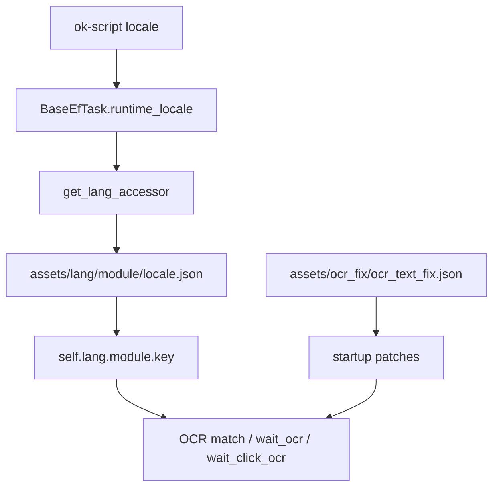

# i18n 与 OCR 草稿状态

返回：[文档索引](../docs/README.md) / [README](../README.md)

本文保留为历史草稿占位，不再描述目标方案或待迁移要求。当前可验证实现以正式开发文档为准：

- i18n 与 OCR 流程：[docs/dev/i18n_OCR配置流程.md](../docs/dev/i18n_OCR配置流程.md)
- 运行时语言入口：[src/core/BaseEfTask.py](../src/core/BaseEfTask.py)
- 语言加载实现：[src/data/lang/__init__.py](../src/data/lang/__init__.py)
- OCR 纠错补丁：[src/patches/ocr_text_fix_patch.py](../src/patches/ocr_text_fix_patch.py)

当前链路：

